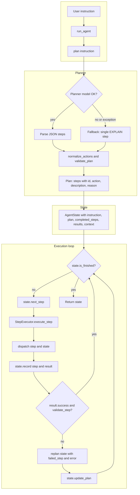
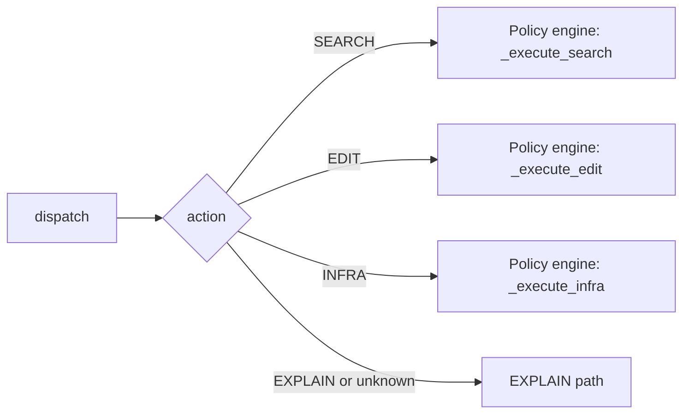
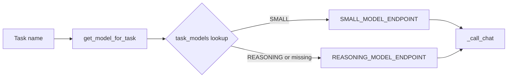
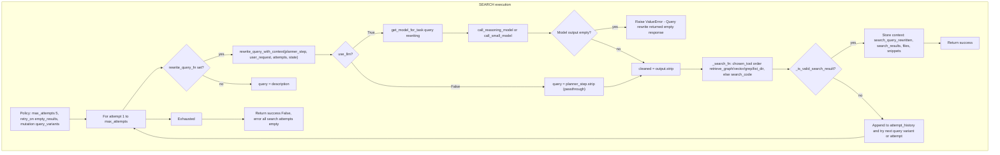
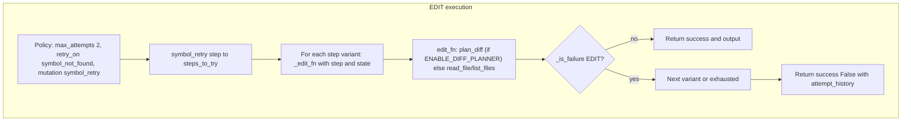
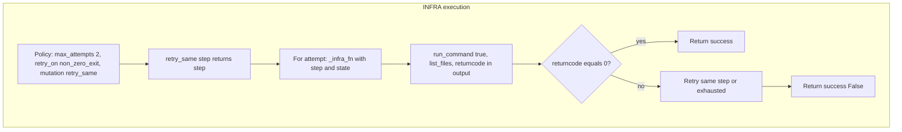
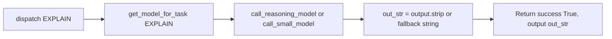
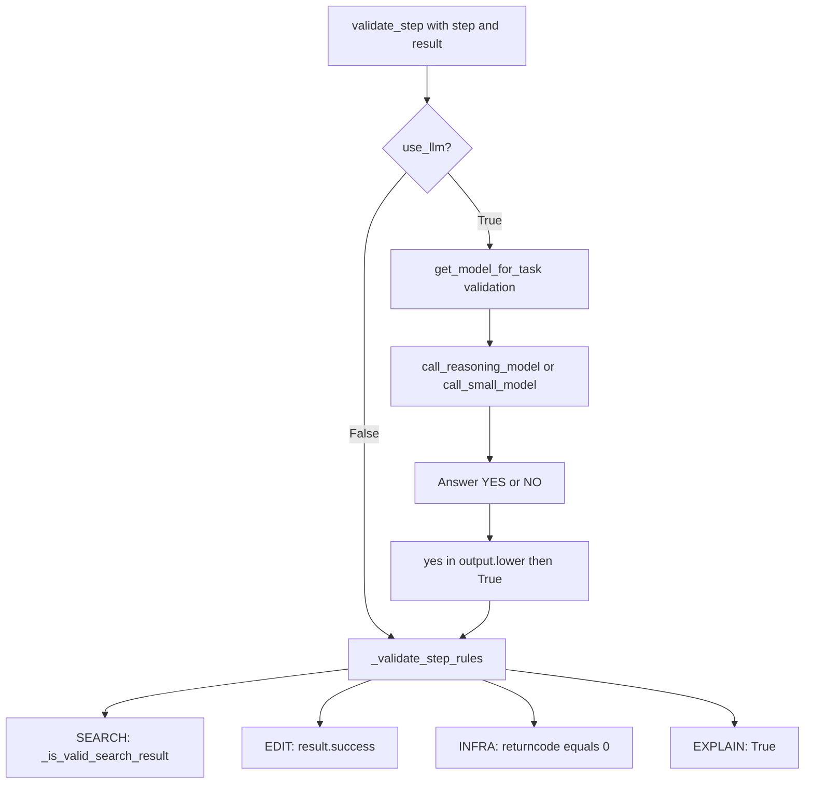
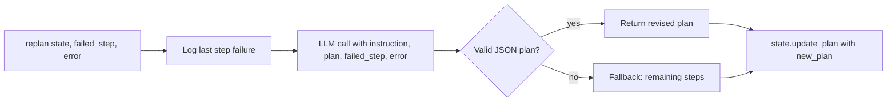

# Agent Loop Workflow Diagram

End-to-end flow of the AutoStudio agent: instruction → plan → execute steps → validate → optional replan → return state. Includes details on model routing, query rewriting, policy-engine retries, fallbacks, and heuristics.

---

## High-level flow

---

## Step dispatch (action routing)

- **SEARCH / EDIT / INFRA** → `ExecutionPolicyEngine.execute_with_policy` (retries, mutation).
- **EXPLAIN** → Direct model call in `step_dispatcher`; no policy engine.

---

## Model routing (task → model)

Config: `models_config.json` → `task_models`. Defaults in code: `query rewriting` → SMALL, `validation` → SMALL, `EXPLAIN` → REASONING.

- **Query rewriting** (SEARCH steps): `task_models["query rewriting"]` → REASONING or SMALL → `call_reasoning_model` / `call_small_model`.
- **Validation** (optional LLM): `task_models["validation"]` → model answers YES/NO.
- **EXPLAIN**: `task_models["EXPLAIN"]` → model; empty output replaced with `"[EXPLAIN: no model output]"` in dispatcher.

---

## SEARCH path (policy engine + query rewrite)

**Details:**

- **Retrieval stack (respects chosen_tool from tool graph or rewriter):**  
  1. `retrieval_cache.get_cached(query)` (if `RETRIEVAL_CACHE_SIZE > 0`)  
  2. Order by `chosen_tool`: `retrieve_graph` → graph; `retrieve_vector` → vector; `retrieve_grep` → Serena `search_for_pattern`; `list_dir` → `list_files(path)`  
  3. Fallback chain if chosen returns nothing: try remaining retrievers  
  4. Final fallback: `search_code` (Serena MCP)  
  - On success: `retrieval_cache.set_cached(query, results)`.

- **Query rewrite (LLM)**  
  - `rewrite_query_with_context(planner_step, user_request, previous_attempts, use_llm=True, state=state)`.  
  - Returns JSON: `{ "tool": "retrieve_graph"|"retrieve_vector"|"retrieve_grep"|"list_dir", "query": "", "reason": "" }`.  
  - **Rewriter wires tool choice:** when tool is valid, sets `state.context["chosen_tool"]` so retrieval order prefers it.  
  - Model from `get_model_for_task("query rewriting")`.  
  - **No heuristic fallback**: if model returns empty → `ValueError("Query rewrite returned empty response")`.  
  - Prompts: `query_rewrite_with_context.yaml` (Serena rules, filesystem rules, tool graph).

- **Query rewrite (use_llm=False)**  
  - Passthrough: `query = planner_step.strip()` (no tokenize/stopwords/dedupe).

- **Fallback when rewrite_query_fn is None**  
  - Policy engine uses `query = description`; if still empty, `query = description` again (line 185).

- **Success criteria**  
  - `_is_valid_search_result(results)`: first result has non-empty `file` and non-empty `snippet`.

- **Retrieval pipeline (after search success)**  
  - `expand_search_results` → `build_context_from_symbols` → (when `ENABLE_CONTEXT_RANKING=1`) `rank_context` → `prune_context` → `state.context["ranked_context"]`.  
  - Ranker: **batch LLM** (one prompt for all snippets); hybrid score = 0.6×LLM + 0.2×symbol_match + 0.1×filename_match + 0.1×reference_score − **same_file_penalty** (diversity).  
  - Pruner: max 6 snippets, 8000 chars; deduplicate by (file, symbol).

- **Mutation**  
  - SEARCH uses `query_variants` conceptually (attempt loop + new rewrite each time with attempt_history). No explicit `generate_query_variants` in loop; each attempt gets a fresh LLM rewrite (or heuristic) with previous attempts in context.

---

## EDIT path (policy engine)

- **Diff planner (ENABLE_DIFF_PLANNER=1):** `plan_diff` → `conflict_resolver` → `patch_generator.to_structured_patches` → `patch_executor.execute_patch` (ast_patcher + patch_validator) → `run_with_repair` (test repair loop). Validation: compile + AST reparse before write; rollback on invalid syntax, >200 lines, >5 files, or apply error. Max 5 files, 200 lines per patch.
- **Mutation**: `symbol_retry(step)` → currently returns `[step]` (single variant). Placeholder for future symbol/path variants.
- **Retry condition**: `result.error` or `result.success is False`.

---

## INFRA path (policy engine)

- **Mutation**: `retry_same(step)` → same step retried.
- **Retry condition**: `output.returncode != 0`.

---

## EXPLAIN path (no policy engine)

- **Fallback**: If model returns empty → `"[EXPLAIN: no model output]"` (string substitute in `step_dispatcher`).
- No retries; single attempt.

---

## Validation (after each step)

- **Rule-based (default)**: SEARCH → non-empty first result with file + snippet; EDIT → success; INFRA → returncode 0; EXPLAIN → True.
- **LLM**: On exception, fallback to rule-based.

---

## Replan (on step failure or validation failure)

- LLM-based: receives `failed_step` and `error`; produces revised plan via `call_reasoning_model` (task_models["replanner"]).
- Fallback: if LLM fails or returns invalid JSON, returns remaining steps only.
- Loop continues with `state.next_step()` (next remaining step).

---

## Context and tool memories

`state.context` is updated by the policy engine on successful tool use. Two memory mechanisms:

| Key | Set when | Shape | Used by |
|-----|----------|-------|---------|
| `ranked_context` | SEARCH succeeds (when `ENABLE_CONTEXT_RANKING=1`) | List of `{ file, symbol, snippet, type }`; ranked and pruned (max 6 snippets, 8000 chars) | EXPLAIN step: primary evidence in `_format_explain_context`. |
| `search_memory` | SEARCH succeeds | `{ "query": str, "results": [ { "file", "snippet" } ] }`; snippets truncated to 500 chars | EXPLAIN step: fallback when `ranked_context` empty. |
| `tool_memories` | SEARCH / EDIT / INFRA succeed | List of records, one per successful tool call. SEARCH: `{ tool, query, result_count, files, snippets_preview }`; EDIT: `{ tool, path, success }`; INFRA: `{ tool, returncode, success }`. | Available for downstream steps or logging. |

- **When set:** In `ExecutionPolicyEngine`, on success path of `_execute_search`, `_execute_edit`, `_execute_infra` (via `_append_tool_memory`). SEARCH also sets legacy keys: `search_query_rewritten`, `search_results`, `files`, `snippets`.
- **EXPLAIN:** In `step_dispatcher`, `_format_explain_context(state)` prefers `ranked_context` (when non-empty); otherwise falls back to `search_memory` and `context_snippets`.

---

## Policy summary (POLICIES)

| Action  | max_attempts | retry_on           | mutation      |
|---------|--------------|--------------------|---------------|
| SEARCH  | 5            | empty_results      | query_variants (via rewrite + attempt_history) |
| EDIT    | 2            | symbol_not_found   | symbol_retry  |
| INFRA   | 2            | non_zero_exit      | retry_same    |
| EXPLAIN | 1            | —                 | —             |

- **max_total_attempts** (engine cap): 10.
- EXPLAIN and unknown actions skip policy and use `_run_once`.

---

## Component map

| Component              | Role |
|------------------------|------|
| `run_agent`            | Entry; plan → state → loop execute → validate → replan until finished. |
| `plan(instruction)`    | Planner; reasoning model + JSON parse; fallback single EXPLAIN step. |
| `StepExecutor`         | Calls `dispatch(step, state)`; wraps result in `StepResult`. |
| `dispatch`             | Routes by action to policy engine (SEARCH/EDIT/INFRA) or EXPLAIN. |
| `ExecutionPolicyEngine`| Retry loop + mutation; injects search_fn, edit_fn, infra_fn, rewrite_query_fn. |
| `rewrite_query_with_context` | LLM returns `{tool, query, reason}`; wires `chosen_tool` when valid; prompts: Serena rules, filesystem rules; **empty LLM output → raise**. |
| `get_model_for_task`   | Config-driven: task_models → SMALL or REASONING. |
| `_call_chat`           | Single non-streaming chat call; extracts `choices[0].message.content`. |
| `validate_step`        | Rules or LLM YES/NO; fallback to rules on LLM error. |
| `replan`               | LLM-based: receives failed_step, error; produces revised plan; fallback to remaining steps. |
| `context["search_memory"]` / `context["tool_memories"]` | Set in policy engine on SEARCH/EDIT/INFRA success; EXPLAIN uses `search_memory` via `_format_explain_context`. |

---

## File reference

- **Agent loop**: `agent/orchestrator/agent_loop.py` — `run_agent`, loop, validate, replan.
- **Executor**: `agent/execution/executor.py` — `StepExecutor.execute_step`, `execute_plan`.
- **Dispatch**: `agent/execution/step_dispatcher.py` — `dispatch`, _search_fn, _edit_fn, _infra_fn, _rewrite_for_search, EXPLAIN.
- **Policy**: `agent/execution/policy_engine.py` — POLICIES, _execute_search, _execute_edit, _execute_infra, _run_once.
- **Query rewriter**: `agent/retrieval/query_rewriter.py` — rewrite_query_with_context (wires chosen_tool), rewrite_query; prompts: `agent/prompts/query_rewrite.yaml`, `query_rewrite_with_context.yaml`.
- **Mutation**: `agent/execution/mutation_strategies.py` — symbol_retry, retry_same, generate_query_variants.
- **Model**: `agent/models/model_client.py` — _call_chat, call_reasoning_model, call_small_model; `agent/models/model_router.py` — get_model_for_task.
- **Validation**: `agent/orchestrator/validator.py` — validate_step, _validate_step_rules.
- **Replan**: `agent/orchestrator/replanner.py` — replan.
- **Planner**: `planner/planner.py` — plan.
- **Graph retriever**: `agent/retrieval/graph_retriever.py` — retrieve_symbol_context.
- **Vector retriever**: `agent/retrieval/vector_retriever.py` — search_by_embedding (fallback).
- **Retrieval cache**: `agent/retrieval/retrieval_cache.py` — LRU cache for search results.
- **Diff planner**: `editing/diff_planner.py` — plan_diff.
- **Patch pipeline**: `editing/patch_generator.py` — to_structured_patches; `editing/ast_patcher.py` — apply_patch; `editing/patch_validator.py` — validate_patch; `editing/patch_executor.py` — execute_patch (rollback on failure).
- **Agent controller**: `agent/orchestrator/agent_controller.py` — run_controller (full pipeline); _get_plan (instruction router + planner).
- **Instruction router**: `agent/routing/instruction_router.py` — route_instruction (when ENABLE_INSTRUCTION_ROUTER=1).
- **Router registry**: `agent/routing/router_registry.py` — get_router, get_router_raw (ROUTER_TYPE integration).

---

## Repository symbol graph (implemented)

**Indexing:** `python -m repo_index.index_repo <path>` creates `.symbol_graph/index.sqlite`; optionally `.symbol_graph/embeddings/` when `INDEX_EMBEDDINGS=1`.

**Retrieval flow:**
- Cache → chosen_tool order (retrieve_graph → retrieve_vector → retrieve_grep → list_dir) → Serena fallback; rewriter can set chosen_tool

**Additional modules:**
- `repo_graph/repo_map_builder.py` — high-level architectural map
- `repo_graph/change_detector.py` — affected callers, risk levels
- `agent/retrieval/vector_retriever.py`, `agent/retrieval/retrieval_cache.py`

**Files:** `repo_index/`, `repo_graph/`, `agent/retrieval/`, `editing/`
