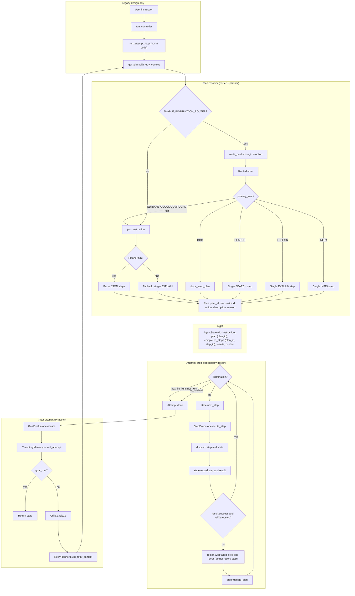
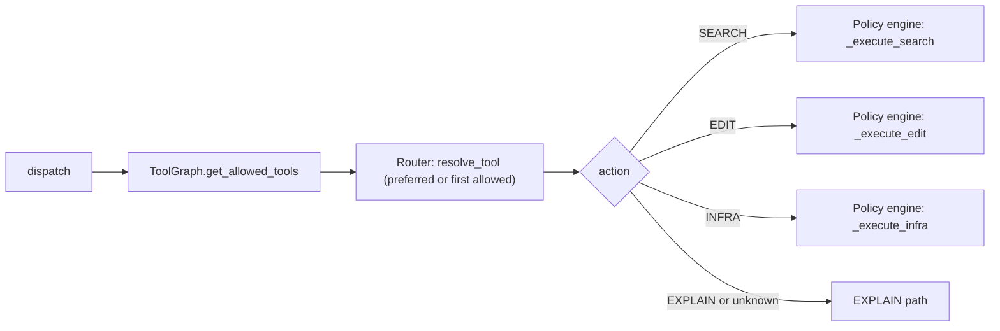
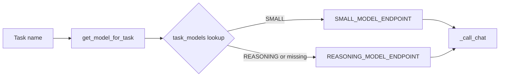
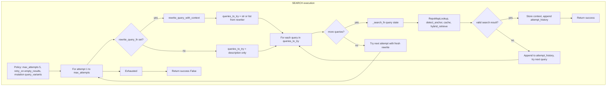
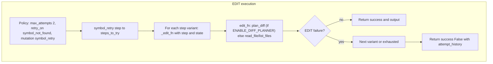
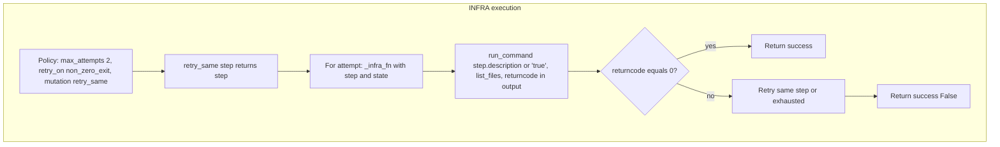
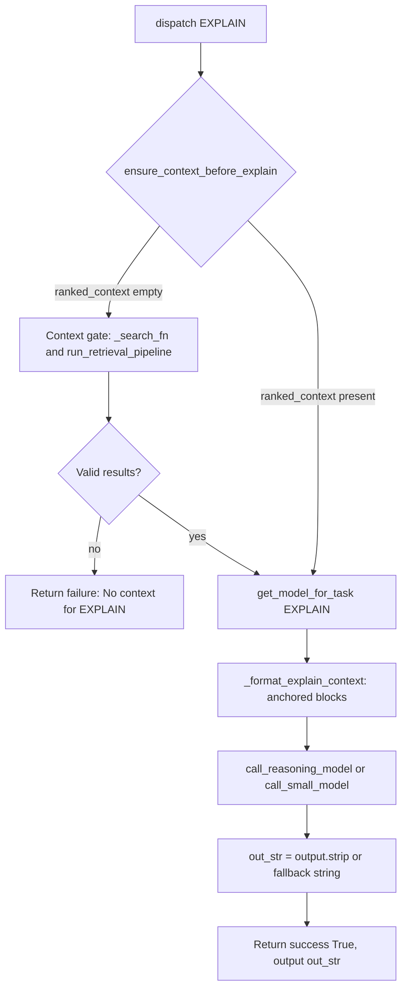
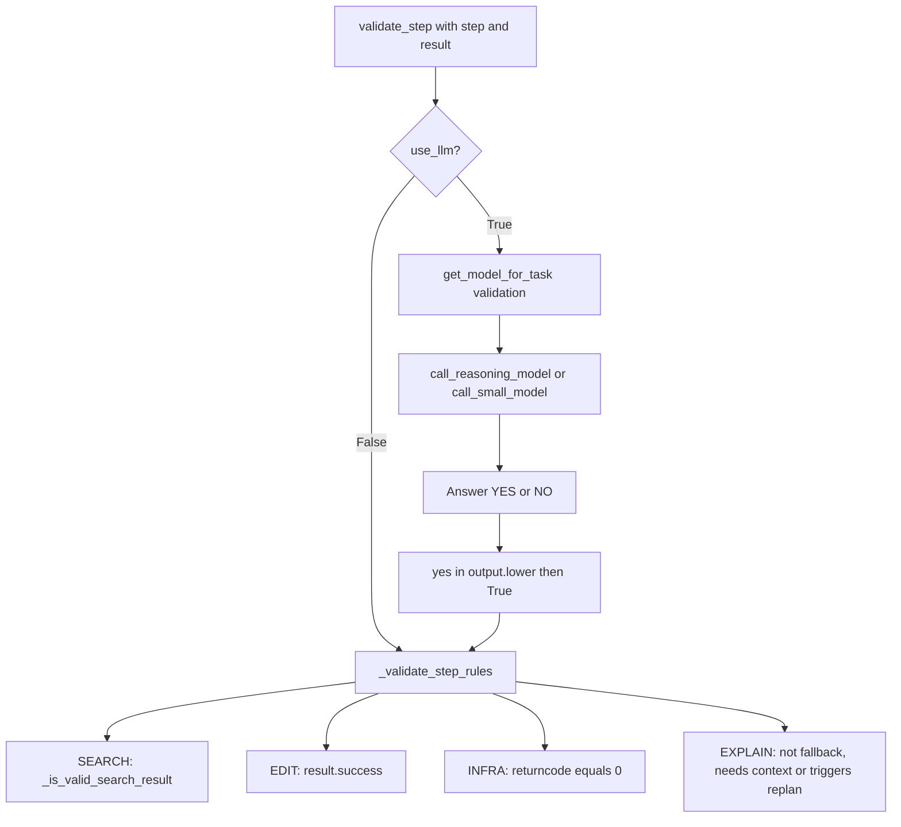
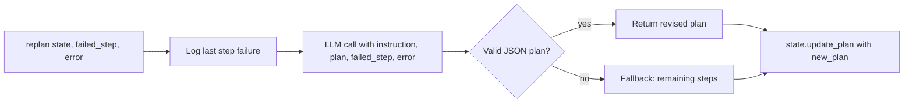
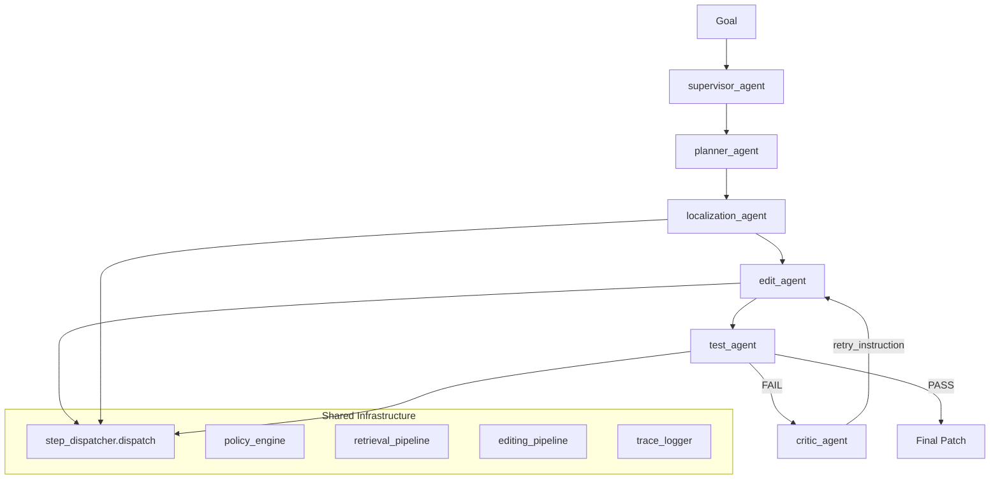

# Agent Loop Workflow Diagram

**Primary (Current Code):** run_controller → run_hierarchical → execution_loop (ReAct). Model chooses actions (search, open_file, edit, run_tests, finish). See [REACT_ARCHITECTURE.md](REACT_ARCHITECTURE.md) and [REACT_QUICK_START.md](REACT_QUICK_START.md).

**Legacy (Design Reference — run_attempt_loop not in code):** The diagrams below document the original Phase 5 design (get_plan, GoalEvaluator, Critic, RetryPlanner). The current controller does not branch; it always uses run_hierarchical. See [PHASE_5_ATTEMPT_LOOP.md](PHASE_5_ATTEMPT_LOOP.md).

---

Retrieval: SEARCH_CANDIDATES → BUILD_CONTEXT → EDIT. Full pipeline: [RETRIEVAL_ARCHITECTURE.md](RETRIEVAL_ARCHITECTURE.md). Instruction routing (legacy): [ROUTING_ARCHITECTURE_REPORT.md](ROUTING_ARCHITECTURE_REPORT.md).

---

## High-level flow (Legacy Design — Not in Current Code)

**Phase 5 design:** run_controller → run_attempt_loop. Each attempt: run_deterministic (get_plan → step loop) → GoalEvaluator → Critic → RetryPlanner → next attempt. **The current code does not use this path**; it always calls run_hierarchical. See [PHASE_5_ATTEMPT_LOOP.md](PHASE_5_ATTEMPT_LOOP.md).



**ASCII diagram (legacy design — not in current code):**

```
  User instruction ──► run_controller ──► run_attempt_loop (removed)
                                                    │
         ┌──────────────────────────────────────────┴──────────────────────────────────────────┐
         │ for each attempt: get_plan(retry_context)                                            │
         │   ENABLE_INSTRUCTION_ROUTER? (default: yes)                                          │
         │   yes: route_production_instruction ──► RoutedIntent                                  │
         │     DOC ──► docs_seed  │  SEARCH ──► Single SEARCH  │  EXPLAIN ──► Single EXPLAIN  │  INFRA ──► Single INFRA │
         │     EDIT/AMBIGUOUS/COMPOUND-flat ──► plan     │  no: plan instruction              │
         │   ──► AgentState (instruction, plan with plan_id, completed_steps as (plan_id, step_id), results, context) │
         │   ──► Step loop: next_step ──► execute_step ──► dispatch ──► state.record             │
         │        validate? ──► success: record │ fail: replan, update_plan (no record)             │
         │   attempt done ──► GoalEvaluator.evaluate ──► TrajectoryMemory.record_attempt         │
         │   goal_met? return │ else: Critic.analyze ──► RetryPlanner.build_retry_context ──► get_plan (next attempt)
         └─────────────────────────────────────────────────────────────────────────────────────┘
```

**Current implementation:** `run_controller` calls `run_hierarchical` → `execution_loop` (ReAct). The execution_loop in `agent/orchestrator/execution_loop.py` is ReAct-only; model selects actions each step. No run_deterministic, run_agent, or ExecutionLoopMode in the current path.

**Termination conditions (Phase 4):** task complete, max replan, max step retries (run_agent only), max steps, max tool calls, max runtime, max iterations. Both `run_agent` and `run_deterministic` use limits from `config/agent_config.py`. **Phase 7:** per-step timeout (`MAX_STEP_TIMEOUT_SECONDS`) via ThreadPoolExecutor around `execute_step`; step timeout returns RETRYABLE_FAILURE and logs `step_timeout`. See [CONFIGURATION.md](CONFIGURATION.md).

**Recovery policy (Phase 4):** Every step result is classified SUCCESS, RETRYABLE_FAILURE, or FATAL_FAILURE. On FATAL_FAILURE the loop stops without replanning. **Deterministic semantics (Phase 2):** failed or invalid steps are **not** recorded; no `undo_last_step`. Replan and `state.update_plan(new_plan)` only. Only successful and valid steps call `state.record(step, result)`. **run_agent** additionally retries the same step up to MAX_STEP_RETRIES before replanning. Policy engine injects classification; trace logs it.

---

## Phase 4 — Plan Identity

Step identity is **plan-scoped** to fix the step ID collision bug during replanning.

- **Problem:** If `completed_steps = [1]` and a replanned plan reuses step ids `[1,2,3]`, `next_step()` would incorrectly skip step 1 of the new plan.
- **Solution:** Every plan has a unique `plan_id`. Step identity is `(plan_id, step_id)`.
- **Plans:** `get_plan()` and `replan()` always attach or assign `plan_id` (e.g. `plan_3f8b8a7d`, from `new_plan_id()`). Replanned plans get a **new** `plan_id`; the previous plan_id is never reused.
- **AgentState:** `completed_steps` is a list of `(plan_id, step_id)` tuples. `next_step()` only treats a step as completed when its `plan_id` matches `state.current_plan_id`, so completed steps from a previous plan do not affect the current plan.
- **Observability:** Trace events (`step_executed`, `patch_result`, `error`, `goal_evaluation`, etc.) include `plan_id` for correlation.

**Architecture (plan-scoped steps):**

```
  get_plan() / replan()  →  plan = { "plan_id": "plan_<uuid8>", "steps": [...] }
       │
       ▼
  state.current_plan_id  →  used by next_step() to filter completed_steps
       │
       ▼
  state.record(step, result)  →  completed_steps.append((current_plan_id, step["id"]))
       │
       ▼
  next_step()  →  completed_ids = { step_id for (pid, step_id) in completed_steps if pid == current_plan_id }
                  →  first step not in completed_ids (no cross-plan collision)
```

**Loop comparison (Phase 2 / Phase 3):** Both entrypoints use **execution_loop()**; behavior differs only by flags.

| Aspect | run_deterministic | run_agent |
|--------|-------------------|-----------|
| Shared loop | execution_loop(..., mode=ExecutionLoopMode.DETERMINISTIC) | execution_loop(..., mode=ExecutionLoopMode.AGENT) |
| Limits | config.agent_config | config.agent_config |
| Failed step | Not recorded; replan → update_plan | Not recorded; replan → update_plan |
| undo_last_step | No | No |
| Step retries | No | Yes (MAX_STEP_RETRIES) |
| Plan exhausted | GoalEvaluator; replan or break | break (no goal evaluator) |

---

## Step dispatch (action routing)

### Phase 6A — Single-lane per task (`dominant_artifact_mode`)

Phase 6A freezes a single dominant artifact lane per task/attempt.

- **Task-level lock**: `state.context["dominant_artifact_mode"]` ∈ `"code"` \| `"docs"` (immutable for the attempt)
- **Evidence**: traces include `dominant_artifact_mode` and `step_artifact_mode` on each `step_executed` event
- **Contract**:
  - Dominant `"docs"`: only `SEARCH_CANDIDATES` / `BUILD_CONTEXT` / `EXPLAIN` allowed; those steps must explicitly set `artifact_mode="docs"`; `SEARCH`/`EDIT` forbidden
  - Dominant `"code"`: any `artifact_mode="docs"` step is forbidden
- **Enforcement**:
  - planner validation rejects mixed-lane plans
  - replanner must not switch lane
  - dispatcher returns `lane_violation` with **FATAL_FAILURE** on contract breach
  - deterministic goal evaluation refuses success when lane violations occurred



**ASCII diagram:**

```
  dispatch ──► ToolGraph.get_allowed_tools ──► resolve_tool
                                                    │
                    ┌───────────────────────────────┴───────────────────────────────┐
                    │ action?                                                        │
                    │   SEARCH ──► Policy engine: _execute_search                     │
                    │   EDIT    ──► Policy engine: _execute_edit                     │
                    │   INFRA   ──► Policy engine: _execute_infra                    │
                    │   EXPLAIN ──► EXPLAIN path (direct model call)                  │
                    └───────────────────────────────────────────────────────────────┘
```

- **Pre-dispatch validation (Phase 7):** `validate_step_input(step)` in `policy_engine` runs before any tool call; checks action in allowed set, required description for SEARCH/EDIT/EXPLAIN, max description length; raises `InvalidStepError` on failure; dispatcher returns FATAL_FAILURE without invoking tools.
- **ToolGraph → Router:** Dispatcher reads `current_node` from state; ToolGraph returns allowed tools; Router chooses tool (preferred for action, or first allowed if preferred not in set—no hard reject). Dispatcher sets `state.context["tool_node"]` after each step.
- **SEARCH / EDIT / INFRA** → `ExecutionPolicyEngine.execute_with_policy` (retries, mutation).
- **EXPLAIN** → Direct model call in `step_dispatcher`; no policy engine; context guardrail truncates if `len(context) > MAX_CONTEXT_CHARS` and logs `context_guardrail_triggered`.

---

## Model routing (task → model)

Config: `models_config.json` → `task_models`. All task names used by `call_small_model` / `call_reasoning_model` must be in `task_models` (no fallback). Endpoint resolved via `task_models[task_name]` → `models[model_key].endpoint`.



**ASCII diagram:**

```
  Task name ──► get_model_for_task ──► task_models lookup
                                            │
                        ┌───────────────────┴───────────────────┐
                        │ SMALL ──► SMALL_MODEL_ENDPOINT        │
                        │ REASONING/missing ──► REASONING_EP    │
                        └───────────────────┬───────────────────┘
                                            │
                                            ▼
                                        _call_chat
```

- **Query rewriting** (SEARCH steps): `task_models["query rewriting"]` → REASONING or SMALL → `call_reasoning_model` / `call_small_model`.
- **Validation** (optional LLM): `task_models["validation"]` → model answers YES/NO.
- **EXPLAIN**: `task_models["EXPLAIN"]` → model; empty output replaced with `"[EXPLAIN: no model output]"` in dispatcher.

---

## SEARCH path (policy engine + query rewrite)



**ASCII diagram:**

```
  Policy (max_attempts 5) ──► For attempt 1 to max_attempts
                                        │
                    ┌───────────────────┴───────────────────┐
                    │ rewrite_query_fn set?                 │
                    │ yes: rewrite_query_with_context       │
                    │ no:  queries_to_try = description     │
                    └───────────────────┬───────────────────┘
                                        │
                                        ▼
  For each query ──► more queries? ──yes──► _search_fn ──► RepoMapLookup, cache, hybrid_retrieve
       │                    │                                    │
       │                    │                                    ▼
       │                    │                         valid search result?
       │                    │                         yes: Store context ──► Return success
       │                    │                         no:  Append attempt_history ──► (loop)
       │                    │
       │                    no──► Try next attempt ──► (back to attempt loop)
       │
       └──► Exhausted ──► Return success False
```

**Details:**

- **Retrieval stack:**  
  1. **Repo map lookup** (before cache): `lookup_repo_map(query)`, `detect_anchor(query, repo_map)` → `state.context["repo_map_anchor"]`, `state.context["repo_map_candidates"]`. When anchor confidence ≥ 0.9, graph retriever uses anchor symbol.  
  2. `retrieval_cache.get_cached(query)` (if `RETRIEVAL_CACHE_SIZE > 0`)  
  3. **Hybrid retrieval** (when `ENABLE_HYBRID_RETRIEVAL=1`): run graph (with anchor when present), vector, grep in parallel via `hybrid_retrieve()`; merge and dedupe; return top 20.  
  4. **Sequential fallback** (when hybrid disabled or returns empty): order by `chosen_tool`; try `retrieve_graph` → `retrieve_vector` → `retrieve_grep` → `list_dir`; final fallback `search_code` (Serena MCP).  
  - On success: `retrieval_cache.set_cached(query, results)`.

- **Query rewrite (LLM)**  
  - `rewrite_query_with_context(planner_step, user_request, previous_attempts, use_llm=True, state=state)`.  
  - Returns JSON: `{ "tool": "retrieve_graph"|"retrieve_vector"|"retrieve_grep"|"list_dir", "query": "", "reason": "" }`.  
  - **Rewriter wires tool choice:** when tool is valid, sets `state.context["chosen_tool"]` so retrieval order prefers it.  
  - Model from `get_model_for_task("query rewriting")`.  
  - **Fallbacks:** on LLM/format error → heuristic (strip filler words); if heuristic empty → stripped planner_step. Policy engine also catches rewriter exceptions and uses description.  
  - Prompts: `query_rewrite_with_context.yaml` (Serena rules, filesystem rules, tool graph). Template braces escaped as `{{`/`}}`.

- **Query rewrite (use_llm=False)**  
  - Passthrough: `query = planner_step.strip()` (no tokenize/stopwords/dedupe).

- **Fallback when rewrite_query_fn is None**  
  - Policy engine uses `query = description`; if still empty, `query = description` again (line 185).

- **Success criteria**  
  - `_is_valid_search_result(results)`: first result has non-empty `file` and non-empty `snippet`.

- **Retrieval pipeline (after search success)**  
  - Dispatcher calls `run_retrieval_pipeline(search_results, state, query)` (no inline logic). Pipeline: `anchor_detector.detect_anchors` (filter to symbol/class/def matches; fallback top N) → **localization_engine.localize_issue** (Phase 10.5; when `ENABLE_LOCALIZATION_ENGINE=1`: dependency traversal → execution paths → symbol ranking → prepend to candidates) → **graph_stage_skipped check** (skip symbol_expander when `.symbol_graph/index.sqlite` absent; sets `graph_stage_skipped` in telemetry) → `symbol_expander.expand_from_anchors` (when graph exists; anchor → `expand_symbol_dependencies` BFS along calls/imports/references; depth=2, max_nodes=20, max_symbol_expansions=8 → fetch bodies → rank → prune to 6; max 15 symbols) → `expand_search_results` (capped at MAX_SYMBOL_EXPANSION) → read_symbol_body/read_file → `find_referencing_symbols` (structured: callers, callees, imports, referenced_by; cap 10 each) → `build_context_from_symbols` (includes `build_call_chain_context` when project_root + symbols) → **deduplicate_candidates** (unconditional; SHA-256 snippet key) → **candidate budget** (slice to MAX_RERANK_CANDIDATES=50) → **reranker** (when `RERANKER_ENABLED` and not symbol query and candidates ≥ RERANK_MIN_CANDIDATES: cross-encoder → score fusion; else fallback to `rank_context` when `ENABLE_CONTEXT_RANKING=1`) → `prune_context` (max 6 snippets, 8000 chars) → `state.context["ranked_context"]`, `state.context["context_snippets"]` (list of `{file, symbol, snippet}`). See [RETRIEVAL_ARCHITECTURE.md](RETRIEVAL_ARCHITECTURE.md) for reranker details.  
  - **Localization (Phase 10.5):** `agent/retrieval/localization/` — dependency_traversal (BFS over symbol graph), execution_path_analyzer (forward/backward call chains), symbol_ranker (4-factor scoring), localization_engine (orchestrator). Prepends ranked candidates to context pool. Config: `MAX_GRAPH_DEPTH`, `MAX_DEPENDENCY_NODES`, `MAX_EXECUTION_PATHS`.  
  - **Symbol expander:** Uses repository symbol graph; `expand_from_anchors(anchors, query, project_root)` calls `expand_symbol_dependencies` (get_callers, get_callees, get_imports, get_referenced_by) and merges graph-expanded snippets with expansion results.  
  - Ranker: **batch LLM**; hybrid score = 0.6×LLM + 0.2×symbol_match + 0.1×filename_match + 0.1×reference_score − **same_file_penalty** (diversity).  
  - Pruner: max 6 snippets, 8000 chars; deduplicate by (file, symbol).

- **Mutation**  
  - SEARCH uses `query_variants` conceptually (attempt loop + new rewrite each time with attempt_history). No explicit `generate_query_variants` in loop; each attempt gets a fresh LLM rewrite (or heuristic) with previous attempts in context.

---

## EDIT path (policy engine)



**ASCII diagram:**

```
  Policy (max_attempts 2) ──► symbol_retry ──► steps_to_try
                                                    │
                                                    ▼
  For each step variant ──► _edit_fn (plan_diff or read_file/list_files)
                                                    │
                                    ┌───────────────┴───────────────┐
                                    │ EDIT failure?                 │
                                    │ no: Return success            │
                                    │ yes: Next variant or exhausted│
                                    │      ──► Return success False │
                                    └───────────────────────────────┘
```

- **Edit→test→fix loop (EDIT via dispatch):** `_edit_fn` runs: `plan_diff` → `conflict_resolver` → `patch_generator.to_structured_patches` → **`agent/runtime/execution_loop.run_edit_test_fix_loop`** (single repair mechanism). Loop behaviour: (1) **Snapshot rollback** — before apply, snapshot affected files; on failure or syntax/test failure, restore from snapshot (no git). (2) **Syntax validation** — after `execute_patch` succeeds, `agent/runtime/syntax_validator.validate_project` runs (manifest-based: Python py_compile, Node npm run build, Go/Cargo); on invalid, rollback and return `syntax_error` without running tests. (3) **Instruction mutation guard** — `base_instruction` fixed at loop start; each retry uses `base_instruction + "\nRetry hint: " + hint` (no accumulation). (4) **Retry guard** — `agent/runtime/retry_guard.should_retry_strategy(failure_type, attempt)` (e.g. syntax_error/timeout retry once; unknown stop). (5) **Strategy explorer** — invoked only when `attempt >= MAX_EDIT_ATTEMPTS` (retries exhausted). Stop conditions: max_attempts, same error ≥ MAX_SAME_ERROR_RETRIES, no changes, patch rejected. Optional **sandbox** (ENABLE_SANDBOX=1): copy project to temp dir for patch + tests. Config: `config/agent_runtime.py`. All EDIT execution goes through `dispatch(step, state)`.
- **Mutation**: `symbol_retry(step)` → currently returns `[step]` (single variant). Placeholder for future symbol/path variants.
- **Retry condition**: `result.error` or `result.success is False`.

---

## INFRA path (policy engine)



**ASCII diagram:**

```
  Policy (max_attempts 2) ──► retry_same ──► step
                                                │
                                                ▼
  For attempt ──► _infra_fn (run_command, list_files)
                                │
                ┌───────────────┴───────────────┐
                │ returncode equals 0?           │
                │ yes: Return success            │
                │ no:  Retry or exhausted        │
                │      ──► Return success False  │
                └───────────────────────────────┘
```

- **Command**: Uses `step.description` or `step.command` as shell command (Phase 9); defaults to `"true"` if empty.
- **Mutation**: `retry_same(step)` → same step retried.
- **Retry condition**: `output.returncode != 0`.

---

## EXPLAIN path (no policy engine)



**ASCII diagram:**

```
  dispatch EXPLAIN ──► ensure_context_before_explain
                                │
                ┌───────────────┴───────────────┐
                │ ranked_context empty?          │
                │ yes: Context gate              │
                │   _search_fn + run_retrieval   │
                │   Valid results? ──no──► Fail   │
                │   ──yes──► (continue)          │
                │ no: get_model_for_task EXPLAIN │
                └───────────────┬───────────────┘
                                │
                                ▼
  _format_explain_context ──► call_model ──► Return success
```

- **Context gate:** If `ranked_context` is empty, inject SEARCH (call `_search_fn` with step description; no LLM rewrite), then `run_retrieval_pipeline()`. If no valid results, return failure without calling the model. Avoids wasted LLM calls.
- **Context guardrail (Phase 7):** Before LLM call, if `len(context_block) > MAX_CONTEXT_CHARS` (default 32000), truncate and log `context_guardrail_triggered` to trace.
- **Anchored context:** `context_builder_v2.assemble_reasoning_context()` emits FILE/SYMBOL/LINES/SNIPPET blocks (~8000 char budget); deduplicates by (file, symbol).
- **Fallback**: If model returns empty → `"[EXPLAIN: no model output]"`.
- No retries; single attempt.

---

## Validation (after each step)



**ASCII diagram:**

```
  validate_step ──► use_llm?
                        │
        ┌───────────────┴───────────────┐
        │ False: _validate_step_rules   │
        │ True:  get_model_for_task      │
        │   ──► call_model ──► YES/NO    │
        │   ──► _validate_step_rules    │
        └───────────────┬───────────────┘
                        │
                        ▼
  Rules: SEARCH (valid result), EDIT (success), INFRA (returncode 0),
         EXPLAIN (not fallback, needs context)
```

- **Rule-based (default)**: SEARCH → non-empty first result with file + snippet; EDIT → success; INFRA → returncode 0; EXPLAIN → if output contains "I cannot answer without relevant code context" → invalid (triggers replanner to add SEARCH); else `_is_valid_explain`: False when output length < 40 chars (triggers replan to add SEARCH). No LLM phrase detection.
- **LLM**: On exception, fallback to rule-based.

---

## Replan (on step failure or validation failure)



**ASCII diagram:**

```
  replan(state, failed_step, error)
        │
        ▼
  Log last step failure ──► LLM call (instruction, plan, failed_step, error)
                                        │
                        ┌───────────────┴───────────────┐
                        │ Valid JSON plan?               │
                        │ yes: Return revised plan       │
                        │ no:  Fallback: remaining steps │
                        └───────────────┬───────────────┘
                                        │
                                        ▼
                            state.update_plan with new_plan
```

- LLM-based: receives `failed_step` and `error`; produces revised plan via `call_reasoning_model` (task_models["replanner"]).
- Fallback: if LLM fails or returns invalid JSON, returns remaining steps only.
- Loop continues with `state.next_step()` (next remaining step).

---

## Context and tool memories

`state.context` is updated by the policy engine on successful tool use. Two memory mechanisms:

| Key | Set when | Shape | Used by |
|-----|----------|-------|---------|
| `repo_map_anchor` | SEARCH: before retrieval in `_search_fn` | `{symbol, confidence}` or None; from `detect_anchor(query, repo_map)` | `hybrid_retrieve` run_graph: uses anchor symbol when confidence ≥ 0.9 |
| `repo_map_candidates` | SEARCH: before retrieval in `_search_fn` | `[{anchor, file}, ...]` from `lookup_repo_map(query)` | Available for downstream or logging |
| `ranked_context` | SEARCH succeeds via `run_retrieval_pipeline` (when `ENABLE_CONTEXT_RANKING=1`) | List of `{ file, symbol, snippet, type, line? }`; ranked and pruned (max 6 snippets, 8000 chars) | EXPLAIN step: primary evidence in `_format_explain_context` (anchored FILE/SYMBOL/LINES/SNIPPET blocks). |
| `context_snippets` | SEARCH succeeds via `run_retrieval_pipeline` | List of `{ file, symbol, snippet }`; built by context_builder | EXPLAIN step: fallback in `_format_explain_context` when ranked_context empty. |
| `search_memory` | SEARCH succeeds | `{ "query": str, "results": [ { "file", "snippet" } ] }`; snippets truncated to 500 chars | EXPLAIN step: fallback when `ranked_context` empty. |
| `tool_memories` | SEARCH / EDIT / INFRA succeed | List of records, one per successful tool call. SEARCH: `{ tool, query, result_count, files, snippets_preview }`; EDIT: `{ tool, path, success }`; INFRA: `{ tool, returncode, success }`. | Available for downstream steps or logging. |

- **When set:** In `ExecutionPolicyEngine`, on success path of `_execute_search`, `_execute_edit`, `_execute_infra` (via `_append_tool_memory`). SEARCH also sets legacy keys: `search_query_rewritten`, `search_results`, `files`, `snippets`. Retrieval pipeline (`run_retrieval_pipeline`) sets `retrieved_symbols`, `retrieved_references`, `retrieved_files`, `context_snippets`, `ranked_context`, `search_memory`.
- **EXPLAIN:** In `step_dispatcher`, `_format_explain_context(state)` prefers `ranked_context` (when non-empty); otherwise falls back to `search_memory` and `context_snippets` (each item `{file, symbol, snippet}`).

---

## Policy summary (POLICIES)

| Action  | max_attempts | retry_on           | mutation      |
|---------|--------------|--------------------|---------------|
| SEARCH  | 5            | empty_results      | query_variants (via rewrite + attempt_history) |
| EDIT    | 2            | symbol_not_found   | symbol_retry  |
| INFRA   | 2            | non_zero_exit      | retry_same    |
| EXPLAIN | 1            | —                 | —             |

- **max_total_attempts** (engine cap): 10.
- EXPLAIN and unknown actions skip policy and use `_run_once`.

---

## Component map

| Component              | Role |
|------------------------|------|
| `run_controller`       | Entry; mode routing; deterministic → run_attempt_loop. |
| `run_attempt_loop`     | Phase 5: for each attempt run_deterministic → GoalEvaluator → TrajectoryMemory; on failure Critic + RetryPlanner → next attempt with retry_context. |
| `execution_loop`      | Phase 3: shared step loop used by run_agent and run_deterministic; iteration/tool/runtime limits, StepExecutor, validate, replan, state.record; controlled by mode (ExecutionLoopMode.DETERMINISTIC | AGENT). Returns LoopResult(state, loop_output); callers use result.state and result.loop_output. |
| `run_deterministic`    | Single attempt: get_plan(retry_context) → state → execution_loop(..., enable_goal_evaluator=True, enable_step_retries=False). Returns (state, loop_output). No undo_last_step; failed steps not recorded. |
| `run_agent`           | Deprecated; get_plan → state → execution_loop(..., enable_goal_evaluator=False, enable_step_retries=True). Returns state. Same limits and failure semantics as run_deterministic; step retries and no goal evaluator. |
| `get_plan`             | Plan resolver; instruction router (when enabled) or planner; single-step for CODE_SEARCH/CODE_EXPLAIN/INFRA; accepts retry_context for Phase 5. |
| `plan(instruction)`    | Planner; reasoning model + JSON parse; fallback single EXPLAIN step; receives retry_context (strategy_hint, previous_attempts, critic_feedback). |
| `StepExecutor`         | Calls `dispatch(step, state)`; wraps result in `StepResult` (includes `files_modified`, `patch_size` for EDIT steps). |
| `dispatch`             | Routes by action to policy engine (SEARCH/EDIT/INFRA) or EXPLAIN. |
| `ExecutionPolicyEngine`| Retry loop + mutation; injects search_fn, edit_fn, infra_fn, rewrite_query_fn. |
| `rewrite_query_with_context` | LLM returns `{tool, query, reason}`; wires `chosen_tool` when valid; prompts: Serena rules, filesystem rules; **empty LLM output → raise**. |
| `get_model_for_task`   | Config-driven: task_models → SMALL or REASONING. |
| `_call_chat`           | Single non-streaming chat call; extracts `choices[0].message.content`. |
| `validate_step`        | Rules or LLM YES/NO; fallback to rules on LLM error. |
| `replan`               | LLM-based: receives failed_step, error; produces revised plan; fallback to remaining steps. |
| `context["search_memory"]` / `context["tool_memories"]` | Set in policy engine on SEARCH/EDIT/INFRA success; EXPLAIN uses `search_memory` via `_format_explain_context`. |

---

## File reference

- **Agent controller**: `agent/orchestrator/agent_controller.py` — `run_controller`, `run_attempt_loop` (Phase 5), mode routing.
- **Deterministic runner**: `agent/orchestrator/deterministic_runner.py` — `run_deterministic`, step loop, validate, replan, termination; accepts retry_context.
- **Goal evaluator**: `agent/orchestrator/goal_evaluator.py` — `GoalEvaluator.evaluate` (deterministic goal-satisfaction check).
- **Trajectory memory**: `agent/meta/trajectory_memory.py` — `TrajectoryMemory.record_attempt`, attempt-level data for retry.
- **Critic / Retry planner**: `agent/meta/critic.py`, `agent/meta/retry_planner.py` — failure analysis and retry_context for next attempt.
- **Plan resolver**: `agent/orchestrator/plan_resolver.py` — `get_plan`, router + planner integration, retry_context passthrough.
- **Executor**: `agent/execution/executor.py` — `StepExecutor.execute_step`, `execute_plan`.
- **Dispatch**: `agent/execution/step_dispatcher.py` — `dispatch`, _search_fn, _edit_fn, _infra_fn, _rewrite_for_search, _format_explain_context, EXPLAIN.
- **Explain gate**: `agent/execution/explain_gate.py` — `ensure_context_before_explain` (inject SEARCH when ranked_context empty).
- **Search pipeline**: `agent/retrieval/search_pipeline.py` — `hybrid_retrieve` (parallel graph + vector + grep), `_merge_results`.
- **Policy**: `agent/execution/policy_engine.py` — POLICIES, validate_step_input, InvalidStepError, _execute_search, _execute_edit, _execute_infra, _run_once.
- **Query rewriter**: `agent/retrieval/query_rewriter.py` — rewrite_query_with_context (wires chosen_tool), rewrite_query; prompts: `agent/prompts/query_rewrite.yaml`, `query_rewrite_with_context.yaml`.
- **Mutation**: `agent/execution/mutation_strategies.py` — symbol_retry, retry_same, generate_query_variants.
- **Model**: `agent/models/model_client.py` — _call_chat, call_reasoning_model, call_small_model; `agent/models/model_router.py` — get_model_for_task.
- **Validation**: `agent/orchestrator/validator.py` — validate_step, _validate_step_rules.
- **Replan**: `agent/orchestrator/replanner.py` — replan.
- **Planner**: `planner/planner.py` — plan.
- **Repo map lookup**: `agent/retrieval/repo_map_lookup.py` — lookup_repo_map, load_repo_map.
- **Graph retriever**: `agent/retrieval/graph_retriever.py` — retrieve_symbol_context.
- **Anchor detector**: `agent/retrieval/anchor_detector.py` — detect_anchors (search results), detect_anchor (query + repo_map).
- **Symbol expander**: `agent/retrieval/symbol_expander.py` — expand_from_anchors (graph depth=2, fetch bodies, rank, prune).
- **Context builder v2**: `agent/retrieval/context_builder_v2.py` — assemble_reasoning_context (FILE/SYMBOL/LINES/SNIPPET).
- **Vector retriever**: `agent/retrieval/vector_retriever.py` — search_by_embedding (fallback).
- **Retrieval cache**: `agent/retrieval/retrieval_cache.py` — LRU cache for search results.
- **Diff planner**: `editing/diff_planner.py` — plan_diff.
- **Execution loop**: `agent/runtime/execution_loop.py` — run_edit_test_fix_loop (snapshot rollback, syntax validation, retry guard, strategy explorer when retries exhausted); `agent/runtime/syntax_validator.py` — validate_project; `agent/runtime/retry_guard.py` — should_retry_strategy.
- **Patch pipeline**: `editing/patch_generator.py` — to_structured_patches; `editing/ast_patcher.py` — apply_patch; `editing/patch_validator.py` — validate_patch; `editing/patch_executor.py` — execute_patch (rollback on failure).
- **Agent controller**: `agent/orchestrator/agent_controller.py` — run_controller (mode routing: deterministic/autonomous/multi_agent); delegates deterministic loop to run_deterministic.
- **Execution loop**: `agent/orchestrator/execution_loop.py` — execution_loop (shared by run_agent and run_deterministic); step loop, limits, validate, replan, optional goal evaluator and step retries.
- **Deterministic runner**: `agent/orchestrator/deterministic_runner.py` — run_deterministic (get_plan → execution_loop with goal evaluator); single source of truth for Mode 1.
- **Autonomous mode (Phase 7/8/15)**: `agent/autonomous/` — run_autonomous(goal, project_root, max_retries=MAX_RETRY_ATTEMPTS); goal_manager, state_observer, action_selector, agent_loop; when max_retries>1, TrajectoryLoop (Phase 15) runs meta loop: attempt→evaluate→critic→retry_planner→retry; reuses dispatcher, retrieval, editing pipeline; limits: max_steps, max_tool_calls, max_runtime, max_edits; respects MAX_RETRY_RUNTIME_SECONDS.
- **Multi-agent orchestration (Phase 9)**: `agent/roles/` — run_multi_agent(goal, project_root, success_criteria); supervisor coordinates planner → localization → edit → test → critic (on failure); AgentWorkspace; all agents use dispatch; limits: max_agent_steps=30, max_patch_attempts=3, max_runtime=120s, max_file_edits=10; trace events: agent_started, agent_completed, agent_failed, handoff.
- **Meta layer (Phase 8/15)**: `agent/meta/` — evaluator (SUCCESS/FAILURE/PARTIAL), critic (diagnose failure; Diagnosis includes evidence, suggested_strategy), retry_planner (rewrite_query, expand_scope, new_plan, etc.; invalid strategy falls back to generate_new_plan), trajectory_store (.agent_memory/trajectories/; each attempt has attempt, start_time, end_time for duration metrics), trajectory_loop (TrajectoryLoop.run_with_retries; DIVERSITY_SEQUENCE escalates strategy when critic repeats; telemetry: attempt_number, retry_strategy, trajectory_length, failure_type).
- **Instruction router**: `agent/routing/instruction_router.py` — route_instruction (when ENABLE_INSTRUCTION_ROUTER=1).
- **Router registry**: `agent/routing/router_registry.py` — get_router, get_router_raw (ROUTER_TYPE integration).

---

## Repository symbol graph (implemented)

**Indexing:** `python -m repo_index.index_repo <path>` creates `.symbol_graph/index.sqlite`; optionally `.symbol_graph/embeddings/` when `INDEX_EMBEDDINGS=1`.

**Retrieval flow:**
- Cache → hybrid_retrieve (parallel graph + vector + grep) when ENABLE_HYBRID_RETRIEVAL=1; else chosen_tool order (retrieve_graph → retrieve_vector → retrieve_grep → list_dir) → Serena fallback

**Additional modules:**
- `repo_graph/repo_map_builder.py` — build_repo_map, build_repo_map_from_storage (spec: modules, symbols, calls)
- `repo_graph/repo_map_updater.py` — update_repo_map_for_file (incremental; call after update_index_for_file)
- `repo_graph/change_detector.py` — affected callers, risk levels
- `agent/retrieval/repo_map_lookup.py` — lookup_repo_map, load_repo_map
- `agent/retrieval/anchor_detector.py` — detect_anchor (query + repo_map → symbol + confidence)
- `agent/retrieval/vector_retriever.py`, `agent/retrieval/retrieval_cache.py`

**Files:** `repo_index/`, `repo_graph/`, `agent/retrieval/`, `editing/`

---

## Phase 9 Multi-Agent Flow



- **Entry:** `run_multi_agent(goal, project_root, success_criteria)` in `agent/roles/supervisor_agent.py`.
- **Agents:** planner (goal→plan via planner.plan), localization (SEARCH via dispatch), edit (EDIT via dispatch), test (INFRA via dispatch; step.description = command), critic (agent.meta.critic.diagnose).
- **State:** AgentWorkspace wraps AgentState; carries goal, plan, candidate_files, patches, test_results, retry_instruction.
- **Trace events:** agent_started, agent_completed, agent_failed, handoff.
