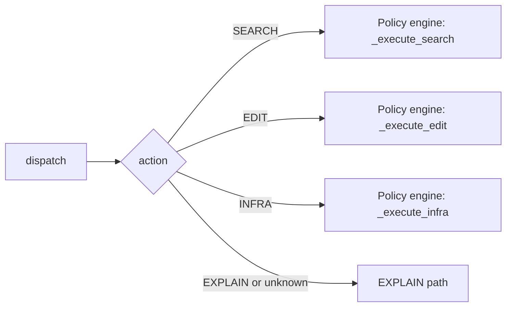

# Agent Loop Workflow Diagram

End-to-end flow of the AutoStudio agent: instruction → plan → execute steps → validate → optional replan → return state. Includes details on model routing, query rewriting, policy-engine retries, fallbacks, and heuristics.

---

## High-level flow

```mermaid
flowchart TB
    subgraph ENTRY[" "]
        A[User instruction] --> B[run_agent]
        B --> C[plan(instruction)]
    end

    subgraph PLAN["Planner"]
        C --> D{Planner model OK?}
        D -->|yes| E[Parse JSON steps]
        D -->|no / exception| F[Fallback: single EXPLAIN step]
        E --> G[normalize_actions / validate_plan]
        F --> G
        G --> H[Plan: steps with id, action, description, reason]
    end

    subgraph STATE["State"]
        H --> I[AgentState: instruction, current_plan, completed_steps, step_results, context]
    end

    subgraph LOOP["Execution loop"]
        I --> J{state.is_finished?}
        J -->|no| K[state.next_step]
        K --> L[StepExecutor.execute_step]
        L --> M[dispatch(step, state)]
        M --> N[state.record(step, result)]
        N --> O{result.success and validate_step?}
        O -->|no| P[replan(state)]
        P --> Q[state.update_plan]
        Q --> J
        O -->|yes| J
        J -->|yes| R[Return state]
    end
```

---

## Step dispatch (action routing)



- **SEARCH / EDIT / INFRA** → `ExecutionPolicyEngine.execute_with_policy` (retries, mutation).
- **EXPLAIN** → Direct model call in `step_dispatcher`; no policy engine.

---

## Model routing (task → model)

Config: `models_config.json` → `task_models`. Defaults in code: `query rewriting` → SMALL, `validation` → SMALL, `EXPLAIN` → REASONING.

```mermaid
flowchart LR
    T[Task name] --> R[get_model_for_task]
    R --> C{task_models[task]}
    C -->|SMALL| S[SMALL_MODEL_ENDPOINT]
    C -->|REASONING or missing| Re[REASONING_MODEL_ENDPOINT]
    S --> MC[_call_chat]
    Re --> MC
```

- **Query rewriting** (SEARCH steps): `task_models["query rewriting"]` → REASONING or SMALL → `call_reasoning_model` / `call_small_model`.
- **Validation** (optional LLM): `task_models["validation"]` → model answers YES/NO.
- **EXPLAIN**: `task_models["EXPLAIN"]` → model; empty output replaced with `"[EXPLAIN: no model output]"` in dispatcher.

---

## SEARCH path (policy engine + query rewrite)

```mermaid
flowchart TB
    subgraph SEARCH["SEARCH execution"]
        S1[Policy: max_attempts=5, retry_on=empty_results, mutation=query_variants]
        S1 --> S2[For attempt 1..max_attempts]
        S2 --> S3{rewrite_query_fn set?}
        S3 -->|yes| S4[rewrite_query_with_context(description, user_request, attempt_history)]
        S3 -->|no| S5[query = description]
        S4 --> S6{use_llm?}
        S6 -->|True| S7[get_model_for_task 'query rewriting']
        S7 --> S8[call_reasoning_model or call_small_model]
        S8 --> S9{Model output empty?}
        S9 -->|yes| S10[Raise ValueError: Query rewrite returned empty response]
        S9 -->|no| S11[cleaned = output.strip]
        S6 -->|False| S12[_rewrite_with_regex: tokenize, stopwords, dedupe]
        S12 --> S11
        S11 --> S13[search_code(query)]
        S13 --> S14{_is_valid_search_result?}
        S14 -->|yes| S15[Store context: search_query_rewritten, search_results, files, snippets]
        S15 --> S16[Return success]
        S14 -->|no| S17[Append to attempt_history; try next query variant or attempt]
        S17 --> S2
        S2 --> S18[Exhausted] --> S19[Return success=False, error: all search attempts empty]
    end
```

**Details:**

- **Query rewrite (LLM)**  
  - `rewrite_query_with_context(planner_step, user_request, previous_attempts, use_llm=True)`.  
  - Model from `get_model_for_task("query rewriting")`.  
  - **No heuristic fallback**: if model returns empty → `ValueError("Query rewrite returned empty response")`.  
  - On exception in rewriter → exception propagates (no fallback).

- **Query rewrite (heuristic, use_llm=False)**  
  - `_rewrite_with_regex(planner_step)`: split identifiers → tokenize → remove stopwords → dedupe → up to 6 tokens, joined by space.

- **Fallback when rewrite_query_fn is None**  
  - Policy engine uses `query = description`; if still empty, `query = description` again (line 185).

- **Success criteria**  
  - `_is_valid_search_result(results)`: first result has non-empty `file` and non-empty `snippet`.

- **Mutation**  
  - SEARCH uses `query_variants` conceptually (attempt loop + new rewrite each time with attempt_history). No explicit `generate_query_variants` in loop; each attempt gets a fresh LLM rewrite (or heuristic) with previous attempts in context.

---

## EDIT path (policy engine)

```mermaid
flowchart TB
    subgraph EDIT["EDIT execution"]
        E1[Policy: max_attempts=2, retry_on=symbol_not_found, mutation=symbol_retry]
        E1 --> E2[symbol_retry(step) → steps_to_try]
        E2 --> E3[For each step variant: _edit_fn(step, state)]
        E3 --> E4[edit_fn: state.context.edit_path ? read_file(path) : list_files('.')]
        E4 --> E5{_is_failure EDIT?}
        E5 -->|no| E6[Return success + output]
        E5 -->|yes| E7[Next variant or exhausted]
        E7 --> E8[Return success=False, attempt_history]
    end
```

- **Mutation**: `symbol_retry(step)` → currently returns `[step]` (single variant). Placeholder for future symbol/path variants.
- **Retry condition**: `result.error` or `result.success is False`.

---

## INFRA path (policy engine)

```mermaid
flowchart TB
    subgraph INFRA["INFRA execution"]
        I1[Policy: max_attempts=2, retry_on=non_zero_exit, mutation=retry_same]
        I1 --> I2[retry_same(step) → [step]]
        I2 --> I3[For attempt: _infra_fn(step, state)]
        I3 --> I4[run_command('true'), list_files('.'), returncode in output]
        I4 --> I5{returncode == 0?}
        I5 -->|yes| I6[Return success]
        I5 -->|no| I7[Retry same step or exhausted]
        I7 --> I8[Return success=False]
    end
```

- **Mutation**: `retry_same(step)` → same step retried.
- **Retry condition**: `output.returncode != 0`.

---

## EXPLAIN path (no policy engine)

```mermaid
flowchart LR
    X[dispatch EXPLAIN] --> X1[get_model_for_task 'EXPLAIN']
    X1 --> X2[call_reasoning_model or call_small_model]
    X2 --> X3[out_str = output.strip or '[EXPLAIN: no model output]']
    X3 --> X4[Return success=True, output=out_str]
```

- **Fallback**: If model returns empty → `"[EXPLAIN: no model output]"` (string substitute in `step_dispatcher`).
- No retries; single attempt.

---

## Validation (after each step)

```mermaid
flowchart TB
    V[validate_step(step, result)] --> U{use_llm?}
    U -->|False| R[_validate_step_rules]
    U -->|True| L[get_model_for_task 'validation']
    L --> M[call_reasoning_model or call_small_model]
    M --> P["Answer YES/NO"]
    P --> R2["'yes' in output.lower → True"]
    R2 --> R
    R --> SEARCH_RULE[SEARCH: _is_valid_search_result]
    R --> EDIT_RULE[EDIT: result.success]
    R --> INFRA_RULE[INFRA: returncode == 0]
    R --> EXPLAIN_RULE[EXPLAIN: True]
```

- **Rule-based (default)**: SEARCH → non-empty first result with file + snippet; EDIT → success; INFRA → returncode 0; EXPLAIN → True.
- **LLM**: On exception, fallback to rule-based.

---

## Replan (on step failure or validation failure)

```mermaid
flowchart LR
    RP[replan(state)] --> R1[Log last step failure]
    R1 --> R2[remaining = steps not in completed_ids]
    R2 --> R3[Return { steps: remaining }]
    R3 --> R4[state.update_plan(new_plan)]
```

- Stub: no LLM replan; plan is replaced with remaining steps only.
- Loop continues with `state.next_step()` (next remaining step).

---

## Policy summary (POLICIES)

| Action  | max_attempts | retry_on           | mutation      |
|---------|--------------|--------------------|---------------|
| SEARCH  | 5            | empty_results      | query_variants (via rewrite + attempt_history) |
| EDIT    | 2            | symbol_not_found   | symbol_retry  |
| INFRA   | 2            | non_zero_exit      | retry_same    |
| EXPLAIN | 1            | —                 | —             |

- **max_total_attempts** (engine cap): 10.
- EXPLAIN and unknown actions skip policy and use `_run_once`.

---

## Component map

| Component              | Role |
|------------------------|------|
| `run_agent`            | Entry; plan → state → loop execute → validate → replan until finished. |
| `plan(instruction)`    | Planner; reasoning model + JSON parse; fallback single EXPLAIN step. |
| `StepExecutor`         | Calls `dispatch(step, state)`; wraps result in `StepResult`. |
| `dispatch`             | Routes by action to policy engine (SEARCH/EDIT/INFRA) or EXPLAIN. |
| `ExecutionPolicyEngine`| Retry loop + mutation; injects search_fn, edit_fn, infra_fn, rewrite_query_fn. |
| `rewrite_query_with_context` | LLM or heuristic rewrite; **empty LLM output → raise**. |
| `_rewrite_with_regex`  | Heuristic: tokenize planner text, stopwords, dedupe (used when use_llm=False). |
| `get_model_for_task`   | Config-driven: task_models → SMALL or REASONING. |
| `_call_chat`           | Single non-streaming chat call; extracts `choices[0].message.content`. |
| `validate_step`        | Rules or LLM YES/NO; fallback to rules on LLM error. |
| `replan`               | Stub: return plan of remaining steps. |

---

## File reference

- **Agent loop**: `agent/orchestrator/agent_loop.py` — `run_agent`, loop, validate, replan.
- **Executor**: `agent/execution/executor.py` — `StepExecutor.execute_step`, `execute_plan`.
- **Dispatch**: `agent/execution/step_dispatcher.py` — `dispatch`, _search_fn, _edit_fn, _infra_fn, _rewrite_for_search, EXPLAIN.
- **Policy**: `agent/execution/policy_engine.py` — POLICIES, _execute_search, _execute_edit, _execute_infra, _run_once.
- **Query rewriter**: `agent/retrieval/query_rewriter.py` — rewrite_query_with_context, rewrite_query, _rewrite_with_regex.
- **Mutation**: `agent/execution/mutation_strategies.py` — symbol_retry, retry_same, generate_query_variants.
- **Model**: `agent/models/model_client.py` — _call_chat, call_reasoning_model, call_small_model; `agent/models/model_router.py` — get_model_for_task.
- **Validation**: `agent/orchestrator/validator.py` — validate_step, _validate_step_rules.
- **Replan**: `agent/orchestrator/replanner.py` — replan.
- **Planner**: `planner/planner.py` — plan.
