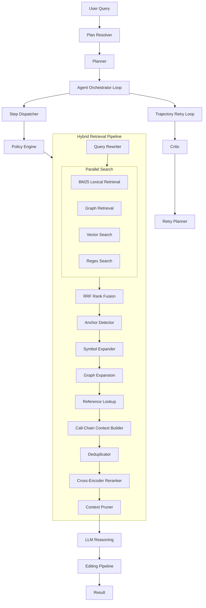

# AutoStudio Architecture

Authoritative system architecture document. Describes the full pipeline from user instruction to LLM reasoning, including hybrid retrieval, graph expansion, reference lookup, call-chain context, deduplication, and cross-encoder reranking.

See also:
- [RETRIEVAL_ARCHITECTURE.md](RETRIEVAL_ARCHITECTURE.md) — detailed retrieval pipeline
- [AGENT_LOOP_WORKFLOW.md](AGENT_LOOP_WORKFLOW.md) — step dispatch and policy engine
- [CONFIGURATION.md](CONFIGURATION.md) — config reference

---

## System Overview

AutoStudio is a repository-aware autonomous coding agent that converts natural-language instructions into executable plans, runs hybrid code search, ranks context, applies structured patches, and persists task memory. The system follows a deterministic pipeline (Mode 1) with optional autonomous retry (Mode 2).

**Core flow:** User instruction → Plan resolver (router + planner) → Agent loop → Step dispatcher → Policy engine → Tools (SEARCH, EDIT, INFRA, EXPLAIN) → Validation → Optional replan → Trajectory retry on failure.

---

## Pipeline Diagram

---

## Data Flow

### 1. Plan Resolution

- **Instruction router** classifies intent (CODE_EDIT, CODE_SEARCH, EXPLAIN, INFRA, GENERAL).
- **Planner** (for CODE_EDIT/GENERAL) produces JSON plan: `{steps: [{id, action, description, reason}]}`.
- Actions: SEARCH, EDIT, EXPLAIN, INFRA.

### 2. Step Execution

- **Step dispatcher** routes by action to PolicyEngine.
- **Policy engine** applies retry policies (SEARCH: 5 attempts, EDIT: 2, INFRA: 2).
- All tools invoked via `dispatch(step, state)` — no direct tool calls.

### 3. SEARCH Path — Hybrid Retrieval Pipeline

The retrieval pipeline is **immutable in order** (Rule 11). Stages:

| Stage | Component | Purpose |
|-------|-----------|---------|
| 1 | Query rewriter | LLM or heuristic rewrite of planner step |
| 2 | Repo map lookup | Token match against repo_map.json |
| 3 | Anchor detection | Symbol/class/function matches; fallback top-N |
| 4 | Parallel search | BM25, graph, vector, grep (concurrent) |
| 5 | RRF fusion | Reciprocal Rank Fusion merges result lists |
| 6 | Graph expansion | expand_from_anchors; expand_symbol_dependencies |
| 7 | Reference lookup | find_referencing_symbols (callers, callees, imports, referenced_by) |
| 8 | Call-chain context | build_call_chain_context (execution paths) |
| 9 | Deduplication | deduplicate_candidates (snippet hash) |
| 10 | Candidate budget | Slice to MAX_RERANK_CANDIDATES |
| 11 | Cross-encoder reranker | Qwen3-Reranker-0.6B (GPU/CPU); symbol bypass, cache |
| 12 | Context pruning | Max snippets, char budget |
| 13 | LLM | Reasoning model receives ranked context |

### 4. EDIT Path

- **Diff planner** → **Conflict resolver** → **Patch generator** → **AST patcher** → **Patch validator** → **Patch executor** → **Test repair loop** → **Index update**.

### 5. EXPLAIN Path

- **Explain gate** ensures ranked context before model call; injects SEARCH if empty.
- **Context builder v2** formats FILE/SYMBOL/LINES/SNIPPET blocks.

### 6. Trajectory Retry Loop (Meta)

On task failure, **TrajectoryLoop** runs: attempt → evaluate → critic → retry planner → retry. Retry strategies escalate (rewrite_query, expand_scope, new_plan, etc.).

---

## Component Descriptions

### Retrieval Subsystem (`agent/retrieval/`)

- **search_pipeline**: `hybrid_retrieve()` — runs BM25, graph, vector, grep in parallel; merges via RRF.
- **retrieval_pipeline**: `run_retrieval_pipeline()` — anchor → expand → build context → dedup → rerank → prune.
- **reranker/**: Cross-encoder (GPU/CPU), cache, dedup, symbol query bypass. See [agent/retrieval/reranker/README.md](../agent/retrieval/reranker/README.md).

### Graph Index (`repo_graph/`)

- **graph_storage**: SQLite nodes/edges.
- **graph_query**: `expand_symbol_dependencies`, `get_callers`, `get_callees`, `get_imports`, `get_referenced_by`.
- **repo_map_builder**: Generates repo_map.json from graph.

### Execution (`agent/execution/`)

- **step_dispatcher**: Single tool entry point; ToolGraph → Router → PolicyEngine.
- **policy_engine**: Retry policies, query rewrite on SEARCH retry, validate_step_input.

### Meta (`agent/meta/`)

- **critic**: Diagnoses failure type from trace.
- **retry_planner**: Maps diagnosis to retry strategy.
- **trajectory_loop**: attempt → evaluate → critique → plan_retry → retry.

---

## Config Sections

| Config | Purpose |
|--------|---------|
| retrieval_config | BM25, RRF, reranker, dedup, candidate budget, graph expansion |
| repo_graph_config | Symbol graph paths, index location |
| agent_config | Task runtime, replan attempts, step timeout, context chars |
| editing_config | Patch size, max files edited |

See [CONFIGURATION.md](CONFIGURATION.md) for full reference.

---

## Observability

Telemetry is stored in `state.context["retrieval_metrics"]` and trace files in `.agent_memory/traces/`. See [OBSERVABILITY.md](OBSERVABILITY.md) for field reference.
