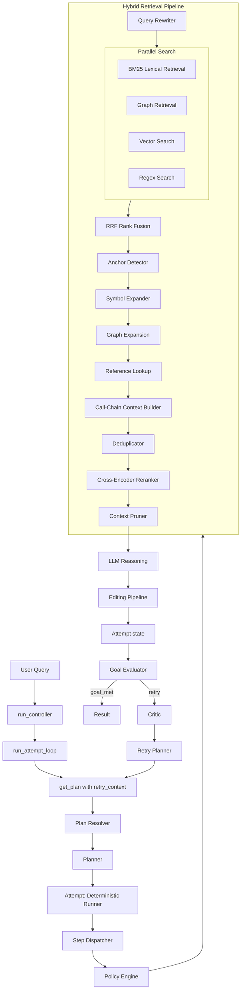

# AutoStudio Architecture

Authoritative system architecture. Describes the pipeline from user instruction to LLM reasoning, including hybrid retrieval, graph expansion, and cross-encoder reranking.

See also:
- [REACT_ARCHITECTURE.md](REACT_ARCHITECTURE.md) — **Primary:** ReAct flow, tools, schema
- [RETRIEVAL_ARCHITECTURE.md](RETRIEVAL_ARCHITECTURE.md) — detailed retrieval pipeline
- [AGENT_LOOP_WORKFLOW.md](AGENT_LOOP_WORKFLOW.md) — legacy step dispatch and policy engine
- [CONFIGURATION.md](CONFIGURATION.md) — config reference
- [architecture_freeze/ARCHITECTURE_FREEZE.md](architecture_freeze/ARCHITECTURE_FREEZE.md) — planner-centric freeze narrative
- Repository root **[README.md](../README.md)** — **agent_v2** mermaid diagrams (ACT loop, exploration data plane, tiered eval plane)

---

## System Overview

**Primary (ReAct, REACT_MODE=1 default):** User instruction → **run_controller** → **run_hierarchical** → **execution_loop** (ReAct). The model selects actions (search, open_file, edit, run_tests, finish) each step. No planner. No Critic/RetryPlanner. See [REACT_ARCHITECTURE.md](REACT_ARCHITECTURE.md).

**Legacy (REACT_MODE=0):** run_attempt_loop, get_plan, GoalEvaluator, Critic, RetryPlanner. See [PHASE_5_ATTEMPT_LOOP.md](PHASE_5_ATTEMPT_LOOP.md).

ReAct pipeline diagram: [REACT_ARCHITECTURE.md](REACT_ARCHITECTURE.md).

### Product path: agent_v2 (planner-centric)

Default pipeline: **AgentRuntime** → **ModeManager** → **PlannerTaskRuntime** (ACT: TaskPlanner decisions → **PlannerV2** when gated → **PlanExecutor** → shared **Dispatcher**). After exploration, the controller may run **answer synthesis** and, when configured, **answer validation** (`agent_v2/validation/answer_validator.py` via model client) before further plan refresh or stop. Shared **retrieval** and **editing** stacks are unchanged in ordering (Rules 11 / editing pipeline).

Benchmarking uses **`eval/`** (`live_executor`, **`PipelineCapture`**, tier definitions) as an observability harness around the same runtime — not a second engine.

---

## Legacy Pipeline (Design Reference — Not in Current Code)

> **Note:** `run_attempt_loop` is not implemented in the current codebase. The controller always calls `run_hierarchical` (ReAct). This diagram preserves the original Phase 5 design for reference.

---

## Data Flow

ReAct and legacy share the SEARCH pipeline (Section 3) and EDIT pipeline core (Section 4). Plan Resolution (1), Step Execution (2), and Attempt Loop (6) are legacy-only.

### 1. Plan Resolution (Legacy only)

- **route_production_instruction** (Stage 38) returns `RoutedIntent`; single production entrypoint. Order: docs-artifact (DOC) → two-phase docs+code (COMPOUND) → legacy `route_instruction` (5 categories).
- **Plan resolver** consumes `RoutedIntent`: DOC→docs_seed_plan; SEARCH/EXPLAIN/INFRA→single-step; EDIT/AMBIGUOUS/COMPOUND-flat→planner. Telemetry: `resolver_consumption` (docs_seed | short_search | short_explain | short_infra | planner).
- **Production-emission contract** (Stage 39): VALIDATE deferred; COMPOUND production-real only for two-phase. See `agent/routing/README.md`.
- **Planner** (for EDIT/GENERAL/AMBIGUOUS) produces JSON plan: `{plan_id, steps: [{id, action, description, reason}]}` (Phase 4: every plan has plan_id).
- Actions: SEARCH, EDIT, EXPLAIN, INFRA.

### 2. Step Execution

- **Step dispatcher** routes by action to PolicyEngine.
- **Policy engine** applies retry policies (SEARCH: 5 attempts, EDIT: 2, INFRA: 2).
- All tools invoked via `dispatch(step, state)` — no direct tool calls.

### 3. SEARCH Path — Hybrid Retrieval Pipeline

The retrieval pipeline is **immutable in order** (Rule 11). Stages:

| Stage | Component | Purpose |
|-------|-----------|---------|
| 1 | Query rewriter | LLM or heuristic rewrite of planner step |
| 2 | Repo map lookup | Token match against repo_map.json |
| 3 | Anchor detection | Symbol/class/function matches; fallback top-N |
| 4 | Parallel search | BM25, graph, vector, grep (concurrent) |
| 5 | RRF fusion | Reciprocal Rank Fusion merges result lists |
| 6 | Graph expansion | expand_from_anchors; expand_symbol_dependencies |
| 7 | Reference lookup | find_referencing_symbols (callers, callees, imports, referenced_by) |
| 8 | Call-chain context | build_call_chain_context (execution paths) |
| 9 | Deduplication | deduplicate_candidates (snippet hash) |
| 10 | Candidate budget | Slice to MAX_RERANK_CANDIDATES |
| 11 | Cross-encoder reranker | Qwen3-Reranker-0.6B (GPU/CPU); symbol bypass, cache |
| 12 | Context pruning | Max snippets, char budget |
| 13 | LLM | Reasoning model receives ranked context |

### 4. EDIT Path

- **Diff planner** → **Conflict resolver** → **Patch generator** → **AST patcher** → **Patch validator** → **Patch executor** → **Test repair loop** → **Index update**.

### 5. EXPLAIN Path

- **Explain gate** ensures ranked context before model call; injects SEARCH if empty.
- **Context builder v2** formats FILE/SYMBOL/LINES/SNIPPET blocks.

### 6. Attempt Loop (Phase 5 — Goal / Trajectory)

After each attempt, **GoalEvaluator** decides if the task goal is satisfied. If not, **Critic** analyzes the attempt (deterministic + LLM strategy hint) and **RetryPlanner** builds retry_context (previous_attempts, critic_feedback, strategy_hint); the next attempt’s **get_plan(retry_context)** feeds the planner. **TrajectoryMemory** stores attempt-level data; critic uses a trajectory summary (not raw step results). See [PHASE_5_ATTEMPT_LOOP.md](PHASE_5_ATTEMPT_LOOP.md).

---

## Component Descriptions

### Retrieval Subsystem (`agent/retrieval/`)

- **search_pipeline**: `hybrid_retrieve()` — runs BM25, graph, vector, grep in parallel; merges via RRF.
- **retrieval_pipeline**: `run_retrieval_pipeline()` — anchor → expand → build context → dedup → rerank → prune.
- **reranker/**: Cross-encoder (GPU/CPU), cache, dedup, symbol query bypass. See [agent/retrieval/reranker/README.md](../agent/retrieval/reranker/README.md).

### Graph Index (`repo_graph/`)

- **graph_storage**: SQLite nodes/edges.
- **graph_query**: `expand_symbol_dependencies`, `get_callers`, `get_callees`, `get_imports`, `get_referenced_by`.
- **repo_map_builder**: Generates repo_map.json from graph.

### Execution (`agent/execution/`)

- **step_dispatcher**: Single tool entry point; ToolGraph → Router → PolicyEngine.
- **policy_engine**: Retry policies, query rewrite on SEARCH retry, validate_step_input.

### Meta (`agent/meta/`)

- **critic**: Diagnoses failure type from trace.
- **retry_planner**: Maps diagnosis to retry strategy.
- **trajectory_loop**: attempt → evaluate → critique → plan_retry → retry.

---

## Config Sections

| Config | Purpose |
|--------|---------|
| retrieval_config | BM25, RRF, reranker, dedup, candidate budget, graph expansion |
| repo_graph_config | Symbol graph paths, index location |
| agent_config | Task runtime, replan attempts, step timeout, context chars |
| editing_config | Patch size, max files edited |

See [CONFIGURATION.md](CONFIGURATION.md) for full reference.

---

## Observability

Telemetry is stored in `state.context["retrieval_metrics"]` and trace files in `.agent_memory/traces/`. See [OBSERVABILITY.md](OBSERVABILITY.md) for field reference.
