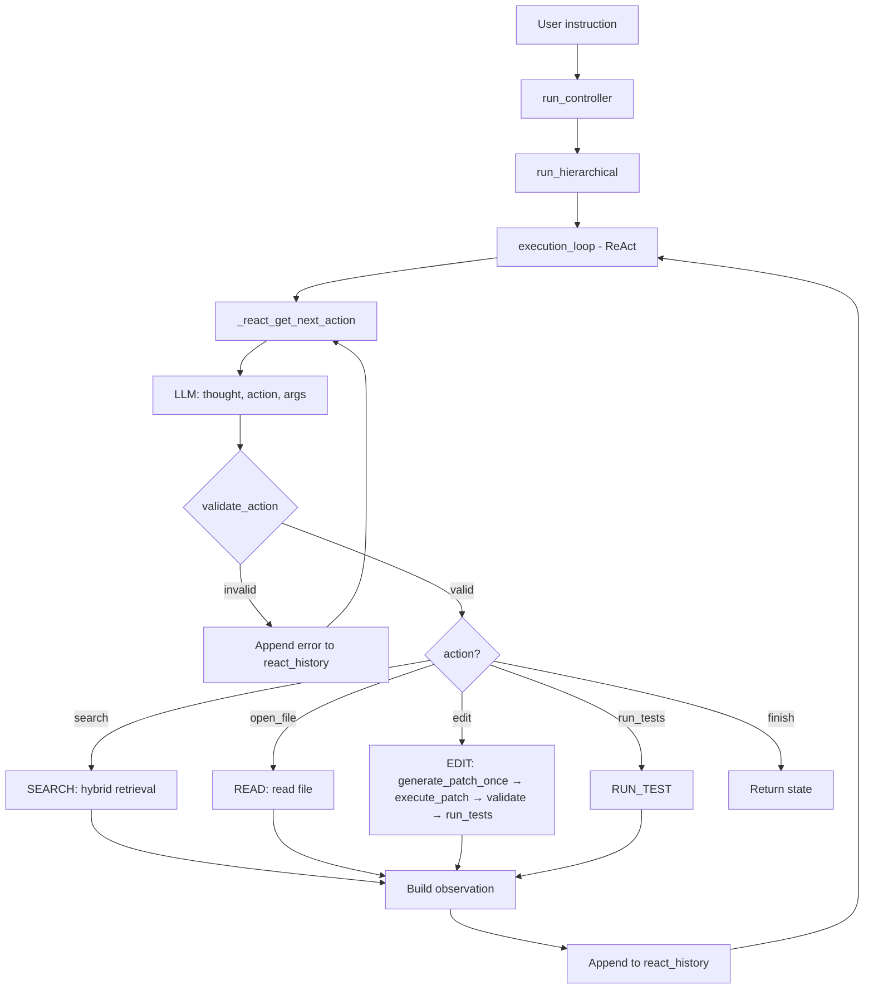

# Documentation Update Plan — ReAct as Primary System

**Date:** 2026-03-23  
**Scope:** Align all READMEs, diagrams, workflows with actual code — ReAct live loop is the go-to system  
**Methodology:** Principal-engineer-level RCA (Root Cause Analysis)

---

## 1. Executive Summary

AutoStudio has undergone significant architectural changes. **ReAct mode is now the primary execution path** (REACT_MODE=1 default). Documentation describes the old deterministic pipeline (run_attempt_loop, planner, Critic, RetryPlanner, GoalEvaluator) as the default flow. **Root cause:** docs were never updated after the ReAct simplification; multiple layers of documentation compound the drift.

**Impact:** New contributors and users will be confused; architectural decisions appear inconsistent with code; eval scripts and quick-start instructions point to deprecated flows.

---

## 2. RCA — Documentation vs. Code Drift

### 2.1 Controller Flow (Critical)

| Doc Says | Code Actually Does |
|----------|-------------------|
| `run_controller` → `run_attempt_loop` (Phase 5) | `run_controller` → `run_hierarchical` |
| Per attempt: get_plan → step loop → GoalEvaluator → Critic/RetryPlanner | No attempt loop; run_hierarchical → execution_loop (ReAct) |
| Mode 1 = deterministic pipeline | Mode 1 = ReAct (model selects actions) |
| `run_deterministic` is single-attempt source | `run_hierarchical` is single source; no run_deterministic in path |

**Evidence:**
- `agent/orchestrator/agent_controller.py`: `state, loop_output = run_hierarchical(...)`
- `agent/orchestrator/deterministic_runner.py`: `run_hierarchical` → `execution_loop(state, instruction, ...)`
- No imports of `run_attempt_loop` in agent_controller

### 2.2 Execution Loop (Critical)

| Doc Says | Code Actually Does |
|----------|-------------------|
| `execution_loop` shared by run_agent and run_deterministic | `execution_loop` in `agent/orchestrator/execution_loop.py` is the ReAct loop |
| Step loop: next_step → execute_step → validate → replan | ReAct loop: _react_get_next_action → executor.execute_step → _build_react_observation → append to react_history |
| Plan from get_plan; steps from planner | Model selects actions (search, open_file, edit, run_tests, finish) each iteration |
| validate_step, replan on failure | No validate_step; no replan; model sees observation and chooses next action |

**Evidence:**
- `agent/orchestrator/execution_loop.py`: `_react_get_next_action`, `react_history`, `_REACT_TO_STEP`
- No planner, no get_plan in execution path

### 2.3 Edit Pipeline (Critical)

| Doc Says | Code Actually Does |
|----------|-------------------|
| EDIT: plan_diff → conflict_resolver → patch_generator → run_edit_test_fix_loop | ReAct EDIT: _edit_react → _generate_patch_once → execute_patch → validate_project → run_tests |
| run_edit_test_fix_loop: critic, retry_planner, strategy_explorer | Single attempt; no critic; no retry_planner in ReAct path |
| plan_diff identifies affected symbols | _generate_patch_once uses instruction + path from step; edit_proposal_generator |

**Evidence:**
- `agent/execution/step_dispatcher.py`: `_dispatch_react` → `_edit_react`; `_edit_react` uses `_generate_patch_once`
- `agent/runtime/execution_loop.py`: Has `run_edit_test_fix_loop` (used by tests) and `_run_edit_once`; ReAct path uses `_run_edit_once`-style flow

### 2.4 Mermaid/ASCII Diagrams (High)

- README.md: Mermaid diagram shows RunAttemptLoop, GetPlan, Planner, GoalEval, Critic, RetryPlanner
- ARCHITECTURE.md: Same pipeline
- AGENT_LOOP_WORKFLOW.md: Plan resolver, step loop, validate, replan

**Reality:** User → run_controller → run_hierarchical → execution_loop (ReAct) → _react_get_next_action → StepExecutor → dispatch (SEARCH/READ/EDIT/RUN_TEST) → observation → repeat until finish.

### 2.5 Quick Start & CLI (Medium)

- README "Run the agent" mentions run_attempt_loop, run_deterministic, Mode 2 autonomous
- run_react_live.py not mentioned as primary way to run
- `python -m agent "instruction"` invokes run_controller → run_hierarchical (correct) but surrounding text describes Phase 5 attempt loop

### 2.6 Module READMEs (Medium)

- `agent/orchestrator/README.md`: Describes plan resolution, get_plan, get_parent_plan, agent loop; no ReAct
- `agent/runtime/README.md`: Describes run_edit_test_fix_loop with critic + retry_planner; ReAct uses _run_edit_once
- `Docs/README.md`: Links to AGENT_LOOP_WORKFLOW, AGENT_CONTROLLER without ReAct caveat

### 2.7 Phase Numbering (Low)

- Docs refer to Phase 3, 4, 5, 6, 7, 8, 9, 10, etc.
- ReAct simplification doesn't map cleanly; many phases (Critic, RetryPlanner, GoalEvaluator) are bypassed in ReAct path
- Recommendation: Add "ReAct path" vs "Legacy deterministic path" where both exist

---

## 3. Artifacts to Update

### 3.1 Tier 1 — Must Update (User-Facing, High Confusion Risk)

| Artifact | Location | Changes |
|----------|----------|---------|
| **README.md** | Root | Architecture Overview: Replace run_attempt_loop with run_hierarchical → ReAct execution_loop. Add ReAct flow diagram. Quick Start: Add run_react_live.py. Deprecate/relabel Phase 5 attempt loop as legacy. |
| **Docs/ARCHITECTURE.md** | Docs/ | Pipeline diagram: ReAct loop. Data flow: model selects actions. Clarify retrieval is reused; editing is generate_patch_once → execute_patch. |
| **Docs/AGENT_LOOP_WORKFLOW.md** | Docs/ | Rename or add ReAct section. Primary flow: _react_get_next_action → dispatch → observation. Legacy: get_plan, validate, replan (if still reachable). |
| **Docs/README.md** | Docs/ | Add ReAct-specific doc link. Update AGENT_LOOP_WORKFLOW description. |

### 3.2 Tier 2 — Should Update (Developer-Facing)

| Artifact | Location | Changes |
|----------|----------|---------|
| **agent/orchestrator/README.md** | agent/orchestrator/ | Add ReAct as primary path. run_hierarchical → execution_loop. Plan resolver: only relevant for non-ReAct (if any). |
| **agent/runtime/README.md** | agent/runtime/ | Clarify: run_edit_test_fix_loop used by tests; ReAct path uses _run_edit_once (generate_patch_once → execute_patch → validate → run_tests). |
| **Docs/AGENT_CONTROLLER.md** | Docs/ | If exists: update to run_hierarchical, ReAct loop. Remove or relabel run_attempt_loop. |
| **Docs/EDIT_PIPELINE_DETAILED_ANALYSIS.md** | Docs/ | Add ReAct EDIT path section. Document _edit_react, _generate_patch_once. Keep plan_diff path for deterministic fallback if applicable. |
| **Docs/PROJECT_STRUCTURE.md** | Docs/ | orchestrator: run_hierarchical, ReAct execution_loop. runtime: _run_edit_once for ReAct. |

### 3.3 Tier 3 — Nice to Have (Consistency)

| Artifact | Location | Changes |
|----------|----------|---------|
| **Docs/PHASE_5_ATTEMPT_LOOP.md** | Docs/ | Add banner: "Legacy; bypassed when REACT_MODE=1" or archive. |
| **Docs/CONFIGURATION.md** | Docs/ | Document REACT_MODE=1 as default. REACT_MODE=0 for legacy. |
| **planner/README.md** | planner/ | Note: Planner used in legacy deterministic path; ReAct does not use planner. |
| **Dev roadmap phases** | dev/roadmap/ | Add note: ReAct is primary; Phase 5 attempt loop bypassed in default config. |

### 3.4 New Artifacts to Create

| Artifact | Purpose |
|----------|---------|
| **Docs/REACT_ARCHITECTURE.md** | Single source of truth for ReAct flow: tools (search, open_file, edit, run_tests, finish), schema, workflow, observations, limits. |
| **Docs/REACT_QUICK_START.md** | How to run ReAct: run_react_live.py, python -m agent, env vars, trace output. |
| **Diagrams: REACT_FLOW.mmd or .svg** | Mermaid/ASCII for: instruction → run_controller → run_hierarchical → execution_loop → _react_get_next_action loop. |

---

## 4. Diagram Update Plan

### 4.1 New ReAct Flow (Mermaid)

### 4.2 README Architecture Section Replacement

Replace the current "Mode 1 (deterministic) uses run_controller → run_attempt_loop" block with:

- **Primary (ReAct, default):** run_controller → run_hierarchical → execution_loop. Model selects actions (search, open_file, edit, run_tests, finish) each step. No planner. No Critic/RetryPlanner. See [Docs/REACT_ARCHITECTURE.md](Docs/REACT_ARCHITECTURE.md).
- **Legacy (REACT_MODE=0):** run_attempt_loop, get_plan, GoalEvaluator, Critic, RetryPlanner. See [Docs/AGENT_LOOP_WORKFLOW.md](Docs/AGENT_LOOP_WORKFLOW.md).

---

## 5. Implementation Phases

### Phase A — RCA and Plan (Done)
- [x] Audit docs vs code
- [x] Identify drift
- [x] Create this plan

### Phase B — Tier 1 Updates (Priority)
1. Create `Docs/REACT_ARCHITECTURE.md` (new canonical doc)
2. Update `README.md` Architecture Overview and diagrams
3. Update `Docs/ARCHITECTURE.md` pipeline and data flow
4. Update `Docs/AGENT_LOOP_WORKFLOW.md` (add ReAct primary, legacy note)
5. Update `Docs/README.md` index

### Phase C — Tier 2 Updates
6. Update `agent/orchestrator/README.md`
7. Update `agent/runtime/README.md`
8. Update `Docs/EDIT_PIPELINE_DETAILED_ANALYSIS.md` (ReAct EDIT path)
9. Update `Docs/PROJECT_STRUCTURE.md`
10. Create `Docs/REACT_QUICK_START.md`

### Phase D — Tier 3 and Diagrams
11. Add deprecation/legacy banners to Phase 5 docs
12. Update CONFIGURATION.md (REACT_MODE)
13. Add ReAct flow diagram to Docs/
14. Update planner/README.md
15. Update relevant dev/roadmap phase docs

### Phase E — Validation
16. Grep for "run_attempt_loop", "get_plan", "GoalEvaluator" in docs — ensure legacy-labeled
17. Grep for "run_hierarchical", "ReAct", "react_history" — ensure documented
18. Run `python -m agent "test"` and `python scripts/run_react_live.py "test"` — verify instructions still work
19. Review with stakeholder

---

## 6. Risk Mitigation

| Risk | Mitigation |
|------|------------|
| Breaking links | Keep old doc names; add redirects or "See REACT_ARCHITECTURE" |
| Over-deleting | Mark legacy, don't delete; Phase 5 may be re-enabled |
| Inconsistent terminology | Glossary: ReAct = model-selects-actions loop; deterministic = planner+retry loop |
| Eval script drift | Audit run_capability_eval, run_principal_engineer_suite — ensure they use run_controller (correct) |

---

## 7. Success Criteria

- [ ] New contributor reading README understands ReAct is the default
- [ ] run_react_live.py is documented as primary live execution script
- [ ] No diagram shows run_attempt_loop as the default path
- [ ] REACT_ARCHITECTURE.md exists and is linked from README
- [ ] EDIT path docs reflect _generate_patch_once → execute_patch (single attempt)
- [ ] Legacy deterministic path is explicitly labeled where it still exists

---

## 8. Appendix — File Inventory

### Docs to Update
- README.md (root)
- Docs/README.md
- Docs/ARCHITECTURE.md
- Docs/AGENT_LOOP_WORKFLOW.md
- Docs/AGENT_CONTROLLER.md (if exists)
- Docs/EDIT_PIPELINE_DETAILED_ANALYSIS.md
- Docs/PROJECT_STRUCTURE.md
- Docs/CONFIGURATION.md
- Docs/PHASE_5_ATTEMPT_LOOP.md
- agent/orchestrator/README.md
- agent/runtime/README.md
- planner/README.md

### Docs to Create
- Docs/REACT_ARCHITECTURE.md
- Docs/REACT_QUICK_START.md
- Docs/diagrams/REACT_FLOW.mmd (optional)

### Code References (No Changes)
- agent/orchestrator/agent_controller.py
- agent/orchestrator/deterministic_runner.py
- agent/orchestrator/execution_loop.py
- agent/execution/step_dispatcher.py
- scripts/run_react_live.py
