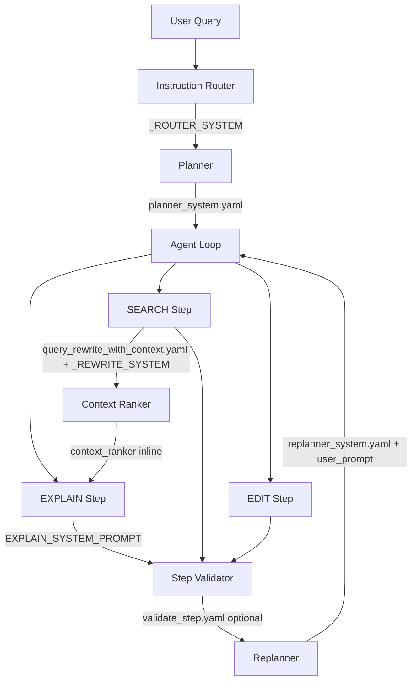

# Prompt Architecture

This document explains all prompts used in AutoStudio: purpose, pipeline position, structure, design reasoning, example I/O, failure modes, code references, and maintenance rules. The prompt layer is fully inspectable.

---

## 1. Overview

AutoStudio uses a **deterministic pipeline** where LLMs plan and reason, and deterministic code dispatches and executes. Prompts enforce structured outputs (JSON, single tokens, YES/NO) to avoid free-form hallucination.

### Prompt Loading

All YAML prompts are loaded via [`agent/prompts/__init__.py`](../agent/prompts/__init__.py):

```python
def get_prompt(name: str, key: str | None = None) -> str | dict:
    """Load prompt from agent/prompts/{name}.yaml. key selects a specific key."""
```

- **Placeholders**: Use `{name}` for substitution; pass kwargs to `format()`.
- **Literal braces**: Escape as `{{` and `}}` in YAML.
- **Structured output**: Prompts requiring JSON use schema-first design, few-shot examples, and explicit "Return JSON only" instructions.

### Model Routing

Task-to-model mapping is defined in [`agent/models/models_config.json`](../agent/models/models_config.json) under `task_models`. The `model_router.yaml` prompt is used only when a task is not in config (fallback). Production uses config lookup via `get_model_for_task()`.

---

## 2. Prompt Inventory

| Prompt | File / Location | Key / Name | Consumer | Model |
|--------|-----------------|------------|----------|-------|
| planner_system | [agent/prompts/planner_system.yaml](../agent/prompts/planner_system.yaml) | `system_prompt` | [planner/planner.py](../planner/planner.py) | REASONING |
| replanner_system | [agent/prompts/replanner_system.yaml](../agent/prompts/replanner_system.yaml) | `system_prompt` | [agent/orchestrator/replanner.py](../agent/orchestrator/replanner.py) | REASONING |
| query_rewrite | [agent/prompts/query_rewrite.yaml](../agent/prompts/query_rewrite.yaml) | `prompt` | [agent/retrieval/query_rewriter.py](../agent/retrieval/query_rewriter.py) | REASONING/SMALL |
| query_rewrite_with_context | [agent/prompts/query_rewrite_with_context.yaml](../agent/prompts/query_rewrite_with_context.yaml) | `main`, `end` | [agent/retrieval/query_rewriter.py](../agent/retrieval/query_rewriter.py) | REASONING/SMALL |
| validate_step | [agent/prompts/validate_step.yaml](../agent/prompts/validate_step.yaml) | `prompt` | [agent/orchestrator/validator.py](../agent/orchestrator/validator.py) | REASONING |
| model_router | [agent/prompts/model_router.yaml](../agent/prompts/model_router.yaml) | `prompt` | [agent/models/model_router.py](../agent/models/model_router.py) | SMALL (fallback) |
| router_logit_system | [agent/prompts/router_logit_system.yaml](../agent/prompts/router_logit_system.yaml) | `system_prompt` | [router_eval/routers/logit_router.py](../router_eval/routers/logit_router.py) | SMALL |
| _ROUTER_SYSTEM | [agent/routing/instruction_router.py](../agent/routing/instruction_router.py) (inline) | — | `instruction_router.route_instruction()` | SMALL |
| EXPLAIN_SYSTEM_PROMPT | [agent/execution/step_dispatcher.py](../agent/execution/step_dispatcher.py) (inline) | — | `dispatch()` EXPLAIN path | REASONING/SMALL |
| _REWRITE_SYSTEM | [agent/retrieval/query_rewriter.py](../agent/retrieval/query_rewriter.py) (inline) | — | `rewrite_query_with_context()` | REASONING/SMALL |
| replanner user_prompt | [agent/orchestrator/replanner.py](../agent/orchestrator/replanner.py) (inline) | — | `replan()` | REASONING/SMALL |
| context_ranker | [agent/retrieval/context_ranker.py](../agent/retrieval/context_ranker.py) (inline) | — | `rank_context()` | REASONING |
| BASELINE_SYSTEM | [router_eval/prompts/router_prompts.py](../router_eval/prompts/router_prompts.py) | — | [baseline_router.py](../router_eval/routers/baseline_router.py) | SMALL |
| FEWSHOT_SYSTEM | [router_eval/prompts/router_prompts.py](../router_eval/prompts/router_prompts.py) | — | [fewshot_router.py](../router_eval/routers/fewshot_router.py), [fewshot_logit_router.py](../router_eval/routers/fewshot_logit_router.py) | SMALL |
| PROMPT_A/B/C | [router_eval/prompts/router_prompts.py](../router_eval/prompts/router_prompts.py) | — | [router_core.py](../router_eval/utils/router_core.py), [ensemble_router.py](../router_eval/routers/ensemble_router.py) | SMALL |
| ROUTER_V2_SYSTEM | [router_eval/prompts/router_v2_prompt.py](../router_eval/prompts/router_v2_prompt.py) | — | [router_v2.py](../router_eval/routers/router_v2.py) | SMALL |
| CRITIC_SYSTEM | [router_eval/prompts/critic_prompt.py](../router_eval/prompts/critic_prompt.py) | — | [critic_router.py](../router_eval/routers/critic_router.py), [final_router.py](../router_eval/routers/final_router.py) | SMALL |

---

## 3. Pipeline Prompt Map



### Narrative Flow

1. **User Query** → Optional instruction router (`ENABLE_INSTRUCTION_ROUTER=1`) uses `_ROUTER_SYSTEM` to classify into CODE_SEARCH, CODE_EDIT, CODE_EXPLAIN, INFRA, GENERAL. CODE_SEARCH/EXPLAIN/INFRA bypass planner with single-step plans.
2. **Planner** → Uses `planner_system.yaml` to produce `{"steps": [...]}` JSON.
3. **Agent Loop** → For each step: SEARCH, EDIT, EXPLAIN, or INFRA.
4. **SEARCH** → Policy engine calls `rewrite_query_with_context()` (query_rewrite_with_context.yaml + _REWRITE_SYSTEM) → retrieval → `run_retrieval_pipeline()` → optional `rank_context()` (context_ranker inline prompt).
5. **EXPLAIN** → Context gate ensures `ranked_context` exists; uses `EXPLAIN_SYSTEM_PROMPT` with formatted context.
6. **Validator** → Rule-based by default; when `ENABLE_LLM_VALIDATION=1`, uses `validate_step.yaml` for SEARCH/EXPLAIN.
7. **Replanner** → On failure, uses `replanner_system.yaml` + inline user_prompt to produce revised plan.

---

## 4. Router Prompts

### 4.1 Production Router (`_ROUTER_SYSTEM`)

**Location**: [`agent/routing/instruction_router.py`](../agent/routing/instruction_router.py) lines 26–40

**Purpose**: Classify developer query before planner. When `ENABLE_INSTRUCTION_ROUTER=1`, routes to single-step plans for CODE_SEARCH, CODE_EXPLAIN, INFRA; falls through to planner for CODE_EDIT, GENERAL.

**Pipeline Position**: Context Grounder → **Intent Router** ← here → Planner

**Structure**:
- System: Categories (CODE_SEARCH, CODE_EDIT, CODE_EXPLAIN, INFRA, GENERAL) + JSON format `{"category": "...", "confidence": 0.0}`
- User: `Instruction:\n{instruction}`

**Design Reasoning**: JSON output enables programmatic parsing; confidence supports future filtering. Categories align with planner actions for single-step bypass.

**Example Input**: "Where is validate_step defined?"

**Expected Output**: `{"category": "CODE_SEARCH", "confidence": 0.92}`

**Failure Modes**: Invalid JSON → defaults to GENERAL; model call failure → GENERAL with confidence 0.

**Used in**: `instruction_router.route_instruction()`; `plan_resolver.get_plan()` when router enabled.

---

### 4.2 Router Eval Prompts

| Prompt | Purpose | Few-Shot |
|--------|---------|----------|
| `BASELINE_SYSTEM` | 5-category single-call router | No |
| `FEWSHOT_SYSTEM` | 5-category with 10 examples | Yes |
| `PROMPT_A_CLASSIFICATION` | Direct classification | No |
| `PROMPT_B_TOOL_SELECTION` | Tool-selection framing | No |
| `PROMPT_C_INSTRUCTION_ANALYSIS` | Intent analysis framing | No |
| `ROUTER_V2_SYSTEM` | 4-category (EDIT, SEARCH, EXPLAIN, INFRA), CATEGORY CONFIDENCE | 4 examples |
| `router_logit_system.yaml` | Single-token: EDIT, SEARCH, EXPLAIN, INFRA, GENERAL | No |
| `CRITIC_SYSTEM` | Validates router prediction: YES or NO \<CATEGORY\> | 5 examples |

**Used in**: `router_eval/routers/*.py`; selectable via `ROUTER_TYPE` env (baseline, fewshot, ensemble, final).

---

## 5. Planner Prompts

### planner_system.yaml

**Purpose**: Convert user instructions into structured execution steps (EDIT, SEARCH, EXPLAIN, INFRA).

**Pipeline Position**: Intent Router → **Planner** ← here → Agent Loop

**Structure**:
- SYSTEM: Role + 4 actions + 9 PLANNING RULES + OUTPUT FORMAT (strict JSON)
- USER: Raw instruction (no template)

**Design Reasoning**:
- One action per step: avoids combined "SEARCH and EDIT" steps.
- SEARCH before EDIT/EXPLAIN: grounds actions in repo results.
- Minimal steps: reduces unnecessary work.
- EXPLAIN only when explicit: avoids over-explaining.
- Rule 9: SEARCH steps target implementation, not tests, for "how does X work" questions.
- **MULTI-STEP EXAMPLES** (Phase 5): Few-shot examples for bug fix (SEARCH → EDIT), multi-file feature (SEARCH → EDIT config → EDIT executor), and refactoring (SEARCH → SEARCH → EDIT → EDIT).

**Example Input**: "Explain how StepExecutor runs steps"

**Expected Output**:
```json
{
  "steps": [
    {"id": 1, "action": "SEARCH", "description": "Locate StepExecutor implementation in agent/execution", "reason": "Need code before explaining"},
    {"id": 2, "action": "EXPLAIN", "description": "Explain execution flow", "reason": "User requested explanation"}
  ]
}
```

**Failure Modes**:
- Hallucinated tool names → normalized to EDIT/SEARCH/EXPLAIN/INFRA by `normalize_actions()`.
- Unbounded step generation → no hard cap; relies on prompt.
- Missing retrieval step → validator/replanner can add SEARCH on EXPLAIN failure.
- Parse failure → fallback: single SEARCH step.
- LLM failure → fallback: single EXPLAIN step.

**Used in**: [planner/planner.py](../planner/planner.py), [planner/planner_prompts.py](../planner/planner_prompts.py), [planner/planner_eval.py](../planner/planner_eval.py), [agent/orchestrator/plan_resolver.py](../agent/orchestrator/plan_resolver.py).

---

## 6. Replanner Prompts

### replanner_system.yaml + inline user_prompt

**Purpose**: On step failure, produce a revised plan that addresses the failure.

**Pipeline Position**: Step Validator (invalid) → **Replanner** ← here → Agent Loop

**Structure**:
- SYSTEM: `replanner_system.yaml` — 6 REPLANNING RULES (analyze failure, revise plan, keep completed steps, ground actions, JSON format).
- USER (inline in `replanner.py`):
  ```
  Original instruction: {instruction}
  Current plan (JSON): {steps_json}
  Failed step: {failed_desc}
  Error message: {error_msg}
  Produce a revised plan (JSON with "steps" array). Address the failure. Return only valid JSON.
  ```

**Design Reasoning**: Rules cover common failures: file not found → add SEARCH; EXPLAIN without context → add SEARCH; SEARCH only tests → more specific SEARCH; query rewrite error → simpler description; config issue → add INFRA.

**Example Input**: Failed EXPLAIN with "I cannot answer without relevant code context"

**Expected Output**: Revised plan with SEARCH before EXPLAIN.

**Failure Modes**: LLM/parse failure → fallback: remaining steps only (no new plan).

**Used in**: [agent/orchestrator/replanner.py](../agent/orchestrator/replanner.py).

---

## 7. Query Rewrite Prompts

### 7.1 query_rewrite.yaml (simple)

**Purpose**: Rewrite user query for code search without execution context. Used when `rewrite_query(text, use_llm=True)`.

**Structure**: Single prompt with `{text}` placeholder. Describes 4 tools (retrieve_graph, retrieve_vector, retrieve_grep, list_dir), rules for identifiers and patterns, "Return only the rewritten search query."

**Used in**: [agent/retrieval/query_rewriter.py](../agent/retrieval/query_rewriter.py) `rewrite_query()`. Primary path is `rewrite_query_with_context()`.

---

### 7.2 query_rewrite_with_context.yaml + _REWRITE_SYSTEM

**Purpose**: Rewrite planner step into search query using user request and previous attempt history. Maximizes recall; policy engine retries with variants.

**Pipeline Position**: SEARCH step → Policy Engine → **Query Rewriter** ← here → Retrieval

**Structure**:
- **main**: Schema `{tool, query, reason}`; optional `queries` array. 10 SEARCH STRATEGY RULES. Tool choice rules. 6 few-shot examples. Variables: `{user_request}`, `{previous_attempts}`, `{planner_step}`.
- **end**: "Return JSON only:"
- **System** (inline `_REWRITE_SYSTEM`): "You are a code-search API. Return ONLY valid JSON with keys: tool, query, reason. Optional: queries (array). Never include explanations."

**Design Reasoning**:
- High recall over precision: downstream ranking prunes.
- Regex/substring patterns: StepExecutor → Step.*Executor, executor.
- BIAS IMPLEMENTATION: When previous results were only tests, prefer retrieve_grep with implementation module name.
- `queries` array: policy engine tries each until success.

**Example Input**: Planner step "Locate dispatcher routing code", previous: `retrieve_graph('dispatcher') → tests/test_agent_e2e.py`

**Expected Output**: `{"tool": "retrieve_grep", "query": "step_dispatcher", "reason": "Previous found only tests; grep for implementation module"}`

**Failure Modes**: LLM error → heuristic strip filler words → raw planner_step. Invalid tool → `chosen_tool` not set; retrieval uses default order.

**Used in**: [agent/retrieval/query_rewriter.py](../agent/retrieval/query_rewriter.py) `rewrite_query_with_context()`.

---

## 8. Validation Prompts

### validate_step.yaml

**Purpose**: When `ENABLE_LLM_VALIDATION=1`, ask LLM whether step output sufficiently supports next step and user goal. Used only for SEARCH and EXPLAIN after rule-based checks pass.

**Pipeline Position**: Step execution → **Validator** ← here (optional LLM path) → Replanner on invalid

**Structure**:
```
Did this step succeed in the context of the agent loop?
User instruction: {instruction}
Step: {step}
Result success: {success}, output (summary): {output_summary}
Next step in plan: {next_step_description}
Consider: Does the output sufficiently support the next step and the user's goal?
For SEARCH: Are the results relevant implementation code (not just tests) when the user asks "how does X work"?
For EXPLAIN: Does the explanation address the question with real code context?
Answer with exactly YES or NO.
```

**Design Reasoning**: Rule-based validation handles most cases; LLM adds nuance for ambiguous SEARCH/EXPLAIN outcomes (e.g., results are implementation vs tests).

**Failure Modes**: LLM failure → fallback to rule-based. Non-YES response → invalid, feedback passed to replanner.

**Used in**: [agent/orchestrator/validator.py](../agent/orchestrator/validator.py) `validate_step()`.

---

### EXPLAIN_SYSTEM_PROMPT (context gate)

**Location**: [`agent/execution/step_dispatcher.py`](../agent/execution/step_dispatcher.py) lines 279–285

**Purpose**: Ground EXPLAIN in provided context; refuse to answer without code context.

**Structure**:
- Answer using ONLY provided context.
- If no context or context lacks answer: respond exactly "I cannot answer without relevant code context. Please run a SEARCH step first to locate the relevant code."
- Keep answer concise; cite file paths from context.

**Design Reasoning**: Prevents hallucination; forces retrieval-before-reasoning. The exact refusal string is detected by validator to trigger replan (add SEARCH).

**Used in**: [agent/execution/step_dispatcher.py](../agent/execution/step_dispatcher.py) `dispatch()` EXPLAIN path.

---

## 9. Model Routing Prompts

### model_router.yaml

**Purpose**: Classify task as SMALL or REASONING when task not in `models_config.json`. Production uses config; this is fallback.

**Structure**:
```
Classify which model should handle this task.
Options: SMALL or REASONING
- Use SMALL for: simple classification, routing, lightweight decisions.
- Use REASONING for: planning, query rewriting, validation, explanation, multi-step reasoning.
Task: {task_description}
Return only the label: SMALL or REASONING.
```

**Used in**: [agent/models/model_router.py](../agent/models/model_router.py) `route_task()`. `get_model_for_task()` uses [models_config.json](../agent/models/models_config.json) `task_models` by default.

---

## 10. Evaluation Prompts

Used in `router_eval/` for router benchmarking:

| Prompt | Purpose |
|--------|---------|
| `CRITIC_SYSTEM` | Validates router prediction; outputs YES or NO \<CATEGORY\> |
| `build_critic_user_message()` | Builds user message: instruction + predicted category |
| `CONFIDENCE_INSTRUCTION` | Extends router to output CATEGORY CONFIDENCE |
| `DUAL_INSTRUCTION` | Extends router to output PRIMARY SECONDARY CONFIDENCE |

**Used in**: [router_eval/routers/critic_router.py](../router_eval/routers/critic_router.py), [final_router.py](../router_eval/routers/final_router.py), [confidence_router.py](../router_eval/routers/confidence_router.py), [dual_router.py](../router_eval/routers/dual_router.py).

---

## 11. Context Ranker (Inline)

**Location**: [`agent/retrieval/context_ranker.py`](../agent/retrieval/context_ranker.py)

**Purpose**: Score retrieved snippets for relevance. Hybrid: 0.6×LLM + 0.2×symbol + 0.1×filename + 0.1×reference, minus diversity/test penalties.

**Structure** (batch):
```
Query: {query}
Snippets:
1. {snippet_1}
2. {snippet_2}
...
Question: How relevant is each snippet for answering the query?
Return one number (0-1) per line, in order.
```

**Used in**: `rank_context()` when `ENABLE_CONTEXT_RANKING=1`.

---

## 12. Prompt Design Philosophy

### Deterministic Outputs

Prompts enforce structured responses to avoid free-form hallucination:

- **Planner/Replanner**: `{"steps": [...]}` JSON only.
- **Router**: `{"category": "...", "confidence": 0.0}` or single category word.
- **Query Rewrite**: `{tool, query, reason}` JSON.
- **Validator**: YES or NO.
- **Model Router**: SMALL or REASONING.

### Avoiding Hallucination

- **EXPLAIN_SYSTEM_PROMPT**: "Answer using ONLY the provided context."
- **Query rewrite**: "Never put file/dir names in name_path" for retrieve_graph; tool choice constrained to 4 tools.
- **Planner**: "Ground actions in repo results"; "SEARCH must occur first."

### Bounded Reasoning

- **Planner**: "Use the minimal number of steps"; "Each step must contain exactly ONE action."
- **Query rewrite**: "Query max ~1000 chars"; "1–3 tokens per query."
- **Context**: Pruned to 6 snippets, 8000 chars; ranking limited to 20 candidates.

### Tool Selection Separation

The planner chooses **action types** (EDIT, SEARCH, EXPLAIN, INFRA). Tool selection (retrieve_graph, retrieve_vector, retrieve_grep, list_dir) is done by the query rewriter and tool graph router—not by the planner. This keeps planning abstract and execution deterministic.

---

## 13. Prompt Safety Risks

| Prompt | Risk | Mitigation |
|--------|------|------------|
| Planner | Hallucinated tool names | `normalize_actions()` maps to EDIT/SEARCH/EXPLAIN/INFRA |
| Planner | Unbounded step generation | Prompt says "minimal steps"; no hard cap |
| Planner | EDIT without retrieval | Rule 8: "SEARCH must occur first"; validator/replanner add SEARCH on failure |
| Router | EDIT vs EXPLAIN misclassification | Few-shot examples; critic validation in eval |
| Router | GENERAL overuse | "use when unclear" in prompt |
| Query Rewrite | Over-expansion of queries | "1–3 tokens"; "Query max ~1000 chars" |
| Query Rewrite | Invalid tool name | Check against allowed set; ignore if invalid |
| Replanner | Infinite replan loop | agent_loop: `MAX_REPLAN_ATTEMPTS=3`; agent_controller: `MAX_REPLAN_ATTEMPTS=5` (config) |
| Validator | LLM says YES when invalid | Rule-based first; LLM only for ambiguous cases |
| EXPLAIN | Answering without context | Context gate; exact refusal string detection |

---

## 14. Prompt Testing Strategy

| Component | Script / Test | Metrics |
|-----------|--------------|---------|
| Planner | `python -m planner.planner_eval` | structural_valid_rate, action_coverage_accuracy, dependency_order_accuracy, mean_latency_sec |
| Router | `python -m router_eval.router_eval_v2` | accuracy, confusion matrix, calibration, avg_confidence |
| Router (golden/adversarial) | `--golden`, `--adversarial` | Edge-case accuracy |
| Agent | `python scripts/evaluate_agent.py` | task_success_rate, retrieval_recall, planner_accuracy, latency_avg |
| Agent (plan-only) | `python scripts/evaluate_agent.py --plan-only` | planner_accuracy, latency |
| Validator | `tests/test_validator.py` | Rule-based validation |

### Eval Datasets

- Planner: [planner/planner_dataset.json](../planner/planner_dataset.json)
- Router: [router_eval/dataset_v2](../router_eval/dataset_v2.py), [golden_dataset_v2.json](../router_eval/golden_dataset_v2.json), [adversarial_dataset_v2.json](../router_eval/adversarial_dataset_v2.json)
- Agent: [tests/agent_eval.json](../tests/agent_eval.json)

---

## 15. Maintenance Rules

When changing prompts:

1. **Run planner_eval**: `python -m planner.planner_eval`
2. **Run router_eval**: `python -m router_eval.router_eval_v2`
3. **Run agent_eval**: `python scripts/evaluate_agent.py`
4. **Inspect traces**: Check `.agent_memory/traces/` for prompt→output behavior

**Never modify prompts without evaluation.** Track metrics before/after changes.

### Adding a New Prompt

1. Create YAML in [agent/prompts/](../agent/prompts/) or add to Python module.
2. Document in this file: purpose, pipeline position, structure, failure modes.
3. Add to Prompt Inventory table.
4. Add consumer to Code References.
5. Add eval coverage if applicable.
