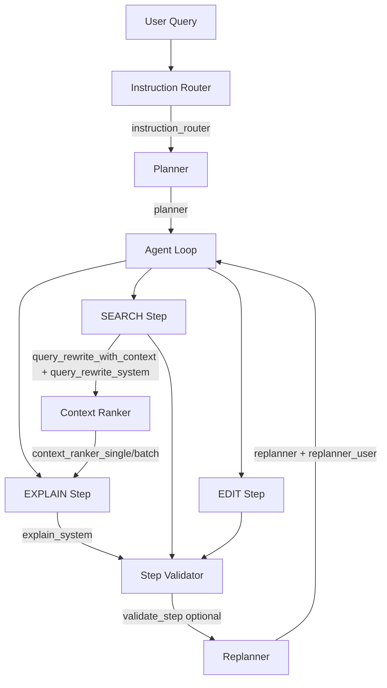

# Prompt Architecture

This document explains all prompts used in AutoStudio: purpose, pipeline position, structure, design reasoning, example I/O, failure modes, code references, and maintenance rules. The prompt layer is fully inspectable.

---

## 1. Overview

AutoStudio uses a **deterministic pipeline** where LLMs plan and reason, and deterministic code dispatches and executes. Prompts enforce structured outputs (JSON, single tokens, YES/NO) to avoid free-form hallucination.

### Phase 13: Prompt Infrastructure

**PromptRegistry** is the central entry point. All production prompts are loaded via:

```python
from agent.prompt_system import get_registry

registry = get_registry()
template = registry.get("planner", version="latest")  # PromptTemplate
instructions = registry.get_instructions("planner", variables={...})  # str
composed = registry.compose("planner", skill_name="planner_skill", repo_context=...)  # PromptTemplate
```

**Versioned prompts** live in `agent/prompt_versions/{name}/v1.yaml`. The loader tries versioned files first, then falls back to legacy `agent/prompts/*.yaml`.

**Compatibility shim**: [`agent/prompts/__init__.py`](../agent/prompts/__init__.py) `get_prompt(name, key)` redirects to the registry for backward compatibility.

### Prompt Loading (Phase 13)

| API | Purpose |
|-----|---------|
| `get_registry().get(name, version, variables)` | Returns `PromptTemplate` (name, version, role, instructions, constraints, output_schema, extra) |
| `get_registry().get_instructions(name, variables)` | Returns instructions string (drop-in for `get_prompt`) |
| `get_registry().get_guarded(name, user_input, version, variables)` | Load with pre-load injection guard on `user_input`; raises `PromptInjectionError` if detected (programmatic use) |
| `get_registry().validate_response(name, response, user_input)` | Validate LLM output against constraints (injection, output_schema, safety); returns `(is_valid, error_message)` (programmatic use) |
| `call_small_model(..., prompt_name="planner")` / `call_reasoning_model(..., prompt_name=...)` | **Primary guardrail enforcement:** injection check always; output validation when `prompt_name` provided |
| `get_registry().compose(name, skill_name, repo_context)` | Composes prompt + skill + repo context |
| `get_registry().get_skill(skill_name)` | Loads skill YAML (goal, tools_allowed, output_format, constraints) |
| `agent.prompt_system.versioning.get_prompt(name, version)` | Version store: `list_versions(name)`, `compare_prompts(name, v1, v2)` |
| `agent.prompt_system.versioning.run_ab_test(...)` | A/B test two prompt versions; returns `ABTestResult` |

- **Placeholders**: Use `{name}` in YAML; pass `variables={"name": value}` to `get()` or `get_instructions()`.
- **Literal braces**: Escape as `{{` and `}}` in YAML.
- **Structured output**: Prompts requiring JSON use schema-first design, few-shot examples, and explicit "Return JSON only" instructions.

### Model Routing

Task-to-model mapping is defined in [`agent/models/models_config.json`](../agent/models/models_config.json) under `task_models`. The `model_router.yaml` prompt (registry name `router`) is used only when a task is not in config (fallback). Production uses config lookup via `get_model_for_task()`.

### Phase 14: Context Control & Token Budgeting

The context control layer enforces prompt size bounds before every LLM call. Pipeline order:

```
retrieve → rank_and_limit() → apply_sliding_window() → prune_sections() → compress() [conditional]
→ count_prompt_tokens() → enforce_budget() → emergency truncation → assemble → Model
```

| Module | Location | Responsibility |
|--------|----------|----------------|
| `token_counter` | `agent/prompt_system/context/token_counter.py` | Count tokens per prompt section; tiktoken/sentencepiece/approximate fallback |
| `context_compressor` | `agent/prompt_system/context/context_compressor.py` | Conditional compression: fires only when `repo_context_tokens > MAX_REPO_CONTEXT_TOKENS` |
| `PromptBudgetManager` | `agent/prompt_system/context/prompt_budget_manager.py` | Dynamic budget allocation (60/20/10% splits), enforce budget, emergency truncation |
| `apply_sliding_window` | `agent/prompt_system/context/context_pruner.py` | Keep last N history turns raw; summarize older turns |

- **`get_guarded()` contract**: Injection guard + assembly only; budgeting is handled by `PromptBudgetManager` in the builder layer.
- **Dynamic fallback key**: `f"{prompt_name}_compact"` (e.g. `planner_compact`, `critic_compact`).
- **Emergency truncation**: Last-resort hard truncation of `repo_context` if prompt still exceeds `MAX_PROMPT_TOKENS` after pruning/fallback.
- **BudgetReport fields**: `pruning_triggered`, `compression_triggered`, `emergency_truncation_triggered`, `use_fallback`, `fallback_key`.

Use `build_context_budgeted()` for full pipeline; `build_context()` remains for simple composition.

---

## 2. Updated Pipeline (Phase 15)

The Phase 15 prompt architecture introduces modular retrieval and editing stages. The planner does **not** invoke `query_expansion` or `context_interpreter` — those are execution details.

```
planner
  → SEARCH_CANDIDATES (retrieval internally runs query_expansion)
  → BUILD_CONTEXT
  → context_interpreter (execution stage)
  → patch_generator (EDIT steps)
  → critic / retry_planner (on failure)
```

| Module | Pipeline Position | Model | Purpose |
|--------|-------------------|-------|---------|
| planner | Intent Router → Planner | REASONING | Convert instruction to steps (SEARCH_CANDIDATES, BUILD_CONTEXT, EDIT, EXPLAIN, INFRA) |
| query_expansion | Inside SEARCH_CANDIDATES (retrieval) | SMALL | Generate 3–6 high-recall search queries; retrieval concern, not planner |
| context_interpreter | After BUILD_CONTEXT, before EDIT/EXPLAIN | REASONING | Summarize retrieved context into key_symbols, dependencies, summary |
| patch_generator | During EDIT steps | REASONING | Generate unified diff or NO_PATCH from instruction + context |
| critic | On failure | SMALL | Diagnose failure_type, evidence, confidence, suggested_strategy |
| retry_planner | After critic | REASONING | Produce strategy, reason, rewrite_queries, plan_override |
| validator | After step execution | SMALL | YES/NO step success (unchanged) |

### Phase 15 Module Details

**query_expansion** — Output: `{"queries": ["string", ...]}`. Rules: 3–6 queries, ≤3 words, prefer code identifiers. Runs inside retrieval when SEARCH_CANDIDATES executes.

**context_interpreter** — Output: `{"key_symbols": [string], "dependencies": [string], "summary": string}`. Ignores files under `tests/`. Reduces hallucinations before EDIT/EXPLAIN.

**patch_generator** — Input: instruction, context_summary, retrieved_files, key_symbols. Output: unified diff or `"NO_PATCH"`. Guardrails: only modify files in retrieved_files; single-file unless instruction explicitly requires multi-file.

---

## 3. Prompt Inventory

| Registry Name | Versioned Location | Consumer | Model |
|---------------|-------------------|----------|-------|
| planner | [agent/prompt_versions/planner/v1.yaml](../agent/prompt_versions/planner/v1.yaml) | [planner/planner.py](../planner/planner.py) | REASONING |
| replanner | [agent/prompt_versions/replanner/v1.yaml](../agent/prompt_versions/replanner/v1.yaml) | [agent/orchestrator/replanner.py](../agent/orchestrator/replanner.py) | REASONING |
| replanner_user | [agent/prompt_versions/replanner_user/v1.yaml](../agent/prompt_versions/replanner_user/v1.yaml) | [agent/orchestrator/replanner.py](../agent/orchestrator/replanner.py) | REASONING |
| critic | [agent/prompt_versions/critic/v1.yaml](../agent/prompt_versions/critic/v1.yaml) | [agent/meta/critic.py](../agent/meta/critic.py) | SMALL |
| retry_planner | [agent/prompt_versions/retry_planner/v1.yaml](../agent/prompt_versions/retry_planner/v1.yaml) | [agent/meta/retry_planner.py](../agent/meta/retry_planner.py) | REASONING |
| query_rewrite | [agent/prompt_versions/query_rewrite/v1.yaml](../agent/prompt_versions/query_rewrite/v1.yaml) | [agent/retrieval/query_rewriter.py](../agent/retrieval/query_rewriter.py) | REASONING/SMALL |
| query_rewrite_with_context | [agent/prompt_versions/query_rewrite_with_context/v1.yaml](../agent/prompt_versions/query_rewrite_with_context/v1.yaml) | [agent/retrieval/query_rewriter.py](../agent/retrieval/query_rewriter.py) | REASONING/SMALL |
| query_rewrite_system | [agent/prompt_versions/query_rewrite_system/v1.yaml](../agent/prompt_versions/query_rewrite_system/v1.yaml) | [agent/retrieval/query_rewriter.py](../agent/retrieval/query_rewriter.py) | SMALL |
| query_expansion | [agent/prompt_versions/query_expansion/v1.yaml](../agent/prompt_versions/query_expansion/v1.yaml) | retrieval (inside SEARCH_CANDIDATES) | SMALL |
| context_interpreter | [agent/prompt_versions/context_interpreter/v1.yaml](../agent/prompt_versions/context_interpreter/v1.yaml) | execution (after BUILD_CONTEXT) | REASONING |
| patch_generator | [agent/prompt_versions/patch_generator/v1.yaml](../agent/prompt_versions/patch_generator/v1.yaml) | execution (EDIT steps) | REASONING |
| validate_step | [agent/prompt_versions/validate_step/v1.yaml](../agent/prompt_versions/validate_step/v1.yaml) | [agent/orchestrator/validator.py](../agent/orchestrator/validator.py) | REASONING |
| router | [agent/prompt_versions/router/v1.yaml](../agent/prompt_versions/router/v1.yaml) | [agent/models/model_router.py](../agent/models/model_router.py) | SMALL (fallback) |
| router_logit | [agent/prompt_versions/router_logit/v1.yaml](../agent/prompt_versions/router_logit/v1.yaml) | [router_eval/routers/logit_router.py](../router_eval/routers/logit_router.py) | SMALL |
| instruction_router | [agent/prompt_versions/instruction_router/v1.yaml](../agent/prompt_versions/instruction_router/v1.yaml) | [agent/routing/instruction_router.py](../agent/routing/instruction_router.py) | SMALL |
| explain_system | [agent/prompt_versions/explain_system/v1.yaml](../agent/prompt_versions/explain_system/v1.yaml) | [agent/execution/step_dispatcher.py](../agent/execution/step_dispatcher.py) | REASONING/SMALL |
| action_selector | [agent/prompt_versions/action_selector/v1.yaml](../agent/prompt_versions/action_selector/v1.yaml) | [agent/autonomous/action_selector.py](../agent/autonomous/action_selector.py) | SMALL/REASONING |
| context_ranker_single | [agent/prompt_versions/context_ranker_single/v1.yaml](../agent/prompt_versions/context_ranker_single/v1.yaml) | [agent/retrieval/context_ranker.py](../agent/retrieval/context_ranker.py) | REASONING |
| context_ranker_batch | [agent/prompt_versions/context_ranker_batch/v1.yaml](../agent/prompt_versions/context_ranker_batch/v1.yaml) | [agent/retrieval/context_ranker.py](../agent/retrieval/context_ranker.py) | REASONING |
| BASELINE_SYSTEM | [router_eval/prompts/router_prompts.py](../router_eval/prompts/router_prompts.py) | — | [baseline_router.py](../router_eval/routers/baseline_router.py) | SMALL |
| FEWSHOT_SYSTEM | [router_eval/prompts/router_prompts.py](../router_eval/prompts/router_prompts.py) | — | [fewshot_router.py](../router_eval/routers/fewshot_router.py), [fewshot_logit_router.py](../router_eval/routers/fewshot_logit_router.py) | SMALL |
| PROMPT_A/B/C | [router_eval/prompts/router_prompts.py](../router_eval/prompts/router_prompts.py) | — | [router_core.py](../router_eval/utils/router_core.py), [ensemble_router.py](../router_eval/routers/ensemble_router.py) | SMALL |
| ROUTER_V2_SYSTEM | [router_eval/prompts/router_v2_prompt.py](../router_eval/prompts/router_v2_prompt.py) | — | [router_v2.py](../router_eval/routers/router_v2.py) | SMALL |
| CRITIC_SYSTEM | [router_eval/prompts/critic_prompt.py](../router_eval/prompts/critic_prompt.py) | — | [critic_router.py](../router_eval/routers/critic_router.py), [final_router.py](../router_eval/routers/final_router.py) | SMALL |

---

## 3. Pipeline Prompt Map



### Narrative Flow

1. **User Query** → Optional instruction router (`ENABLE_INSTRUCTION_ROUTER=1`) uses `get_registry().get_instructions("instruction_router")` to classify into CODE_SEARCH, CODE_EDIT, CODE_EXPLAIN, INFRA, GENERAL. CODE_SEARCH/EXPLAIN/INFRA bypass planner with single-step plans.
2. **Planner** → Uses `PromptRegistry.get("planner")` (planner/v1.yaml) to produce `{"steps": [...]}` JSON.
3. **Agent Loop** → For each step: SEARCH, EDIT, EXPLAIN, or INFRA.
4. **SEARCH** → Policy engine calls `rewrite_query_with_context()` (query_rewrite_with_context + query_rewrite_system from registry) → retrieval → `run_retrieval_pipeline()` → optional `rank_context()` (context_ranker_single / context_ranker_batch from registry).
5. **EXPLAIN** → Context gate ensures `ranked_context` exists; uses `get_registry().get_instructions("explain_system")` with formatted context.
6. **Validator** → Rule-based by default; when `ENABLE_LLM_VALIDATION=1`, uses `PromptRegistry.get("validate_step")` for SEARCH/EXPLAIN.
7. **Replanner** → On failure, uses `PromptRegistry.get("replanner")` + `get_registry().get_instructions("replanner_user", variables={...})` to produce revised plan.

---

## 4. Router Prompts

### 4.1 Production Router (`instruction_router`)

**Location**: [agent/prompt_versions/instruction_router/v1.yaml](../agent/prompt_versions/instruction_router/v1.yaml) — loaded via `get_registry().get_instructions("instruction_router")`

**Consumer**: [`agent/routing/instruction_router.py`](../agent/routing/instruction_router.py)

**Purpose**: Classify developer query before planner. When `ENABLE_INSTRUCTION_ROUTER=1`, routes to single-step plans for CODE_SEARCH, CODE_EXPLAIN, INFRA; falls through to planner for CODE_EDIT, GENERAL.

**Pipeline Position**: Context Grounder → **Intent Router** ← here → Planner

**Structure**:
- System: Categories (CODE_SEARCH, CODE_EDIT, CODE_EXPLAIN, INFRA, GENERAL) + JSON format `{"category": "...", "confidence": 0.0}`
- User: `Instruction:\n{instruction}`

**Design Reasoning**: JSON output enables programmatic parsing; confidence supports future filtering. Categories align with planner actions for single-step bypass.

**Example Input**: "Where is validate_step defined?"

**Expected Output**: `{"category": "CODE_SEARCH", "confidence": 0.92}`

**Failure Modes**: Invalid JSON → defaults to GENERAL; model call failure → GENERAL with confidence 0.

**Used in**: `instruction_router.route_instruction()`; `plan_resolver.get_plan()` when router enabled.

---

### 4.2 Router Eval Prompts

| Prompt | Purpose | Few-Shot |
|--------|---------|----------|
| `BASELINE_SYSTEM` | 5-category single-call router | No |
| `FEWSHOT_SYSTEM` | 5-category with 10 examples | Yes |
| `PROMPT_A_CLASSIFICATION` | Direct classification | No |
| `PROMPT_B_TOOL_SELECTION` | Tool-selection framing | No |
| `PROMPT_C_INSTRUCTION_ANALYSIS` | Intent analysis framing | No |
| `ROUTER_V2_SYSTEM` | 4-category (EDIT, SEARCH, EXPLAIN, INFRA), CATEGORY CONFIDENCE | 4 examples |
| `router_logit_system.yaml` | Single-token: EDIT, SEARCH, EXPLAIN, INFRA, GENERAL | No |
| `CRITIC_SYSTEM` | Validates router prediction: YES or NO \<CATEGORY\> | 5 examples |

**Used in**: `router_eval/routers/*.py`; selectable via `ROUTER_TYPE` env (baseline, fewshot, ensemble, final).

---

## 5. Planner Prompts

### planner_system.yaml

**Purpose**: Convert user instructions into structured execution steps (EDIT, SEARCH, EXPLAIN, INFRA).

**Pipeline Position**: Intent Router → **Planner** ← here → Agent Loop

**Structure**:
- SYSTEM: Role + 4 actions + 9 PLANNING RULES + OUTPUT FORMAT (strict JSON)
- USER: Raw instruction (no template)

**Design Reasoning**:
- One action per step: avoids combined "SEARCH and EDIT" steps.
- SEARCH before EDIT/EXPLAIN: grounds actions in repo results.
- Minimal steps: reduces unnecessary work.
- EXPLAIN only when explicit: avoids over-explaining.
- Rule 9: SEARCH steps target implementation, not tests, for "how does X work" questions.
- **MULTI-STEP EXAMPLES** (Phase 5): Few-shot examples for bug fix (SEARCH → EDIT), multi-file feature (SEARCH → EDIT config → EDIT executor), and refactoring (SEARCH → SEARCH → EDIT → EDIT).

**Example Input**: "Explain how StepExecutor runs steps"

**Expected Output**:
```json
{
  "steps": [
    {"id": 1, "action": "SEARCH", "description": "Locate StepExecutor implementation in agent/execution", "reason": "Need code before explaining"},
    {"id": 2, "action": "EXPLAIN", "description": "Explain execution flow", "reason": "User requested explanation"}
  ]
}
```

**Failure Modes**:
- Hallucinated tool names → normalized to EDIT/SEARCH/EXPLAIN/INFRA by `normalize_actions()`.
- Unbounded step generation → no hard cap; relies on prompt.
- Missing retrieval step → validator/replanner can add SEARCH on EXPLAIN failure.
- Parse failure → fallback: single SEARCH step.
- LLM failure → fallback: single EXPLAIN step.

**Used in**: [planner/planner.py](../planner/planner.py), [planner/planner_prompts.py](../planner/planner_prompts.py), [planner/planner_eval.py](../planner/planner_eval.py), [agent/orchestrator/plan_resolver.py](../agent/orchestrator/plan_resolver.py).

---

## 6. Replanner Prompts

### replanner_system.yaml + replanner_user

**Purpose**: On step failure, produce a revised plan that addresses the failure.

**Pipeline Position**: Step Validator (invalid) → **Replanner** ← here → Agent Loop

**Structure**:
- SYSTEM: `replanner/v1.yaml` — 6 REPLANNING RULES (analyze failure, revise plan, keep completed steps, ground actions, JSON format).
- USER: `replanner_user/v1.yaml` — loaded via `get_registry().get_instructions("replanner_user", variables={instruction, steps_json, failed_desc, error_msg})`:
  ```
  Original instruction: {instruction}
  Current plan (JSON): {steps_json}
  Failed step: {failed_desc}
  Error message: {error_msg}
  Produce a revised plan (JSON with "steps" array). Address the failure. Return only valid JSON.
  ```

**Design Reasoning**: Rules cover common failures: file not found → add SEARCH; EXPLAIN without context → add SEARCH; SEARCH only tests → more specific SEARCH; query rewrite error → simpler description; config issue → add INFRA.

**Example Input**: Failed EXPLAIN with "I cannot answer without relevant code context"

**Expected Output**: Revised plan with SEARCH before EXPLAIN.

**Failure Modes**: LLM/parse failure → fallback: remaining steps only (no new plan).

**Used in**: [agent/orchestrator/replanner.py](../agent/orchestrator/replanner.py).

---

## 7. Query Rewrite Prompts

### 7.1 query_rewrite.yaml (simple)

**Purpose**: Rewrite user query for code search without execution context. Used when `rewrite_query(text, use_llm=True)`.

**Structure**: Single prompt with `{text}` placeholder. Describes 4 tools (retrieve_graph, retrieve_vector, retrieve_grep, list_dir), rules for identifiers and patterns, "Return only the rewritten search query."

**Used in**: [agent/retrieval/query_rewriter.py](../agent/retrieval/query_rewriter.py) `rewrite_query()`. Primary path is `rewrite_query_with_context()`.

---

### 7.2 query_rewrite_with_context.yaml + _REWRITE_SYSTEM

**Purpose**: Rewrite planner step into search query using user request and previous attempt history. Maximizes recall; policy engine retries with variants.

**Pipeline Position**: SEARCH step → Policy Engine → **Query Rewriter** ← here → Retrieval

**Structure**:
- **main**: Schema `{tool, query, reason}`; optional `queries` array. 10 SEARCH STRATEGY RULES. Tool choice rules. 6 few-shot examples. Variables: `{user_request}`, `{previous_attempts}`, `{planner_step}`.
- **end**: "Return JSON only:"
- **System** (inline `_REWRITE_SYSTEM`): "You are a code-search API. Return ONLY valid JSON with keys: tool, query, reason. Optional: queries (array). Never include explanations."

**Design Reasoning**:
- High recall over precision: downstream ranking prunes.
- Regex/substring patterns: StepExecutor → Step.*Executor, executor.
- BIAS IMPLEMENTATION: When previous results were only tests, prefer retrieve_grep with implementation module name.
- `queries` array: policy engine tries each until success.

**Example Input**: Planner step "Locate dispatcher routing code", previous: `retrieve_graph('dispatcher') → tests/test_agent_e2e.py`

**Expected Output**: `{"tool": "retrieve_grep", "query": "step_dispatcher", "reason": "Previous found only tests; grep for implementation module"}`

**Failure Modes**: LLM error → heuristic strip filler words → raw planner_step. Invalid tool → `chosen_tool` not set; retrieval uses default order.

**Used in**: [agent/retrieval/query_rewriter.py](../agent/retrieval/query_rewriter.py) `rewrite_query_with_context()`.

---

## 8. Validation Prompts

### validate_step.yaml

**Purpose**: When `ENABLE_LLM_VALIDATION=1`, ask LLM whether step output sufficiently supports next step and user goal. Used only for SEARCH and EXPLAIN after rule-based checks pass.

**Pipeline Position**: Step execution → **Validator** ← here (optional LLM path) → Replanner on invalid

**Structure**:
```
Did this step succeed in the context of the agent loop?
User instruction: {instruction}
Step: {step}
Result success: {success}, output (summary): {output_summary}
Next step in plan: {next_step_description}
Consider: Does the output sufficiently support the next step and the user's goal?
For SEARCH: Are the results relevant implementation code (not just tests) when the user asks "how does X work"?
For EXPLAIN: Does the explanation address the question with real code context?
Answer with exactly YES or NO.
```

**Design Reasoning**: Rule-based validation handles most cases; LLM adds nuance for ambiguous SEARCH/EXPLAIN outcomes (e.g., results are implementation vs tests).

**Failure Modes**: LLM failure → fallback to rule-based. Non-YES response → invalid, feedback passed to replanner.

**Used in**: [agent/orchestrator/validator.py](../agent/orchestrator/validator.py) `validate_step()`.

---

### explain_system (context gate)

**Location**: [agent/prompt_versions/explain_system/v1.yaml](../agent/prompt_versions/explain_system/v1.yaml) — loaded via `get_registry().get_instructions("explain_system")`

**Consumer**: [agent/execution/step_dispatcher.py](../agent/execution/step_dispatcher.py)

**Purpose**: Ground EXPLAIN in provided context; refuse to answer without code context.

**Structure**:
- Answer using ONLY provided context.
- If no context or context lacks answer: respond exactly "I cannot answer without relevant code context. Please run a SEARCH step first to locate the relevant code."
- Keep answer concise; cite file paths from context.

**Design Reasoning**: Prevents hallucination; forces retrieval-before-reasoning. The exact refusal string is detected by validator to trigger replan (add SEARCH).

**Used in**: [agent/execution/step_dispatcher.py](../agent/execution/step_dispatcher.py) `dispatch()` EXPLAIN path.

---

## 9. Model Routing Prompts

### model_router.yaml

**Purpose**: Classify task as SMALL or REASONING when task not in `models_config.json`. Production uses config; this is fallback.

**Structure**:
```
Classify which model should handle this task.
Options: SMALL or REASONING
- Use SMALL for: simple classification, routing, lightweight decisions.
- Use REASONING for: planning, query rewriting, validation, explanation, multi-step reasoning.
Task: {task_description}
Return only the label: SMALL or REASONING.
```

**Used in**: [agent/models/model_router.py](../agent/models/model_router.py) `route_task()`. `get_model_for_task()` uses [models_config.json](../agent/models/models_config.json) `task_models` by default.

---

## 10. Evaluation Prompts

Used in `router_eval/` for router benchmarking:

| Prompt | Purpose |
|--------|---------|
| `CRITIC_SYSTEM` | Validates router prediction; outputs YES or NO \<CATEGORY\> |
| `build_critic_user_message()` | Builds user message: instruction + predicted category |
| `CONFIDENCE_INSTRUCTION` | Extends router to output CATEGORY CONFIDENCE |
| `DUAL_INSTRUCTION` | Extends router to output PRIMARY SECONDARY CONFIDENCE |

**Used in**: [router_eval/routers/critic_router.py](../router_eval/routers/critic_router.py), [final_router.py](../router_eval/routers/final_router.py), [confidence_router.py](../router_eval/routers/confidence_router.py), [dual_router.py](../router_eval/routers/dual_router.py).

---

## 11. Context Ranker

**Location**: [agent/prompt_versions/context_ranker_single/v1.yaml](../agent/prompt_versions/context_ranker_single/v1.yaml) and [agent/prompt_versions/context_ranker_batch/v1.yaml](../agent/prompt_versions/context_ranker_batch/v1.yaml)

**Consumer**: [agent/retrieval/context_ranker.py](../agent/retrieval/context_ranker.py)

**Purpose**: Score retrieved snippets for relevance. Hybrid: 0.6×LLM + 0.2×symbol + 0.1×filename + 0.1×reference, minus diversity/test penalties.

**Structure**:
- **Single** (`context_ranker_single`): `get_registry().get_instructions("context_ranker_single", variables={query, snippet})` — one snippet at a time (fallback).
- **Batch** (`context_ranker_batch`): `get_registry().get_instructions("context_ranker_batch", variables={query, snippets})` — multiple snippets, one score per line.

**Used in**: `rank_context()` when `ENABLE_CONTEXT_RANKING=1`.

---

## 12. Prompt Design Philosophy

### Deterministic Outputs

Prompts enforce structured responses to avoid free-form hallucination:

- **Planner/Replanner**: `{"steps": [...]}` JSON only.
- **Router**: `{"category": "...", "confidence": 0.0}` or single category word.
- **Query Rewrite**: `{tool, query, reason}` JSON.
- **Validator**: YES or NO.
- **Model Router**: SMALL or REASONING.

### Avoiding Hallucination

- **explain_system**: "Answer using ONLY the provided context."
- **Query rewrite**: "Never put file/dir names in name_path" for retrieve_graph; tool choice constrained to 4 tools.
- **Planner**: "Ground actions in repo results"; "SEARCH must occur first."

### Bounded Reasoning

- **Planner**: "Use the minimal number of steps"; "Each step must contain exactly ONE action."
- **Query rewrite**: "Query max ~1000 chars"; "1–3 tokens per query."
- **Context**: Pruned to 6 snippets, 8000 chars; ranking limited to 20 candidates.

### Tool Selection Separation

The planner chooses **action types** (EDIT, SEARCH, EXPLAIN, INFRA). Tool selection (retrieve_graph, retrieve_vector, retrieve_grep, list_dir) is done by the query rewriter and tool graph router—not by the planner. This keeps planning abstract and execution deterministic.

---

## 13. Prompt Safety Risks

| Prompt | Risk | Mitigation |
|--------|------|------------|
| Planner | Hallucinated tool names | `normalize_actions()` maps to EDIT/SEARCH/EXPLAIN/INFRA |
| Planner | Unbounded step generation | Prompt says "minimal steps"; no hard cap |
| Planner | EDIT without retrieval | Rule 8: "SEARCH must occur first"; validator/replanner add SEARCH on failure |
| Router | EDIT vs EXPLAIN misclassification | Few-shot examples; critic validation in eval |
| Router | GENERAL overuse | "use when unclear" in prompt |
| Query Rewrite | Over-expansion of queries | "1–3 tokens"; "Query max ~1000 chars" |
| Query Rewrite | Invalid tool name | Check against allowed set; ignore if invalid |
| Replanner | Infinite replan loop | agent_loop: `MAX_REPLAN_ATTEMPTS=3`; agent_controller: `MAX_REPLAN_ATTEMPTS=5` (config) |
| Validator | LLM says YES when invalid | Rule-based first; LLM only for ambiguous cases |
| explain_system | Answering without context | Context gate; exact refusal string detection |

---

## 14. Prompt Testing Strategy

| Component | Script / Test | Metrics |
|-----------|--------------|---------|
| **Prompt regression (Phase 15)** | `pytest tests/test_prompt_regression.py -v` | Load + schema validation for planner, replanner, critic, retry_planner, query_expansion, context_interpreter, patch_generator |
| **Prompt CI (Phase 13)** | `python scripts/run_prompt_ci.py` | task_success, json_validity, tool_correctness; regression vs baseline |
| Planner | `python -m planner.planner_eval` | structural_valid_rate, action_coverage_accuracy, dependency_order_accuracy, mean_latency_sec |
| Router | `python -m router_eval.router_eval_v2` | accuracy, confusion matrix, calibration, avg_confidence |
| Router (golden/adversarial) | `--golden`, `--adversarial` | Edge-case accuracy |
| Agent | `python scripts/evaluate_agent.py` | task_success_rate, retrieval_recall, planner_accuracy, latency_avg |
| Agent (plan-only) | `python scripts/evaluate_agent.py --plan-only` | planner_accuracy, latency |
| Validator | `tests/test_validator.py` | Rule-based validation |

### Eval Datasets

- **Prompt CI (Phase 13):** [tests/prompt_eval_dataset.json](../tests/prompt_eval_dataset.json) — 100 cases across navigation (15), planning (20), editing (20), refactoring (15), test-fixing (15), repo-reasoning (15); expected_actions per task; baseline: `dev/prompt_eval_results/baseline.json`
- Planner: [planner/planner_dataset.json](../planner/planner_dataset.json)
- Router: [router_eval/dataset_v2](../router_eval/dataset_v2.py), [golden_dataset_v2.json](../router_eval/golden_dataset_v2.json), [adversarial_dataset_v2.json](../router_eval/adversarial_dataset_v2.json)
- Agent: [tests/agent_eval.json](../tests/agent_eval.json)

---

## 15. Maintenance Rules

When changing prompts:

1. **Run prompt CI**: `python scripts/run_prompt_ci.py` — gates on regression
2. **Run planner_eval**: `python -m planner.planner_eval`
3. **Run router_eval**: `python -m router_eval.router_eval_v2`
4. **Run agent_eval**: `python scripts/evaluate_agent.py`
5. **Inspect traces**: Check `.agent_memory/traces/` for prompt→output behavior
6. **Log failures**: Use `agent.prompt_eval.failure_analysis.failure_logger.log_failure()` when prompts produce invalid output

**Never modify prompts without evaluation.** Track metrics before/after changes. See [prompt_engineering_rules.md](prompt_engineering_rules.md).

### Guardrails (Phase 13 Hardening)

**Guardrails are enforced at the LLM call boundary**, not inside prompt utilities. This ensures no module can bypass them by calling `model_client` directly.

**Correct architecture:**

```
Agent / Router / Planner / etc.
    ↓
call_small_model() / call_reasoning_model()
    ↓
_pre: injection check on user content (always)
_post: constraint validation when prompt_name provided (optional)
    ↓
Model client (OpenAI-compatible API)
```

- **Pre-call:** Injection check runs on every call to `call_small_model` / `call_reasoning_model` (via `agent/models/model_client.py`). Raises `PromptInjectionError` if detected.
- **Post-call:** Constraint validation (output_schema, safety) runs when `prompt_name` is passed. Call sites that return JSON pass `prompt_name`; free-text prompts (explain_system, context_ranker, simple query_rewrite) omit it.
- **Disable:** Set `ENABLE_PROMPT_GUARDRAILS=0` for eval or tests.

**Registry APIs** (for programmatic use): `get_registry().get_guarded(name, user_input=...)` and `validate_response(name, response, user_input)` remain available for custom flows that bypass model_client.

### A/B Testing (Phase 13 Scaffold)

`agent.prompt_system.versioning.run_ab_test(prompt_name, variant_a, variant_b, run_fn, dataset_path)` runs two versions against the same dataset and returns `ABTestResult` with `winner`, `a_task_success`, `b_task_success`. Wires into `eval_runner` and `run_prompt_ci.py`. Automated optimization loop is Phase 14.

### Adding a New Prompt (Phase 13)

1. Create versioned YAML in [agent/prompt_versions/{name}/v1.yaml](../agent/prompt_versions/) with envelope: `version`, `role`, `instructions`, `constraints`, `output_schema`.
2. Add to `_DEFAULT_REGISTRY` and `_LEGACY_MAP` in [agent/prompt_system/registry.py](../agent/prompt_system/registry.py) and [loader.py](../agent/prompt_system/loader.py) if needed.
3. Document in this file: purpose, pipeline position, structure, failure modes.
4. Add test case to [tests/prompt_eval_dataset.json](../tests/prompt_eval_dataset.json).
5. Run `python scripts/run_prompt_ci.py --save-baseline` after first successful run.
