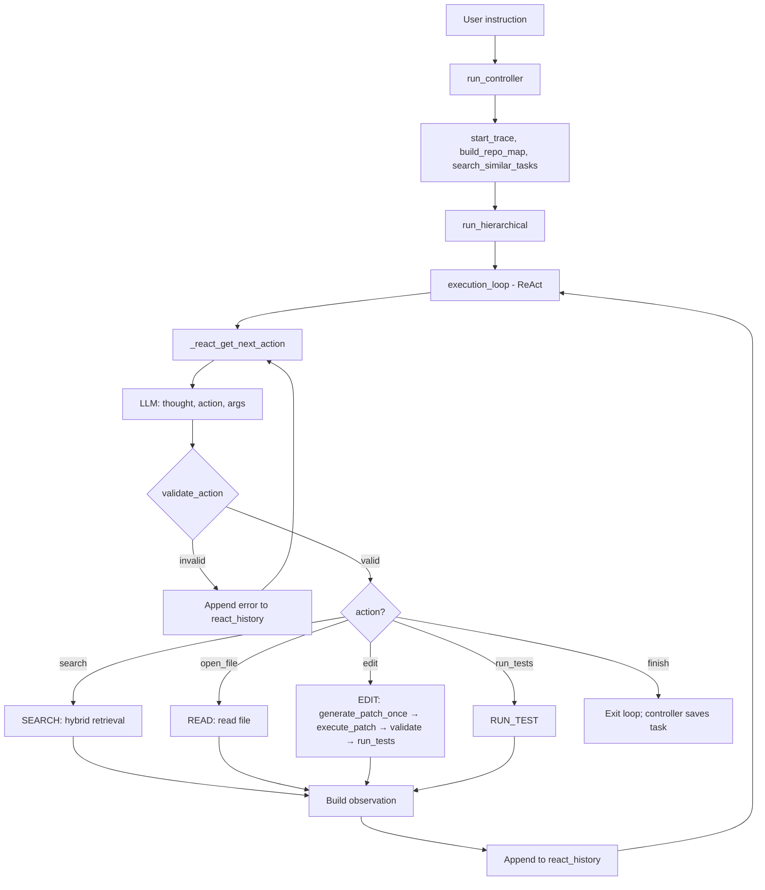

# ReAct Architecture — Primary Execution Path

**ReAct mode is the default and primary execution path** for AutoStudio (REACT_MODE=1). The model selects actions step-by-step; no planner, no Critic, no RetryPlanner.

---

## Overview

```
User instruction
    → run_controller
        → start_trace
        → ensure_retrieval_daemon (optional)
        → build_repo_map
        → search_similar_tasks (optional)
        → run_hierarchical
            → execution_loop (ReAct)
                → _react_get_next_action (LLM: thought, action, args)
                → validate_action (strict schema)
                → StepExecutor.execute_step → dispatch (SEARCH/READ/EDIT/RUN_TEST)
                → _build_react_observation
                → append to react_history
                → repeat until finish or limits
        → save_task
        → finish_trace
```

---

## Flow Diagram



---

## Tool Schema (Strict Contract)

| Action | Required Args | Internal Step |
|--------|---------------|---------------|
| `search` | `query` (non-empty) | SEARCH |
| `open_file` | `path` | READ |
| `edit` | `path`, `instruction` | EDIT |
| `run_tests` | `{}` | RUN_TEST |
| `finish` | `{}` | (terminates loop) |

Source of truth: `agent/execution/react_schema.py` — `validate_action(action, args)` enforces schema. Invalid output → error appended to react_history → model retries.

---

## Required Workflow

The production prompt enforces:

1. **search** → find relevant files
2. **open_file** → read and understand code
3. **edit** → apply a precise fix (path + instruction)
4. **run_tests** → verify

Edit requires `path` explicitly; no fallback to candidates when binding is missing (ReAct path).

---

## EDIT Path (ReAct)

```
edit (path, instruction)
    → _edit_react (step_dispatcher)
    → _generate_patch_once (instruction-driven, no plan_diff)
    → execute_patch
    → validate_project (syntax)
    → run_tests
    → return observation (patch_applied, tests_passed, files_modified, syntax_error if any)
```

Single attempt per edit step. No critic, no retry_planner. Model sees observation and decides next action.

---

## Output Format

Model must output strict JSON:

```json
{
  "thought": "<concise reasoning>",
  "action": "<search | open_file | edit | run_tests | finish>",
  "args": { ... }
}
```

Parse: `json.loads(output)`. Schema: `validate_action(action, args)`. No fallback parsing; invalid → observation → retry.

---

## Limits (agent_config)

| Limit | Config | Default |
|-------|--------|---------|
| Max loop iterations | MAX_LOOP_ITERATIONS | 50 |
| Max steps | MAX_STEPS | 30 |
| Max tool calls | MAX_TOOL_CALLS | 50 |
| Max task runtime | MAX_TASK_RUNTIME_SECONDS | 900 |
| Per-step timeout | MAX_STEP_TIMEOUT_SECONDS | 60 |

---

## Key Files

| File | Role |
|------|------|
| `agent/orchestrator/agent_controller.py` | run_controller → run_hierarchical |
| `agent/orchestrator/deterministic_runner.py` | run_hierarchical → execution_loop |
| `agent/orchestrator/execution_loop.py` | ReAct loop: _react_get_next_action, react_history |
| `agent/execution/step_dispatcher.py` | _dispatch_react, _edit_react, _generate_patch_once |
| `agent/execution/react_schema.py` | ALLOWED_ACTIONS, validate_action |
| `agent/prompt_versions/react_action/v1.yaml` | Production ReAct system prompt |
| `scripts/run_react_live.py` | Live execution with trace capture |

See [REACT_QUICK_START.md](REACT_QUICK_START.md) for run commands and trace output.

---

## See Also

- [REACT_QUICK_START.md](REACT_QUICK_START.md) — Quick start guide
- [REACT_LIVE_EXECUTION_REPORT_20260323.md](REACT_LIVE_EXECUTION_REPORT_20260323.md) — Live run report
- [EDIT_PIPELINE_DETAILED_ANALYSIS.md](EDIT_PIPELINE_DETAILED_ANALYSIS.md) — Edit pipeline details
