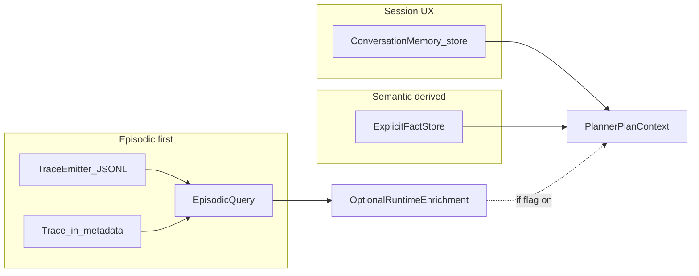

# AgentV2 memory — Phase 5 deep plan (corrected ordering)

## Verdict (staff-level)

- **Ordering fix is mandatory**: episodic access must precede semantic derivation and session UX polish. Session persistence improves continuity but does not unlock cross-run learning; episodic does.
- **Episodic is under-delivered today**: the codebase can emit rich in-run `[Trace](agent_v2/schemas/trace.py)` objects and optional JSONL via `[TraceEmitter](agent_v2/runtime/trace_emitter.py)`, but **default execution wiring never passes `log_dir`**, so disk episodic is effectively off in the main path.
- **Boundary fix is real but last**: `[state.context](agent_v2/state/agent_state.py)` mixes memory-like keys (`task_working_memory`, `conversation_memory_store`, `planner_session_memory` per `[dag_executor.py](agent_v2/runtime/dag_executor.py)` / `[task_working_memory.py](agent_v2/memory/task_working_memory.py)`) with tool handles and flags. A **light `state.memory` bag** reduces cognitive load without replacing the execution engine.

**Final tightening**

1. **Episodic query — no retrieval creep in 5.1**: Only **recency**, **tool**, and **success/failure** filters. No similarity, keyword overlap on instructions, or instruction fingerprint. Value = debugging + failure reuse, not semantic search.
2. **Planner — no schema coupling in 5.1**: `episodic_events = episodic_query(...)` at runtime; inject into the planner prompt **only when opt-in** (config/flag). **No** new `PlannerPlanContext` fields for episodic in this phase.

---

## Current code anchors (facts)

| Concern                | Where                                                                                                                                                      | What exists                                                                                                                                                  |
| ---------------------- | ---------------------------------------------------------------------------------------------------------------------------------------------------------- | ------------------------------------------------------------------------------------------------------------------------------------------------------------ |
| Runtime state bag      | `[agent_v2/state/agent_state.py](agent_v2/state/agent_state.py)`                                                                                           | `context`, `metadata`, `history`, `step_results`, `exploration_result`, plan fields                                                                          |
| Task working memory    | `[agent_v2/memory/task_working_memory.py](agent_v2/memory/task_working_memory.py)`                                                                         | Lives under `state.context["task_working_memory"]`                                                                                                           |
| Session (planner)      | `[agent_v2/runtime/session_memory.py](agent_v2/runtime/session_memory.py)`                                                                                 | `SessionMemory` under `state.context["planner_session_memory"]` (`[dag_executor.py](agent_v2/runtime/dag_executor.py)` `_planner_session_memory_from_state`) |
| Chat / session turns   | `[agent_v2/memory/conversation_memory.py](agent_v2/memory/conversation_memory.py)` + `[planner_task_runtime.py](agent_v2/runtime/planner_task_runtime.py)` | `InMemoryConversationMemoryStore` in `state.context`; used at ~372–402, ~536–694                                                                             |
| Trace emitter (in-run) | `[planner_task_runtime.py](agent_v2/runtime/planner_task_runtime.py)` ~529–585, ~625–688                                                                   | `TraceEmitter()` **no `log_dir`** → `[trace_emitter.py](agent_v2/runtime/trace_emitter.py)` `_persist_execution_log_entry` is a no-op                        |
| DAG default executor   | `[agent_v2/runtime/runtime.py](agent_v2/runtime/runtime.py)` ~88–95                                                                                        | `DagExecutor(...)` **no `trace_log_dir`**                                                                                                                    |
| Planner envelope       | `[agent_v2/schemas/planner_plan_context.py](agent_v2/schemas/planner_plan_context.py)`                                                                     | Carries `session`; **do not add episodic fields in Phase 5.1** — keep planner contract stable; episodic is optional runtime enrichment only                  |
| Langfuse               | `[agent_v2/observability/langfuse_client.py](agent_v2/observability/langfuse_client.py)`                                                                   | Cross-run observability; **not** a typed in-process episodic API — treat as complement, not substitute for Phase 5.1                                         |

**Implication for Phase 5.1**: “structured access over JSONL” is only honest if you **wire `log_dir`** (config/env) into `TraceEmitter` construction in `[planner_task_runtime.py](agent_v2/runtime/planner_task_runtime.py)` and/or `[AgentRuntime](agent_v2/runtime/runtime.py)` + `[DagExecutor](agent_v2/runtime/dag_executor.py)`. Optionally default to repo-ignored dir already hinted in `[.gitignore](.gitignore)` (`.agent_memory/`).

---

## Phase 5.1 — Episodic access (FIRST)

### Goal

Make execution history **queryable in code** with **only** structured filters: **recency** (most recent runs), **tool**, **success/failure**. Primary value: **debugging + reuse of failure patterns**, not semantic search. Optional: bounded text may be passed into the planner **without** changing `PlannerPlanContext` (see 5.1e).

### 5.1a — Make on-disk episodic actually exist (prerequisite)

1. Add config knob in `[agent_v2/config.py](agent_v2/config.py)` (e.g. `AGENT_V2_EPISODIC_LOG_DIR` or reuse/align with existing patterns) defaulting to **off** or to `.agent_memory/episodic/` (gitignored).
2. When creating per-run `TraceEmitter` in `[planner_task_runtime.py](agent_v2/runtime/planner_task_runtime.py)`, pass `log_dir=<resolved_root>/<trace_id_or_run_id>/` so each run gets an isolated `trace_*` folder (matches current `TraceEmitter` layout).
3. Mirror the same for `[AgentRuntime](agent_v2/runtime/runtime.py)` → `DagExecutor(trace_log_dir=...)` if that path executes plans without `PlannerTaskRuntime`’s emitter.

### 5.1b — Enrich JSONL rows for tool/success filtering

`[ExecutionLogEntry](agent_v2/runtime/trace_emitter.py)` today has `task_id`, `attempt_number`, `arguments`, `success`, `error_*`, `timestamp`, `duration_ms` — **no `tool`**. `[ExecutionTask](agent_v2/schemas/execution_task.py)` has `tool: str`.

- Extend `ExecutionLogEntry` with `**tool: str**` (and optionally `plan_id` / `trace_id` if you want cross-file correlation without loading `Trace`).
- Populate in `record_execution_attempt` from `task.tool`.

This is a **small schema change** but it is what makes “filter by tool” real on JSONL.

### 5.1c — Episodic query layer (non-trivial but still small)

New module e.g. `[agent_v2/memory/episodic_query.py](agent_v2/memory/episodic_query.py)` (name flexible) with:

- **Supported filters (Phase 5.1 only — do not over-scope)**:
  - **Recency**: most recent runs / events (mtime order on run dirs, `limit`, optional `since` timestamp).
  - **Tool**: filter rows where `tool == …` (requires 5.1b).
  - **Success / failure**: filter on `success` and optionally `error_type`.
- **Explicitly deferred** (not in Phase 5.1): similarity scoring, keyword matching on instructions, instruction fingerprinting, or any “relevance” beyond the three filters above. Add later only if needed.

**API shape**: e.g. `episodic_query(base_dir, *, tool=None, success=None, since=None, limit=N, plan_id=None)` returning a list of normalized dicts / small pydantic models: `{trace_id, timestamp, tool, success, error_type, task_id, plan_id?}`.

- **Scan strategy (minimal)**:
  - Enumerate recent `trace_*` directories (mtime sort) under the episodic root; cap directories scanned for bounded cost.
  - For each run: read `*.jsonl` task files **or** a single append-only **events** file (5.1d) if you add it for I/O efficiency — still **no** relevance ranking, only filter + sort by time.

### 5.1d — Optional but recommended: one JSONL manifest per run

Append **one line per tool attempt** under the same `trace_<id>` directory, e.g. `events.jsonl`, written by `TraceEmitter` on `record_execution_attempt`. Purpose: **faster scans**, not richer “relevance.” **Do not** add instruction fingerprints or keyword fields for Phase 5.1.

### 5.1e — Connect to the system (optional runtime enrichment only)

- **Do not** add `episodic_recap`, `episodic_events`, or any episodic field to `[PlannerPlanContext](agent_v2/schemas/planner_plan_context.py)` in Phase 5.1 — avoids tight coupling between memory and planner contract too early.
- **Do** use a clear call-site pattern:
`episodic_events = episodic_query(...)` (or empty list if disabled / no logs).
Then, **if** a config flag or explicit caller opt-in is set, **append** a bounded string built from `episodic_events` to the planner prompt (or to an existing string slot the planner already concatenates) in `[planner_task_runtime.py](agent_v2/runtime/planner_task_runtime.py)` / `[PlannerV2](agent_v2/planner/planner_v2.py)` prompt assembly — same spirit as `SessionMemory.to_prompt_block` caps in `[session_memory.py](agent_v2/runtime/session_memory.py)`.
- **Architecture alignment**: this remains **runtime enrichment**; planner input schema stays unchanged. Episodic text is advisory context for debugging and failure reuse, not a second retrieval system.

### Tests

- Unit tests with **temp dirs**: write synthetic JSONL, assert filters.
- One integration-style test: run a tiny plan with `log_dir` set, then query.

---

## Phase 5.2 — Session persistence (SECOND)

### Goal

Persist `[ConversationState](agent_v2/memory/conversation_memory.py)` across process restarts **without** changing orchestration shape.

### Implementation sketch

1. Add `FileConversationMemoryStore` implementing `ConversationMemoryStore` in `[conversation_memory.py](agent_v2/memory/conversation_memory.py)` (or sibling module).
  - One file per `session_id` under `.agent_memory/sessions/<session_id>.json` (or JSONL for append-only — pick one; JSON is fine at this scale).
2. Replace or branch `get_or_create_in_memory_store(state)` → `get_or_create_conversation_store(state)` selecting implementation via config/env.
3. Ensure `[SESSION_ID_METADATA_KEY](agent_v2/memory/conversation_memory.py)` is set by CLI/API when multi-session matters (today defaults to `"default"` via `get_session_id_from_state`).

### Tests

- Round-trip: append turns, new process, load same session.

---

## Phase 5.3 — Semantic memory (minimal, THIRD)

### Constraints (explicit)

- **Only explicit facts** (human- or tool-produced strings), e.g. `file → symbols`, `project → layout notes`, `constraints`.
- **Keyword / token overlap lookup only** (no vector DB, no embeddings).
- **Optional derivation hook**: a small job that reads **episodic query results** (Phase 5.1) and proposes candidate facts is allowed later — but Phase 5.3 can ship **storage + query** first.

### Implementation sketch

- New module e.g. `[agent_v2/memory/explicit_fact_store.py](agent_v2/memory/explicit_fact_store.py)`:
  - Append-only JSONL or sqlite — pick JSONL for minimal deps.
  - API: `add_fact(scope, key, text, tags[], source_run_id?)`, `query(keywords, limit)`.
- Planner wiring for semantic recap is **out of scope for Phase 5.1**; when you add it, prefer the same **optional runtime enrichment** pattern as episodic (avoid new `PlannerPlanContext` fields until the contract stabilizes), or a single optional field only after episodic enrichment has proven its shape.

---

## Phase 5.4 — Memory separation (light, LAST)

### Goal

Stop treating `state.context` as the only memory namespace.

### Implementation sketch (non-breaking migration)

1. Extend `[AgentState](agent_v2/state/agent_state.py)` with `memory: dict[str, Any] = field(default_factory=dict)`.
2. Introduce constants + accessors:
  - `state.memory["working"]` → holds or mirrors `TaskWorkingMemory` payload
  - `state.memory["session"]` → holds `SessionMemory` snapshot handle or the object reference pattern you use today
3. Update **writers** first: `[task_working_memory_from_state](agent_v2/memory/task_working_memory.py)`, `_planner_session_memory_from_state` (`[dag_executor.py](agent_v2/runtime/dag_executor.py)`), `[get_or_create_in_memory_store](agent_v2/memory/conversation_memory.py)` to **prefer `state.memory`**, fall back to `state.context` for one transition (or single-step cutover if test suite allows).
4. Leave **tool handles** (`shell`, `editor`, `browser` in `[dispatcher.py](agent_v2/runtime/dispatcher.py)`) in `context` — they are runtime dependencies, not episodic/session memory.

### Note on duplicate `AgentState` schema

There is a pydantic `[agent_v2/schemas/agent_state.py](agent_v2/schemas/agent_state.py)` documenting a richer shape; runtime uses the dataclass. Phase 5.4 should **either** document the split or add `memory` to both if anything serializes the pydantic model — keep scope to what actually runs.

---

## Explicitly out of scope (per your constraints)

- Procedural memory, workflow learning libraries
- Vector search, embeddings, learned scoring layers
- Episodic “relevance” beyond recency + tool + success filters (no similarity / keyword / fingerprint in Phase 5.1)
- Replacing dispatcher / planner / retrieval pipeline order

---

## Success criteria (measurable)

- **Episodic**: With dev config enabling logs, a run produces on-disk JSONL; `episodic_query` returns rows filtered only by **recency, tool, success/failure**; optional flag can attach a **capped** episodic block to the planner prompt **without** any `PlannerPlanContext` schema change.
- **Session**: Conversation survives process restart for the same `session_id`.
- **Semantic**: Facts can be added and retrieved by keyword without new infrastructure.
- **Separation**: Memory keys are not added ad hoc to `context` for new features; new memory goes under `state.memory` with stable key names.

