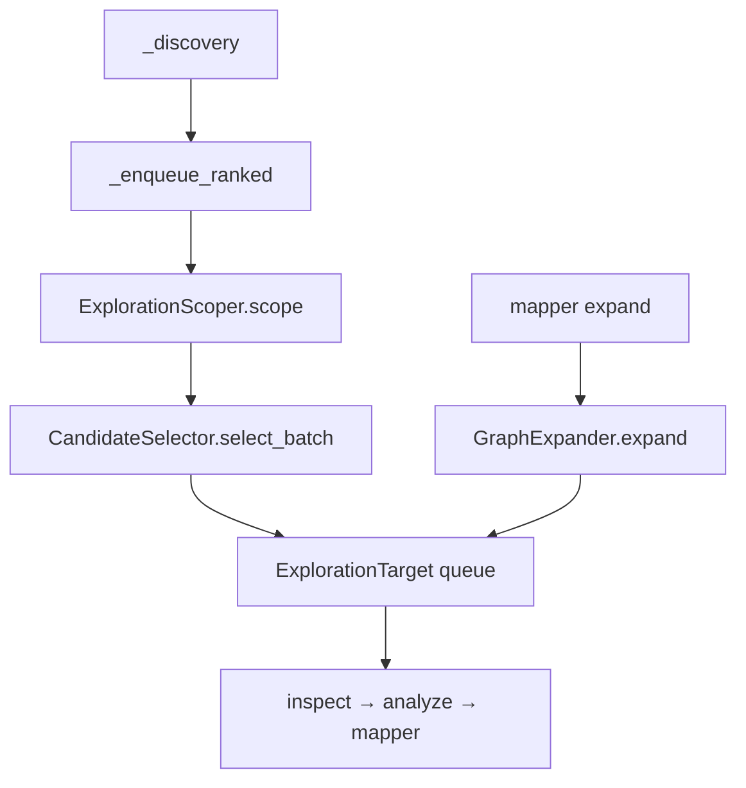
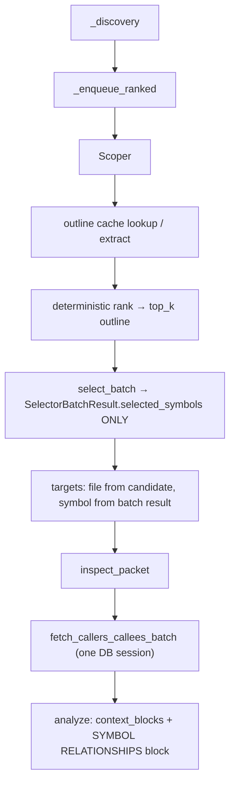

# Symbol-aware exploration pipeline — audit, design, and implementation plan

**Status:** design / pre-implementation  
**Scope:** AutoStudio `agent_v2` exploration — scoper → candidates → selector → inspect → analyzer  
**Principles:** Reuse existing graph storage and candidate structures; no new databases; deterministic heavy work; no exploration loop control-flow changes.

---

## Part A — System audit (summary)

### A.1 Scoper

| Item | Detail |
|------|--------|
| **File** | `agent_v2/exploration/exploration_scoper.py` |
| **Method** | `ExplorationScoper.scope()` |
| **Returns** | `list[ExplorationCandidate]` — subset of input; expands dedupe-by-`file_path` indices back to all original rows for chosen files |
| **Consumed by** | `ExplorationEngineV2._enqueue_ranked()` → passes `scoped` to `CandidateSelector.select_batch()` |

### A.2 `ExplorationCandidate` (file-level entity)

**File:** `agent_v2/schemas/exploration.py`

Represents a **file** after discovery merge: `file_path`, `snippet` / `snippet_summary`, `source` / `source_channels`, `symbol` / `symbols` (from **discovery** hits — not a full outline). No typed function/class outline in schema today.

### A.3 Graph stack

| Component | Path | Notes |
|-----------|------|--------|
| Lookup | `agent/retrieval/graph_lookup.py` | SQLite via `GraphStorage` |
| Adapter | `agent/retrieval/adapters/graph.py` — `fetch_graph()` | Node rows for retrieval |
| Exploration expand | `agent_v2/exploration/graph_expander.py` | Uses `fetch_graph`; caller/callee split via snippet substring is weak |
| **Authoritative edges** | `repo_graph/graph_query.py` — `get_callers`, `get_callees`, `find_symbol` | Use for structured caller/callee data |

### A.4 Selector batch

**File:** `agent_v2/exploration/candidate_selector.py` — `select_batch()`  
**Payload today:** `file_path`, `symbol`, `source`, `symbols`, `snippet_summary`, `source_channels`, optional `repo`  
**Output:** `SelectorBatchResult` with `selected_candidates`, `selection_confidence`, `coverage_signal`  
**Consumed by:** `_enqueue_ranked()` → `ExplorationTarget` queue.

### A.5 Analyzer

**File:** `agent_v2/exploration/understanding_analyzer.py`  
**Context:** Built in `_build_context_blocks_for_analysis()` → `ContextBlock` list; analyzer gets `snippet` + `context_blocks` JSON.

### A.6 Current data flow



---

## Part B — Target architecture

**Pipeline:**

```
scoper → candidates (≤10 files, config-driven)
      → deterministic symbol outline (+ cache)
      → rank/filter outlines → top_k for selector prompt only
      → selector (files + selected_symbols in batch result only)
      → inspect (file + primary symbol for read anchor)
      → batched graph fetch (callers/callees)
      → analyzer: code context + separate SYMBOL RELATIONSHIPS block
```

**Clean separation (mandatory):**

| Concept | Owner |
|---------|--------|
| File-level discovery/scoping candidate | `ExplorationCandidate` — **file only**; discovery `symbol`/`symbols` unchanged as retrieval hints |
| Per-batch symbol choices | **`SelectorBatchResult` only** — single source of truth for selector-chosen symbols |
| Downstream | Pass **`selector_result`** (or derived struct) **explicitly** — do **not** persist selector symbols on `ExplorationCandidate` |

This avoids state pollution, stale symbols across loops, and confusion between discovery symbols vs selector symbols.

---

## Part C — Design details (updated)

### C.1 Symbol extraction (deterministic)

- Run after scoper, on the bounded file list entering the selector.
- **Reuse:** Tree-sitter path in `repo_index/symbol_extractor.py` (same stack as indexer) for Python; other extensions optional/skip.
- **Output type:** In-memory only: `list[{"name": str, "type": "function" | "class" | "method"}]` per file, attached to **ephemeral** structures used for prompting and batch graph input — **not** stored on `ExplorationCandidate`.

### C.1a Symbol outline cache (mandatory)

- **Structure:** `symbol_outline_cache: dict[str, list[OutlineEntry]]` keyed by **canonical `file_path`**.
- **Scope:** One `ExplorationEngineV2.explore()` run (engine instance or `ex_state`-like bag cleared per run).
- **Effect:** Same file revisited across inner steps does not re-parse AST.

### C.1b Pre-filter before selector prompt (mandatory)

- **Problem:** Dumping all functions/classes for large files overloads the model.
- **Fix:** Deterministic rank over outline names using **instruction + intent text** (token overlap, substring match, optional fuzzy score): keep **top_k ∈ [10, 15]** (config).
- **Selector sees:** Only this **truncated** list per file, plus existing file-level fields.

### C.2 Selector upgrade

- **Input:** Existing candidate fields + per-row `outline_for_prompt` (filtered top_k only).
- **Output JSON:** Extend with `selected_symbols`: map **batch candidate index** (string keys `"0"`, `"1"`, …) → **1–3** symbol names (validated against **filtered** outline for that row).
- **Parsing:** `CandidateSelector.select_batch()` fills **`SelectorBatchResult.selected_symbols`** only; `_match_many` still returns `ExplorationCandidate` rows **without** adding selector symbol fields to the model.
- **Inspect anchor:** Engine derives **primary symbol** for `READ` from `selected_symbols[index][0]` or first valid name when building the active `ExplorationTarget` — from **`SelectorBatchResult`**, not by mutating candidate.

### C.3 Graph fetch — **batched** (mandatory)

- **Do not:** Loop per symbol opening/closing `GraphStorage`.
- **Do:** `fetch_callers_callees_batch(symbols: list[str], file_paths: list[str], project_root: str, *, k_each: int, ...) -> dict[str, BatchSymbolEdges]` (exact return shape TBD: e.g. per resolved node id or per `(file, symbol)` key).
- **Inside:** Single `GraphStorage` session (single index open for the run batch); resolve all symbols, then fetch edges for each resolved node in batch.
- **Implementation location:** Prefer thin module under `agent/retrieval/adapters/graph.py` or `agent_v2/exploration/graph_symbol_edges.py` calling `repo_graph.graph_query` + `GraphStorage` — **no duplicate edge logic**.

### C.3a Symbol disambiguation (mandatory)

When multiple graph nodes share a name:

1. **Exact `file_path` match** (canonical path compare).
2. Else **same directory** as candidate file (parent path match).
3. Else **highest graph degree** (in-degree + out-degree or configured metric) as fallback.

Apply during batch resolution so each logical `(candidate_file, symbol_name)` maps to **at most one** node id for edge queries.

### C.4 Analyzer integration (structured block)

- **Do not** append graph text into the concatenated **code `snippet`** string.
- **Do:** Add a **separate** prompt variable, e.g. `symbol_relationships_block`, rendered as:

```
--------------------------------
SYMBOL RELATIONSHIPS
--------------------------------
function_a:
  callers: [...]
  callees: [...]
```

- **Placement:** Same turn as analyze, **after** code/context blocks in the user message layout, **before** the model’s reasoning output (i.e. separate section in the prompt, not mixed into `snippet`).
- **Caps:** Top-k callers/callees per symbol; global char cap (config).

---

## Part D — Implementation plan

### D.1 Schema changes

- **`SelectorBatchResult`:** Add `selected_symbols: dict[str, list[str]]` (default `{}`). **Only** authoritative store for selector-chosen symbols for that batch.
- **`ExplorationCandidate`:** **No new symbol/outline/selection fields.** Do not persist selector decisions on the candidate.

### D.2 Files to modify / add

| Area | Action |
|------|--------|
| `agent_v2/schemas/exploration.py` | Extend `SelectorBatchResult` only (as above) |
| `agent_v2/config.py` | Flags + `OUTLINE_TOP_K_FOR_SELECTOR`, graph `K`, batch limits |
| `agent_v2/exploration/exploration_engine_v2.py` | Cache dict on run; after scoper: outline + filter; pass explicit selection downstream; batch graph before analyze; pass relationships block to analyzer |
| `agent_v2/exploration/candidate_selector.py` | Payload with filtered outline; parse `selected_symbols` into `SelectorBatchResult` only |
| New | `file_symbol_outline.py` (or reuse `repo_index` helpers) — read file → outline |
| New | `graph_symbol_edges_batch.py` (or adapter) — `fetch_callers_callees_batch` + disambiguation |
| `agent_v2/exploration/understanding_analyzer.py` | New variable `symbol_relationships_block` (empty default) |
| `agent/prompt_versions/exploration.analyzer/**` | Document separate section |
| `agent/prompt_versions/exploration.selector.batch/**` | `selected_symbols` contract + outline rules |
| Tests | Selector JSON, batch graph mock, cache hit, disambiguation order |

### D.3 Data flow (after)



### D.4 Constraints

- No breaking changes: missing `selected_symbols` → current behavior; empty graph → empty block.
- No extra exploration loop iterations; graph + outline work inside existing step budget.
- Backward compatible prompts with optional new JSON keys.

### D.5 Success criteria

- Selector chooses files **and** symbols with **batch result** as sole symbol source of truth.
- Graph enrichment uses **one** storage session per batch step.
- Outlines **cached** per file per `explore()` run.
- Selector prompt receives **bounded** symbol lists.
- Analyzer receives **isolated** relationship section, not merged into code snippet.

---

## Part E — Explicit non-goals

- No new databases or storage systems.
- No LLM-based symbol extraction.
- No changes to exploration loop control structure (`while` / max steps).
- No attaching selector symbols to `ExplorationCandidate`.

---

*Document merges the original staff-engineer audit/design with mandatory fixes: candidate/selector separation, batched graph fetch, per-run outline cache, selector outline pre-filter, structured analyzer block, and symbol disambiguation policy.*
