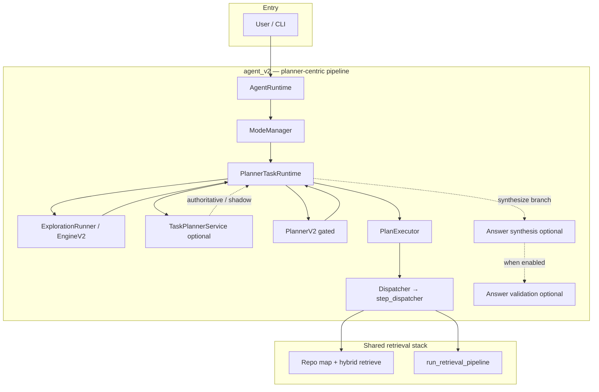
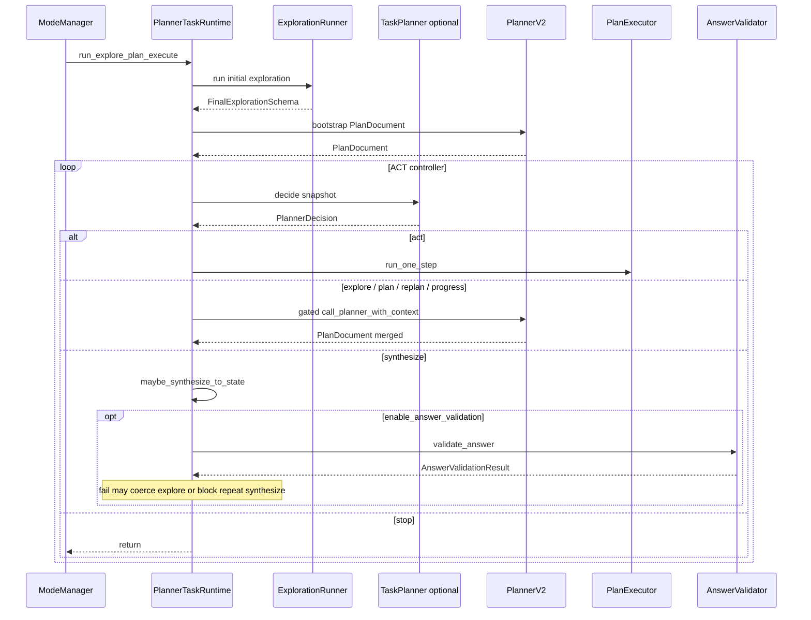
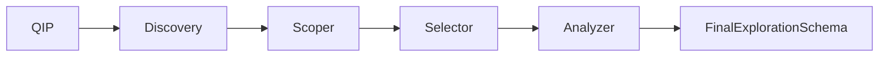
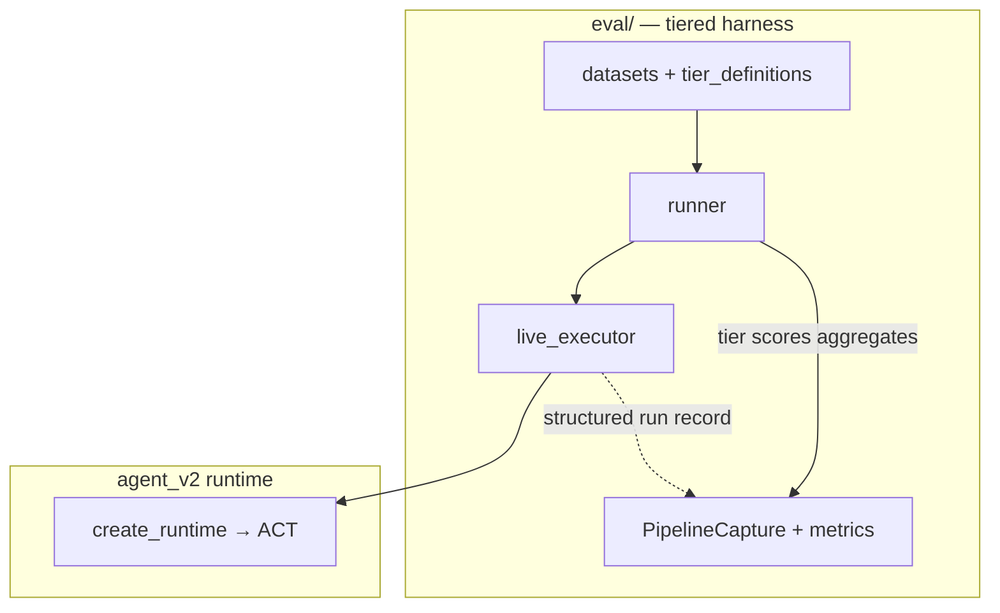

# AutoStudio

[](https://github.com/Pugsy-Explores/AutoCodeStudio)
[](https://github.com/Pugsy-Explores/AutoCodeStudio)
[](https://www.python.org/downloads/)

Repository-aware coding agent: **exploration → structured plan → tool execution** (`agent_v2/`), with traces, execution graphs, and safety limits.

---

## Table of contents

| | |
|--|--|
| [Prerequisites](#prerequisites) | [Testing](#testing) |
| [Quickstart](#quickstart) | [Observability](#observability-langfuse) |
| [Installation](#installation) | [Architecture](#1-overview) |
| [Configuration](#configuration) | [System architecture](#system-architecture) |
| [CLI](#cli) | [Tools by mode](#tools-by-runtime-mode) |
| | [Project structure](#4-project-structure) · [Known limitations](#7-known-issues--legacy-parts) |

---

## Prerequisites

| Requirement | Notes |
|-------------|--------|
| **Python** | **3.10+** (`requires-python` in `pyproject.toml`). |
| **LLM endpoint** | OpenAI-compatible HTTP API (see `agent/models/models_config.json`). Defaults point at **localhost** ports (`8081`, `8082`, `8003`); adjust for your stack. |
| **Network** | Runtime calls your configured model endpoints; optional Langfuse for traces. |
| **Disk** | Writable project tree for indexing (`.symbol_graph/`), patches, and optional `.agent_memory/`. |

**Not required for unit tests:** a live LLM if tests are mocked or markers skipped (see [Testing](#testing)).

---

## Quickstart

```bash
# 1. Clone and enter the repo
cd AutoStudio

# 2. Create a virtualenv (recommended)
python3.10 -m venv .venv && source .venv/bin/activate   # Windows: .venv\Scripts\activate

# 3. Install package + test extras
pip install -U pip
pip install -e ".[test]"

# 4. Point models at your OpenAI-compatible server (override JSON defaults)
export MODEL_API_KEY="your-key"   # or "none" for local servers that ignore auth

# 5. Run the CLI against a repo (defaults to cwd if SERENA_PROJECT_DIR unset)
export SERENA_PROJECT_DIR="$(pwd)"
autostudio explain "AgentRuntime"
# or
autostudio edit "List the main entrypoints in this codebase"
```

Smoke-check imports: `python -c "from agent_v2.runtime.bootstrap import create_runtime; print('ok')"`

## System architecture

**Context:** `agent_v2` is the default product path: bounded exploration, optional synthesis, **`PlannerTaskRuntime`** (outer loop), **gated PlannerV2** (plan materialization), **`PlanExecutor`** → shared **`Dispatcher`** / `step_dispatcher`. TaskPlanner is optional authority (`AGENT_V2_TASK_PLANNER_AUTHORITATIVE_LOOP`).

### End-to-end control and retrieval



### ACT path (controller loop)



### Exploration engine (data plane)



### Tiered evaluation (benchmark plane)

Observability-only: does not replace the execution engine. `tiered-eval` / `eval.runner` drives `create_runtime` → exploration → ACT loop; **`PipelineCapture`** records loop metadata, state snapshots, and aggregate metrics (see `eval/LIVE_EVAL_AUDIT.md`).



Further narrative: [§2 Architecture](#2-architecture), [§3 Execution flow](#3-execution-flow-lifecycle).

---

## Tools by runtime mode

Plan steps use lowercase **`PlanStep.action`** values; planner **`engine.tool`** ids map via `agent_v2/runtime/phase1_tool_exposure.py`. Validator allowlists come from **`get_config().planner`** in `agent_v2/config.py` (`read_only` vs `plan_safe` vs full ACT policy).

### `agent_v2` — plan step actions (`PlanDocument` → `PlanExecutor`)

| `PlanStep.action` | Planner `engine.tool` | Role |
|-------------------|----------------------|------|
| `search` | `search_code` | Retrieval / search |
| `open_file` | `open_file` | Read file regions |
| `shell` | `run_shell` | Shell (policy-gated) |
| `run_tests` | `run_tests` | Test runner |
| `edit` | `edit` | Edits (**excluded** in plan-safe / `PLAN_MODE_TOOL_POLICY`) |
| `finish` | `none` | Terminal |

### `agent_v2` — `ModeManager` modes

| Mode | Exploration | Plan / execute | Tool policy |
|------|-------------|-----------------|-------------|
| `act`, `plan_execute` | Yes | Controller loop + `PlanExecutor` (unless controller off) | ACT — includes **`edit`** where allowed |
| `plan`, `deep_plan` | Yes | Same; **`deep_plan`** uses `deep=True` on planner | Plan-safe — **no `edit`** |
| `plan_legacy` | Yes | Single PlannerV2 call, **no** `PlanExecutor` | Plan-only trace |

Exploration-only tools inside **ExplorationEngineV2** are read-only (search / open / inspect paths); they are separate from post-planner `edit` / `run_tests` unless a later plan step invokes them.

---

## Installation

**Editable install (recommended for development):**

```bash
pip install -e ".[test]"
```

This installs the `autostudio` console script (`pyproject.toml` → `agent.cli.entrypoint:main`) and dependencies (`openai`, `pydantic`, `langfuse`, `tree-sitter`, …).

**Optional UI (execution graph):**

```bash
cd ui && npm install && npm run dev
```

See [`ui/README.md`](ui/README.md).

---

## Configuration

### Environment variables (essential)

| Variable | Purpose |
|----------|---------|
| **`MODEL_API_KEY`** | Bearer token for LLM HTTP calls; overrides `agent/models/models_config.json`. Use `none` if the server does not require auth. |
| **`SERENA_PROJECT_DIR`** | Absolute path to the repository under edit. If unset, CLI helpers use **current working directory**. |

Endpoints and per-task model routing are defined in **`agent/models/models_config.json`** (`models.*.endpoint`, `task_models`). Override patterns are documented in [`Docs/CONFIGURATION.md`](Docs/CONFIGURATION.md) (router/planner envs such as `ROUTER_LLM_MODEL` when applicable).

### Runtime and safety (common)

| Variable | Default | Purpose |
|----------|---------|---------|
| `REACT_MODE` | `1` | Policy/dispatch behavior when `agent_v2` sets `react_mode` in context (not the high-level orchestration mode). |
| `SKIP_STARTUP_CHECKS` | off | Set to `1` in tests/mocks to skip `ensure_services_ready()` (see `config/startup.py`). |
| `RETRIEVAL_DAEMON_AUTO_START` | `1` | Disable with `0` if you do not want the retrieval daemon started automatically. |

Full lists: **`config/`** modules (`agent_runtime.py`, `retrieval_config.py`, `editing_config.py`, …) and [`Docs/CONFIGURATION.md`](Docs/CONFIGURATION.md).

### Langfuse (optional)

If you use Langfuse observability, set the usual **`LANGFUSE_*`** credentials expected by `langfuse` (see `agent_v2/observability/`). Runs work without it; traces may be limited.

---

## CLI

```bash
autostudio --help
```

Common commands (see `agent/cli/entrypoint.py`):

| Command | Description |
|---------|-------------|
| `autostudio edit "<instruction>"` | Run **`agent_v2`** with `mode=act` (full pipeline). |
| `autostudio explain <symbol>` | Shortcut instruction: explain how a symbol works. |
| `autostudio trace ...` | Trace helpers (wraps `scripts/replay_trace.py`). |

**Modes** (for programmatic use): `act`, `plan`, `deep_plan`, `plan_execute` — see `agent_v2/cli_adapter.VALID_MODES` and `parse_mode`.

Programmatic usage:

```python
from agent_v2.runtime.bootstrap import create_runtime

runtime = create_runtime()
out = runtime.run("Your instruction", mode="act")
```

Use **`tests.utils.runtime_adapter`** for legacy-shaped dicts (`run_controller`, `run_hierarchical`) in tests.

---

## Testing

Install test dependencies: `pip install -e ".[test]"` (installs **pytest**).

```bash
# Default: full test collection under tests/ (excludes heavy fixture trees per pyproject norecursedirs)
pytest

# Fast feedback: skip slow tests
pytest -m "not slow"

# Integration tests (real services; see marker)
TEST_MODE=integration pytest -m integration

# agent_v2 live LLM phases (cost + latency)
AGENT_V2_LIVE=1 pytest tests/test_agent_v2_phases_live.py -m agent_v2_live
```

**Pytest markers** (from `pyproject.toml`):

| Marker | Meaning |
|--------|---------|
| `slow` | Long-running; exclude with `-m "not slow"`. |
| `integration` | Real services; use `TEST_MODE=integration`. |
| `agent_v2_live` | Live LLM; requires `AGENT_V2_LIVE=1`. |
| `replanner_regression` | Replanner prompt regression (live LLM). |
| `query_intent_parser_eval`, `scoper_eval`, `selector_batch_eval`, `analyzer_eval` | Live LLM suites for exploration pipeline modules; each requires its own `*_EVAL_LIVE=1` (see [`tests/README.md`](tests/README.md#exploration-llm-eval-harness-testsevals)). |

**Useful targets:**

| Suite | Command |
|-------|---------|
| Mode manager | `pytest tests/test_mode_manager.py` |
| Agent loop (unit) | `pytest tests/test_agent_v2_loop_retry.py` |
| Router eval (mock) | `python -m router_eval.router_eval --mock` |
| Exploration LLM eval harness | [`tests/README.md`](tests/README.md#exploration-llm-eval-harness-testsevals) — per-module `export` gates and `pytest` commands |

CI tip: `SKIP_STARTUP_CHECKS=1` is often set in automated test environments to avoid daemon/bootstrap side effects.

---

## Observability (Langfuse)

When configured, runs emit structured traces (generations, tool spans). Execution graphs for the UI are built from trace payloads (`agent_v2/observability/graph_builder.py`). Optional dev server: `python -m agent_v2.observability.server` (see `ui/README.md`).

---

## 1. Overview

**What it does:** Turns an instruction into repository-grounded actions using **`agent_v2/`**: **bounded exploration** (`ExplorationEngineV2`) → optional **answer synthesis** → **`PlannerTaskRuntime`** outer loop → **`PlanExecutor`** (structured steps via **`Dispatcher`** → legacy **`_dispatch_react`**). The live **`PlanDocument`** is produced by **PlannerV2**; **control** (what to do next: explore again, refresh plan, run one step, synthesize, stop) is owned by **`PlannerTaskRuntime`**, optionally driven by **`TaskPlannerService`** when `AGENT_V2_TASK_PLANNER_AUTHORITATIVE_LOOP=1`. PlannerV2 is a **gated plan generator**, not the controller.

**Not a pure ReAct loop:** `ModeManager` does **not** use `AgentLoop.run()` for `act`. See [`agent_v2/README.md`](agent_v2/README.md).

**IDE / automation:** Use **`autostudio`** or `create_runtime()`; **`agent.orchestrator.run_controller` raises**.

---

## 2. Architecture

### High level

1. **`AgentRuntime`** — composes `ModeManager`, `ExplorationRunner`, `PlanExecutor`, dispatcher, observability.
2. **`ModeManager`** — maps `mode` → `PlannerTaskRuntime` methods (`run_explore_plan_execute`, `run_plan_explore_execute_safe`, `run_plan_only`).
3. **Exploration** — `ExplorationEngineV2`: QIP → discovery → scoper → selector → analyzer → `FinalExplorationSchema` (bounded; read-only tools).
4. **PlannerV2** — LLM emits **`PlanDocument`** + `engine` controller fields; invocation is **gated** by `should_call_planner_v2` when TaskPlanner is authoritative (`agent_v2/planning/planner_v2_invocation.py`).
5. **TaskPlanner** — `TaskPlannerService.decide(PlannerDecisionSnapshot) → PlannerDecision` (rule-based default: `RuleBasedTaskPlannerService`).
6. **PlanExecutor** — runs the next plan step or returns status to the outer loop; **`PlannerTaskRuntime._run_act_controller_loop`** schedules PlannerV2 and exploration re-runs.

### Key concepts

| Concept | Role |
|--------|------|
| **ACT / `plan_execute`** | Exploration → synthesis (if enabled) → **controller loop** (if `AGENT_V2_PLANNER_CONTROLLER_LOOP=1`) → else single PlannerV2 + full `PlanExecutor.run`. |
| **`plan` / `deep_plan`** | Exploration → same controller path with **`PLAN_MODE_TOOL_POLICY`** (no edit). |
| **`plan_legacy`** | Exploration → **one** PlannerV2 call → plan-only (no controller loop). |
| **TaskPlanner authoritative** | `AGENT_V2_TASK_PLANNER_AUTHORITATIVE_LOOP=1` — decisions from `TaskPlannerService`; PlannerV2 only when gate allows. |
| **Shadow loop** | `AGENT_V2_TASK_PLANNER_SHADOW_LOOP=1` (and not authoritative) — logs TaskPlanner vs `PlanDocument.engine` mismatch; engine still wins. |
| **Memory** | **Task working memory** (`state.context["task_working_memory"]`), **conversation store** (`state.context["conversation_memory_store"]`), **planner session memory** — see §3 below. |

---

## 3. Execution flow (lifecycle)

**Decision → execution → memory update → next decision** (controller enabled):

1. Build `AgentState`; Langfuse root trace optional.
2. **ExplorationRunner.run** — `FinalExplorationSchema`; write `state.context` exploration fields; **task working memory** tick via `PlannerTaskRuntime`.
3. **maybe_synthesize_to_state** — if `AGENT_V2_ENABLE_ANSWER_SYNTHESIS=1` and policy allows.
4. **Bootstrap PlannerV2** — first `call_planner_with_context` → `PlanDocument`.
5. **Loop (`_run_act_controller_loop`):**
   - Build **`PlannerDecisionSnapshot`** (consumes `task_planner_last_loop_outcome` from metadata when present).
   - **Resolve decision:** authoritative → `TaskPlanner.decide`; else → `planner_decision_from_plan_document(plan_doc)`; shadow → compare + engine decision.
   - **Branch:** `synthesize` / `plan` / `replan` / `explore` / `act` / `stop` — see [`agent_v2/runtime/README.md`](agent_v2/runtime/README.md).
   - On **act:** `PlanExecutor.run_one_step` → `success` | `failed_step` | `progress` → may trigger gated PlannerV2 **progress_refresh** or failure replan.
6. Append assistant turn to **conversation memory**; normalize CLI result.

**Controller disabled (`AGENT_V2_PLANNER_CONTROLLER_LOOP=0`):** steps 2–4 then a **single** `PlanExecutor.run` (full plan walk).

**Modes `plan_legacy`:** steps 2–4 once, no `PlanExecutor`; plan trace only.

### Memory model (snapshot)

| Layer | Location | Content |
|-------|----------|---------|
| **Working memory** | `state.context["task_working_memory"]` | Per-instruction counters, exploration query hash, completed-step kinds, fingerprint for snapshots. Reset when a new top-level run starts. |
| **Conversation memory** | `state.context["conversation_memory_store"]` | Turn summaries; `metadata["chat_session_id"]` selects session. |
| **Planner session** | `state.context["planner_session_memory"]` | Short planner/executor session facts for prompts. |
| **Snapshot** | `PlannerDecisionSnapshot` (ephemeral) | Built each controller iteration; not persisted as a single blob. |

### Control-plane evolution

| Period | Control |
|--------|---------|
| **Default today (env off)** | **`PlannerDecision`** derived from **`PlanDocument.engine`** / legacy `controller` via `planner_decision_from_plan_document`. |
| **Authoritative TaskPlanner (`AGENT_V2_TASK_PLANNER_AUTHORITATIVE_LOOP=1`)** | **`TaskPlannerService.decide`** returns **`PlannerDecision`**; **PlannerV2** runs only when **`should_call_planner_v2`** is true (bootstrap materialization, `plan`/`replan` decisions, post-sub-exploration merge, failure/insufficiency replan, progress refresh). |

---

## 4. Project structure

| Path | Purpose |
|------|---------|
| **`agent_v2/`** | `AgentRuntime`, `ModeManager`, **`PlannerTaskRuntime`** (ACT loop), `PlanExecutor`, `ExplorationRunner`, schemas, observability. Module READMEs: [`agent_v2/README.md`](agent_v2/README.md), [`agent_v2/runtime/README.md`](agent_v2/runtime/README.md), [`agent_v2/planning/README.md`](agent_v2/planning/README.md), [`agent_v2/exploration/README.md`](agent_v2/exploration/README.md), [`agent_v2/memory/README.md`](agent_v2/memory/README.md). |
| **`agent/`** | Legacy integration: execution dispatch, retrieval, models, CLI, prompts. **Orchestrator `run_controller` removed** (raises). |
| **`planner/`** | Standalone **legacy** JSON planner + `planner_eval`; production plans come from **`agent_v2/planner/planner_v2.py`**. |
| **`config/`** | Env-backed limits and flags (`REACT_MODE`, retrieval, editing). |
| **`editing/`** | Patch pipeline: diff plan → validate → execute. |
| **`repo_index/`**, **`repo_graph/`** | Symbol index and graph for retrieval. |
| **`router_eval/`** | Instruction-router evaluation harness. |
| **`ui/`** | Execution graph visualization (React Flow). |
| **`tests/utils/runtime_adapter.py`** | **`run_controller` / `run_hierarchical`** → `create_runtime().run()`. |
| **`Docs/architecture_freeze/`** | Normative design reference; schemas in `SCHEMAS.md`. |

---

## 5. End-to-end example

1. `export SERENA_PROJECT_DIR=/path/to/repo` (or rely on cwd).
2. `autostudio edit "Add a unit test for foo"` (or call `create_runtime().run("...", mode="act")`).
3. Exploration gathers files; planner emits steps like `open_file` → `edit` → `run_tests`.
4. `PlanExecutor` runs each step; failures retry per `ExecutionPolicy`; replan may produce a new `PlanDocument`.
5. API/CLI output via `agent_v2/cli_adapter.format_output`: `status`, `trace`, `plan`, `result` (history).

---

## 6. Development guide

- **New tool behavior:** Extend **`agent/execution/step_dispatcher.py`** dispatch paths; keep policy + trace hooks. Plan steps must map to allowed `PlanStep.action` values (`planner_v2.py` / schemas).
- **Tune exploration / controller:** `agent_v2/config.py` — e.g. `AGENT_V2_EXPLORATION_MAX_STEPS`, `AGENT_V2_PLANNER_CONTROLLER_LOOP`, `AGENT_V2_TASK_PLANNER_AUTHORITATIVE_LOOP`, `AGENT_V2_MAX_PLANNER_CONTROLLER_CALLS`.
- **Modes:** `agent_v2/cli_adapter.VALID_MODES` — `act`, `plan`, `deep_plan`, `plan_execute`, `plan_legacy`.
- **Tests:** `pytest tests/test_mode_manager.py`, `tests/test_planner_v2_invocation.py`, `tests/test_task_planner_synthesis_loop.py`, `tests/test_agent_v2_phases_live.py`, `tests/test_agent_v2_loop_retry.py` (**`AgentLoop`** is not the `act` path; tests cover class behavior in isolation).

---

## 7. Known issues / legacy parts

| Item | Status |
|------|--------|
| **`AgentLoop.run` in production `act`** | **Not used** by `ModeManager`; class kept for composition/tests. |
| **`agent/orchestrator.run_controller`** | **Raises** — use **`tests.utils.runtime_adapter`** or CLI. |
| **`planner/` package** | Legacy plan format + eval; **PlannerV2** is the live planner. |
| **`REACT_MODE` env** | Default **on**; affects dispatcher/policy when `react_mode` context is set — not the same as “ReAct is the main loop” (orchestration is **`PlannerTaskRuntime`** + optional TaskPlanner). |
| **Docs under `Docs/`** | Normative freeze docs may lag; **runtime truth** = `agent_v2/**/*.py` + READMEs under `agent_v2/`. |

---

## Quick reference

- **Bootstrap:** `from agent_v2.runtime.bootstrap import create_runtime`
- **Run:** `create_runtime().run("instruction", mode="act")`
- **Architecture intent:** [`Docs/architecture_freeze/ARCHITECTURE_FREEZE.md`](Docs/architecture_freeze/ARCHITECTURE_FREEZE.md)
- **Structured types:** [`Docs/architecture_freeze/SCHEMAS.md`](Docs/architecture_freeze/SCHEMAS.md)
- **Full config reference:** [`Docs/CONFIGURATION.md`](Docs/CONFIGURATION.md)
