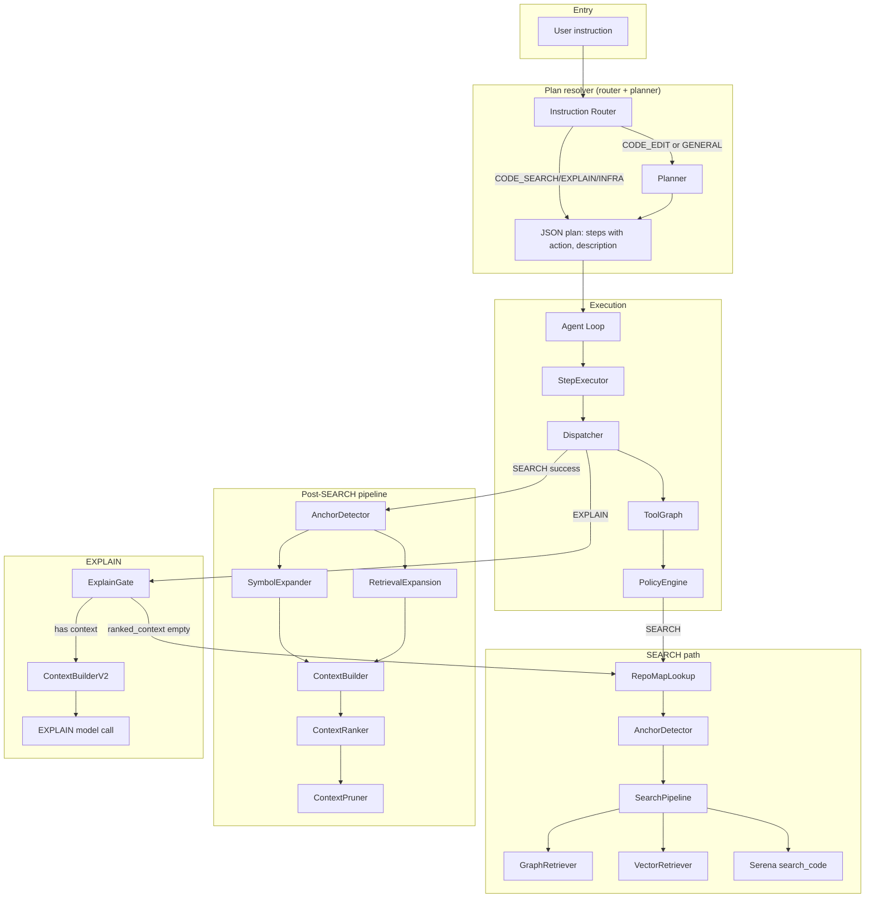

# AutoStudio

**A repository-aware autonomous coding agent** that plans, searches, edits, and explains codebases using LLMs and structured tool execution.

AutoStudio converts natural-language instructions into executable plans, runs code search (graph + vector + Serena fallback), ranks context, applies structured patches with conflict resolution, runs tests with repair loops, and persists task memory—all while respecting safety limits, policy-driven retries, and configurable model routing.

---

## Table of Contents

- [Architecture Overview](#architecture-overview)
- [Quick Start](#quick-start)
- [Project Structure](#project-structure)
- [Core Components](#core-components)
- [Execution Pipeline](#execution-pipeline)
- [Agent Controller (Full Pipeline)](#agent-controller-full-pipeline)
- [Configuration](#configuration)
- [Environment Variables](#environment-variables)
- [Tools and Adapters](#tools-and-adapters)
- [Testing](#testing)
- [Subsystems](#subsystems)
- [Repository Symbol Graph](#repository-symbol-graph-implemented)
- [Evaluation](#evaluation)
- [Documentation](#documentation)

---

## Architecture Overview



**ASCII diagram:**

```
    ┌─────────────────────┐
    │  User instruction   │
    └──────────┬──────────┘
               │
               ▼
    ┌──────────────────────────────────────────┐
    │  Plan resolver (router + planner)        │
    │  InstructionRouter ──► Planner ──► Plan  │
    │  CODE_EDIT/GENERAL ──► Planner           │
    │  CODE_SEARCH/EXPLAIN/INFRA ──► Plan      │
    └──────────┬───────────────────────────────┘
               │
               ▼
    ┌──────────────────────────────────────────┐
    │  Execution                                │
    │  Loop ──► Exec ──► Dispatch ──► ToolGraph │
    │                    └──► PolicyEngine      │
    └──────────┬───────────────────────────────┘
               │
       ┌───────┴───────┐
       │               │
       ▼               ▼
┌──────────────┐  ┌─────────────────────────────┐
│ SEARCH path  │  │ Post-SEARCH pipeline         │
│ RepoMapLookup│  │ AnchorDetector ──► SymbolExp │
│ ──► Anchor  │  │ ──► Expand ──► ContextBuilder│
│ ──► Search   │  │ ──► Ranker ──► Pruner        │
│   Pipeline   │  └─────────────────────────────┘
│ ──► Graph/   │
│   Vector/    │  ┌─────────────────────────────┐
│   SerenaGrep│  │ EXPLAIN path                  │
└──────────────┘  │ ExplainGate ──► ContextBuilderV2
                  │ ──► EXPLAIN model call        │
                  └─────────────────────────────┘
```

**High-level flow:** Instruction → Plan resolver (instruction router when enabled, else planner) → Plan → Execute steps (SEARCH / EDIT / INFRA / EXPLAIN) → Validate → Optional replan → Return state. SEARCH uses `_search_fn` (RepoMapLookup → SearchPipeline) then `run_retrieval_pipeline` on success. EXPLAIN uses ExplainGate to inject SEARCH when `ranked_context` is empty.

---

## Quick Start

### Prerequisites

- Python 3.10+
- OpenAI-compatible LLM endpoints (e.g. llama.cpp, vLLM, or OpenAI API)
- Optional: [Serena](https://github.com/oraios/serena) MCP server for code search

### Dependencies

```bash
pip install -r requirements.txt
# or
pip install openai>=1.0.0 PyYAML>=6.0 tree-sitter tree-sitter-python
pip install mcp  # optional, for Serena code search
pip install chromadb sentence-transformers  # optional, for vector search and task index
```

Core: `openai`, `PyYAML`, `tree-sitter`, `tree-sitter-python`. Serena adapter requires `mcp`. Vector search and task index require `chromadb` and `sentence-transformers` (graceful fallback when unavailable).

### Run the agent

```bash
# From project root — standard agent loop (plan → execute steps)
python -m agent "Find where the StepExecutor class is defined"

# Full pipeline — agent controller (repo map, conflict resolution, test repair, task memory)
python -c "from agent.orchestrator.agent_controller import run_controller; run_controller('Add logging to execute_step', project_root='.')"

# Or with explicit CLI
python -m agent.cli.run_agent "Explain how the dispatcher routes SEARCH steps"
```

### Index repository (symbol graph + optional embeddings)

```bash
python -m repo_index.index_repo /path/to/repo
# Creates .symbol_graph/index.sqlite, symbols.json, repo_map.json, and optionally .symbol_graph/embeddings/ (when chromadb + sentence-transformers installed)
```

### Model endpoints

Configure `agent/models/models_config.json` or set:

- `SMALL_MODEL_ENDPOINT` — e.g. `http://localhost:8001/v1/chat/completions`
- `REASONING_MODEL_ENDPOINT` — e.g. `http://localhost:8002/v1/chat/completions`

---

## Project Structure

```
AutoStudio/
├── config/                   # Centralized configuration (see Docs/CONFIGURATION.md)
│   ├── agent_config.py       # Agent loop limits (runtime, replan)
│   ├── editing_config.py     # Patch and file limits
│   ├── retrieval_config.py   # Retrieval budgets and flags
│   ├── router_config.py      # Instruction router
│   ├── tool_graph_config.py # Tool graph enable
│   ├── repo_graph_config.py # Symbol graph paths
│   ├── observability_config.py # Trace settings
│   ├── logging_config.py    # Log level/format
│   └── config_validator.py  # Startup validation
├── agent/                    # Core agent package
│   ├── cli/                  # CLI entry points
│   ├── execution/            # Step execution and dispatch
│   │   ├── executor.py       # StepExecutor (execute_step → dispatch)
│   │   ├── step_dispatcher.py  # Orchestrates: ToolGraph → Router → PolicyEngine; calls run_retrieval_pipeline
│   │   ├── tool_graph.py     # Allowed tools per node; ENABLE_TOOL_GRAPH
│   │   ├── tool_graph_router.py  # resolve_tool (preferred or first allowed; no hard reject)
│   │   ├── policy_engine.py  # Retry + mutation for SEARCH/EDIT/INFRA
│   │   └── explain_gate.py   # Context gate before EXPLAIN (inject SEARCH if empty)
│   ├── memory/               # State, results, task memory, task index
│   │   ├── state.py          # AgentState
│   │   ├── task_memory.py    # save_task, load_task, list_tasks
│   │   └── task_index.py     # Vector index for past tasks (optional)
│   ├── models/               # Model client and config
│   ├── observability/        # Trace logging
│   │   └── trace_logger.py   # start_trace, log_event, finish_trace
│   ├── orchestrator/         # Agent loop, controller, validation
│   │   ├── agent_loop.py     # run_agent (standard loop)
│   │   └── agent_controller.py # run_controller (full pipeline)
│   ├── retrieval/            # Query rewrite, context building, ranking
│   │   ├── search_pipeline.py  # Hybrid parallel retrieval (graph + vector + grep); uses repo_map anchor when present
│   │   ├── retrieval_pipeline.py  # run_retrieval_pipeline: anchor → symbol_expander + expand → read → build_context
│   │   ├── repo_map_lookup.py  # lookup_repo_map: tokenize query → match symbols → anchor candidates
│   │   ├── anchor_detector.py  # detect_anchors (search results); detect_anchor (query + repo_map)
│   │   ├── symbol_expander.py  # expand_from_anchors: graph depth=2 → fetch bodies → rank → prune (max 15 symbols, 6 snippets)
│   │   ├── graph_retriever.py # Symbol lookup + 2-hop expansion
│   │   ├── vector_retriever.py # Embedding-based search (optional)
│   │   ├── retrieval_cache.py  # LRU cache for search results
│   │   ├── query_rewriter.py
│   │   ├── retrieval_expander.py
│   │   ├── context_builder.py
│   │   ├── context_builder_v2.py  # assemble_reasoning_context: FILE/SYMBOL/LINES/SNIPPET format, ~8000 char budget
│   │   ├── context_ranker.py
│   │   └── context_pruner.py
│   ├── tools/                # Tool adapters
│   └── prompts/              # YAML prompts
├── repo_index/               # Repository indexing (Tree-sitter)
│   ├── indexer.py            # scan_repo, index_repo (parallel, optional embeddings)
│   ├── parser.py             # parse_file
│   ├── symbol_extractor.py   # extract_symbols
│   └── dependency_extractor.py # extract_edges
├── repo_graph/               # Symbol graph storage and query
│   ├── graph_storage.py      # SQLite nodes/edges
│   ├── graph_builder.py      # build_graph
│   ├── graph_query.py        # find_symbol, expand_neighbors
│   ├── repo_map_builder.py   # build_repo_map, build_repo_map_from_storage (spec: modules, symbols, calls)
│   ├── repo_map_updater.py   # update_repo_map_for_file (incremental; call after update_index_for_file)
│   └── change_detector.py    # Semantic change impact (risk levels)
├── editing/                  # Diff planning, conflict resolution, patches
│   ├── diff_planner.py       # plan_diff (EDIT step)
│   ├── conflict_resolver.py  # Detect and resolve edit conflicts
│   ├── semantic_diff.py      # AST-aware overlap detection
│   ├── merge_strategies.py   # merge_sequential, merge_three_way
│   ├── patch_generator.py    # to_structured_patches
│   ├── patch_executor.py     # execute_patch (with rollback)
│   ├── patch_validator.py    # validate_patch
│   ├── ast_patcher.py        # AST patching
│   └── test_repair_loop.py   # Run tests, repair on failure
├── planner/
├── router_eval/
├── Docs/                     # See Docs/README.md for index
├── mcp_retriever.py          # Optional ChromaDB retrieval API (legacy)
├── index_repo.py             # Legacy embedding indexer
└── tests/
```

---

## Core Components

| Component | Role |
|-----------|------|
| **run_agent** | Entry point: plan → state → execute loop → validate → replan until finished |
| **plan(instruction)** | Planner: LLM + JSON parse → `{steps: [{id, action, description, reason}]}` |
| **StepExecutor** | Calls `dispatch(step, state)`; wraps result in `StepResult` |
| **dispatch** | Routes by action to PolicyEngine (SEARCH/EDIT/INFRA) or EXPLAIN |
| **ToolGraph** | Per-node `allowed_tools` and `preferred_tool`; restricts transitions |
| **ExecutionPolicyEngine** | Retry loop with mutation; injects search_fn, edit_fn, infra_fn, rewrite_query_fn |
| **validate_step** | Rule-based or LLM YES/NO; EXPLAIN with empty-context output → invalid (triggers replanner); fallback to rules on error |
| **replan** | LLM-based: receives failed_step, error; produces revised plan; fallback to remaining steps |
| **instruction_router** | Classifies before planner (when ENABLE_INSTRUCTION_ROUTER=1); uses ROUTER_TYPE or inline SMALL model |

---

## Execution Pipeline

### Step actions

| Action | Policy | Retry condition | Mutation |
|--------|--------|-----------------|----------|
| SEARCH | 5 attempts | empty_results | query_variants (rewrite + attempt_history) |
| EDIT | 2 attempts | symbol_not_found | symbol_retry |
| INFRA | 2 attempts | non_zero_exit | retry_same |
| EXPLAIN | 1 attempt | — | — |

### SEARCH pipeline

Dispatcher orchestrates only: after SEARCH success it calls `run_retrieval_pipeline(results, state, query)`. The pipeline encapsulates:

```
SEARCH
  → policy_engine.search()
      → _search_fn: repo_map_lookup(query) + detect_anchor(query, repo_map) → state.context[repo_map_anchor, repo_map_candidates]
      → retrieval_cache.get_cached() [if RETRIEVAL_CACHE_SIZE > 0]
      → hybrid_retrieve() [when ENABLE_HYBRID_RETRIEVAL=1]
          → graph uses repo_map_anchor when confidence ≥ 0.9
          → parallel: graph_retriever + vector_retriever + search_code (grep)
          → merge_results() → top 20 candidates
      → else: sequential fallback (graph → vector → grep)
      → retrieval_cache.set_cached() on success
  → run_retrieval_pipeline(results, state, query)
      → anchor_detector.detect_anchors()  # filter to symbol/class/def matches; fallback top N
      → symbol_expander.expand_from_anchors() [when graph exists; anchor → expand depth=2 → fetch bodies → rank → prune to 6]
      → retrieval_expander.expand_search_results() [capped at MAX_SYMBOL_EXPANSION]
      → read_symbol_body / read_file → find_referencing_symbols
      → context_builder.build_context_from_symbols()
      → context_ranker.rank_context() [when ENABLE_CONTEXT_RANKING=1]
      → context_pruner.prune_context() [max 6 snippets, 8000 chars]
  → state.context["ranked_context"], context_snippets (list of {file, symbol, snippet})
```

- **Hybrid retrieval (default):** Runs graph, vector, grep in parallel; merges and dedupes; returns top 20. Improves recall (semantics + exact matches). Set `ENABLE_HYBRID_RETRIEVAL=0` for sequential fallback.
- **Retrieval budgets:** MAX_SEARCH_RESULTS=20, MAX_SYMBOL_EXPANSION=10, MAX_CONTEXT_SNIPPETS=6.
- **Query rewrite:** `rewrite_query_with_context(planner_step, user_request, attempt_history, state)` — LLM returns `{tool, query, reason}`; wires `chosen_tool`; prompts prefer high recall, regex-style patterns.
- **Symbol expander:** When graph index exists, `expand_from_anchors()` expands anchor symbols via `expand_neighbors(depth=2)`, fetches bodies, ranks, prunes to top 6 (max 15 symbols).
- **Context builder:** Deduplicates symbols, references, files; limits total chars. `context_builder_v2` formats ranked context for reasoning (FILE/SYMBOL/LINES/SNIPPET).
- **Context ranker:** Hybrid score = 0.6×LLM + 0.2×symbol_match + 0.1×filename_match + 0.1×reference_score − same_file_penalty; batch LLM; caps at 20 candidates.
- **Context pruner:** Max 6 snippets, 8000 chars; deduplicate by (file, symbol).

### EDIT pipeline (when ENABLE_DIFF_PLANNER=1)

```
EDIT
  → diff_planner.plan_diff(instruction, context)
  → conflict_resolver.resolve_conflicts() — same symbol, same file, semantic overlap
  → patch_generator.to_structured_patches()
  → patch_executor.execute_patch()
      → ast_patcher.apply_patch() — Tree-sitter AST edits (insert/replace/delete)
      → patch_validator.validate_patch() — compile + AST reparse
      → write on success; rollback on failure
  → repo_index.update_index_for_file() on success
  → repo_graph.update_repo_map_for_file() on success (incremental repo_map refresh)
```

- **Diff planner:** Identifies affected symbols, queries graph for callers.
- **Conflict resolver:** Splits conflicting edits into sequential groups.
- **Patch generator:** Converts plan to structured patches (symbol, action, target_node, code).
- **AST patcher:** Symbol-level (function_body_start, function_body, class_body) and statement-level edits; preserves relative indentation.
- **Patch validator:** Ensures code compiles and AST reparse succeeds before write.
- **Patch executor:** Applies validated patches; max 5 files, 200 lines per patch; rollback on invalid syntax, validation failure, or apply error.

### EXPLAIN

- **Context gate:** Before calling the model, `ensure_context_before_explain()` checks `ranked_context`. If empty, injects SEARCH (calls `_search_fn` with step description) and runs `run_retrieval_pipeline()`. Avoids wasted LLM calls when no context.
- **Anchored context format:** `context_builder_v2.assemble_reasoning_context()` emits FILE/SYMBOL/LINES/SNIPPET blocks (~8000 char budget); deduplicates by (file, symbol).
- Uses `ranked_context` as primary evidence; else falls back to `search_memory` and `context_snippets`.
- Model from `task_models["EXPLAIN"]` (default: REASONING_V2).
- Empty output → `"[EXPLAIN: no model output]"`.

---

## Agent Controller (Full Pipeline)

`run_controller(instruction, project_root)` orchestrates the complete development workflow without modifying `agent_loop` or `StepExecutor`:

```
instruction
  → build_repo_map() — high-level architectural map
  → search_similar_tasks() — vector index of past tasks (optional)
  → get_plan() — instruction router (if enabled) or planner.plan()
  → while task_not_complete:
        step = next_step()
        if SEARCH: dispatch (hybrid_retrieve or retrieve_graph → retrieve_vector → retrieve_grep → Serena)
        if EDIT: plan_diff → conflict_resolver → run_with_repair → change_detector → update_index
        validate step; if failure: replan
  → save_task() — persist to .agent_memory/tasks/
  → return task summary
```

**Safety limits:** max 5 files edited, 200 lines per patch, 15 min task runtime.

**Failure handling:** On step failure or validation failure, the agent replans (up to 5 attempts) using an LLM-based replanner that receives the failed step and error. SEARCH exhausts fallback chain (retrieve_graph → retrieve_vector → retrieve_grep → Serena) and retries with rewritten queries. EDIT failures trigger rollback before any files are written; patch validator ensures syntax and AST integrity.

**Test repair loop:** After patch execution, runs tests (pytest); on failure, plans repair and retries (max 3 attempts). Supports flaky test detection and compile step before tests.

**Trace logging:** Events stored in `.agent_memory/traces/`. Each trace includes plan, tool calls (step_executed with chosen tool), patch results, errors, and task_complete summary. See `agent/observability/trace_logger.py`.

---

## Configuration

All configuration values are centralized under `config/`. See [Docs/CONFIGURATION.md](Docs/CONFIGURATION.md) for the full reference, including environment variable overrides and validation rules.

### models_config.json

```json
{
  "models": {
    "SMALL": { "name": "Qwen 2B", "endpoint": "http://localhost:8001/v1/chat/completions" },
    "REASONING": { "name": "Qwen 9B", "endpoint": "http://localhost:8002/v1/chat/completions" },
    "REASONING_V2": { "name": "Qwen 14B", "endpoint": "http://localhost:8003/v1/chat/completions" }
  },
  "task_models": {
    "query rewriting": "REASONING",
    "validation": "REASONING",
    "EXPLAIN": "REASONING_V2",
    "EDIT": "REASONING_V2",
    "routing": "REASONING",
    "planner": "REASONING_V2",
    "context_ranking": "REASONING_V2"
  },
  "task_params": {
    "EXPLAIN": { "temperature": 0.0, "max_tokens": null, "request_timeout_seconds": 600 },
    "planner": { "temperature": 0.0, "max_tokens": 1024, "request_timeout_seconds": 600 },
    "context_ranking": { "temperature": 0.0, "max_tokens": 256, "request_timeout_seconds": 60 }
  }
}
```

- **models:** Maps model key (SMALL, REASONING, REASONING_V2) → name and endpoint
- **task_models:** Maps task name → model key (new features use REASONING_V2)
- **task_params:** Per-task temperature, max_tokens, timeout

---

## Environment Variables

All config values support env overrides. See [Docs/CONFIGURATION.md](Docs/CONFIGURATION.md) for the complete list.

| Variable | Purpose |
|----------|---------|
| `ENABLE_INSTRUCTION_ROUTER` | 1 or 0 (default) — route instruction before planner; CODE_SEARCH/CODE_EXPLAIN/INFRA skip planner |
| `ROUTER_TYPE` | baseline, fewshot, ensemble, or final — use router from registry when instruction router enabled |
| `SMALL_MODEL_ENDPOINT` | Override small model URL |
| `REASONING_MODEL_ENDPOINT` | Override reasoning model URL |
| `MODEL_API_KEY` | API key for model endpoints |
| `MODEL_TEMPERATURE` | Default temperature |
| `MODEL_MAX_TOKENS` | Default max tokens |
| `MODEL_REQUEST_TIMEOUT` | Default request timeout (seconds) |
| `REASONING_V2_MODEL_ENDPOINT` | Override REASONING_V2 endpoint |
| `ENABLE_TOOL_GRAPH` | 1 (default) or 0 — restrict tools by graph |
| `ENABLE_CONTEXT_RANKING` | 1 (default) or 0 — rank and prune context before EXPLAIN |
| `ENABLE_VECTOR_SEARCH` | 1 (default) or 0 — use embedding search when graph returns nothing |
| `ENABLE_HYBRID_RETRIEVAL` | 1 (default) or 0 — run graph, vector, grep in parallel; 0 = sequential fallback |
| `RETRIEVAL_CACHE_SIZE` | LRU cache size for search results (default 100); 0 to disable. Read at runtime from env. |
| `INDEX_EMBEDDINGS` | 1 (default) or 0 — build ChromaDB embedding index during index_repo |
| `INDEX_PARALLEL_WORKERS` | Parallel file parsing workers (default 8) |
| `SERENA_PROJECT_DIR` | Project root for Serena MCP |
| `SERENA_USE_PLACEHOLDER` | 1 to disable Serena (return empty results) |
| `SERENA_GREP_FALLBACK` | 1 (default) or 0 — use ripgrep when Serena MCP unavailable |
| `SERENA_VERBOSE` | 1 for Serena debug logs |
| `PLANNER_MAX_TOKENS` | Max tokens for planner (default 1024) |
| `ENABLE_DIFF_PLANNER` | 1 (default) or 0 — EDIT returns planned changes vs read_file |
| `TEST_REPAIR_ENABLED` | 1 (default) or 0 — run tests after patch; 0 = patch only |
| `COMPILE_BEFORE_TEST` | 1 (default) or 0 — run py_compile before tests |

---

## Tools and Adapters

| Tool | Adapter | Purpose |
|------|---------|---------|
| `retrieve_symbol_context` | graph_retriever | Graph-based symbol lookup + 2-hop expansion (when index exists) |
| `search_by_embedding` | vector_retriever | Semantic code search via ChromaDB (when graph returns nothing) |
| `search_code` | serena_adapter | Serena MCP: find_symbol, search_for_pattern (fallback) |
| `read_file` | filesystem_adapter | Read file contents |
| `write_file` | filesystem_adapter | Write file contents |
| `list_files` | filesystem_adapter | List directory |
| `find_referencing_symbols` | reference_tools | Stub; wire to Serena when available |
| `read_symbol_body` | reference_tools | Read symbol body (or file window) |
| `run_command` | terminal_adapter | Execute shell command |
| `lookup_docs` | context7_adapter | Optional doc lookup |

**Serena MCP:** Requires `mcp` package and Serena installed (e.g. `uvx serena start-mcp-server`). When unavailable, `search_code` falls back to ripgrep (unless `SERENA_GREP_FALLBACK=0`). Query rewrite prompts (`query_rewrite.yaml`, `query_rewrite_with_context.yaml`) encode Serena rules (find_symbol name_path, search_for_pattern regex) and filesystem rules (list_dir paths within project).

**Repository indexing:** Build a symbol graph for instant graph-based retrieval:

```bash
python -m repo_index.index_repo /path/to/repo
```

Creates `.symbol_graph/index.sqlite`, `symbols.json`, and `repo_map.json`. SEARCH uses repo_map lookup and anchor detection before graph retrieval when index exists. Programmatic use supports `include_dirs` to index only specific subdirs (e.g. `("agent", "editing")`).

---

## Testing

```bash
# From workspace root (parent of AutoStudio)
python -m pytest AutoStudio/tests/ -v

# End-to-end agent pipeline (mocked LLM, deterministic)
python -m pytest AutoStudio/tests/test_agent_e2e.py -v

# Specific suites
python -m pytest AutoStudio/tests/test_context_ranker.py -v
python -m pytest AutoStudio/tests/test_explain_gate.py -v
python -m pytest AutoStudio/tests/test_tool_graph.py -v
python -m pytest AutoStudio/tests/test_policy_engine.py -v
python -m pytest AutoStudio/tests/test_agent_robustness.py -v  # failure scenarios, replan, fallback, no corruption
python -m pytest AutoStudio/tests/test_agent_trajectory.py -v --mock  # complex trajectories: multi-search, conflict resolver, repair loop
python -m pytest AutoStudio/tests/test_observability.py -v  # trace creation, plan, tool calls, errors, patch results
python -m pytest AutoStudio/tests/test_indexer.py AutoStudio/tests/test_symbol_graph.py AutoStudio/tests/test_repo_map.py -v  # repo index + graph + repo map
INDEX_EMBEDDINGS=0 python -m pytest AutoStudio/tests/test_retrieval_pipeline.py AutoStudio/tests/test_graph_retriever.py -v  # retrieval pipeline
python -m pytest AutoStudio/tests/test_symbol_expansion.py AutoStudio/tests/test_context_builder_v2.py -v  # symbol expander, context builder v2

# Repo index/graph with debug logging (when failures occur)
INDEX_EMBEDDINGS=0 python -m pytest AutoStudio/tests/test_indexer.py AutoStudio/tests/test_symbol_graph.py -v --log-cli-level=DEBUG
```

**E2E tests** (`test_agent_e2e.py`): default tries real LLM; if unreachable, warns and falls back to mock. Use `--mock` to force mock mode and skip the probe.

```bash
python -m pytest tests/test_agent_e2e.py -v          # default: try LLM, fallback to mock
python -m pytest tests/test_agent_e2e.py -v --mock  # always use mock (fast, deterministic)
```

| Scenario | Flow | Assertions |
|----------|------|------------|
| Explain code | plan → search → retrieval → explain | No errors, task memory saved |
| Code edit | plan → search → diff planner → patch → index update | Patches applied, index updated, task memory saved |
| Multi-file change | conflict resolver → sequential patch groups | Patches applied to all files, task memory saved |

Tests mock LLM calls where appropriate (e.g. `test_context_ranker.py` mocks `call_reasoning_model`). See [Docs/REPOSITORY_SYMBOL_GRAPH.md](Docs/REPOSITORY_SYMBOL_GRAPH.md#testing-and-validation) for indexing validation details.

**Agent trajectory** (`test_agent_trajectory.py`): Complex-task tests for long agent runs (task: "Add logging to all executor classes"):

| Scenario | Verification |
|----------|--------------|
| Multiple search steps | ≥2 SEARCH steps hit retriever (use `RETRIEVAL_CACHE_SIZE=0`) |
| Conflict resolver | Invoked when multiple edits target same file |
| Repair loop | `run_with_repair` invoked when `TEST_REPAIR_ENABLED=1` |
| No infinite loop | Stops after `MAX_REPLAN_ATTEMPTS` on repeated failure |
| Runtime | Completes within 15 minutes |

**Agent robustness** (`test_agent_robustness.py`): Failure-scenario tests ensure the agent replans, triggers fallback search, and avoids repository corruption:

| Scenario | Expected behavior |
|----------|-------------------|
| Nonexistent symbol search | Policy retries with rewritten query; falls back to vector → Serena; returns failure with `attempt_history` when exhausted |
| Invalid edit instruction | Patch validator rejects; rollback restores files; no corruption |
| Patch validator failure | Rollback restores all modified files |
| Graph lookup empty | Fallback to vector search, then Serena |
| Search exception | Caught by policy engine; no unhandled crash |

---

## Subsystems

### Planner

- Converts instruction → JSON plan with steps `{id, action, description, reason}`
- Actions: EDIT, SEARCH, EXPLAIN, INFRA
- Evaluation: `python -m planner.planner_eval`

### Router Eval

- Phased router evaluation harness; categories: EDIT, SEARCH, EXPLAIN, INFRA, GENERAL
- Swap routers by changing import in `router_eval.py`
- Run: `python -m router_eval.router_eval`
- Production integration: set `ROUTER_TYPE=baseline|fewshot|ensemble|final` to use router_eval routers in production
- Run with production router: `python -m router_eval.run_all_routers --production`

### Optional: ChromaDB and embeddings

- **Vector search:** `agent/retrieval/vector_retriever.py` — semantic search when graph returns nothing. Index built by `repo_index.index_repo` when `INDEX_EMBEDDINGS=1` (requires `chromadb`, `sentence-transformers`).
- **Task index:** `agent/memory/task_index.py` — vector index of past tasks for `search_similar_tasks`.
- **Legacy:** `index_repo.py`, `mcp_retriever.py` — standalone embedding indexer and FastAPI endpoint.

---

## Repository Symbol Graph (Implemented)

AutoStudio includes **repository structure awareness**:

- **Indexing:** `repo_index` — Tree-sitter parser, parallel file parsing, symbol extraction, dependency edges; optional embedding index
- **Graph:** `repo_graph` — SQLite storage, 2-hop expansion
- **Repo map:** `repo_graph/repo_map_builder` — spec format `{modules, symbols, calls}`; `build_repo_map_from_storage`; `repo_map.json`
- **Repo map lookup:** `agent/retrieval/repo_map_lookup` — `lookup_repo_map(query)` → anchor candidates; `load_repo_map()`
- **Anchor detection:** `detect_anchor(query, repo_map)` — exact/fuzzy symbol match → `{symbol, confidence}`; seeds graph retrieval
- **Incremental updates:** `repo_graph/repo_map_updater` — `update_repo_map_for_file()` after `update_index_for_file`
- **Change detector:** `repo_graph/change_detector` — affected callers, risk levels (LOW/MEDIUM/HIGH)
- **Retrieval:** repo_map lookup → anchor → graph_retriever (when anchor confidence ≥ 0.9) → vector_retriever → Serena fallback
- **Diff planning:** `editing/diff_planner` — planned changes with affected symbols and callers
- **Conflict resolution:** `editing/conflict_resolver` — same symbol, same file, semantic overlap
- **Test repair:** `editing/test_repair_loop` — run tests, repair on failure, flaky detection, compile step

See [Docs/REPOSITORY_SYMBOL_GRAPH.md](Docs/REPOSITORY_SYMBOL_GRAPH.md) for details.

---

## Documentation

| Doc | Description |
|-----|--------------|
| [Docs/PROMPT_ARCHITECTURE.md](Docs/PROMPT_ARCHITECTURE.md) | Prompt layer: all prompts, pipeline position, design philosophy, safety risks, testing |
| [Docs/CONFIGURATION.md](Docs/CONFIGURATION.md) | Centralized config: all modules, env overrides, validation |
| [Docs/AGENT_LOOP_WORKFLOW.md](Docs/AGENT_LOOP_WORKFLOW.md) | Step dispatch, SEARCH/EDIT/INFRA/EXPLAIN flows, policy engine, model routing |
| [Docs/AGENT_CONTROLLER.md](Docs/AGENT_CONTROLLER.md) | Full pipeline: run_controller, instruction router, safety limits, test repair, task memory |
| [Docs/ROUTING_ARCHITECTURE_REPORT.md](Docs/ROUTING_ARCHITECTURE_REPORT.md) | Routing architecture: instruction router, tool graph, categories, replanner |
| [Docs/REPOSITORY_SYMBOL_GRAPH.md](Docs/REPOSITORY_SYMBOL_GRAPH.md) | Symbol graph, repo map, change detector, vector search |
| [Docs/CODING_AGENT_ARCHITECTURE_GUIDE.md](Docs/CODING_AGENT_ARCHITECTURE_GUIDE.md) | Architecture patterns, anti-patterns, production practices |

---

## Evaluation

Agent evaluation dataset and script:

```bash
# Light eval (get_plan only, no model execution)
python scripts/evaluate_agent.py --plan-only

# Full eval (run_agent per task; requires model endpoints)
python scripts/evaluate_agent.py

# Filter tasks and metrics
python scripts/evaluate_agent.py --tasks explain_step_executor,where_retry --metrics planner_accuracy,latency
python scripts/evaluate_agent.py --json  # JSON output
```

**Dataset:** `tests/agent_eval.json` — tasks such as "Explain StepExecutor", "Where is retry logic implemented", "Add retry logic to executor".

**Metrics:** `task_success_rate`, `retrieval_recall`, `planner_accuracy`, `latency`.

---

## License and Contributing

See project root for license.
