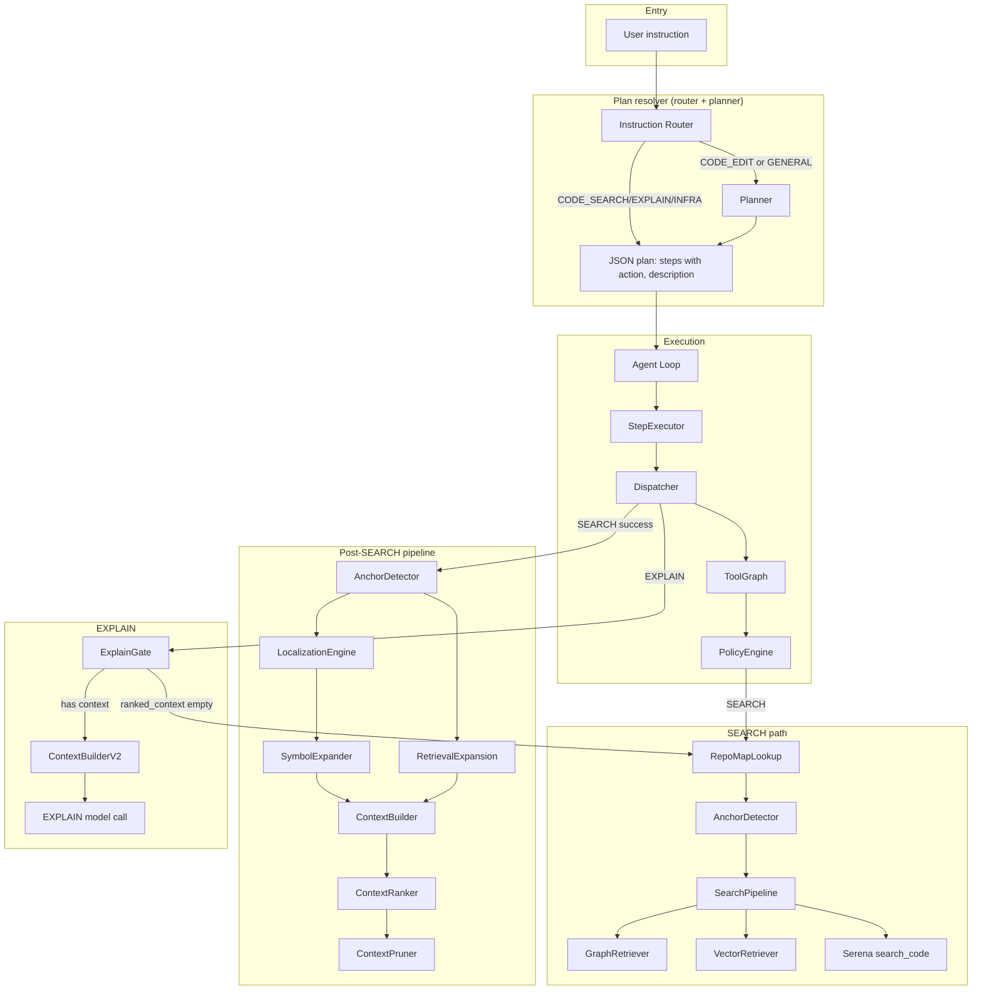

# AutoStudio

[](https://github.com/Pugsy-Explores/AutoCodeStudio)
[](https://github.com/Pugsy-Explores/AutoCodeStudio)
[](https://github.com/Pugsy-Explores/AutoCodeStudio)
[](https://github.com/Pugsy-Explores/AutoCodeStudio/blob/main/LICENSE)
[](https://github.com/Pugsy-Explores/AutoCodeStudio/stargazers)

> **Plan. Search. Edit. Explain.** — A repository-aware autonomous coding agent that turns natural language into structured execution. LLM-powered planning, smart efficient routing, hybrid retrieval, and deterministic tool dispatch.

**A repository-aware autonomous coding agent** that plans, searches, edits, and explains codebases using LLMs and structured tool execution.

AutoStudio converts natural-language instructions into executable plans, runs code search (graph + vector + Serena fallback), ranks context, applies structured patches with conflict resolution, runs tests with repair loops, and persists task memory—all while respecting safety limits, policy-driven retries, and configurable model routing.

---

## Table of Contents

- [Architecture Overview](#architecture-overview)
- [Quick Start](#quick-start)
- [Project Structure](#project-structure)
- [Core Components](#core-components)
- [Execution Pipeline](#execution-pipeline)
- [Agent Controller (Full Pipeline)](#agent-controller-full-pipeline)
- [Configuration](#configuration)
- [Environment Variables](#environment-variables)
- [Tools and Adapters](#tools-and-adapters)
- [Testing](#testing)
- [Subsystems](#subsystems)
- [Repository Symbol Graph](#repository-symbol-graph-implemented)
- [Evaluation](#evaluation)
- [Documentation](#documentation)

---

## Architecture Overview



**ASCII diagram:**

```
    ┌─────────────────────┐
    │  User instruction   │
    └──────────┬──────────┘
               │
               ▼
    ┌──────────────────────────────────────────┐
    │  Plan resolver (router + planner)        │
    │  InstructionRouter ──► Planner ──► Plan  │
    │  CODE_EDIT/GENERAL ──► Planner           │
    │  CODE_SEARCH/EXPLAIN/INFRA ──► Plan      │
    └──────────┬───────────────────────────────┘
               │
               ▼
    ┌──────────────────────────────────────────┐
    │  Execution                                │
    │  Loop ──► Exec ──► Dispatch ──► ToolGraph │
    │                    └──► PolicyEngine      │
    └──────────┬───────────────────────────────┘
               │
       ┌───────┴───────┐
       │               │
       ▼               ▼
┌──────────────┐  ┌─────────────────────────────┐
│ SEARCH path  │  │ Post-SEARCH pipeline         │
│ RepoMapLookup│  │ AnchorDetector ──► Localization│
│ ──► Anchor  │  │ ──► SymbolExp ──► Expand     │
│ ──► Search   │  │ ──► ContextBuilder ──► Ranker ──► Pruner │
│   Pipeline   │  └─────────────────────────────┘
│ ──► Graph/   │  ┌─────────────────────────────┐
│   Vector/    │  │ EXPLAIN path                  │
│   SerenaGrep│  │ ExplainGate ──► ContextBuilderV2
└──────────────┘  │ ──► EXPLAIN model call        │
                  └─────────────────────────────┘
```

**High-level flow:** Instruction → Plan resolver (instruction router by default, else planner) → Plan → Execute steps (SEARCH / EDIT / INFRA / EXPLAIN) → Validate → Optional replan → Return state. SEARCH uses `_search_fn` (RepoMapLookup → SearchPipeline) then `run_retrieval_pipeline` on success. EXPLAIN uses ExplainGate to inject SEARCH when `ranked_context` is empty.

---

## Quick Start

### Prerequisites

- Python 3.10+
- OpenAI-compatible LLM endpoints (e.g. llama.cpp, vLLM, or OpenAI API)
- Optional: [Serena](https://github.com/oraios/serena) MCP server for code search

### Dependencies

```bash
pip install -r requirements.txt
# or
pip install openai>=1.0.0 PyYAML>=6.0 tree-sitter tree-sitter-python
pip install mcp  # optional, for Serena code search
pip install chromadb sentence-transformers  # optional, for vector search and task index
```

Core: `openai`, `PyYAML`, `tree-sitter`, `tree-sitter-python`. Serena adapter requires `mcp`. Vector search and task index require `chromadb` and `sentence-transformers` (graceful fallback when unavailable).

### Run the agent

```bash
# Install CLI (optional): pip install -e .
# Then use autostudio subcommands:
autostudio explain StepExecutor
autostudio edit "add logging to execute_step"
autostudio chat                    # Interactive session (slash-commands: /explain, /fix, /refactor, /add-logging, /find)
autostudio chat --live             # Session with live step visualization
autostudio trace <task_id>         # View trace by task_id
autostudio debug last-run          # Interactive trace viewer for most recent run

# Phase 12 — Developer workflow (issue → task → agent → PR → CI → review)
autostudio issue "Fix retry logic in StepExecutor"   # Full workflow: parse issue → solve → PR → CI → review
autostudio fix "add logging to execute_step"        # Multi-agent solve only (no PR/CI/review)
autostudio pr                                      # Generate PR from last workflow run
autostudio review                                  # Review last patch
autostudio ci                                      # Run CI (pytest, ruff) on project root

# Or run directly without installing:
python -m agent.cli.entrypoint explain StepExecutor
python -m agent.cli.entrypoint chat

# Mode 2 — Autonomous loop (goal-driven; Phase 7/8)
python -c "from agent.autonomous import run_autonomous; run_autonomous('Fix failing test', project_root='.')"
# With self-improving retries (Phase 8): max_retries=3, success_criteria='tests_pass'

# Legacy — standard agent loop (plan → execute steps)
python -m agent "Find where the StepExecutor class is defined"
python -m agent "Explain how StepExecutor works"

# Legacy — single-shot with optional live visualization
python -m agent.cli.run_agent "Explain how the dispatcher routes SEARCH steps" [--live]
```

### Index repository (symbol graph + optional embeddings)

```bash
python -m repo_index.index_repo /path/to/repo
# Creates .symbol_graph/index.sqlite, symbols.json, repo_map.json, and optionally .symbol_graph/embeddings/ (when chromadb + sentence-transformers installed)
# Uses .gitignore to exclude venv, __pycache__, etc. Use --no-gitignore to index everything.
# Use --verbose to log each file indexed.
```

### Model endpoints

Configure `agent/models/models_config.json` or set:

- `SMALL_MODEL_ENDPOINT` — e.g. `http://localhost:8001/v1/chat/completions`
- `REASONING_MODEL_ENDPOINT` — e.g. `http://localhost:8002/v1/chat/completions`

---

## Project Structure

Detailed repository tree. Excludes: `.venv/`, `__pycache__/`, `.agent_memory/`, `reports/`, `.symbol_graph/`, `.cursor/`.

```
AutoStudio/
├── pyproject.toml              # Package config; autostudio CLI entrypoint (Phase 6)
├── mcp.json                     # MCP server config (Serena, etc.)
├── index_repo.py                # Legacy embedding indexer (use repo_index.index_repo)
├── mcp_retriever.py             # Optional ChromaDB retrieval API (legacy)
│
├── config/                      # Centralized configuration (Docs/CONFIGURATION.md)
│   ├── __init__.py
│   ├── agent_config.py         # Agent loop limits: runtime, replan, step timeout, context chars
│   ├── editing_config.py       # Patch and file limits
│   ├── retrieval_config.py     # Retrieval budgets, hybrid flags, cache size
│   ├── router_config.py        # Instruction router (ROUTER_TYPE, ENABLE_INSTRUCTION_ROUTER)
│   ├── tool_graph_config.py    # Tool graph enable/disable
│   ├── repo_graph_config.py    # Symbol graph paths (.symbol_graph/)
│   ├── repo_intelligence_config.py  # Phase 10: repo scan, architecture, impact, context limits
│   ├── observability_config.py # Trace settings
│   ├── logging_config.py       # Log level/format
│   └── config_validator.py     # Startup validation
│
├── agent/                       # Core agent package
│   ├── __init__.py
│   ├── __main__.py             # python -m agent "instruction"
│   ├── agent_loop.py           # Legacy: run_agent entry
│   ├── executor.py             # Legacy executor
│   ├── state.py                # AgentState (legacy alias)
│   ├── step_result.py          # StepResult (legacy alias)
│   ├── test_executor.py        # Test harness
│   │
│   ├── autonomous/             # Mode 2: goal-driven loop (Phase 7/8)
│   │   ├── __init__.py
│   │   ├── agent_loop.py       # run_autonomous(goal, max_retries=3); meta loop: evaluate→critic→retry
│   │   ├── goal_manager.py     # Goal tracking, limit checks; reset_for_retry (Phase 8)
│   │   ├── state_observer.py   # ObservationBundle from repo_map, trace, retrieval
│   │   └── action_selector.py  # Small-model structured action selection (SEARCH/EDIT/EXPLAIN/INFRA)
│   │
│   ├── cli/                    # CLI entry points (Phase 6)
│   │   ├── __init__.py
│   │   ├── __main__.py
│   │   ├── entrypoint.py       # autostudio: explain, edit, trace, chat, debug, issue, fix, pr, review, ci
│   │   ├── run_agent.py        # Single-shot (legacy); --live for step visualization
│   │   ├── session.py          # Interactive chat REPL
│   │   ├── command_parser.py   # Slash-commands: /explain, /fix, /refactor, /add-logging, /find
│   │   └── live_viz.py         # Live trace event listeners
│   │
│   ├── execution/              # Step execution and dispatch
│   │   ├── __init__.py
│   │   ├── executor.py         # StepExecutor (execute_step → dispatch)
│   │   ├── step_dispatcher.py  # Orchestrates: ToolGraph → Router → PolicyEngine; run_retrieval_pipeline
│   │   ├── tool_graph.py       # Allowed tools per node; ENABLE_TOOL_GRAPH
│   │   ├── tool_graph_router.py # resolve_tool (preferred or first allowed)
│   │   ├── policy_engine.py    # Retry + mutation; validate_step_input pre-dispatch (Phase 7)
│   │   ├── explain_gate.py     # Context gate before EXPLAIN (inject SEARCH if empty)
│   │   └── mutation_strategies.py  # Query rewrite, symbol retry, retry_same
│   │
│   ├── intelligence/           # Phase 11: solution memory, task embeddings, experience retrieval
│   │   ├── __init__.py
│   │   ├── solution_memory.py  # Persist successful solutions to .agent_memory/solutions/
│   │   ├── task_embeddings.py  # ChromaDB vector index (.agent_memory/intelligence_index/)
│   │   ├── experience_retriever.py  # Pre-task: similar_solutions, developer_profile, repo_knowledge
│   │   ├── developer_model.py  # developer_profile.json: preferences from accepted solutions
│   │   └── repo_learning.py   # repo_knowledge.json: bug_areas, refactor_patterns, constraints
│   │
│   ├── meta/                   # Reflection layer (Phase 8)
│   │   ├── __init__.py
│   │   ├── evaluator.py        # SUCCESS/FAILURE/PARTIAL from step results
│   │   ├── critic.py           # Diagnose failure (retrieval_miss, bad_plan, bad_patch, etc.)
│   │   ├── retry_planner.py    # Retry hints: rewrite_query, expand_scope, new_plan
│   │   └── trajectory_store.py # Persist attempts under .agent_memory/trajectories/
│   │
│   ├── memory/                 # State, results, task memory, task index
│   │   ├── __init__.py
│   │   ├── state.py            # AgentState
│   │   ├── step_result.py      # StepResult
│   │   ├── task_memory.py      # save_task, load_task, list_tasks
│   │   ├── task_index.py       # Vector index for past tasks (optional)
│   │   └── session_memory.py   # Session: conversation_history, recent_files (Phase 6)
│   │
│   ├── models/                 # Model client and config
│   │   ├── __init__.py
│   │   ├── model_client.py     # LLM call boundary; guardrails (injection + optional output validation)
│   │   ├── model_config.py     # Load models_config.json, env overrides
│   │   ├── model_router.py     # Route task → model (SMALL, REASONING, REASONING_V2)
│   │   ├── model_types.py      # Typed request/response
│   │   └── models_config.json  # Model endpoints, task_models, task_params
│   │
│   ├── observability/          # Trace logging
│   │   ├── __init__.py
│   │   ├── trace_logger.py     # start_trace, log_event, finish_trace; event/stage listeners
│   │   └── ux_metrics.py       # Session metrics: interaction_latency, steps_per_task, patch_success
│   │
│   ├── orchestrator/           # Agent loop, controller, validation
│   │   ├── __init__.py
│   │   ├── agent_loop.py       # run_agent (Mode 1: standard loop; per-step timeout)
│   │   ├── agent_controller.py # run_controller (mode: deterministic/autonomous/multi_agent)
│   │   ├── deterministic_runner.py  # run_deterministic (plan → dispatch loop; Mode 1 source)
│   │   ├── plan_resolver.py    # get_plan: instruction_router or planner.plan()
│   │   ├── replanner.py        # LLM-based replan on failure
│   │   └── validator.py        # validate_step (rules + optional LLM)
│   │
│   ├── prompt_system/          # Phase 13: Prompt infrastructure
│   │   ├── __init__.py
│   │   ├── registry.py         # PromptRegistry.get(), get_instructions(); guardrails at model_client boundary
│   │   ├── loader.py           # Load YAML from prompt_versions or legacy prompts/
│   │   ├── prompt_template.py # PromptTemplate dataclass
│   │   ├── prompt_context_builder.py
│   │   ├── versioning/        # prompt_version_store, prompt_diff, prompt_history, prompt_ab_test
│   │   ├── guardrails/        # injection, output_schema, safety_policy, constraint_checker
│   │   ├── skills/            # planner_skill, patch_generation_skill, etc. (YAML)
│   │   ├── context/           # context_budget_manager, ranker/pruner facades, summarizer
│   │   ├── retry_strategies/  # stricter_prompt, more_context, different_model, critic_feedback
│   │   └── observability/     # prompt_metrics, prompt_usage_logger
│   │
│   ├── prompt_eval/            # Phase 13: Prompt evaluation
│   │   ├── eval_runner.py
│   │   ├── prompt_benchmark.py
│   │   ├── prompt_score.py
│   │   ├── prompt_dataset_loader.py
│   │   └── failure_analysis/  # failure_logger, failure_patterns, failure_cluster
│   │
│   ├── prompts/                # Legacy YAML prompts (compat shim → PromptRegistry)
│   │   ├── __init__.py        # get_prompt() redirects to registry
│   │   ├── README.md
│   │   ├── planner_system.yaml
│   │   ├── replanner_system.yaml
│   │   ├── critic_system.yaml
│   │   ├── retry_planner_system.yaml
│   │   ├── query_rewrite.yaml
│   │   ├── query_rewrite_with_context.yaml
│   │   ├── query_rewrite_system.yaml
│   │   ├── validate_step.yaml
│   │   ├── model_router.yaml
│   │   └── router_logit_system.yaml
│   │
│   ├── repo_intelligence/      # Phase 10: repository-scale intelligence
│   │   ├── __init__.py
│   │   ├── repo_summary_graph.py   # build_repo_summary_graph: modules, entrypoints, key_classes
│   │   ├── architecture_map.py    # build_architecture_map: controllers, services, data_layers
│   │   ├── impact_analyzer.py      # analyze_impact: BFS from edited file to affected files
│   │   ├── context_compressor.py   # compress_context when ranked_context exceeds budget
│   │   └── long_horizon_planner.py # plan_long_horizon: architecture-aware multi-module planning
│   │
│   ├── retrieval/              # Query rewrite, context building, ranking
│   │   ├── __init__.py
│   │   ├── search_pipeline.py      # Hybrid parallel (graph + vector + grep); repo_map anchor
│   │   ├── retrieval_pipeline.py   # anchor → localization → symbol_expander + expand → build_context
│   │   ├── repo_map_lookup.py      # lookup_repo_map: tokenize query → match symbols → anchor
│   │   ├── anchor_detector.py      # detect_anchors (results); detect_anchor (query + repo_map)
│   │   ├── symbol_expander.py      # expand_from_anchors: graph depth=2 → rank → prune
│   │   ├── graph_retriever.py      # Symbol lookup + 2-hop expansion
│   │   ├── vector_retriever.py     # Embedding-based search (ChromaDB)
│   │   ├── retrieval_cache.py     # LRU cache for search results
│   │   ├── retrieval_expander.py   # expand_search_results
│   │   ├── query_rewriter.py
│   │   ├── context_builder.py
│   │   ├── context_builder_v2.py   # assemble_reasoning_context: FILE/SYMBOL/LINES/SNIPPET
│   │   ├── context_ranker.py
│   │   ├── context_pruner.py
│   │   ├── symbol_graph.py         # Symbol graph query wrapper
│   │   └── localization/           # Phase 10.5: graph-guided localization
│   │       ├── __init__.py
│   │       ├── dependency_traversal.py   # BFS over symbol graph (callers, callees)
│   │       ├── execution_path_analyzer.py # Forward/backward call chains
│   │       ├── symbol_ranker.py            # Score by dependency, call graph, name, semantic
│   │       └── localization_engine.py     # Orchestrate stages; prepend to candidates
│   │
│   ├── roles/                  # Phase 9: hierarchical multi-agent
│   │   ├── __init__.py
│   │   ├── base_role_agent.py  # Base class for role agents
│   │   ├── supervisor_agent.py # Orchestrates planner → localization → edit → test → critic
│   │   ├── planner_agent.py
│   │   ├── localization_agent.py
│   │   ├── edit_agent.py
│   │   ├── test_agent.py
│   │   ├── critic_agent.py
│   │   └── workspace.py        # AgentWorkspace: shared state, patches, trace
│   │
│   ├── routing/                # Instruction routing
│   │   ├── __init__.py
│   │   ├── instruction_router.py  # Classify before planner (CODE_EDIT, CODE_SEARCH, etc.)
│   │   └── router_registry.py     # baseline, fewshot, ensemble, final
│   │
│   ├── tools/                  # Tool adapters
│   │   ├── __init__.py
│   │   ├── filesystem_adapter.py   # read_file, write_file, list_files
│   │   ├── terminal_adapter.py     # run_command
│   │   ├── reference_tools.py      # read_symbol_body, find_referencing_symbols
│   │   ├── serena_adapter.py       # Serena MCP: search_code
│   │   └── context7_adapter.py    # Optional doc lookup
│   │
│   └── workflow/               # Phase 12: developer workflow (issue → PR → CI → review)
│       ├── __init__.py
│       ├── workflow_controller.py  # Orchestrate: issue → parse → run_multi_agent → PR → CI → review
│       ├── issue_parser.py         # Parse GitHub/GitLab issues into structured tasks
│       ├── pr_generator.py         # Generate PR title/description from workspace/patches
│       ├── ci_runner.py            # Run pytest, ruff; MAX_CI_RUNTIME_SECONDS
│       ├── code_review_agent.py    # Review patch: style, security, large diffs, missing tests
│       └── developer_feedback.py   # Apply feedback via critic → retry planner → improved patch
│
├── repo_index/                 # Repository indexing (Tree-sitter)
│   ├── __init__.py
│   ├── index_repo.py           # CLI: index_repo (--verbose, --no-gitignore)
│   ├── indexer.py              # scan_repo, index_repo (parallel, .gitignore, optional embeddings)
│   ├── parser.py               # parse_file
│   ├── symbol_extractor.py     # extract_symbols
│   └── dependency_extractor.py # extract_edges
│
├── repo_graph/                 # Symbol graph storage and query
│   ├── __init__.py
│   ├── graph_storage.py        # SQLite nodes/edges
│   ├── graph_builder.py        # build_graph
│   ├── graph_query.py          # find_symbol, expand_neighbors
│   ├── repo_map_builder.py     # build_repo_map, build_repo_map_from_storage
│   ├── repo_map_updater.py     # update_repo_map_for_file (incremental)
│   └── change_detector.py      # Semantic change impact (risk levels)
│
├── editing/                    # Diff planning, conflict resolution, patches
│   ├── __init__.py
│   ├── diff_planner.py         # plan_diff (EDIT step)
│   ├── conflict_resolver.py    # Detect and resolve edit conflicts
│   ├── semantic_diff.py        # AST-aware overlap detection
│   ├── merge_strategies.py     # merge_sequential, merge_three_way
│   ├── patch_generator.py      # to_structured_patches
│   ├── patch_executor.py       # execute_patch (with rollback)
│   ├── patch_validator.py      # validate_patch
│   ├── ast_patcher.py          # AST patching (Tree-sitter)
│   └── test_repair_loop.py     # Run tests, repair on failure
│
├── planner/                    # Instruction → JSON plan
│   ├── __init__.py
│   ├── README.md
│   ├── planner.py             # plan(instruction) → {steps: [{id, action, description, reason}]}
│   ├── planner_prompts.py
│   ├── planner_utils.py
│   ├── planner_dataset.json
│   └── planner_eval.py        # python -m planner.planner_eval
│
├── router_eval/                # Instruction router evaluation
│   ├── __init__.py
│   ├── README.md
│   ├── router_eval.py          # python -m router_eval.router_eval
│   ├── router_eval_v2.py
│   ├── run_all_routers.py      # Run with production router
│   ├── dataset.py
│   ├── dataset_v2.py
│   ├── golden_dataset_v2.json
│   ├── adversarial_dataset_v2.json
│   ├── prompts/
│   ├── routers/                # baseline, fewshot, ensemble, final, etc.
│   └── tests/
│
├── agent/prompt_versions/      # Phase 13: Versioned prompts (planner/v1.yaml, etc.)
│   ├── planner/
│   ├── router/
│   ├── critic/
│   ├── retry_planner/
│   ├── replanner/
│   ├── replanner_user/
│   ├── query_rewrite/
│   ├── query_rewrite_with_context/
│   ├── query_rewrite_system/
│   ├── validate_step/
│   ├── router_logit/
│   ├── instruction_router/
│   ├── explain_system/
│   ├── action_selector/
│   ├── context_ranker_single/
│   └── context_ranker_batch/
│
├── scripts/                    # Evaluation and utilities
│   ├── run_principal_engineer_suite.py  # Phase 3/4: scenarios, failure mining, stress
│   ├── run_capability_eval.py           # Phase 5: dev_tasks.json
│   ├── run_autonomous_eval.py           # Phase 8: autonomous_tasks.json
│   ├── run_multi_agent_eval.py          # Phase 9: multi_agent_tasks.json
│   ├── run_repository_eval.py           # Phase 10: repository_tasks.json
│   ├── run_localization_eval.py         # Phase 10.5: localization_tasks.json
│   ├── run_workflow_eval.py             # Phase 12: workflow_tasks.json
│   ├── run_prompt_ci.py                 # Phase 13: prompt CI (eval + regression)
│   ├── evaluate_agent.py                # Legacy: agent_eval.json
│   ├── replay_trace.py
│   ├── report_bug.py
│   ├── validate_retrieval_pipeline.py
│   └── verify_phase2_exit.py
│
├── Docs/                       # Documentation (see Docs/README.md)
│   ├── README.md
│   ├── AGENT_CONTROLLER.md
│   ├── AGENT_LOOP_WORKFLOW.md
│   ├── CONFIGURATION.md
│   ├── PROMPT_ARCHITECTURE.md
│   ├── prompt_engineering_rules.md  # Phase 13: governance rules
│   ├── ROUTING_ARCHITECTURE_REPORT.md
│   ├── REPOSITORY_SYMBOL_GRAPH.md
│   ├── CODING_AGENT_ARCHITECTURE_GUIDE.md
│   ├── WORKFLOW.md
│   ├── phase.md
│   └── repo_pattern_anti_pattterns.md
│
├── dev/                        # Development workflow
│   ├── bugs/                   # Bug tracking (backlog, in_progress, resolved)
│   │   ├── bug_index.md
│   │   ├── backlog/
│   │   ├── in_progress/
│   │   ├── resolved/
│   │   ├── regression_tests/
│   │   └── templates/
│   ├── evaluation/             # Failure patterns, metrics, test tasks
│   │   ├── failure_cases.md
│   │   ├── failure_patterns.md
│   │   ├── metrics.md
│   │   └── test_tasks.md
│   ├── experiments/            # Experiment notes
│   │   ├── FT_7B_Qwen_Locagent_model.md
│   │   ├── editing_pipeline_tests.md
│   │   ├── planner_improvements.md
│   │   └── retrieval_tuning.md
│   ├── roadmap/                # Phase 1–13 roadmap
│   │   ├── phase_1_pipeline.md
│   │   ├── phase_2_integration.md
│   │   ├── phase_3_scenarios.md
│   │   ├── phase_4_reliability.md
│   │   ├── phase_5_metrics.md
│   │   ├── phase_6_developer_experience.md
│   │   ├── phase_7_reliability_hardening.md
│   │   ├── phase_8_autonomous_mode.md
│   │   ├── phase_9_workflow_integration.md
│   │   ├── phase_10_capability_expansion.md
│   │   ├── phase_10-5_graph_traversal.md
│   │   ├── phase_11_intelligence.md
│   │   ├── phase_12_last_stop.md
│   │   └── phase_13_prompt_framwork.md
│   └── tasks/                  # Task tracking
│       ├── backlog.md
│       ├── in_progress.md
│       └── completed.md
│
└── tests/                      # Test suite
    ├── __init__.py
    ├── conftest.py
    ├── prompt_eval_dataset.json  # Phase 13: prompt benchmark test cases
    ├── agent_scenarios.json   # 40 scenarios (G1–G8)
    ├── dev_tasks.json         # 40 developer tasks (Phase 5)
    ├── autonomous_tasks.json  # 7 tasks (Phase 8)
    ├── multi_agent_tasks.json # 30 tasks (Phase 9)
    ├── repository_tasks.json  # 40 tasks (Phase 10)
    ├── localization_tasks.json # 10 tasks (Phase 10.5)
    ├── workflow_tasks.json    # 8 tasks (Phase 12)
    ├── agent_eval.json        # Legacy
    ├── fixtures/
    ├── test_agent_controller.py
    ├── test_agent_loop.py
    ├── test_agent_e2e.py
    ├── test_agent_robustness.py
    ├── test_agent_trajectory.py
    ├── test_autonomous_meta.py
    ├── test_roles.py
    ├── test_observability.py
    ├── test_explain_gate.py
    ├── test_tool_graph.py
    ├── test_policy_engine.py
    ├── test_retrieval_pipeline.py
    ├── test_graph_retriever.py
    ├── test_context_ranker.py
    ├── test_context_builder_v2.py
    ├── test_symbol_expansion.py
    ├── test_agent_*.py
    ├── test_*.py
    └── ...
```

---

## Core Components

| Component | Role |
|-----------|------|
| **run_agent** | Entry point: plan → state → execute loop → validate → replan until finished |
| **plan(instruction)** | Planner: LLM + JSON parse → `{steps: [{id, action, description, reason}]}` |
| **StepExecutor** | Calls `dispatch(step, state)`; wraps result in `StepResult` (includes `files_modified`, `patch_size` for EDIT steps) |
| **dispatch** | Routes by action to PolicyEngine (SEARCH/EDIT/INFRA) or EXPLAIN; pre-dispatch validate_step_input (Phase 7) |
| **ToolGraph** | Per-node `allowed_tools` and `preferred_tool`; restricts transitions |
| **ExecutionPolicyEngine** | Retry loop with mutation; injects search_fn, edit_fn, infra_fn, rewrite_query_fn; validate_step_input pre-dispatch |
| **validate_step** | Rule-based or LLM YES/NO; EXPLAIN with empty-context output → invalid (triggers replanner); fallback to rules on error |
| **replan** | LLM-based: receives failed_step, error; produces revised plan; fallback to remaining steps |
| **instruction_router** | Classifies before planner (default: enabled); uses ROUTER_TYPE or inline SMALL model |

---

## Execution Pipeline

### Step actions

| Action | Policy | Retry condition | Mutation |
|--------|--------|-----------------|----------|
| SEARCH | 5 attempts | empty_results | query_variants (rewrite + attempt_history) |
| EDIT | 2 attempts | symbol_not_found | symbol_retry |
| INFRA | 2 attempts | non_zero_exit | retry_same |
| EXPLAIN | 1 attempt | — | — |

### SEARCH pipeline

Dispatcher orchestrates only: after SEARCH success it calls `run_retrieval_pipeline(results, state, query)`. The pipeline encapsulates:

```
SEARCH
  → policy_engine.search()
      → _search_fn: repo_map_lookup(query) + detect_anchor(query, repo_map) → state.context[repo_map_anchor, repo_map_candidates]
      → retrieval_cache.get_cached() [if RETRIEVAL_CACHE_SIZE > 0]
      → hybrid_retrieve() [when ENABLE_HYBRID_RETRIEVAL=1]
          → graph uses repo_map_anchor when confidence ≥ 0.9
          → parallel: graph_retriever + vector_retriever + search_code (grep)
          → merge_results() → top 20 candidates
      → else: sequential fallback (graph → vector → grep)
      → retrieval_cache.set_cached() on success
  → run_retrieval_pipeline(results, state, query)
      → anchor_detector.detect_anchors()  # filter to symbol/class/def matches; fallback top N
      → localization_engine.localize_issue() [Phase 10.5: when ENABLE_LOCALIZATION_ENGINE; dependency traversal → execution paths → symbol ranking → prepend to candidates]
      → symbol_expander.expand_from_anchors() [when graph exists; anchor → expand depth=2 → fetch bodies → rank → prune to 6]
      → retrieval_expander.expand_search_results() [capped at MAX_SYMBOL_EXPANSION]
      → read_symbol_body / read_file → find_referencing_symbols
      → context_builder.build_context_from_symbols()
      → context_ranker.rank_context() [when ENABLE_CONTEXT_RANKING=1]
      → context_pruner.prune_context() [max 6 snippets, 8000 chars]
      → context_compressor.compress_context() [Phase 10: when repo_summary present; summaries if over budget]
  → state.context["ranked_context"], context_snippets (list of {file, symbol, snippet})
```

- **Hybrid retrieval (default):** Runs graph, vector, grep in parallel; merges and dedupes; returns top 20. Improves recall (semantics + exact matches). Set `ENABLE_HYBRID_RETRIEVAL=0` for sequential fallback.
- **Retrieval budgets:** MAX_SEARCH_RESULTS=20, MAX_SYMBOL_EXPANSION=10, MAX_CONTEXT_SNIPPETS=6.
- **Query rewrite:** `rewrite_query_with_context(planner_step, user_request, attempt_history, state)` — LLM returns `{tool, query, reason}`; wires `chosen_tool`; prompts prefer high recall, regex-style patterns.
- **Symbol expander:** When graph index exists, `expand_from_anchors()` expands anchor symbols via `expand_neighbors(depth=2)`, fetches bodies, ranks, prunes to top 6 (max 15 symbols).
- **Context builder:** Deduplicates symbols, references, files; limits total chars. `context_builder_v2` formats ranked context for reasoning (FILE/SYMBOL/LINES/SNIPPET).
- **Context ranker:** Hybrid score = 0.6×LLM + 0.2×symbol_match + 0.1×filename_match + 0.1×reference_score − same_file_penalty; batch LLM; caps at 20 candidates.
- **Context pruner:** Max 6 snippets, 8000 chars; deduplicate by (file, symbol).

### EDIT pipeline (inside dispatcher `_edit_fn`)

All EDIT execution goes through `dispatch(step, state)`. The dispatcher's `_edit_fn` runs:

```
EDIT (via dispatch)
  → diff_planner.plan_diff(instruction, context)
  → conflict_resolver.resolve_conflicts() — same symbol, same file, semantic overlap
  → patch_generator.to_structured_patches()
  → test_repair_loop.run_with_repair() — execute_patch + run tests + repair on failure
      → ast_patcher.apply_patch() — Tree-sitter AST edits (insert/replace/delete)
      → patch_validator.validate_patch() — compile + AST reparse
      → write on success; rollback on failure
  → repo_index.update_index_for_file() on success
  → repo_graph.update_repo_map_for_file() on success (incremental repo_map refresh)
```

- **Diff planner:** Identifies affected symbols, queries graph for callers.
- **Conflict resolver:** Splits conflicting edits into sequential groups.
- **Patch generator:** Converts plan to structured patches (symbol, action, target_node, code).
- **AST patcher:** Symbol-level (function_body_start, function_body, class_body) and statement-level edits; preserves relative indentation.
- **Patch validator:** Ensures code compiles and AST reparse succeeds before write.
- **Patch executor:** Applies validated patches; max 5 files, 200 lines per patch; rollback on invalid syntax, validation failure, or apply error.

### EXPLAIN

- **Context gate:** Before calling the model, `ensure_context_before_explain()` checks `ranked_context`. If empty, injects SEARCH (calls `_search_fn` with step description) and runs `run_retrieval_pipeline()`. Avoids wasted LLM calls when no context.
- **Anchored context format:** `context_builder_v2.assemble_reasoning_context()` emits FILE/SYMBOL/LINES/SNIPPET blocks (~8000 char budget); deduplicates by (file, symbol).
- Uses `ranked_context` as primary evidence; else falls back to `search_memory` and `context_snippets`.
- Model from `task_models["EXPLAIN"]` (default: REASONING_V2).
- Empty output → `"[EXPLAIN: no model output]"`.

---

## Agent Controller (Full Pipeline)

`run_controller(instruction, project_root, mode="deterministic")` orchestrates the complete development workflow. All tool execution goes through `dispatch(step, state)`. Mode routing: `deterministic` (default), `autonomous`, or `multi_agent`.

```
instruction
  → [if mode != deterministic] route to run_autonomous or run_multi_agent
  → build_repo_map() — high-level architectural map
  → search_similar_tasks() — vector index of past tasks (optional)
  → run_deterministic(instruction, project_root)
       → get_plan() — instruction router (default) or planner.plan()
       → while task_not_complete:
            step = next_step()
            result = dispatch(step, state)   # ALL steps via dispatch (SEARCH, EDIT, INFRA, EXPLAIN)
            validate step; if failure: replan
  → save_task() — persist to .agent_memory/tasks/
  → return task summary
```

**EDIT pipeline (inside dispatcher):** When action is EDIT, `_edit_fn` runs plan_diff → resolve_conflicts → to_structured_patches → run_with_repair → update_index.

**Safety limits:** max 5 files edited, 200 lines per patch. Task runtime: agent_loop 60s (Phase 4); agent_controller 15 min (configurable via `MAX_TASK_RUNTIME_SECONDS`). **Phase 7 reliability:** per-step timeout (`MAX_STEP_TIMEOUT_SECONDS`), pre-dispatch tool validation (`validate_step_input`), context guardrail (`MAX_CONTEXT_CHARS`). **Mode 2 (autonomous):** `run_autonomous(goal, max_retries=3)` — goal-driven loop with observe → select → dispatch; when max_retries>1, wraps with evaluator → critic → retry_planner meta loop (Phase 8); reuses dispatcher, retrieval, editing pipeline; limits: max_steps, max_tool_calls, max_runtime, max_edits. **Phase 9 (multi-agent):** `run_multi_agent(goal, project_root)` — supervisor → planner → localization → edit → test → critic (on failure); same infrastructure; limits: max_agent_steps=30, max_patch_attempts=3, max_runtime=120s, max_file_edits=10. **Phase 10 (repo intelligence):** Before planner, supervisor builds repo_summary_graph and architecture_map; planner uses plan_long_horizon when architecture_map present; after edit, impact_analyzer predicts affected files; retrieval pipeline optionally compresses context when repo_summary present; limits: max_repo_scan_files=200, max_architecture_nodes=500, max_context_tokens=8192, max_impact_depth=3. **Phase 11 (intelligence layer):** Before each autonomous run, experience_retriever fetches similar past solutions (task_embeddings), developer_profile, and repo_knowledge; injects experience_hints into state.context for planner adaptation; on success, stores solution to solution_memory, task_embeddings, repo_learning, developer_model. **Phase 12 (developer workflow):** `agent/workflow/` — issue_parser (GitHub/GitLab issues → structured tasks), pr_generator (workspace/patches → PR title/description), ci_runner (pytest, ruff; MAX_CI_RUNTIME_SECONDS), code_review_agent (style, security, large diffs, missing tests), developer_feedback (critic → retry planner → improved patch), workflow_controller (orchestrate full flow); CLI: `autostudio issue`, `autostudio fix`, `autostudio pr`, `autostudio review`, `autostudio ci`; safety: MAX_FILES_PER_PR=10, MAX_PATCH_LINES=500.

**Failure handling:** On step failure or validation failure, the agent replans. agent_loop: up to 3 replans, 2 step retries before replan; agent_controller: up to 5 replans (configurable). SEARCH exhausts fallback chain (retrieve_graph → retrieve_vector → retrieve_grep → file_search) and retries with rewritten queries. EDIT failures trigger rollback before any files are written; patch validator ensures syntax and AST integrity.

**Test repair loop:** After patch execution, runs tests (pytest); on failure, plans repair and retries (max 3 attempts). Supports flaky test detection and compile step before tests.

**Trace logging:** Events stored in `.agent_memory/traces/`. Each trace includes plan, tool calls (step_executed with chosen tool), patch results, errors, and task_complete summary. See `agent/observability/trace_logger.py`.

---

## Configuration

All configuration values are centralized under `config/`. See [Docs/CONFIGURATION.md](Docs/CONFIGURATION.md) for the full reference, including environment variable overrides and validation rules.

### models_config.json

```json
{
  "models": {
    "SMALL": { "name": "Qwen 2B", "endpoint": "http://localhost:8001/v1/chat/completions" },
    "REASONING": { "name": "Qwen 9B", "endpoint": "http://localhost:8002/v1/chat/completions" },
    "REASONING_V2": { "name": "Qwen 14B", "endpoint": "http://localhost:8003/v1/chat/completions" }
  },
    "task_models": {
    "experience_retrieval": "SMALL",
    "action_selection": "SMALL",
    "evaluation": "SMALL",
    "critique": "SMALL",
    "retry_planning": "REASONING",
    "query rewriting": "REASONING",
    "validation": "REASONING",
    "EXPLAIN": "REASONING_V2",
    "EDIT": "REASONING_V2",
    "routing": "REASONING",
    "planner": "REASONING_V2",
    "context_ranking": "REASONING_V2"
  },
  "task_params": {
    "EXPLAIN": { "temperature": 0.0, "max_tokens": null, "request_timeout_seconds": 600 },
    "planner": { "temperature": 0.0, "max_tokens": 1024, "request_timeout_seconds": 600 },
    "context_ranking": { "temperature": 0.0, "max_tokens": 256, "request_timeout_seconds": 60 }
  }
}
```

- **models:** Maps model key (SMALL, REASONING, REASONING_V2) → name and endpoint
- **task_models:** Maps task name → model key (new features use REASONING_V2)
- **task_params:** Per-task temperature, max_tokens, timeout

---

## Environment Variables

All config values support env overrides. See [Docs/CONFIGURATION.md](Docs/CONFIGURATION.md) for the complete list.

| Variable | Purpose |
|----------|---------|
| `ENABLE_INSTRUCTION_ROUTER` | 1 (default) or 0 — route instruction before planner; CODE_SEARCH/CODE_EXPLAIN/INFRA skip planner |
| `ROUTER_TYPE` | baseline, fewshot, ensemble, or final — use router from registry when instruction router enabled |
| `SMALL_MODEL_ENDPOINT` | Override small model URL |
| `REASONING_MODEL_ENDPOINT` | Override reasoning model URL |
| `MODEL_API_KEY` | API key for model endpoints |
| `MODEL_TEMPERATURE` | Default temperature |
| `MODEL_MAX_TOKENS` | Default max tokens |
| `MODEL_REQUEST_TIMEOUT` | Default request timeout (seconds) |
| `REASONING_V2_MODEL_ENDPOINT` | Override REASONING_V2 endpoint |
| `ENABLE_TOOL_GRAPH` | 1 (default) or 0 — restrict tools by graph |
| `ENABLE_CONTEXT_RANKING` | 1 (default) or 0 — rank and prune context before EXPLAIN |
| `ENABLE_VECTOR_SEARCH` | 1 (default) or 0 — use embedding search when graph returns nothing |
| `ENABLE_HYBRID_RETRIEVAL` | 1 (default) or 0 — run graph, vector, grep in parallel; 0 = sequential fallback |
| `RETRIEVAL_CACHE_SIZE` | LRU cache size for search results (default 100); 0 to disable. Read at runtime from env. |
| `INDEX_EMBEDDINGS` | 1 (default) or 0 — build ChromaDB embedding index during index_repo |
| `INDEX_PARALLEL_WORKERS` | Parallel file parsing workers (default 8) |
| `SERENA_PROJECT_DIR` | Project root for Serena MCP |
| `SERENA_USE_PLACEHOLDER` | 1 to disable Serena (return empty results) |
| `SERENA_GREP_FALLBACK` | 1 (default) or 0 — use ripgrep when Serena MCP unavailable |
| `SERENA_VERBOSE` | 1 for Serena debug logs |
| `MAX_STEP_TIMEOUT_SECONDS` | Per-step timeout (default 15); prevents single slow tool from consuming full task budget |
| `MAX_CONTEXT_CHARS` | Hard cap on context before LLM reasoning call (default 32000); truncation logs `context_guardrail_triggered` |
| `PLANNER_MAX_TOKENS` | Max tokens for planner (default 1024) |
| `ENABLE_DIFF_PLANNER` | 1 (default) or 0 — EDIT returns planned changes vs read_file |
| `TEST_REPAIR_ENABLED` | 1 (default) or 0 — run tests after patch; 0 = patch only |
| `COMPILE_BEFORE_TEST` | 1 (default) or 0 — run py_compile before tests |
| `MAX_REPO_SCAN_FILES` | Phase 10: cap repo scan (default 200) |
| `MAX_ARCHITECTURE_NODES` | Phase 10: cap architecture map (default 500) |
| `MAX_CONTEXT_TOKENS` | Phase 10: context budget for compressor (default 8192) |
| `MAX_IMPACT_DEPTH` | Phase 10: BFS depth for impact analyzer (default 3) |
| `ENABLE_LOCALIZATION_ENGINE` | Phase 10.5: 1 (default) or 0 — graph-guided localization (dependency traversal, execution paths, symbol ranking) |
| `MAX_GRAPH_DEPTH` | Phase 10.5: dependency traversal depth (default 3) |
| `MAX_DEPENDENCY_NODES` | Phase 10.5: cap on graph nodes (default 100) |
| `MAX_EXECUTION_PATHS` | Phase 10.5: cap on execution path chains (default 10) |
| `MAX_FILES_PER_PR` | Phase 12: max files per PR (default 10) |
| `MAX_PATCH_LINES` | Phase 12: max patch lines (default 500) |
| `MAX_CI_RUNTIME_SECONDS` | Phase 12: CI timeout in seconds (default 600) |
| `MAX_PROMPT_TOKENS` | Phase 14: hard cap on total prompt tokens (default 12000) |
| `OUTPUT_TOKEN_RESERVE` | Phase 14: tokens reserved for model output (default 2000) |
| `MAX_REPO_SNIPPETS` | Phase 14: max ranked code snippets (default 10) |
| `MAX_HISTORY_TOKENS` | Phase 14: token budget for history (default 2000) |
| `MAX_REPO_CONTEXT_TOKENS` | Phase 14: threshold for conditional compression (default 7200) |
| `MAX_RETRIEVAL_RESULTS` | Phase 14: max candidates from retrieval to ranker (default 20) |
| `HISTORY_WINDOW_TURNS` | Phase 14: last N turns kept raw (default 10) |
| `HISTORY_SUMMARY_TURNS` | Phase 14: older turns summarized (default 30) |

---

## Tools and Adapters

| Tool | Adapter | Purpose |
|------|---------|---------|
| `retrieve_symbol_context` | graph_retriever | Graph-based symbol lookup + 2-hop expansion (when index exists) |
| `search_by_embedding` | vector_retriever | Semantic code search via ChromaDB (when graph returns nothing) |
| `search_code` | serena_adapter | Serena MCP: find_symbol, search_for_pattern (fallback) |
| `read_file` | filesystem_adapter | Read file contents |
| `write_file` | filesystem_adapter | Write file contents |
| `list_files` | filesystem_adapter | List directory |
| `find_referencing_symbols` | reference_tools | Stub; wire to Serena when available |
| `read_symbol_body` | reference_tools | Read symbol body (or file window) |
| `run_command` | terminal_adapter | Execute shell command |
| `lookup_docs` | context7_adapter | Optional doc lookup |

**Serena MCP:** Requires `mcp` package and Serena installed (e.g. `uvx serena start-mcp-server`). When unavailable, `search_code` falls back to ripgrep (unless `SERENA_GREP_FALLBACK=0`). Query rewrite prompts (`query_rewrite.yaml`, `query_rewrite_with_context.yaml`) encode Serena rules (find_symbol name_path, search_for_pattern regex) and filesystem rules (list_dir paths within project).

**Repository indexing:** Build a symbol graph for instant graph-based retrieval:

```bash
python -m repo_index.index_repo /path/to/repo          # default: respects .gitignore
python -m repo_index.index_repo /path/to/repo -v      # verbose: log each file indexed
python -m repo_index.index_repo /path/to/repo --no-gitignore  # index everything (including venv, __pycache__)
```

Creates `.symbol_graph/index.sqlite`, `symbols.json`, and `repo_map.json`. By default, paths matching `.gitignore` (e.g. `venv/`, `.venv/`, `__pycache__/`) are excluded. SEARCH uses repo_map lookup and anchor detection before graph retrieval when index exists. Programmatic use supports `include_dirs`, `ignore_gitignore`, and `verbose` (e.g. `index_repo(path, include_dirs=("agent", "editing"), verbose=True)`).

---

## Testing

```bash
# From workspace root (parent of AutoStudio)
python -m pytest AutoStudio/tests/ -v

# End-to-end agent pipeline (mocked LLM, deterministic)
python -m pytest AutoStudio/tests/test_agent_e2e.py -v

# Specific suites
python -m pytest AutoStudio/tests/test_agent_loop.py -v      # Execution loop, planner→executor→results; ExplainGate
python -m pytest AutoStudio/tests/test_developer_workflow.py -v  # Phase 6: session memory, slash-commands, multi-turn
python -m pytest AutoStudio/tests/test_context_ranker.py -v
python -m pytest AutoStudio/tests/test_explain_gate.py -v   # Context gate: ensure_context_before_explain
python -m pytest AutoStudio/tests/test_tool_graph.py -v      # Step→tool mapping (SEARCH→retrieve_graph, etc.)
python -m pytest AutoStudio/tests/test_policy_engine.py -v
python -m pytest AutoStudio/tests/test_autonomous_meta.py -v  # Phase 8: evaluator, critic, retry_planner, trajectory_store
python -m pytest AutoStudio/tests/test_roles.py -v           # Phase 9: planner, localization, edit, test, critic agents
python scripts/run_repository_eval.py --mock --limit 2       # Phase 10: repository eval (mock)
python -m pytest AutoStudio/tests/test_agent_robustness.py -v  # failure scenarios, replan, fallback, no corruption
python -m pytest AutoStudio/tests/test_agent_trajectory.py -v --mock  # complex trajectories: multi-search, conflict resolver, repair loop

# Phase 3 scenario evaluation (40 tasks via run_controller; output: reports/eval_report.json)
python scripts/run_principal_engineer_suite.py --scenarios

# Phase 5 capability eval (dev_tasks.json; output: reports/eval_report.json)
python scripts/run_capability_eval.py --mock       # CI: no agent calls
python scripts/run_capability_eval.py --limit 5   # Quick smoke test
python -m pytest AutoStudio/tests/test_observability.py -v  # trace creation, plan, tool calls, errors, patch results
python -m pytest AutoStudio/tests/test_multifile_edits.py -v  # Multi-file patch pipeline (two-file, three-file, rollback)
python -m pytest AutoStudio/tests/test_indexer.py AutoStudio/tests/test_symbol_graph.py AutoStudio/tests/test_repo_map.py -v  # repo index + graph + repo map
INDEX_EMBEDDINGS=0 python -m pytest AutoStudio/tests/test_retrieval_pipeline.py AutoStudio/tests/test_graph_retriever.py -v  # retrieval pipeline
python -m pytest AutoStudio/tests/test_symbol_expansion.py AutoStudio/tests/test_context_builder_v2.py -v  # symbol expander, context builder v2

# Repo index/graph with debug logging (when failures occur)
INDEX_EMBEDDINGS=0 python -m pytest AutoStudio/tests/test_indexer.py AutoStudio/tests/test_symbol_graph.py -v --log-cli-level=DEBUG
```

**E2E tests** (`test_agent_e2e.py`): default tries real LLM; if unreachable, warns and falls back to mock. Use `--mock` to force mock mode and skip the probe.

```bash
python -m pytest tests/test_agent_e2e.py -v          # default: try LLM, fallback to mock
python -m pytest tests/test_agent_e2e.py -v --mock  # always use mock (fast, deterministic)
```

| Scenario | Flow | Assertions |
|----------|------|------------|
| Explain code | plan → search → retrieval → explain | No errors, task memory saved |
| Code edit | plan → search → diff planner → patch → index update | Patches applied, index updated, task memory saved |
| Multi-file change | conflict resolver → sequential patch groups | Patches applied to all files, task memory saved |

Tests mock LLM calls where appropriate (e.g. `test_context_ranker.py` mocks `call_reasoning_model`). See [Docs/REPOSITORY_SYMBOL_GRAPH.md](Docs/REPOSITORY_SYMBOL_GRAPH.md#testing-and-validation) for indexing validation details.

**Agent trajectory** (`test_agent_trajectory.py`): Complex-task tests for long agent runs (task: "Add logging to all executor classes"):

| Scenario | Verification |
|----------|--------------|
| Multiple search steps | ≥2 SEARCH steps hit retriever (use `RETRIEVAL_CACHE_SIZE=0`) |
| Conflict resolver | Invoked when multiple edits target same file |
| Repair loop | `run_with_repair` invoked when `TEST_REPAIR_ENABLED=1` |
| No infinite loop | Stops after MAX_REPLAN_ATTEMPTS (agent_loop: 3; agent_controller: 5) on repeated failure |
| Runtime | agent_loop: 60s; agent_controller: 15 min (configurable) |

**Agent robustness** (`test_agent_robustness.py`): Failure-scenario tests ensure the agent replans, triggers fallback search, and avoids repository corruption:

| Scenario | Expected behavior |
|----------|-------------------|
| Nonexistent symbol search | Policy retries with rewritten query; falls back to vector → Serena; returns failure with `attempt_history` when exhausted |
| Invalid edit instruction | Patch validator rejects; rollback restores files; no corruption |
| Patch validator failure | Rollback restores all modified files |
| Graph lookup empty | Fallback to vector search, then Serena, then file_search (Phase 4) |
| Search exception | Caught by policy engine; no unhandled crash |

---

## Subsystems

### Planner

- Converts instruction → JSON plan with steps `{id, action, description, reason}`
- Actions: EDIT, SEARCH, EXPLAIN, INFRA
- Evaluation: `python -m planner.planner_eval`

### Prompt System (Phase 13 + Phase 14)

- **PromptRegistry**: Central registry for all prompts; `get_registry().get(name)`, `get_instructions(name, variables=...)`, `get_guarded(name, user_input=...)`, `validate_response(name, response, user_input)`, `compose(prompt, skill, repo_context)`
- **Phase 14 — Token Budgeting & Context Control**: `agent/prompt_system/context/` — enforces prompt size bounds via ranked context pruning, conditional compression (only when `repo_context_tokens > MAX_REPO_CONTEXT_TOKENS`), sliding conversation window (last N raw + summarized older), dynamic budget allocation per section, and emergency hard truncation as a last-resort safety guard. Use `build_context_budgeted()` for full pipeline.
- **Versioning**: Prompts in `agent/prompt_versions/{name}/v1.yaml`; `get_prompt(name, version="latest")`, `compare_prompts(name, v1, v2)`, `run_ab_test(name, variant_a, variant_b, run_fn)` for A/B testing
- **Guardrails**: Injection detection (pre-load via `get_guarded`), output schema validation, safety policy, constraint checker (post-response via `validate_response`)
- **Skills**: Modular YAML skills (planner_skill, patch_generation_skill, etc.); compose with prompts
- **Evaluation**: `tests/prompt_eval_dataset.json` (100 cases: navigation, planning, editing, refactoring, test-fixing, repo-reasoning), `scripts/run_prompt_ci.py` (regression detection, `--prompt NAME` for specific prompt)
- **Observability**: `PromptUsageMetric` with `prompt_usage`, `avg_latency_ms`, `token_usage`; `generate_report()` from trace data
- **Failure logging**: `agent/prompt_eval/failure_analysis/` — log failures to `dev/failure_logs/`
- **Retry strategies**: Stricter prompt, more context, different model, critic feedback
- **Governance**: Rules 6 (eval coverage per prompt), 7 (context budget); see [Docs/prompt_engineering_rules.md](Docs/prompt_engineering_rules.md)
- See [Docs/PROMPT_ARCHITECTURE.md](Docs/PROMPT_ARCHITECTURE.md) and [Docs/prompt_engineering_rules.md](Docs/prompt_engineering_rules.md)

### Router Eval

- Phased router evaluation harness; categories: EDIT, SEARCH, EXPLAIN, INFRA, GENERAL
- Swap routers by changing import in `router_eval.py`
- Run: `python -m router_eval.router_eval`
- Production integration: set `ROUTER_TYPE=baseline|fewshot|ensemble|final` to use router_eval routers in production
- Run with production router: `python -m router_eval.run_all_routers --production`

### Optional: ChromaDB and embeddings

- **Vector search:** `agent/retrieval/vector_retriever.py` — semantic search when graph returns nothing. Index built by `repo_index.index_repo` when `INDEX_EMBEDDINGS=1` (requires `chromadb`, `sentence-transformers`).
- **Task index:** `agent/memory/task_index.py` — vector index of past tasks for `search_similar_tasks` (`.agent_memory/task_index/`).
- **Intelligence layer (Phase 11):** `agent/intelligence/` — solution memory (`.agent_memory/solutions/`), task embeddings (`.agent_memory/intelligence_index/`), developer profile (`.agent_memory/developer_profile.json`), repo knowledge (`.agent_memory/repo_knowledge.json`).
- **Legacy:** `index_repo.py`, `mcp_retriever.py` — standalone embedding indexer and FastAPI endpoint.

---

## Repository Symbol Graph (Implemented)

AutoStudio includes **repository structure awareness**:

- **Indexing:** `repo_index` — Tree-sitter parser, parallel file parsing, symbol extraction, dependency edges; optional embedding index
- **Graph:** `repo_graph` — SQLite storage, 2-hop expansion
- **Repo map:** `repo_graph/repo_map_builder` — spec format `{modules, symbols, calls}`; `build_repo_map_from_storage`; `repo_map.json`
- **Repo map lookup:** `agent/retrieval/repo_map_lookup` — `lookup_repo_map(query)` → anchor candidates; `load_repo_map()`
- **Anchor detection:** `detect_anchor(query, repo_map)` — exact/fuzzy symbol match → `{symbol, confidence}`; seeds graph retrieval
- **Incremental updates:** `repo_graph/repo_map_updater` — `update_repo_map_for_file()` after `update_index_for_file`
- **Change detector:** `repo_graph/change_detector` — affected callers, risk levels (LOW/MEDIUM/HIGH)
- **Retrieval:** repo_map lookup → anchor → graph_retriever (when anchor confidence ≥ 0.9) → vector_retriever → Serena fallback
- **Diff planning:** `editing/diff_planner` — planned changes with affected symbols and callers
- **Conflict resolution:** `editing/conflict_resolver` — same symbol, same file, semantic overlap
- **Test repair:** `editing/test_repair_loop` — run tests, repair on failure, flaky detection, compile step

See [Docs/REPOSITORY_SYMBOL_GRAPH.md](Docs/REPOSITORY_SYMBOL_GRAPH.md) for details.

### Repository Intelligence (Phase 10)

When using `run_multi_agent`, the supervisor builds a **repository intelligence layer** before planning:

- **repo_summary_graph** — High-level map: modules, entrypoints, key classes, dependency edges (capped at `MAX_REPO_SCAN_FILES`)
- **architecture_map** — Classifies modules into controllers, services, data_layers, utilities (heuristics + small model for ambiguous)
- **long_horizon_planner** — Prepends architecture context to the goal; delegates to `planner.plan()` for multi-module planning
- **impact_analyzer** — After each edit, BFS from edited file to predict affected files/symbols (depth `MAX_IMPACT_DEPTH`)
- **context_compressor** — When `ranked_context` exceeds `MAX_CONTEXT_TOKENS`, replaces snippets with summaries

Config: `config/repo_intelligence_config.py`. See [dev/roadmap/phase_10_capability_expansion.md](dev/roadmap/phase_10_capability_expansion.md).

### Intelligence Layer (Phase 11)

The autonomous loop includes an **intelligence layer** that learns from successful runs and adapts planning:

- **solution_memory** — Persists successful solutions to `.agent_memory/solutions/<task_id>.json` (goal, files_modified, patch_summary)
- **task_embeddings** — ChromaDB vector index of solution patterns in `.agent_memory/intelligence_index/` for semantic search
- **experience_retriever** — Before each task: retrieves similar solutions, developer_profile, repo_knowledge; returns ExperienceHints (similar_solutions, suggested_files) injected into `state.context["experience_hints"]`
- **developer_model** — `.agent_memory/developer_profile.json`: preferred_test_framework, logging_style, code_style, observed_patterns
- **repo_learning** — `.agent_memory/repo_knowledge.json`: frequent_bug_areas, common_refactor_patterns, architecture_constraints

On success, the agent stores the solution and updates developer_model and repo_learning. See [dev/roadmap/phase_11_intelligence.md](dev/roadmap/phase_11_intelligence.md).

### Graph-Guided Localization (Phase 10.5)

The retrieval pipeline includes a **localization layer** that performs structural repository navigation before vector search:

- **dependency_traversal** — BFS over symbol graph (callers, callees, imports) from anchor; returns candidate symbols with hop distance
- **execution_path_analyzer** — Reconstructs forward/backward call chains from anchor
- **symbol_ranker** — Scores candidates by dependency distance (0.4), call graph relevance (0.25), name similarity (0.2), semantic similarity (0.15)
- **localization_engine** — Orchestrates stages; prepends ranked candidates to context pool

Config: `ENABLE_LOCALIZATION_ENGINE`, `MAX_GRAPH_DEPTH`, `MAX_DEPENDENCY_NODES`, `MAX_EXECUTION_PATHS`. See [dev/roadmap/phase_10-5_graph_traversal.md](dev/roadmap/phase_10-5_graph_traversal.md).

### Developer Workflow (Phase 12)

The **workflow layer** (`agent/workflow/`) turns AutoStudio into a developer teammate operating inside the real software development loop: issue → agent solution → PR → CI → review → merge.

- **issue_parser** — Converts GitHub/GitLab issue text into structured tasks (type, module, symbol, priority)
- **pr_generator** — Generates PR title and description from workspace, patches, and test results
- **ci_runner** — Runs pytest and ruff with `MAX_CI_RUNTIME_SECONDS` (600s) timeout
- **code_review_agent** — Reviews patches for style violations, security risks, large diffs (> `MAX_PATCH_LINES`), missing tests
- **developer_feedback** — Applies human feedback via critic → retry planner → improved patch
- **workflow_controller** — Orchestrates full flow: issue → parse → run_multi_agent → PR → CI → review

**CLI commands:** `autostudio issue <text>`, `autostudio fix <instruction>`, `autostudio pr`, `autostudio review`, `autostudio ci`. Last workflow result persisted to `.agent_memory/last_workflow.json` for `pr` and `review` commands.

**Safety limits:** `MAX_FILES_PER_PR=10`, `MAX_PATCH_LINES=500`, `MAX_CI_RUNTIME_SECONDS=600`. See [dev/roadmap/phase_12_last_stop.md](dev/roadmap/phase_12_last_stop.md).

---

## Documentation

| Doc | Description |
|-----|--------------|
| [Docs/PROMPT_ARCHITECTURE.md](Docs/PROMPT_ARCHITECTURE.md) | Prompt layer: PromptRegistry, versioning, all prompts, pipeline position, design philosophy, safety risks, testing |
| [Docs/prompt_engineering_rules.md](Docs/prompt_engineering_rules.md) | Phase 13: governance rules (1 prompt = 1 capability, versioning, evaluation, failure logging, Rules 6–7, guardrails, A/B testing) |
| [Docs/CONFIGURATION.md](Docs/CONFIGURATION.md) | Centralized config: all modules, env overrides, validation |
| [Docs/AGENT_LOOP_WORKFLOW.md](Docs/AGENT_LOOP_WORKFLOW.md) | Step dispatch, SEARCH/EDIT/INFRA/EXPLAIN flows, policy engine, model routing |
| [Docs/AGENT_CONTROLLER.md](Docs/AGENT_CONTROLLER.md) | Full pipeline: run_controller, instruction router, safety limits, test repair, task memory |
| [Docs/ROUTING_ARCHITECTURE_REPORT.md](Docs/ROUTING_ARCHITECTURE_REPORT.md) | Routing architecture: instruction router, tool graph, categories, replanner |
| [Docs/REPOSITORY_SYMBOL_GRAPH.md](Docs/REPOSITORY_SYMBOL_GRAPH.md) | Symbol graph, repo map, change detector, vector search |
| [Docs/CODING_AGENT_ARCHITECTURE_GUIDE.md](Docs/CODING_AGENT_ARCHITECTURE_GUIDE.md) | Architecture patterns, anti-patterns, production practices |
| [dev/roadmap/phase_1_pipeline.md](dev/roadmap/phase_1_pipeline.md) | Phase 1 pipeline convergence: steps 1–8, verification tests, full system test |
| [dev/roadmap/phase_3_scenarios.md](dev/roadmap/phase_3_scenarios.md) | Phase 3 scenario evaluation: 40-task benchmark, run_principal_engineer_suite --scenarios |
| [dev/roadmap/phase_4_reliability.md](dev/roadmap/phase_4_reliability.md) | Phase 4 reliability: failure policies, execution limits, failure mining, stress testing |
| [dev/roadmap/phase_5_metrics.md](dev/roadmap/phase_5_metrics.md) | Phase 5 capability expansion: dev_tasks.json, run_capability_eval, metrics dashboard |
| [dev/roadmap/phase_6_developer_experience.md](dev/roadmap/phase_6_developer_experience.md) | Phase 6 developer experience: autostudio CLI, interactive chat, slash-commands, session memory, live viz, UX metrics |
| [dev/roadmap/phase_7_reliability_hardening.md](dev/roadmap/phase_7_reliability_hardening.md) | Phase 7 reliability hardening: per-step timeout, tool validation, context guardrail; autonomous mode (agent/autonomous/, run_autonomous) |
| [dev/roadmap/phase_8_autonomous_mode.md](dev/roadmap/phase_8_autonomous_mode.md) | Phase 8 self-improving loop: agent/meta/ (evaluator, critic, retry_planner, trajectory_store); outer retry loop; reflection metrics |
| [dev/roadmap/phase_9_workflow_integration.md](dev/roadmap/phase_9_workflow_integration.md) | Phase 9 hierarchical multi-agent: agent/roles/ (supervisor, planner, localization, edit, test, critic); run_multi_agent; AgentWorkspace; multi_agent_tasks.json; run_multi_agent_eval |
| [dev/roadmap/phase_10_capability_expansion.md](dev/roadmap/phase_10_capability_expansion.md) | Phase 10 repository-scale intelligence: agent/repo_intelligence/ (repo_summary_graph, architecture_map, impact_analyzer, context_compressor, long_horizon_planner); repository_tasks.json; run_repository_eval |
| [dev/roadmap/phase_10-5_graph_traversal.md](dev/roadmap/phase_10-5_graph_traversal.md) | Phase 10.5 graph-guided localization: agent/retrieval/localization/ (dependency_traversal, execution_path_analyzer, symbol_ranker, localization_engine); localization_tasks.json; run_localization_eval |
| [dev/roadmap/phase_11_intelligence.md](dev/roadmap/phase_11_intelligence.md) | Phase 11 intelligence layer: agent/intelligence/ (solution_memory, task_embeddings, experience_retriever, developer_model, repo_learning); experience_hints injection; solution storage on success; metrics: solution_reuse_rate, experience_improvement, repeat_failure_rate, developer_acceptance |
| [dev/roadmap/phase_12_last_stop.md](dev/roadmap/phase_12_last_stop.md) | Phase 12 developer workflow: agent/workflow/ (issue_parser, pr_generator, ci_runner, code_review_agent, developer_feedback, workflow_controller); CLI: issue, fix, pr, review, ci; workflow_tasks.json; run_workflow_eval; metrics: pr_success_rate, ci_pass_rate, issue_to_pr_success |
| [Docs/WORKFLOW.md](Docs/WORKFLOW.md) | Phase 12 workflow layer: modules, CLI, flow, safety limits, trace events, persistence, evaluation |

---

## Evaluation

**Phase 3 scenario evaluation** (40 real tasks via `run_controller`):

```bash
# Run all 40 scenarios; output: reports/eval_report.json
python scripts/run_principal_engineer_suite.py --scenarios

# Run with agent_loop for Phase 4 metrics (replan_rate, failure_rate)
python scripts/run_principal_engineer_suite.py --scenarios --use-agent-loop

# Run full principal engineer suite (explain, edit, router_eval, failure tests, scenarios)
python scripts/run_principal_engineer_suite.py
```

**Phase 5 capability eval** (40 developer tasks via `run_agent`):

```bash
# Run dev_tasks.json through agent; output: reports/eval_report.json
python scripts/run_capability_eval.py

# Mock mode for CI (no LLM calls)
python scripts/run_capability_eval.py --mock

# Limit tasks for quick validation
python scripts/run_capability_eval.py --limit 5
```

**Phase 8 autonomous eval** (7 tasks via `run_autonomous`):

```bash
# Run autonomous_tasks.json; output: reports/autonomous_eval_report.json
python scripts/run_autonomous_eval.py

# Mock mode for CI
python scripts/run_autonomous_eval.py --mock
```

**Phase 9 multi-agent eval** (30 tasks via `run_multi_agent`):

```bash
# Run multi_agent_tasks.json; output: reports/multi_agent_eval_report.json
python scripts/run_multi_agent_eval.py

# Mock mode for CI
python scripts/run_multi_agent_eval.py --mock

# Merge metrics into reports/eval_report.json
python scripts/run_multi_agent_eval.py --merge
```

**Phase 10 repository eval** (40 tasks via `run_multi_agent` with repo intelligence):

```bash
# Run repository_tasks.json; output: reports/repository_eval_report.json
python scripts/run_repository_eval.py

# Mock mode for CI
python scripts/run_repository_eval.py --mock

# Merge metrics into reports/eval_report.json
python scripts/run_repository_eval.py --merge
```

**Phase 10.5 localization eval** (10 tasks; graph-guided localization):

```bash
# Run localization_tasks.json; output: reports/localization_report.json
python scripts/run_localization_eval.py

# Mock mode for CI
python scripts/run_localization_eval.py --mock

# Limit tasks for quick validation
python scripts/run_localization_eval.py --limit 3
```

**Phase 12 workflow eval** (8 tasks; issue → task → PR → CI → review):

```bash
# Run workflow_tasks.json; output: reports/workflow_eval_report.json
python scripts/run_workflow_eval.py

# Mock mode for CI
python scripts/run_workflow_eval.py --mock

# Limit tasks for quick validation
python scripts/run_workflow_eval.py --limit 3
```

**Phase 13 prompt CI** (prompt evaluation and regression detection):

```bash
# Run prompt eval against tests/prompt_eval_dataset.json; compare with baseline
python scripts/run_prompt_ci.py

# Save current run as baseline (run after prompt changes you want to keep)
python scripts/run_prompt_ci.py --save-baseline

# Evaluate specific prompt
python scripts/run_prompt_ci.py --prompt planner

# Use custom dataset
python scripts/run_prompt_ci.py --dataset path/to/dataset.json
```

Exit code 1 on regression if: `task_success` drops >5%, `json_validity` drops >2%, `tool_misuse` increases >3%. Results: `dev/prompt_eval_results/`.

**Phase 4 reliability** (failure mining, stress testing):

```bash
# Aggregate failures from 10 scenario runs → dev/evaluation/failure_patterns.md
python scripts/run_principal_engineer_suite.py --failure-mining --mining-reps 10

# Stress test with varied seeds → reports/stress_report.json
python scripts/run_principal_engineer_suite.py --stress --stress-reps 5
```

**Datasets:**
- `tests/agent_scenarios.json` — 40 structured scenarios across 8 groups (code_understanding, navigation, simple_edits, multi_line_fixes, multi_file, bug_fixing, feature_addition, refactoring).
- `tests/dev_tasks.json` — 40 developer tasks for Phase 5 capability eval (bug_fixing, feature_addition, refactoring, code_generation).
- `tests/autonomous_tasks.json` — 7 autonomous-mode benchmark tasks across 5 types (Phase 8: bug_fixing, feature_addition, refactoring, test_repair, configuration_updates).
- `tests/multi_agent_tasks.json` — 30 multi-agent benchmark tasks (Phase 9: fix_test_suite, multi_file_refactor, feature_addition).
- `tests/repository_tasks.json` — 40 repository-scale benchmark tasks (Phase 10: refactor_architecture, rename_api, multi_service_feature, config_update).
- `tests/workflow_tasks.json` — 8 workflow benchmark tasks (Phase 12: fix_failing_test, implement_feature, refactor_module, add_logging).

**Metrics:** `task_success_rate`, `retrieval_recall`, `planner_accuracy`, `edit_success_rate`, `avg_latency`, `avg_files_modified`, `avg_steps_per_task`, `avg_patch_size`, `failure_rate`, `replan_rate`. **Phase 8 reflection metrics** (run_autonomous_eval.py): `attempts_per_goal`, `retry_success_rate`, `critic_accuracy`, `trajectory_reuse`. **Phase 9 multi-agent metrics** (run_multi_agent_eval.py): `goal_success_rate`, `agent_delegations`, `critic_accuracy`, `localization_accuracy`, `patch_success_rate`. **Phase 10 repository metrics** (run_repository_eval.py): `localization_accuracy`, `impact_prediction_accuracy`, `context_compression_ratio`, `long_horizon_success_rate`. **Phase 10.5 localization metrics** (run_localization_eval.py): `file_accuracy`, `function_accuracy`, `top_k_recall`, `avg_graph_nodes`. **Phase 11 intelligence metrics** (run_autonomous_eval.py, run_multi_agent_eval.py): `solution_reuse_rate`, `experience_improvement`, `repeat_failure_rate`, `developer_acceptance`. **Phase 12 workflow metrics** (run_workflow_eval.py): `pr_success_rate`, `ci_pass_rate`, `developer_acceptance_rate`, `avg_retries_per_task`, `pr_merge_latency`, `issue_to_pr_success`. See `dev/evaluation/metrics.md`.

**Phase 6 UX metrics** (per-task, written by `run_controller`): `reports/ux_metrics.json` — `interaction_latency`, `steps_per_task`, `tool_calls`, `patch_success`.

**Legacy agent eval** (get_plan / run_agent):

```bash
python scripts/evaluate_agent.py --plan-only   # Light: get_plan only
python scripts/evaluate_agent.py              # Full: run_agent per task
```

**Dataset:** `tests/agent_eval.json`. **Metrics:** `task_success_rate`, `retrieval_recall`, `planner_accuracy`, `latency`.

---

## License and Contributing

Licensed under the [MIT License](LICENSE). See [LICENSE](LICENSE) in the project root.
