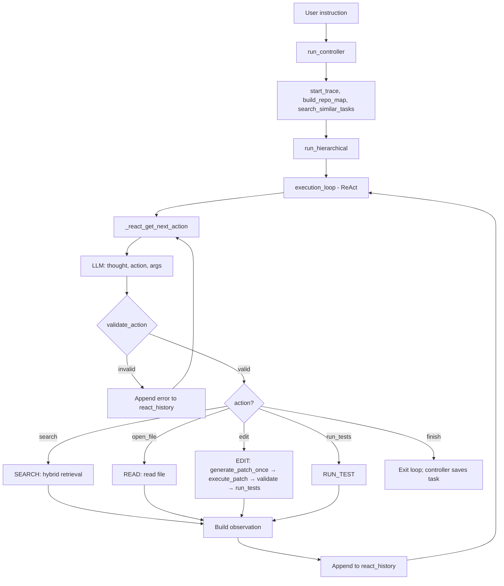

# AutoStudio

[](https://github.com/Pugsy-Explores/AutoCodeStudio)
[](https://github.com/Pugsy-Explores/AutoCodeStudio)
[](https://github.com/Pugsy-Explores/AutoCodeStudio)
[](https://github.com/Pugsy-Explores/AutoCodeStudio/blob/main/LICENSE)
[](https://github.com/Pugsy-Explores/AutoCodeStudio/stargazers)

> **Plan. Search. Edit. Explain.** — A repository-aware autonomous coding agent that turns natural language into structured execution. LLM-powered planning, smart efficient routing, hybrid retrieval, and deterministic tool dispatch.

**A repository-aware autonomous coding agent** that plans, searches, edits, and explains codebases using LLMs and structured tool execution.

AutoStudio converts natural-language instructions into executable plans, runs code search (graph + vector + Serena fallback), ranks context, applies structured patches with conflict resolution, runs tests with repair loops, and persists task memory—all while respecting safety limits, policy-driven retries, and configurable model routing.

---

## Table of Contents

- [Architecture Overview](#architecture-overview)
- [ReAct Architecture](#react-architecture)
- [Quick Start](#quick-start)
- [Project Structure](#project-structure)
- [Core Components](#core-components)
- [Execution Pipeline](#execution-pipeline)
- [Agent Controller (Full Pipeline)](#agent-controller-full-pipeline)
- [Configuration](#configuration)
- [Environment Variables](#environment-variables)
- [Tools and Adapters](#tools-and-adapters)
- [Testing](#testing)
- [Module index](#module-index)
- [Subsystems](#subsystems)
- [Repository Symbol Graph](#repository-symbol-graph-implemented)
- [Evaluation](#evaluation)
- [Documentation](#documentation)

---

## Module index

- **`agent/`**: main runtime orchestration, execution, retrieval integration, workflows — see [`agent/README.md`](agent/README.md)
- **`config/`**: centralized configuration + startup checks — see [`config/README.md`](config/README.md)
- **`editing/`**: diff planning, patch validation/execution, repair helpers — see [`editing/README.md`](editing/README.md)
- **`planner/`**: instruction → atomic step plan — see [`planner/README.md`](planner/README.md)
- **`repo_index/`**: scan/parse/extract symbols + edges — see [`repo_index/README.md`](repo_index/README.md)
- **`repo_graph/`**: symbol graph + repo map generation — see [`repo_graph/README.md`](repo_graph/README.md)
- **`router_eval/`**: router evaluation harness — see [`router_eval/README.md`](router_eval/README.md)
- **`tests/`**: unit/integration tests + fixtures — see [`tests/README.md`](tests/README.md)

## Architecture Overview

**Primary (ReAct, default, REACT_MODE=1):** Instruction → **run_controller** → **run_hierarchical** → **execution_loop** (ReAct). The model selects actions (search, open_file, edit, run_tests, finish) each step. No planner. No Critic/RetryPlanner. See [ReAct Architecture](#react-architecture) below and [Docs/REACT_QUICK_START.md](Docs/REACT_QUICK_START.md).

**Legacy (design reference, not in code):** Phase 5 design (run_attempt_loop, get_plan, GoalEvaluator, Critic, RetryPlanner) documented in [Docs/AGENT_LOOP_WORKFLOW.md](Docs/AGENT_LOOP_WORKFLOW.md) and [Docs/PHASE_5_ATTEMPT_LOOP.md](Docs/PHASE_5_ATTEMPT_LOOP.md).

### Hybrid Retrieval (Shared)

SEARCH path reuses the same retrieval pipeline: RepoMapLookup → BM25 + Graph + Vector + Grep → RRF → Anchor → SymbolExpander → GraphExpansion → ReferenceLookup → CallChain → Deduplicator → Reranker → Pruner. See [Docs/RETRIEVAL_ARCHITECTURE.md](Docs/RETRIEVAL_ARCHITECTURE.md).

---

## ReAct Architecture

ReAct mode is the default and primary execution path (REACT_MODE=1). The model selects actions step-by-step; no planner, no Critic, no RetryPlanner.

### Flow

```
User instruction
    → run_controller
        → start_trace
        → ensure_retrieval_daemon (optional)
        → build_repo_map
        → search_similar_tasks (optional)
        → run_hierarchical
            → execution_loop (ReAct)
                → _react_get_next_action (LLM: thought, action, args)
                → validate_action (strict schema)
                → StepExecutor.execute_step → dispatch (SEARCH/READ/EDIT/RUN_TEST)
                → _build_react_observation
                → append to react_history
                → repeat until finish or limits
        → save_task
        → finish_trace
```

### Flow Diagram



### Tool Schema

| Action | Required Args | Internal Step |
|--------|---------------|---------------|
| `search` | `query` (non-empty) | SEARCH |
| `open_file` | `path` | READ |
| `edit` | `path`, `instruction` | EDIT |
| `run_tests` | `{}` | RUN_TEST |
| `finish` | `{}` | (terminates loop) |

Source of truth: `agent/execution/react_schema.py`. Invalid output → error appended to react_history → model retries.

### Required Workflow

1. **search** → find relevant files
2. **open_file** → read and understand code
3. **edit** → apply a precise fix (path + instruction)
4. **run_tests** → verify

### EDIT Path

```
edit (path, instruction) → _edit_react → _generate_patch_once → execute_patch → validate_project → run_tests
```

Single attempt per edit step. No critic, no retry_planner.

### Limits

| Limit | Config | Default |
|-------|--------|---------|
| Max loop iterations | MAX_LOOP_ITERATIONS | 50 |
| Max steps | MAX_STEPS | 30 |
| Max tool calls | MAX_TOOL_CALLS | 50 |
| Max task runtime | MAX_TASK_RUNTIME_SECONDS | 900 |
| Per-step timeout | MAX_STEP_TIMEOUT_SECONDS | 60 |

### Key Files

| File | Role |
|------|------|
| `agent/orchestrator/agent_controller.py` | run_controller → run_hierarchical |
| `agent/orchestrator/deterministic_runner.py` | run_hierarchical → execution_loop |
| `agent/orchestrator/execution_loop.py` | ReAct loop: _react_get_next_action, react_history |
| `agent/execution/step_dispatcher.py` | _dispatch_react, _edit_react, _generate_patch_once |
| `agent/execution/react_schema.py` | ALLOWED_ACTIONS, validate_action |
| `agent/prompt_versions/react_action/v1.yaml` | Production ReAct system prompt |
| `scripts/run_react_live.py` | Live execution with trace capture |

---

## Quick Start

### Prerequisites

- Python 3.10+
- OpenAI-compatible LLM endpoints (e.g. llama.cpp, vLLM, or OpenAI API)
- Optional: [Serena](https://github.com/oraios/serena) MCP server for code search

### Dependencies

```bash
pip install -r requirements.txt
# or
pip install openai>=1.0.0 PyYAML>=6.0 tree-sitter tree-sitter-python
pip install mcp  # optional, for Serena code search
pip install chromadb sentence-transformers  # optional, for vector search and task index
```

Core: `openai`, `PyYAML`, `tree-sitter`, `tree-sitter-python`. Serena adapter requires `mcp`. Vector search and task index require `chromadb` and `sentence-transformers` (graceful fallback when unavailable).

### Run the agent

```bash
# Primary: ReAct mode (model selects actions step-by-step)
python -m agent "Add a docstring to the main function in agent/__main__.py"
python -m agent "Find where the StepExecutor class is defined"

# Live mode — full trace output to Docs/react_runs/
python scripts/run_react_live.py "Add a docstring to the main function in agent/__main__.py"

# Install CLI (optional): pip install -e .
autostudio explain StepExecutor
autostudio edit "add logging to execute_step"
autostudio chat                    # Interactive session
autostudio chat --live             # Session with live step visualization
autostudio trace <task_id>         # View trace by task_id
autostudio debug last-run          # Interactive trace viewer for most recent run

# Phase 12 — Developer workflow (issue → task → agent → PR → CI → review)
autostudio issue "Fix retry logic in StepExecutor"
autostudio fix "add logging to execute_step"
autostudio pr
autostudio review
autostudio ci

# Or run directly without installing:
python -m agent.cli.entrypoint explain StepExecutor
python -m agent.cli.entrypoint chat

# Mode 2 — Autonomous loop (goal-driven; Phase 7/8)
python -c "from agent.autonomous import run_autonomous; run_autonomous('Fix failing test', project_root='.')"
```

**Runtime:** `run_controller` → `run_hierarchical` → ReAct execution_loop. See [Docs/REACT_QUICK_START.md](Docs/REACT_QUICK_START.md).

### Index repository (symbol graph + optional embeddings)

```bash
python -m repo_index.index_repo /path/to/repo
# Creates .symbol_graph/index.sqlite, symbols.json, repo_map.json, and optionally .symbol_graph/embeddings/ (when chromadb + sentence-transformers installed)
# Uses .gitignore to exclude venv, __pycache__, etc. Use --no-gitignore to index everything.
# Use --verbose to log each file indexed.
```

### Retrieval daemon (optional)

Run the unified retrieval daemon (reranker + embedding) before agent sessions to avoid cold-start latency. When `RERANKER_USE_DAEMON=1` and `EMBEDDING_USE_DAEMON=1` (defaults), the agent uses the daemon instead of loading models in-process. When `RETRIEVAL_DAEMON_AUTO_START=1` (default), the agent will start the daemon automatically if it is not already running.

```bash
python scripts/retrieval_daemon.py              # foreground
python scripts/retrieval_daemon.py --daemon     # background
python scripts/retrieval_daemon.py --stop       # stop daemon
```

Endpoints: `POST /rerank`, `POST /embed`, `GET /health`. See [Docs/RETRIEVAL_ARCHITECTURE.md](Docs/RETRIEVAL_ARCHITECTURE.md) §4.9.

### Model endpoints

Configure `agent/models/models_config.json` or set:

- `SMALL_MODEL_ENDPOINT` — e.g. `http://localhost:8001/v1/chat/completions`
- `REASONING_MODEL_ENDPOINT` — e.g. `http://localhost:8002/v1/chat/completions`

---

## Project Structure

- `agent/` — orchestration, execution, retrieval, tools, memory, models
- `config/`, `editing/`, `repo_index/`, `repo_graph/`, `planner/`, `scripts/`, `Docs/`, `dev/`, `tests/`

See [Docs/PROJECT_STRUCTURE.md](Docs/PROJECT_STRUCTURE.md) for full tree.

## Core Components

**run_controller** → **run_hierarchical** → **execution_loop** (ReAct). Key files and tool schema: [ReAct Architecture](#react-architecture). Legacy: [Docs/AGENT_LOOP_WORKFLOW.md](Docs/AGENT_LOOP_WORKFLOW.md).

---

## Execution Pipeline

**SEARCH:** Hybrid retrieval (BM25 + graph + vector + grep → RRF → anchor → expand → rerank → prune). See [Docs/RETRIEVAL_ARCHITECTURE.md](Docs/RETRIEVAL_ARCHITECTURE.md).

**EDIT (ReAct):** `_edit_react` → `_generate_patch_once` → execute_patch → validate_project → run_tests. Single attempt. [Docs/EDIT_PIPELINE_DETAILED_ANALYSIS.md](Docs/EDIT_PIPELINE_DETAILED_ANALYSIS.md).

**EXPLAIN:** Context gate; injects SEARCH if empty. Uses `context_builder_v2`.

---

## Agent Controller (Full Pipeline)

`run_controller(instruction, project_root)`: build_repo_map → run_hierarchical → execution_loop (ReAct) → save_task. Safety, limits, failure handling, trace: [Docs/AGENT_CONTROLLER.md](Docs/AGENT_CONTROLLER.md).


---

## Configuration

All configuration values are centralized under `config/`. See [Docs/CONFIGURATION.md](Docs/CONFIGURATION.md) for the full reference, including environment variable overrides and validation rules.

Models, task_models, task_params, reranker: `agent/models/models_config.json`. Env overrides: see [Docs/CONFIGURATION.md](Docs/CONFIGURATION.md).

---

## Environment Variables

All config values support env overrides. See [Docs/CONFIGURATION.md](Docs/CONFIGURATION.md) for the complete list.

| Variable | Purpose |
|----------|---------|
| `ENABLE_INSTRUCTION_ROUTER` | 1 (default) or 0 — route instruction before planner; CODE_SEARCH/CODE_EXPLAIN/INFRA skip planner |
| `ROUTER_TYPE` | baseline, fewshot, ensemble, or final — use router from registry when instruction router enabled |
| `SMALL_MODEL_ENDPOINT` | Override small model URL |
| `REASONING_MODEL_ENDPOINT` | Override reasoning model URL |
| `MODEL_API_KEY` | API key for model endpoints |
| `MODEL_TEMPERATURE` | Default temperature |
| `MODEL_MAX_TOKENS` | Default max tokens |
| `MODEL_REQUEST_TIMEOUT` | Default request timeout (seconds) |
| `MODEL_RETRY_MAX_ATTEMPTS` | Max retries on connection/timeout (default 5); exponential backoff |
| `MODEL_RETRY_BASE_DELAY_SECONDS` | Base delay for exponential backoff (default 1.0) |
| `REASONING_V2_MODEL_ENDPOINT` | Override REASONING_V2 endpoint |
| `ENABLE_TOOL_GRAPH` | 1 (default) or 0 — restrict tools by graph |
| `ENABLE_CONTEXT_RANKING` | 1 (default) or 0 — (unused by retrieval; kept for compatibility) |
| `ENABLE_VECTOR_SEARCH` | 1 (default) or 0 — use embedding search when graph returns nothing |
| `ENABLE_HYBRID_RETRIEVAL` | 1 (default) or 0 — run graph, vector, grep in parallel; 0 = sequential fallback |
| `RETRIEVAL_CACHE_SIZE` | LRU cache size for search results (default 100); 0 to disable. Read at runtime from env. |
| `INDEX_EMBEDDINGS` | 1 (default) or 0 — build ChromaDB embedding index during index_repo |
| `INDEX_PARALLEL_WORKERS` | Parallel file parsing workers (default 8) |
| `SERENA_PROJECT_DIR` | Project root for Serena MCP |
| `SERENA_MCP_COMMAND` | Command to run Serena (default: `uvx`) |
| `SERENA_MCP_ARGS` | Override Serena args; default includes `--open-web-dashboard false` to avoid browser auto-open |
| `SERENA_USE_PLACEHOLDER` | 1 to disable Serena (return empty results) |
| `SERENA_GREP_FALLBACK` | 1 (default) or 0 — use ripgrep when Serena MCP unavailable |
| `SERENA_VERBOSE` | 1 for Serena debug logs |
| `MAX_STEP_TIMEOUT_SECONDS` | Per-step timeout (default 15); prevents single slow tool from consuming full task budget |
| `MAX_CONTEXT_CHARS` | Hard cap on context before LLM reasoning call (default 32000); truncation logs `context_guardrail_triggered` |
| `PLANNER_MAX_TOKENS` | Max tokens for planner (default 1024) |
| `ENABLE_DIFF_PLANNER` | 1 (default) or 0 — EDIT returns planned changes vs read_file |
| `TEST_REPAIR_ENABLED` | 1 (default) or 0 — run tests after patch; 0 = patch only |
| `COMPILE_BEFORE_TEST` | 1 (default) or 0 — run py_compile before tests |
| `MAX_REPO_SCAN_FILES` | Phase 10: cap repo scan (default 200) |
| `MAX_ARCHITECTURE_NODES` | Phase 10: cap architecture map (default 500) |
| `MAX_CONTEXT_TOKENS` | Phase 10: context budget for compressor (default 8192) |
| `MAX_IMPACT_DEPTH` | Phase 10: BFS depth for impact analyzer (default 3) |
| `ENABLE_LOCALIZATION_ENGINE` | Phase 10.5: 1 (default) or 0 — graph-guided localization (dependency traversal, execution paths, symbol ranking) |
| `MAX_GRAPH_DEPTH` | Phase 10.5: dependency traversal depth (default 3) |
| `MAX_DEPENDENCY_NODES` | Phase 10.5: cap on graph nodes (default 100) |
| `MAX_EXECUTION_PATHS` | Phase 10.5: cap on execution path chains (default 10) |
| `MAX_FILES_PER_PR` | Phase 12: max files per PR (default 10) |
| `MAX_PATCH_LINES` | Phase 12: max patch lines (default 500) |
| `MAX_CI_RUNTIME_SECONDS` | Phase 12: CI timeout in seconds (default 600) |
| `MAX_AGENT_ATTEMPTS` | Phase 5: max attempt-loop iterations per task (default 3); goal_met or exhaust → return |
| `MAX_PROMPT_TOKENS` | Phase 14: hard cap on total prompt tokens (default 12000) |
| `OUTPUT_TOKEN_RESERVE` | Phase 14: tokens reserved for model output (default 2000) |
| `MAX_REPO_SNIPPETS` | Phase 14: max ranked code snippets (default 10) |
| `MAX_HISTORY_TOKENS` | Phase 14: token budget for history (default 2000) |
| `MAX_REPO_CONTEXT_TOKENS` | Phase 14: threshold for conditional compression (default 7200) |
| `MAX_RETRIEVAL_RESULTS` | Phase 14: max candidates from retrieval to ranker (default 20) |
| `RERANKER_STARTUP` | 1 (default) or 0 — auto-init reranker at service startup. 0 = lazy-load on first use |
| `HISTORY_WINDOW_TURNS` | Phase 14: last N turns kept raw (default 10) |
| `HISTORY_SUMMARY_TURNS` | Phase 14: older turns summarized (default 30) |

---

## Tools and Adapters

| Tool | Adapter | Purpose |
|------|---------|---------|
| `retrieve_symbol_context` | graph_retriever | Graph-based symbol lookup + 2-hop expansion (when index exists) |
| `search_by_embedding` | vector_retriever | Semantic code search via ChromaDB (when graph returns nothing) |
| `search_code` | serena_adapter | Serena MCP: find_symbol, search_for_pattern (fallback) |
| `read_file` | filesystem_adapter | Read file contents |
| `write_file` | filesystem_adapter | Write file contents |
| `list_files` | filesystem_adapter | List directory |
| `find_referencing_symbols` | reference_tools | Symbol graph: callers, callees, imports, referenced_by |
| `read_symbol_body` | reference_tools | Read symbol body (or file window) |
| `run_command` | terminal_adapter | Execute shell command |
| `lookup_docs` | context7_adapter | Optional doc lookup |

**Serena MCP:** Requires `mcp` package and Serena installed (e.g. `uvx serena start-mcp-server`). When unavailable, `search_code` falls back to ripgrep (unless `SERENA_GREP_FALLBACK=0`). Query rewrite prompts (`query_rewrite.yaml`, `query_rewrite_with_context.yaml`) encode Serena rules (find_symbol name_path, search_for_pattern regex) and filesystem rules (list_dir paths within project).

**Repository indexing:** Build a symbol graph for instant graph-based retrieval:

```bash
python -m repo_index.index_repo /path/to/repo          # default: respects .gitignore
python -m repo_index.index_repo /path/to/repo -v      # verbose: log each file indexed
python -m repo_index.index_repo /path/to/repo --no-gitignore  # index everything (including venv, __pycache__)
```

Creates `.symbol_graph/index.sqlite`, `symbols.json`, and `repo_map.json`. By default, paths matching `.gitignore` (e.g. `venv/`, `.venv/`, `__pycache__/`) are excluded. SEARCH uses repo_map lookup and anchor detection before graph retrieval when index exists. Programmatic use supports `include_dirs`, `ignore_gitignore`, and `verbose` (e.g. `index_repo(path, include_dirs=("agent", "editing"), verbose=True)`).

---

## Testing

Install dependencies first (includes pytest, numpy, tree-sitter, BM25): `pip install -r requirements-dev.txt` or `bash scripts/install_test_deps.sh`. The test session aborts early if core imports are missing (override only for emergencies: `AUTOSTUDIO_SKIP_IMPORT_CHECK=1`).

```bash
# From workspace root (parent of AutoStudio)
python -m pytest AutoStudio/tests/ -v

# End-to-end agent pipeline (mocked LLM, deterministic)
python -m pytest AutoStudio/tests/test_agent_e2e.py -v

# Specific suites
python -m pytest AutoStudio/tests/test_agent_loop.py -v      # Execution loop, planner→executor→results; ExplainGate
python -m pytest AutoStudio/tests/test_developer_workflow.py -v  # Phase 6: session memory, slash-commands, multi-turn
python -m pytest AutoStudio/tests/test_context_ranker.py -v
python -m pytest AutoStudio/tests/test_explain_gate.py -v   # Context gate: ensure_context_before_explain
python -m pytest AutoStudio/tests/test_tool_graph.py -v      # Step→tool mapping (SEARCH→retrieve_graph, etc.)
python -m pytest AutoStudio/tests/test_policy_engine.py -v
python -m pytest AutoStudio/tests/test_autonomous_meta.py -v  # Phase 8: evaluator, critic, retry_planner, trajectory_store
python -m pytest AutoStudio/tests/test_roles.py -v           # Phase 9: planner, localization, edit, test, critic agents
python scripts/run_repository_eval.py --mock --limit 2       # Phase 10: repository eval (mock)
python -m pytest AutoStudio/tests/test_agent_robustness.py -v  # failure scenarios, replan, fallback, no corruption
python -m pytest AutoStudio/tests/test_agent_trajectory.py -v --mock  # complex trajectories: multi-search, conflict resolver, repair loop

# Phase 3 scenario evaluation (40 tasks via run_controller; output: reports/eval_report.json)
python scripts/run_principal_engineer_suite.py --scenarios

# Phase 5 capability eval (dev_tasks.json; output: reports/eval_report.json)
python scripts/run_capability_eval.py --mock       # CI: no agent calls
python scripts/run_capability_eval.py --limit 5   # Quick smoke test
python -m pytest AutoStudio/tests/test_observability.py -v  # trace creation, plan, tool calls, errors, patch results
python -m pytest AutoStudio/tests/test_multifile_edits.py -v  # Multi-file patch pipeline (two-file, three-file, rollback)
python -m pytest AutoStudio/tests/test_indexer.py AutoStudio/tests/test_symbol_graph.py AutoStudio/tests/test_repo_map.py -v  # repo index + graph + repo map
INDEX_EMBEDDINGS=0 python -m pytest AutoStudio/tests/test_retrieval_pipeline.py AutoStudio/tests/test_graph_retriever.py -v  # retrieval pipeline
python -m pytest AutoStudio/tests/test_symbol_expansion.py AutoStudio/tests/test_context_builder_v2.py -v  # symbol expander, context builder v2

# Repo index/graph with debug logging (when failures occur)
INDEX_EMBEDDINGS=0 python -m pytest AutoStudio/tests/test_indexer.py AutoStudio/tests/test_symbol_graph.py -v --log-cli-level=DEBUG
```

**E2E tests** (`test_agent_e2e.py`): default tries real LLM; if unreachable, warns and falls back to mock. Use `--mock` to force mock mode and skip the probe.

```bash
python -m pytest tests/test_agent_e2e.py -v          # default: try LLM, fallback to mock
python -m pytest tests/test_agent_e2e.py -v --mock  # always use mock (fast, deterministic)
```

| Scenario | Flow | Assertions |
|----------|------|------------|
| Explain code | plan → search → retrieval → explain | No errors, task memory saved |
| Code edit | plan → search → diff planner → patch → index update | Patches applied, index updated, task memory saved |
| Multi-file change | conflict resolver → sequential patch groups | Patches applied to all files, task memory saved |

Tests mock LLM calls where appropriate (e.g. `test_context_ranker.py` mocks `call_reasoning_model`). See [Docs/REPOSITORY_SYMBOL_GRAPH.md](Docs/REPOSITORY_SYMBOL_GRAPH.md#testing-and-validation) for indexing validation details.

**Agent trajectory** (`test_agent_trajectory.py`): Complex-task tests for long agent runs (task: "Add logging to all executor classes"):

| Scenario | Verification |
|----------|--------------|
| Multiple search steps | ≥2 SEARCH steps hit retriever (use `RETRIEVAL_CACHE_SIZE=0`) |
| Conflict resolver | Invoked when multiple edits target same file |
| Repair loop | `run_with_repair` invoked when `TEST_REPAIR_ENABLED=1` |
| No infinite loop | Stops after MAX_REPLAN_ATTEMPTS (agent_loop: 3; agent_controller: 5) on repeated failure; run_attempt_loop stops after MAX_AGENT_ATTEMPTS (default 3) when goal not met |
| Runtime | agent_loop: 60s; agent_controller: 15 min (configurable) |

**Agent robustness** (`test_agent_robustness.py`): Failure-scenario tests ensure the agent replans, triggers fallback search, and avoids repository corruption:

| Scenario | Expected behavior |
|----------|-------------------|
| Nonexistent symbol search | Policy retries with rewritten query; falls back to vector → Serena; returns failure with `attempt_history` when exhausted |
| Invalid edit instruction | Patch validator rejects; rollback restores files; no corruption |
| Patch validator failure | Rollback restores all modified files |
| Graph lookup empty | Fallback to vector search, then Serena, then file_search (Phase 4) |
| Search exception | Caught by policy engine; no unhandled crash |

---

## Subsystems

### Planner

- Converts instruction → JSON plan with steps `{id, action, description, reason}`
- Actions: EDIT, SEARCH, EXPLAIN, INFRA
- Evaluation: `python -m planner.planner_eval`

### Prompt System (Phase 13 + Phase 14)

- **PromptRegistry**: Central registry for all prompts; `get_registry().get(name)`, `get_instructions(name, variables=...)`, `get_guarded(name, user_input=...)`, `validate_response(name, response, user_input)`, `compose(prompt, skill, repo_context)`
- **Phase 14 — Token Budgeting & Context Control**: `agent/prompt_system/context/` — enforces prompt size bounds via ranked context pruning, conditional compression (only when `repo_context_tokens > MAX_REPO_CONTEXT_TOKENS`), sliding conversation window (last N raw + summarized older), dynamic budget allocation per section, and emergency hard truncation as a last-resort safety guard. Use `build_context_budgeted()` for full pipeline.
- **Versioning**: Prompts in `agent/prompt_versions/{name}/v1.yaml`; `get_prompt(name, version="latest")`, `compare_prompts(name, v1, v2)`, `run_ab_test(name, variant_a, variant_b, run_fn)` for A/B testing
- **Guardrails**: Injection detection (pre-load via `get_guarded`), output schema validation, safety policy, constraint checker (post-response via `validate_response`)
- **Skills**: Modular YAML skills (planner_skill, patch_generation_skill, etc.); compose with prompts
- **Evaluation**: `tests/prompt_eval_dataset.json` (100 cases: navigation, planning, editing, refactoring, test-fixing, repo-reasoning), `scripts/run_prompt_ci.py` (regression detection, `--prompt NAME` for specific prompt)
- **Observability**: `PromptUsageMetric` with `prompt_usage`, `avg_latency_ms`, `token_usage`; `generate_report()` from trace data
- **Failure logging**: `agent/prompt_eval/failure_analysis/` — log failures to `dev/failure_logs/`
- **Retry strategies**: Stricter prompt, more context, different model, critic feedback
- **Governance**: Rules 6 (eval coverage per prompt), 7 (context budget); see [Docs/prompt_engineering_rules.md](Docs/prompt_engineering_rules.md)
- See [Docs/PROMPT_ARCHITECTURE.md](Docs/PROMPT_ARCHITECTURE.md) and [Docs/prompt_engineering_rules.md](Docs/prompt_engineering_rules.md)

### Router Eval

- Phased router evaluation harness; categories: EDIT, SEARCH, EXPLAIN, INFRA, GENERAL
- Swap routers by changing import in `router_eval.py`
- Run: `python -m router_eval.router_eval`
- Production integration: set `ROUTER_TYPE=baseline|fewshot|ensemble|final` to use router_eval routers in production
- Run with production router: `python -m router_eval.run_all_routers --production`

### Optional: ChromaDB and embeddings

- **Vector search:** `agent/retrieval/vector_retriever.py` — semantic search when graph returns nothing. Index built by `repo_index.index_repo` when `INDEX_EMBEDDINGS=1` (requires `chromadb`, `sentence-transformers`).
- **Task index:** `agent/memory/task_index.py` — vector index of past tasks for `search_similar_tasks` (`.agent_memory/task_index/`).
- **Intelligence layer (Phase 11):** `agent/intelligence/` — solution memory (`.agent_memory/solutions/`), task embeddings (`.agent_memory/intelligence_index/`), developer profile (`.agent_memory/developer_profile.json`), repo knowledge (`.agent_memory/repo_knowledge.json`).
- **Legacy:** `index_repo.py`, `mcp_retriever.py` — standalone embedding indexer and FastAPI endpoint.

---

## Repository Symbol Graph (Implemented)

AutoStudio includes **repository structure awareness**:

- **Indexing:** `repo_index` — Tree-sitter parser, parallel file parsing, symbol extraction, dependency edges; optional embedding index
- **Graph:** `repo_graph` — SQLite storage, 2-hop expansion
- **Repo map:** `repo_graph/repo_map_builder` — spec format `{modules, symbols, calls}`; `build_repo_map_from_storage`; `repo_map.json`
- **Repo map lookup:** `agent/retrieval/repo_map_lookup` — `lookup_repo_map(query)` → anchor candidates; `load_repo_map()`
- **Anchor detection:** `detect_anchor(query, repo_map)` — exact/fuzzy symbol match → `{symbol, confidence}`; seeds graph retrieval
- **Incremental updates:** `repo_graph/repo_map_updater` — `update_repo_map_for_file()` after `update_index_for_file`
- **Change detector:** `repo_graph/change_detector` — affected callers, risk levels (LOW/MEDIUM/HIGH)
- **Retrieval:** repo_map lookup → anchor → graph_retriever (when anchor confidence ≥ 0.9) → vector_retriever → Serena fallback
- **Diff planning:** `editing/diff_planner` — planned changes with affected symbols and callers
- **Conflict resolution:** `editing/conflict_resolver` — same symbol, same file, semantic overlap
- **Test repair:** `editing/test_repair_loop` — run tests, repair on failure, flaky detection, compile step

See [Docs/REPOSITORY_SYMBOL_GRAPH.md](Docs/REPOSITORY_SYMBOL_GRAPH.md) for details.

### Repository Intelligence (Phase 10)

When using `run_multi_agent`, the supervisor builds a **repository intelligence layer** before planning:

- **repo_summary_graph** — High-level map: modules, entrypoints, key classes, dependency edges (capped at `MAX_REPO_SCAN_FILES`)
- **architecture_map** — Classifies modules into controllers, services, data_layers, utilities (heuristics + small model for ambiguous)
- **long_horizon_planner** — Prepends architecture context to the goal; delegates to `planner.plan()` for multi-module planning
- **impact_analyzer** — After each edit, BFS from edited file to predict affected files/symbols (depth `MAX_IMPACT_DEPTH`)
- **context_compressor** — When `ranked_context` exceeds `MAX_CONTEXT_TOKENS`, replaces snippets with summaries

Config: `config/repo_intelligence_config.py`. See [dev/roadmap/phase_10_capability_expansion.md](dev/roadmap/phase_10_capability_expansion.md).

### Intelligence Layer (Phase 11)

The autonomous loop includes an **intelligence layer** that learns from successful runs and adapts planning:

- **solution_memory** — Persists successful solutions to `.agent_memory/solutions/<task_id>.json` (goal, files_modified, patch_summary)
- **task_embeddings** — ChromaDB vector index of solution patterns in `.agent_memory/intelligence_index/` for semantic search
- **experience_retriever** — Before each task: retrieves similar solutions, developer_profile, repo_knowledge; returns ExperienceHints (similar_solutions, suggested_files) injected into `state.context["experience_hints"]`
- **developer_model** — `.agent_memory/developer_profile.json`: preferred_test_framework, logging_style, code_style, observed_patterns
- **repo_learning** — `.agent_memory/repo_knowledge.json`: frequent_bug_areas, common_refactor_patterns, architecture_constraints

On success, the agent stores the solution and updates developer_model and repo_learning. See [dev/roadmap/phase_11_intelligence.md](dev/roadmap/phase_11_intelligence.md).

### Graph-Guided Localization (Phase 10.5)

The retrieval pipeline includes a **localization layer** that performs structural repository navigation before vector search:

- **dependency_traversal** — BFS over symbol graph (callers, callees, imports) from anchor; returns candidate symbols with hop distance
- **execution_path_analyzer** — Reconstructs forward/backward call chains from anchor
- **symbol_ranker** — Scores candidates by dependency distance (0.4), call graph relevance (0.25), name similarity (0.2), semantic similarity (0.15)
- **localization_engine** — Orchestrates stages; prepends ranked candidates to context pool

Config: `ENABLE_LOCALIZATION_ENGINE`, `MAX_GRAPH_DEPTH`, `MAX_DEPENDENCY_NODES`, `MAX_EXECUTION_PATHS`. See [dev/roadmap/phase_10-5_graph_traversal.md](dev/roadmap/phase_10-5_graph_traversal.md).

### Developer Workflow (Phase 12)

The **workflow layer** (`agent/workflow/`) turns AutoStudio into a developer teammate operating inside the real software development loop: issue → agent solution → PR → CI → review → merge.

- **issue_parser** — Converts GitHub/GitLab issue text into structured tasks (type, module, symbol, priority)
- **pr_generator** — Generates PR title and description from workspace, patches, and test results
- **ci_runner** — Runs pytest and ruff with `MAX_CI_RUNTIME_SECONDS` (600s) timeout
- **code_review_agent** — Reviews patches for style violations, security risks, large diffs (> `MAX_PATCH_LINES`), missing tests
- **developer_feedback** — Applies human feedback via critic → retry planner → improved patch
- **workflow_controller** — Orchestrates full flow: issue → parse → run_multi_agent → PR → CI → review

**CLI commands:** `autostudio issue <text>`, `autostudio fix <instruction>`, `autostudio pr`, `autostudio review`, `autostudio ci`. Last workflow result persisted to `.agent_memory/last_workflow.json` for `pr` and `review` commands.

**Safety limits:** `MAX_FILES_PER_PR=10`, `MAX_PATCH_LINES=500`, `MAX_CI_RUNTIME_SECONDS=600`. See [dev/roadmap/phase_12_last_stop.md](dev/roadmap/phase_12_last_stop.md).

---

## Documentation

| Doc | Description |
|-----|--------------|
| [ReAct Architecture](#react-architecture) | **Primary:** ReAct flow, tools, schema, EDIT path (in main README) |
| [Docs/REACT_QUICK_START.md](Docs/REACT_QUICK_START.md) | Quick start for ReAct mode |
| [Docs/ARCHITECTURE.md](Docs/ARCHITECTURE.md) | Authoritative system architecture: pipeline diagram, component descriptions, data flow |
| [Docs/OBSERVABILITY.md](Docs/OBSERVABILITY.md) | Telemetry fields, trace logging, retrieval metrics |
| [Docs/PROMPT_ARCHITECTURE.md](Docs/PROMPT_ARCHITECTURE.md) | Prompt layer: PromptRegistry, versioning, all prompts, pipeline position, design philosophy, safety risks, testing |
| [Docs/prompt_engineering_rules.md](Docs/prompt_engineering_rules.md) | Phase 13: governance rules (1 prompt = 1 capability, versioning, evaluation, failure logging, Rules 6–7, guardrails, A/B testing) |
| [Docs/CONFIGURATION.md](Docs/CONFIGURATION.md) | Centralized config: all modules, env overrides, validation |
| [Docs/AGENT_LOOP_WORKFLOW.md](Docs/AGENT_LOOP_WORKFLOW.md) | High-level flow (run_attempt_loop, Phase 5), step dispatch, SEARCH/EDIT/INFRA/EXPLAIN flows, policy engine, model routing |
| [Docs/AGENT_CONTROLLER.md](Docs/AGENT_CONTROLLER.md) | Full pipeline: run_controller, run_attempt_loop (Phase 5), instruction router, safety limits, test repair, task memory |
| [Docs/PHASE_5_ATTEMPT_LOOP.md](Docs/PHASE_5_ATTEMPT_LOOP.md) | Phase 5 attempt loop: TrajectoryMemory, hybrid Critic, RetryPlanner, strategy hints, trajectory summarization, planner diversity guard |
| [Docs/ROUTING_ARCHITECTURE_REPORT.md](Docs/ROUTING_ARCHITECTURE_REPORT.md) | Routing architecture: instruction router, tool graph, categories, replanner |
| [Docs/REPOSITORY_SYMBOL_GRAPH.md](Docs/REPOSITORY_SYMBOL_GRAPH.md) | Symbol graph, repo map, change detector, vector search |
| [Docs/CODING_AGENT_ARCHITECTURE_GUIDE.md](Docs/CODING_AGENT_ARCHITECTURE_GUIDE.md) | Architecture patterns, anti-patterns, production practices |
| [dev/roadmap/phase_1_pipeline.md](dev/roadmap/phase_1_pipeline.md) | Phase 1 pipeline convergence: steps 1–8, verification tests, full system test |
| [dev/roadmap/phase_3_scenarios.md](dev/roadmap/phase_3_scenarios.md) | Phase 3 scenario evaluation: 40-task benchmark, run_principal_engineer_suite --scenarios |
| [dev/roadmap/phase_4_reliability.md](dev/roadmap/phase_4_reliability.md) | Phase 4 reliability: failure policies, execution limits, failure mining, stress testing |
| [dev/roadmap/phase_5_metrics.md](dev/roadmap/phase_5_metrics.md) | Phase 5 capability expansion: dev_tasks.json, run_capability_eval, metrics dashboard |
| [dev/roadmap/phase_6_developer_experience.md](dev/roadmap/phase_6_developer_experience.md) | Phase 6 developer experience: autostudio CLI, interactive chat, slash-commands, session memory, live viz, UX metrics |
| [dev/roadmap/phase_7_reliability_hardening.md](dev/roadmap/phase_7_reliability_hardening.md) | Phase 7 reliability hardening: per-step timeout, tool validation, context guardrail; autonomous mode (agent/autonomous/, run_autonomous) |
| [dev/roadmap/phase_8_autonomous_mode.md](dev/roadmap/phase_8_autonomous_mode.md) | Phase 8 self-improving loop: agent/meta/ (evaluator, critic, retry_planner, trajectory_store); outer retry loop; reflection metrics |
| [dev/roadmap/phase_9_workflow_integration.md](dev/roadmap/phase_9_workflow_integration.md) | Phase 9 hierarchical multi-agent: agent/roles/ (supervisor, planner, localization, edit, test, critic); run_multi_agent; AgentWorkspace; multi_agent_tasks.json; run_multi_agent_eval |
| [dev/roadmap/phase_10_capability_expansion.md](dev/roadmap/phase_10_capability_expansion.md) | Phase 10 repository-scale intelligence: agent/repo_intelligence/ (repo_summary_graph, architecture_map, impact_analyzer, context_compressor, long_horizon_planner); repository_tasks.json; run_repository_eval |
| [dev/roadmap/phase_10-5_graph_traversal.md](dev/roadmap/phase_10-5_graph_traversal.md) | Phase 10.5 graph-guided localization: agent/retrieval/localization/ (dependency_traversal, execution_path_analyzer, symbol_ranker, localization_engine); localization_tasks.json; run_localization_eval |
| [dev/roadmap/phase_11_intelligence.md](dev/roadmap/phase_11_intelligence.md) | Phase 11 intelligence layer: agent/intelligence/ (solution_memory, task_embeddings, experience_retriever, developer_model, repo_learning); experience_hints injection; solution storage on success; metrics: solution_reuse_rate, experience_improvement, repeat_failure_rate, developer_acceptance |
| [dev/roadmap/phase_12_last_stop.md](dev/roadmap/phase_12_last_stop.md) | Phase 12 developer workflow: agent/workflow/ (issue_parser, pr_generator, ci_runner, code_review_agent, developer_feedback, workflow_controller); CLI: issue, fix, pr, review, ci; workflow_tasks.json; run_workflow_eval; metrics: pr_success_rate, ci_pass_rate, issue_to_pr_success |
| [Docs/WORKFLOW.md](Docs/WORKFLOW.md) | Phase 12 workflow layer: modules, CLI, flow, safety limits, trace events, persistence, evaluation |
| [dev/roadmap/phase_15_trajectory.md](dev/roadmap/phase_15_trajectory.md) | Phase 15 trajectory loop: TrajectoryLoop, trajectory_store, retry diversity, run_retry_eval |
| [dev/roadmap/phase_16_failure_mining.md](dev/roadmap/phase_16_failure_mining.md) | Phase 16 failure mining: agent/failure_mining/, run_failure_mining.py, reports/failure_analysis.md |

---

## Evaluation

**Phase 3 scenario evaluation** (40 real tasks via `run_controller`):

```bash
# Run all 40 scenarios; output: reports/eval_report.json
python scripts/run_principal_engineer_suite.py --scenarios

# Run with agent_loop for Phase 4 metrics (replan_rate, failure_rate)
python scripts/run_principal_engineer_suite.py --scenarios --use-agent-loop

# Run full principal engineer suite (explain, edit, router_eval, failure tests, scenarios)
python scripts/run_principal_engineer_suite.py
```

**Phase 5 capability eval** (40 developer tasks via `run_controller` / run_attempt_loop):

```bash
# Run dev_tasks.json through agent; output: reports/eval_report.json
python scripts/run_capability_eval.py

# Mock mode for CI (no LLM calls)
python scripts/run_capability_eval.py --mock

# Limit tasks for quick validation
python scripts/run_capability_eval.py --limit 5
```

**Phase 8 autonomous eval** (7 tasks via `run_autonomous`):

```bash
# Run autonomous_tasks.json; output: reports/autonomous_eval_report.json
python scripts/run_autonomous_eval.py

# Mock mode for CI
python scripts/run_autonomous_eval.py --mock
```

**Phase 9 multi-agent eval** (30 tasks via `run_multi_agent`):

```bash
# Run multi_agent_tasks.json; output: reports/multi_agent_eval_report.json
python scripts/run_multi_agent_eval.py

# Mock mode for CI
python scripts/run_multi_agent_eval.py --mock

# Merge metrics into reports/eval_report.json
python scripts/run_multi_agent_eval.py --merge
```

**Phase 10 repository eval** (40 tasks via `run_multi_agent` with repo intelligence):

```bash
# Run repository_tasks.json; output: reports/repository_eval_report.json
python scripts/run_repository_eval.py

# Mock mode for CI
python scripts/run_repository_eval.py --mock

# Merge metrics into reports/eval_report.json
python scripts/run_repository_eval.py --merge
```

**Phase 10.5 localization eval** (10 tasks; graph-guided localization):

```bash
# Run localization_tasks.json; output: reports/localization_report.json
python scripts/run_localization_eval.py

# Mock mode for CI
python scripts/run_localization_eval.py --mock

# Limit tasks for quick validation
python scripts/run_localization_eval.py --limit 3
```

**Phase 12 workflow eval** (8 tasks; issue → task → PR → CI → review):

```bash
# Run workflow_tasks.json; output: reports/workflow_eval_report.json
python scripts/run_workflow_eval.py

# Mock mode for CI
python scripts/run_workflow_eval.py --mock

# Limit tasks for quick validation
python scripts/run_workflow_eval.py --limit 3
```

**Phase 13 prompt CI** (prompt evaluation and regression detection):

```bash
# Run prompt eval against tests/prompt_eval_dataset.json; compare with baseline
python scripts/run_prompt_ci.py

# Save current run as baseline (run after prompt changes you want to keep)
python scripts/run_prompt_ci.py --save-baseline

# Evaluate specific prompt
python scripts/run_prompt_ci.py --prompt planner

# Use custom dataset
python scripts/run_prompt_ci.py --dataset path/to/dataset.json
```

Exit code 1 on regression if: `task_success` drops >5%, `json_validity` drops >2%, `tool_misuse` increases >3%. Also checks Phase 16 failure guardrails when `reports/failure_stats.json` exists: `retrieval_miss_rate` < 40%, `patch_error_rate` < 25%. Results: `dev/prompt_eval_results/`.

**Phase 16 failure mining** (trajectory-scoped failure analysis):

```bash
# Run 300 tasks, extract failures, cluster, generate reports
python scripts/run_failure_mining.py --tasks 300

# Analyze existing trajectories only (skip run_autonomous)
python scripts/run_failure_mining.py --skip-run

# Use LLM to relabel unknown failure types
python scripts/run_failure_mining.py --use-judge
```

Output: `reports/failure_analysis.md`, `reports/failure_stats.json`. Dataset: `tests/failure_mining_tasks.json` (300 tasks: bug fixes, refactors, feature, navigation). Metrics: `avg_steps_success`, `avg_steps_failure`, `loop_failure_rate`, `retrieval_miss_rate`, `patch_error_rate`.

**Phase 4 reliability** (failure mining, stress testing):

```bash
# Aggregate failures from 10 scenario runs → dev/evaluation/failure_patterns.md
python scripts/run_principal_engineer_suite.py --failure-mining --mining-reps 10

# Stress test with varied seeds → reports/stress_report.json
python scripts/run_principal_engineer_suite.py --stress --stress-reps 5
```

**Datasets:**
- `tests/agent_scenarios.json` — 40 structured scenarios across 8 groups (code_understanding, navigation, simple_edits, multi_line_fixes, multi_file, bug_fixing, feature_addition, refactoring).
- `tests/dev_tasks.json` — 40 developer tasks for Phase 5 capability eval (bug_fixing, feature_addition, refactoring, code_generation).
- `tests/autonomous_tasks.json` — 7 autonomous-mode benchmark tasks across 5 types (Phase 8: bug_fixing, feature_addition, refactoring, test_repair, configuration_updates).
- `tests/multi_agent_tasks.json` — 30 multi-agent benchmark tasks (Phase 9: fix_test_suite, multi_file_refactor, feature_addition).
- `tests/repository_tasks.json` — 40 repository-scale benchmark tasks (Phase 10: refactor_architecture, rename_api, multi_service_feature, config_update).
- `tests/workflow_tasks.json` — 8 workflow benchmark tasks (Phase 12: fix_failing_test, implement_feature, refactor_module, add_logging).
- `tests/failure_mining_tasks.json` — 300 tasks (Phase 16: 100 bug fixes, 50 refactors, 50 feature, 100 navigation).

**Metrics** (see `dev/evaluation/metrics.md` for definitions):

| Scope | Script | Metrics |
|-------|--------|---------|
| **Core** | Principal engineer suite, capability eval | `task_success_rate`, `retrieval_recall`, `planner_accuracy`, `edit_success_rate`, `avg_latency`, `avg_files_modified`, `avg_steps_per_task`, `avg_patch_size`, `failure_rate`, `replan_rate` |
| **Phase 8 (autonomous)** | `run_autonomous_eval.py` | `attempts_per_goal`, `retry_success_rate`, `critic_accuracy`, `trajectory_reuse` |
| **Phase 9 (multi-agent)** | `run_multi_agent_eval.py` | `goal_success_rate`, `agent_delegations`, `critic_accuracy`, `localization_accuracy`, `patch_success_rate` |
| **Phase 10 (repository)** | `run_repository_eval.py` | `localization_accuracy`, `impact_prediction_accuracy`, `context_compression_ratio`, `long_horizon_success_rate` |
| **Phase 10.5 (localization)** | `run_localization_eval.py` | `file_accuracy`, `function_accuracy`, `top_k_recall`, `avg_graph_nodes` |
| **Phase 11 (intelligence)** | `run_autonomous_eval.py`, `run_multi_agent_eval.py` | `solution_reuse_rate`, `experience_improvement`, `repeat_failure_rate`, `developer_acceptance` |
| **Phase 12 (workflow)** | `run_workflow_eval.py` | `pr_success_rate`, `ci_pass_rate`, `developer_acceptance_rate`, `avg_retries_per_task`, `pr_merge_latency`, `issue_to_pr_success` |
| **Phase 16 (failure mining)** | `run_failure_mining.py` | `avg_steps_success`, `avg_steps_failure`, `loop_failure_rate`, `retrieval_miss_rate`, `patch_error_rate` |

**Phase 6 UX metrics** (per-task, written by `run_controller`): `reports/ux_metrics.json` — `interaction_latency`, `steps_per_task`, `tool_calls`, `patch_success`.

**Legacy agent eval** (get_plan / run_agent):

```bash
python scripts/evaluate_agent.py --plan-only   # Light: get_plan only
python scripts/evaluate_agent.py              # Full: run_agent per task
```

**Dataset:** `tests/agent_eval.json`. **Metrics:** `task_success_rate`, `retrieval_recall`, `planner_accuracy`, `latency`.

---

## License and Contributing

Licensed under the [MIT License](LICENSE). See [LICENSE](LICENSE) in the project root.
