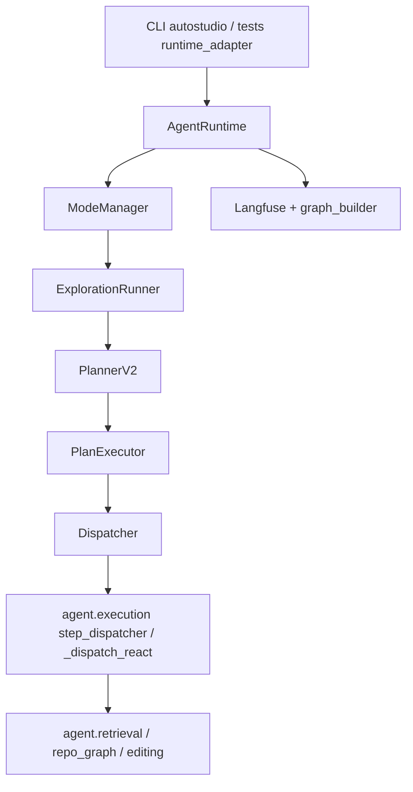
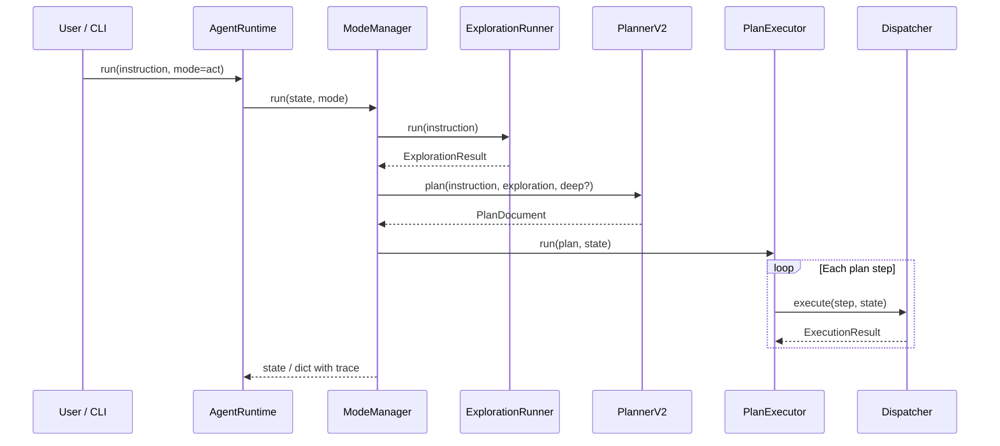
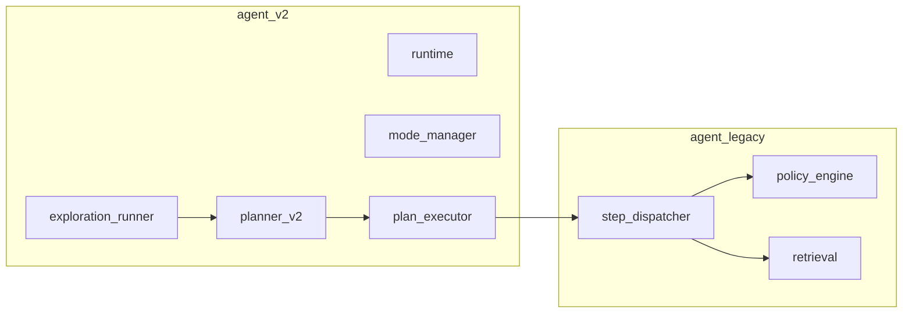

# AutoStudio

[](https://github.com/Pugsy-Explores/AutoCodeStudio)
[](https://github.com/Pugsy-Explores/AutoCodeStudio)
[](https://www.python.org/downloads/)

Repository-aware coding agent: **exploration → structured plan → tool execution** (`agent_v2/`), with traces, execution graphs, and safety limits.

---

## Table of contents

| | |
|--|--|
| [Prerequisites](#prerequisites) | [Testing](#testing) |
| [Quickstart](#quickstart) | [Observability](#observability-langfuse) |
| [Installation](#installation) | [Architecture](#1-overview) |
| [Configuration](#configuration) | [Diagrams](#4-diagrams) |
| [CLI](#cli) | [Project structure](#5-project-structure) |
| | [Known limitations](#8-known-issues--legacy-parts) |

---

## Prerequisites

| Requirement | Notes |
|-------------|--------|
| **Python** | **3.10+** (`requires-python` in `pyproject.toml`). |
| **LLM endpoint** | OpenAI-compatible HTTP API (see `agent/models/models_config.json`). Defaults point at **localhost** ports (`8081`, `8082`, `8003`); adjust for your stack. |
| **Network** | Runtime calls your configured model endpoints; optional Langfuse for traces. |
| **Disk** | Writable project tree for indexing (`.symbol_graph/`), patches, and optional `.agent_memory/`. |

**Not required for unit tests:** a live LLM if tests are mocked or markers skipped (see [Testing](#testing)).

---

## Quickstart

```bash
# 1. Clone and enter the repo
cd AutoStudio

# 2. Create a virtualenv (recommended)
python3.10 -m venv .venv && source .venv/bin/activate   # Windows: .venv\Scripts\activate

# 3. Install package + test extras
pip install -U pip
pip install -e ".[test]"

# 4. Point models at your OpenAI-compatible server (override JSON defaults)
export MODEL_API_KEY="your-key"   # or "none" for local servers that ignore auth

# 5. Run the CLI against a repo (defaults to cwd if SERENA_PROJECT_DIR unset)
export SERENA_PROJECT_DIR="$(pwd)"
autostudio explain "AgentRuntime"
# or
autostudio edit "List the main entrypoints in this codebase"
```

Smoke-check imports: `python -c "from agent_v2.runtime.bootstrap import create_runtime; print('ok')"`

---

## Installation

**Editable install (recommended for development):**

```bash
pip install -e ".[test]"
```

This installs the `autostudio` console script (`pyproject.toml` → `agent.cli.entrypoint:main`) and dependencies (`openai`, `pydantic`, `langfuse`, `tree-sitter`, …).

**Optional UI (execution graph):**

```bash
cd ui && npm install && npm run dev
```

See [`ui/README.md`](ui/README.md).

---

## Configuration

### Environment variables (essential)

| Variable | Purpose |
|----------|---------|
| **`MODEL_API_KEY`** | Bearer token for LLM HTTP calls; overrides `agent/models/models_config.json`. Use `none` if the server does not require auth. |
| **`SERENA_PROJECT_DIR`** | Absolute path to the repository under edit. If unset, CLI helpers use **current working directory**. |

Endpoints and per-task model routing are defined in **`agent/models/models_config.json`** (`models.*.endpoint`, `task_models`). Override patterns are documented in [`Docs/CONFIGURATION.md`](Docs/CONFIGURATION.md) (router/planner envs such as `ROUTER_LLM_MODEL` when applicable).

### Runtime and safety (common)

| Variable | Default | Purpose |
|----------|---------|---------|
| `REACT_MODE` | `1` | Policy/dispatch behavior when `agent_v2` sets `react_mode` in context (not the high-level orchestration mode). |
| `SKIP_STARTUP_CHECKS` | off | Set to `1` in tests/mocks to skip `ensure_services_ready()` (see `config/startup.py`). |
| `RETRIEVAL_DAEMON_AUTO_START` | `1` | Disable with `0` if you do not want the retrieval daemon started automatically. |

Full lists: **`config/`** modules (`agent_runtime.py`, `retrieval_config.py`, `editing_config.py`, …) and [`Docs/CONFIGURATION.md`](Docs/CONFIGURATION.md).

### Langfuse (optional)

If you use Langfuse observability, set the usual **`LANGFUSE_*`** credentials expected by `langfuse` (see `agent_v2/observability/`). Runs work without it; traces may be limited.

---

## CLI

```bash
autostudio --help
```

Common commands (see `agent/cli/entrypoint.py`):

| Command | Description |
|---------|-------------|
| `autostudio edit "<instruction>"` | Run **`agent_v2`** with `mode=act` (full pipeline). |
| `autostudio explain <symbol>` | Shortcut instruction: explain how a symbol works. |
| `autostudio trace ...` | Trace helpers (wraps `scripts/replay_trace.py`). |

**Modes** (for programmatic use): `act`, `plan`, `deep_plan`, `plan_execute` — see `agent_v2/cli_adapter.VALID_MODES` and `parse_mode`.

Programmatic usage:

```python
from agent_v2.runtime.bootstrap import create_runtime

runtime = create_runtime()
out = runtime.run("Your instruction", mode="act")
```

Use **`tests.utils.runtime_adapter`** for legacy-shaped dicts (`run_controller`, `run_hierarchical`) in tests.

---

## Testing

Install test dependencies: `pip install -e ".[test]"` (installs **pytest**).

```bash
# Default: full test collection under tests/ (excludes heavy fixture trees per pyproject norecursedirs)
pytest

# Fast feedback: skip slow tests
pytest -m "not slow"

# Integration tests (real services; see marker)
TEST_MODE=integration pytest -m integration

# agent_v2 live LLM phases (cost + latency)
AGENT_V2_LIVE=1 pytest tests/test_agent_v2_phases_live.py -m agent_v2_live
```

**Pytest markers** (from `pyproject.toml`):

| Marker | Meaning |
|--------|---------|
| `slow` | Long-running; exclude with `-m "not slow"`. |
| `integration` | Real services; use `TEST_MODE=integration`. |
| `agent_v2_live` | Live LLM; requires `AGENT_V2_LIVE=1`. |
| `replanner_regression` | Replanner prompt regression (live LLM). |

**Useful targets:**

| Suite | Command |
|-------|---------|
| Mode manager | `pytest tests/test_mode_manager.py` |
| Agent loop (unit) | `pytest tests/test_agent_v2_loop_retry.py` |
| Router eval (mock) | `python -m router_eval.router_eval --mock` |

CI tip: `SKIP_STARTUP_CHECKS=1` is often set in automated test environments to avoid daemon/bootstrap side effects.

---

## Observability (Langfuse)

When configured, runs emit structured traces (generations, tool spans). Execution graphs for the UI are built from trace payloads (`agent_v2/observability/graph_builder.py`). Optional dev server: `python -m agent_v2.observability.server` (see `ui/README.md`).

---

## 1. Overview

**What it does:** Turns an instruction into repository-grounded actions (search, read, edit, tests, shell) using a **planner-centric control plane** (`agent_v2/`): the model proposes a `PlanDocument`; execution walks that plan and fills per-step arguments. A **bounded exploration phase** runs first so the planner receives real context instead of guessing.

**What is different from a pure ReAct loop:** The architecture freeze (`Docs/architecture_freeze/ARCHITECTURE_FREEZE.md`) replaces “LLM picks the next tool forever” with **plan as source of truth** for execution. In code, `ModeManager` routes `act` through **ExplorationRunner → PlannerV2 → PlanExecutor**, not through the composable `AgentLoop` class (see [Known issues](#8-known-issues--legacy-parts)).

**IDE / automation:** Prefer **`autostudio`** or `create_runtime()`; do **not** call `agent.orchestrator.run_controller` (it **raises**).

---

## 2. Architecture

### High level

1. **`AgentRuntime`** (`agent_v2/runtime/runtime.py`) — composes dispatcher, optional `PlanExecutor`, `ExplorationRunner`, `ModeManager`, and observability (Langfuse trace, graph projection).
2. **`ModeManager`** (`agent_v2/runtime/mode_manager.py`) — selects pipeline by **mode** string.
3. **Exploration** — read-only, bounded steps (search / open_file / shell) producing `ExplorationResult`.
4. **Planner** — `PlannerV2` emits a validated **`PlanDocument`** (steps with tool actions).
5. **Tool execution** — `PlanExecutor` runs steps via **`Dispatcher`** → legacy **`_dispatch_react`** (`agent/execution/step_dispatcher.py`), with retries and optional replan (`Replanner`).

### Key concepts

| Concept | Role |
|--------|------|
| **Plan** (`plan` mode) | Exploration → planner (`deep=False`) → **no** `PlanExecutor`; returns `AgentState` with `current_plan` and trace for UI/API. |
| **Deep plan** (`deep_plan` mode) | Same as plan but planner called with **`deep=True`** (stronger “thorough plan” prompt). |
| **Act** (`act` or `plan_execute`) | Exploration → planner (`deep=False`) → **`PlanExecutor.run`** (full tool execution + replan). |
| **Agent loop** | The class **`AgentLoop`** (`agent_v2/runtime/agent_loop.py`) implements a generic ReAct-style loop (action → dispatch → observe). It is **wired on `AgentRuntime` but not used** by `ModeManager` for `act` (see tests `test_mode_manager.py`). |
| **Tool execution** | Structured steps from `PlanDocument`; `PlanArgumentGenerator` may call the model for **arguments only** per step policy. |
| **Memory / state** | **`AgentState`** (`agent_v2/state/agent_state.py`): `instruction`, `history`, `context`, `exploration_result`, `current_plan` / `current_plan_steps`, `step_results`, `metadata`. |

### Deviation from ArchitectureFreeze

- **Intended** (freeze): planner-centric pipeline, plan decides next step at execution time.
- **Code:** matches for **`act`**. The separate **`AgentLoop`** module exists for tests/alternate wiring; default production path does not call `AgentLoop.run()` from `ModeManager`.

---

## 3. Execution flow (lifecycle)

**Modes `act` / `plan_execute`:**

1. Build `AgentState`, set `metadata["mode"]`, create Langfuse root trace.
2. `ModeManager._run_explore_plan_execute`: set `context["react_mode"] = True` (interacts with `REACT_MODE` in `config/agent_runtime.py` inside dispatch/policy paths).
3. **ExplorationRunner.run** — until cap or stop: propose next exploration action (JSON ReAct shape), validate, dispatch (read-only allowlist).
4. If exploration metadata says incomplete → **RuntimeError** (gated planning).
5. **PlannerV2.plan** — `ExplorationResult` → **`PlanDocument`**.
6. **PlanExecutor.run** — for each step: validate, merge args, dispatch tool, retries, **Replanner** on exhaustion (policy limits).
7. Normalize result: `status`, `trace`, `graph`, `state`; finalize Langfuse trace.

**Modes `plan` / `deep_plan`:** steps 1–5 only (no `PlanExecutor`); attach plan-only trace for Phase 13-style observability.

---

## 4. Diagrams

### a) System architecture



### b) Agent loop (logical vs class)



### c) Module interaction



---

## 5. Project structure

| Path | Purpose |
|------|---------|
| **`agent_v2/`** | Current runtime: `AgentRuntime`, `ModeManager`, `PlanExecutor`, `ExplorationRunner`, schemas, observability. See [`agent_v2/README.md`](agent_v2/README.md). |
| **`agent/`** | Legacy integration: execution dispatch, retrieval, models, CLI, prompts. **Orchestrator `run_controller` removed** (raises). |
| **`planner/`** | Standalone **legacy** JSON planner + `planner_eval`; production plans come from **`agent_v2/planner/planner_v2.py`**. |
| **`config/`** | Env-backed limits and flags (`REACT_MODE`, retrieval, editing). |
| **`editing/`** | Patch pipeline: diff plan → validate → execute. |
| **`repo_index/`**, **`repo_graph/`** | Symbol index and graph for retrieval. |
| **`router_eval/`** | Instruction-router evaluation harness. |
| **`ui/`** | Execution graph visualization (React Flow). |
| **`tests/utils/runtime_adapter.py`** | **`run_controller` / `run_hierarchical`** → `create_runtime().run()`. |
| **`Docs/architecture_freeze/`** | Normative design reference; schemas in `SCHEMAS.md`. |

---

## 6. End-to-end example

1. `export SERENA_PROJECT_DIR=/path/to/repo` (or rely on cwd).
2. `autostudio edit "Add a unit test for foo"` (or call `create_runtime().run("...", mode="act")`).
3. Exploration gathers files; planner emits steps like `open_file` → `edit` → `run_tests`.
4. `PlanExecutor` runs each step; failures retry per `ExecutionPolicy`; replan may produce a new `PlanDocument`.
5. API/CLI output via `agent_v2/cli_adapter.format_output`: `status`, `trace`, `plan`, `result` (history).

---

## 7. Development guide

- **New tool behavior:** Extend **`agent/execution/step_dispatcher.py`** dispatch paths; keep policy + trace hooks. Plan steps must map to allowed `PlanStep.action` values (`planner_v2.py` / schemas).
- **Tune exploration:** `agent_v2/config.py` (`EXPLORATION_STEPS`, `ENABLE_EXPLORATION_ENGINE_V2`, etc.).
- **Modes:** `agent_v2/cli_adapter.VALID_MODES` — `act`, `plan`, `deep_plan`, `plan_execute`.
- **Tests:** `pytest tests/test_mode_manager.py`, `tests/test_agent_v2_phases_live.py`, `tests/test_agent_v2_loop_retry.py` ( **`AgentLoop`** unit behavior).

---

## 8. Known issues / legacy parts

| Item | Status |
|------|--------|
| **`AgentLoop.run` in production `act`** | **Not used** by `ModeManager`; class kept for composition/tests. |
| **`agent/orchestrator.run_controller`** | **Raises** — use **`tests.utils.runtime_adapter`** or CLI. |
| **`planner/` package** | Legacy plan format + eval; **PlannerV2** is the live planner. |
| **`REACT_MODE` env** | Default **on**; affects dispatcher/policy when `react_mode` context is set — not the same as “ReAct is the main loop” (control plane is planner-centric). |
| **Docs under `Docs/`** | Many describe older pipeline/ReAct-primary narrative; trust **`agent_v2`** + this README for runtime behavior. |

---

## Quick reference

- **Bootstrap:** `from agent_v2.runtime.bootstrap import create_runtime`
- **Run:** `create_runtime().run("instruction", mode="act")`
- **Architecture intent:** [`Docs/architecture_freeze/ARCHITECTURE_FREEZE.md`](Docs/architecture_freeze/ARCHITECTURE_FREEZE.md)
- **Structured types:** [`Docs/architecture_freeze/SCHEMAS.md`](Docs/architecture_freeze/SCHEMAS.md)
- **Full config reference:** [`Docs/CONFIGURATION.md`](Docs/CONFIGURATION.md)
