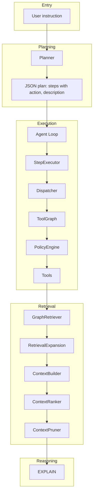

# AutoStudio

**A repository-aware autonomous coding agent** that plans, searches, edits, and explains codebases using LLMs and structured tool execution.

AutoStudio converts natural-language instructions into executable plans, runs code search (graph + vector + Serena fallback), ranks context, applies structured patches with conflict resolution, runs tests with repair loops, and persists task memory—all while respecting safety limits, policy-driven retries, and configurable model routing.

---

## Table of Contents

- [Architecture Overview](#architecture-overview)
- [Quick Start](#quick-start)
- [Project Structure](#project-structure)
- [Core Components](#core-components)
- [Execution Pipeline](#execution-pipeline)
- [Agent Controller (Full Pipeline)](#agent-controller-full-pipeline)
- [Configuration](#configuration)
- [Environment Variables](#environment-variables)
- [Tools and Adapters](#tools-and-adapters)
- [Testing](#testing)
- [Subsystems](#subsystems)
- [Repository Symbol Graph](#repository-symbol-graph-implemented)
- [Documentation](#documentation)

---

## Architecture Overview



**High-level flow:** Instruction → Plan → Execute steps (SEARCH / EDIT / INFRA / EXPLAIN) → Validate → Optional replan → Return state.

---

## Quick Start

### Prerequisites

- Python 3.10+
- OpenAI-compatible LLM endpoints (e.g. llama.cpp, vLLM, or OpenAI API)
- Optional: [Serena](https://github.com/oraios/serena) MCP server for code search

### Dependencies

```bash
pip install -r requirements.txt
# or
pip install openai>=1.0.0 PyYAML>=6.0 tree-sitter tree-sitter-python
pip install mcp  # optional, for Serena code search
pip install chromadb sentence-transformers  # optional, for vector search and task index
```

Core: `openai`, `PyYAML`, `tree-sitter`, `tree-sitter-python`. Serena adapter requires `mcp`. Vector search and task index require `chromadb` and `sentence-transformers` (graceful fallback when unavailable).

### Run the agent

```bash
# From project root — standard agent loop (plan → execute steps)
python -m agent "Find where the StepExecutor class is defined"

# Full pipeline — agent controller (repo map, conflict resolution, test repair, task memory)
python -c "from agent.orchestrator.agent_controller import run_controller; run_controller('Add logging to execute_step', project_root='.')"

# Or with explicit CLI
python -m agent.cli.run_agent "Explain how the dispatcher routes SEARCH steps"
```

### Index repository (symbol graph + optional embeddings)

```bash
python -m repo_index.index_repo /path/to/repo
# Creates .symbol_graph/index.sqlite, symbols.json, and optionally .symbol_graph/embeddings/ (when chromadb + sentence-transformers installed)
```

### Model endpoints

Configure `agent/models/models_config.json` or set:

- `SMALL_MODEL_ENDPOINT` — e.g. `http://localhost:8001/v1/chat/completions`
- `REASONING_MODEL_ENDPOINT` — e.g. `http://localhost:8002/v1/chat/completions`

---

## Project Structure

```
AutoStudio/
├── agent/                    # Core agent package
│   ├── cli/                  # CLI entry points
│   ├── execution/            # Step execution and dispatch
│   ├── memory/               # State, results, task memory, task index
│   │   ├── state.py          # AgentState
│   │   ├── task_memory.py    # save_task, load_task, list_tasks
│   │   └── task_index.py     # Vector index for past tasks (optional)
│   ├── models/               # Model client and config
│   ├── observability/        # Trace logging
│   │   └── trace_logger.py   # start_trace, log_event, finish_trace
│   ├── orchestrator/         # Agent loop, controller, validation
│   │   ├── agent_loop.py     # run_agent (standard loop)
│   │   └── agent_controller.py # run_controller (full pipeline)
│   ├── retrieval/            # Query rewrite, context building, ranking
│   │   ├── graph_retriever.py # Symbol lookup + 2-hop expansion
│   │   ├── vector_retriever.py # Embedding-based search (optional)
│   │   ├── retrieval_cache.py  # LRU cache for search results
│   │   ├── query_rewriter.py
│   │   ├── retrieval_expander.py
│   │   ├── context_builder.py
│   │   ├── context_ranker.py
│   │   └── context_pruner.py
│   ├── tools/                # Tool adapters
│   └── prompts/              # YAML prompts
├── repo_index/               # Repository indexing (Tree-sitter)
│   ├── indexer.py            # scan_repo, index_repo (parallel, optional embeddings)
│   ├── parser.py             # parse_file
│   ├── symbol_extractor.py   # extract_symbols
│   └── dependency_extractor.py # extract_edges
├── repo_graph/               # Symbol graph storage and query
│   ├── graph_storage.py      # SQLite nodes/edges
│   ├── graph_builder.py      # build_graph
│   ├── graph_query.py        # find_symbol, expand_neighbors
│   ├── repo_map_builder.py   # High-level architectural map
│   └── change_detector.py    # Semantic change impact (risk levels)
├── editing/                  # Diff planning, conflict resolution, patches
│   ├── diff_planner.py       # plan_diff (EDIT step)
│   ├── conflict_resolver.py  # Detect and resolve edit conflicts
│   ├── semantic_diff.py      # AST-aware overlap detection
│   ├── merge_strategies.py   # merge_sequential, merge_three_way
│   ├── patch_generator.py    # to_structured_patches
│   ├── patch_executor.py     # execute_patch (with rollback)
│   ├── patch_validator.py    # validate_patch
│   ├── ast_patcher.py        # AST patching
│   └── test_repair_loop.py   # Run tests, repair on failure
├── planner/
├── router_eval/
├── Docs/                     # See Docs/README.md for index
├── mcp_retriever.py          # Optional ChromaDB retrieval API (legacy)
├── index_repo.py             # Legacy embedding indexer
└── tests/
```

---

## Core Components

| Component | Role |
|-----------|------|
| **run_agent** | Entry point: plan → state → execute loop → validate → replan until finished |
| **plan(instruction)** | Planner: LLM + JSON parse → `{steps: [{id, action, description, reason}]}` |
| **StepExecutor** | Calls `dispatch(step, state)`; wraps result in `StepResult` |
| **dispatch** | Routes by action to PolicyEngine (SEARCH/EDIT/INFRA) or EXPLAIN |
| **ToolGraph** | Per-node `allowed_tools` and `preferred_tool`; restricts transitions |
| **ExecutionPolicyEngine** | Retry loop with mutation; injects search_fn, edit_fn, infra_fn, rewrite_query_fn |
| **validate_step** | Rule-based or LLM YES/NO; fallback to rules on error |
| **replan** | Stub: returns plan of remaining steps on failure |

---

## Execution Pipeline

### Step actions

| Action | Policy | Retry condition | Mutation |
|--------|--------|-----------------|----------|
| SEARCH | 5 attempts | empty_results | query_variants (rewrite + attempt_history) |
| EDIT | 2 attempts | symbol_not_found | symbol_retry |
| INFRA | 2 attempts | non_zero_exit | retry_same |
| EXPLAIN | 1 attempt | — | — |

### SEARCH pipeline

```
SEARCH
  → policy_engine.search()
      → retrieval_cache.get_cached() [if RETRIEVAL_CACHE_SIZE > 0]
      → _search_fn: graph_retriever.retrieve_symbol_context(query) first
      → if no results: vector_retriever.search_by_embedding(query) [if ENABLE_VECTOR_SEARCH]
      → if still empty: search_code (Serena MCP) fallback
      → retrieval_cache.set_cached() on success
  → _run_retrieval_expansion()
      → expand_search_results()
      → build_context_from_symbols()
      → context_ranker.rank_context()      [when ENABLE_CONTEXT_RANKING=1]
      → context_pruner.prune_context()
  → state.context["ranked_context"]
```

- **Retrieval stack:** Graph retriever → vector search → Serena fallback. Graph uses `.symbol_graph/index.sqlite`; vector uses `.symbol_graph/embeddings/` (ChromaDB).
- **Query rewrite:** `rewrite_query_with_context(planner_step, user_request, attempt_history)` — LLM or passthrough
- **Retrieval expansion:** Expands search results into `read_symbol_body` / `read_file` actions (capped at 5 files)
- **Context builder:** Deduplicates symbols, references, files; limits total chars
- **Context ranker:** Hybrid score = 0.6×LLM + 0.2×symbol_match + 0.1×filename_match + 0.1×reference_score − same_file_penalty; **batch LLM** (one prompt for all snippets); **diversity penalty** (−0.1 per duplicate from same file); caps at 20 candidates
- **Context pruner:** Max 6 snippets, 8000 chars; deduplicate by (file, symbol)

### EDIT pipeline (when ENABLE_DIFF_PLANNER=1)

```
EDIT
  → diff_planner.plan_diff(instruction, context)
  → conflict_resolver.resolve_conflicts() — same symbol, same file, semantic overlap
  → patch_generator.to_structured_patches()
  → patch_executor.execute_patch() — AST patching, rollback on failure
  → repo_index.update_index_for_file() on success
```

- **Diff planner:** Identifies affected symbols, queries graph for callers.
- **Conflict resolver:** Splits conflicting edits into sequential groups.
- **Patch executor:** Applies validated patches; max 5 files, 200 lines per patch.

### EXPLAIN

- Uses `ranked_context` as primary evidence when non-empty; else falls back to `search_memory` and `context_snippets`
- Model from `task_models["EXPLAIN"]` (default: REASONING_V2 for new features)
- Empty output → `"[EXPLAIN: no model output]"`

---

## Agent Controller (Full Pipeline)

`run_controller(instruction, project_root)` orchestrates the complete development workflow without modifying `agent_loop` or `StepExecutor`:

```
instruction
  → build_repo_map() — high-level architectural map
  → search_similar_tasks() — vector index of past tasks (optional)
  → planner.plan(instruction)
  → while task_not_complete:
        step = next_step()
        if SEARCH: dispatch (graph → vector → Serena)
        if EDIT: plan_diff → conflict_resolver → run_with_repair → change_detector → update_index
        validate step; if failure: replan
  → save_task() — persist to .agent_memory/tasks/
  → return task summary
```

**Safety limits:** max 5 files edited, 200 lines per patch, 15 min task runtime.

**Test repair loop:** After patch execution, runs tests (pytest); on failure, plans repair and retries (max 3 attempts). Supports flaky test detection and compile step before tests.

**Trace logging:** Events stored in `.agent_memory/traces/`.

---

## Configuration

### models_config.json

```json
{
  "models": {
    "SMALL": { "name": "Qwen 2B", "endpoint": "http://localhost:8001/v1/chat/completions" },
    "REASONING": { "name": "Qwen 9B", "endpoint": "http://localhost:8002/v1/chat/completions" },
    "REASONING_V2": { "name": "Qwen 14B", "endpoint": "http://localhost:8003/v1/chat/completions" }
  },
  "task_models": {
    "query rewriting": "REASONING",
    "validation": "REASONING",
    "EXPLAIN": "REASONING_V2",
    "routing": "REASONING",
    "planner": "REASONING_V2",
    "context_ranking": "REASONING_V2"
  },
  "task_params": {
    "EXPLAIN": { "temperature": 0.0, "max_tokens": null, "request_timeout_seconds": 600 },
    "planner": { "temperature": 0.0, "max_tokens": 1024, "request_timeout_seconds": 600 },
    "context_ranking": { "temperature": 0.0, "max_tokens": 256, "request_timeout_seconds": 60 }
  }
}
```

- **models:** Maps model key (SMALL, REASONING, REASONING_V2) → name and endpoint
- **task_models:** Maps task name → model key (new features use REASONING_V2)
- **task_params:** Per-task temperature, max_tokens, timeout

---

## Environment Variables

| Variable | Purpose |
|----------|---------|
| `SMALL_MODEL_ENDPOINT` | Override small model URL |
| `REASONING_MODEL_ENDPOINT` | Override reasoning model URL |
| `MODEL_API_KEY` | API key for model endpoints |
| `MODEL_TEMPERATURE` | Default temperature |
| `MODEL_MAX_TOKENS` | Default max tokens |
| `MODEL_REQUEST_TIMEOUT` | Default request timeout (seconds) |
| `REASONING_V2_MODEL_ENDPOINT` | Override REASONING_V2 endpoint |
| `ENABLE_TOOL_GRAPH` | 1 (default) or 0 — restrict tools by graph |
| `ENABLE_CONTEXT_RANKING` | 1 (default) or 0 — rank and prune context before EXPLAIN |
| `ENABLE_VECTOR_SEARCH` | 1 (default) or 0 — use embedding search when graph returns nothing |
| `RETRIEVAL_CACHE_SIZE` | LRU cache size for search results (default 100); 0 to disable |
| `INDEX_EMBEDDINGS` | 1 (default) or 0 — build ChromaDB embedding index during index_repo |
| `INDEX_PARALLEL_WORKERS` | Parallel file parsing workers (default 8) |
| `SERENA_PROJECT_DIR` | Project root for Serena MCP |
| `SERENA_USE_PLACEHOLDER` | 1 to disable Serena (return empty results) |
| `SERENA_VERBOSE` | 1 for Serena debug logs |
| `PLANNER_MAX_TOKENS` | Max tokens for planner (default 1024) |
| `ENABLE_DIFF_PLANNER` | 1 (default) or 0 — EDIT returns planned changes vs read_file |
| `TEST_REPAIR_ENABLED` | 1 (default) or 0 — run tests after patch; 0 = patch only |
| `COMPILE_BEFORE_TEST` | 1 (default) or 0 — run py_compile before tests |

---

## Tools and Adapters

| Tool | Adapter | Purpose |
|------|---------|---------|
| `retrieve_symbol_context` | graph_retriever | Graph-based symbol lookup + 2-hop expansion (when index exists) |
| `search_by_embedding` | vector_retriever | Semantic code search via ChromaDB (when graph returns nothing) |
| `search_code` | serena_adapter | Serena MCP: find_symbol, search_for_pattern (fallback) |
| `read_file` | filesystem_adapter | Read file contents |
| `write_file` | filesystem_adapter | Write file contents |
| `list_files` | filesystem_adapter | List directory |
| `find_referencing_symbols` | reference_tools | Stub; wire to Serena when available |
| `read_symbol_body` | reference_tools | Read symbol body (or file window) |
| `run_command` | terminal_adapter | Execute shell command |
| `lookup_docs` | context7_adapter | Optional doc lookup |

**Serena MCP:** Requires `mcp` package and Serena installed (e.g. `uvx serena start-mcp-server`). When unavailable, `search_code` returns empty results.

**Repository indexing:** Build a symbol graph for instant graph-based retrieval:

```bash
python -m repo_index.index_repo /path/to/repo
```

Creates `.symbol_graph/index.sqlite` and `symbols.json`. SEARCH uses graph retriever when index exists.

---

## Testing

```bash
# From workspace root (parent of AutoStudio)
python -m pytest AutoStudio/tests/ -v

# Specific suites
python -m pytest AutoStudio/tests/test_context_ranker.py -v
python -m pytest AutoStudio/tests/test_tool_graph.py -v
python -m pytest AutoStudio/tests/test_policy_engine.py -v
python -m pytest AutoStudio/tests/test_indexer.py AutoStudio/tests/test_symbol_graph.py -v  # repo index + graph
```

Tests mock LLM calls where appropriate (e.g. `test_context_ranker.py` mocks `call_reasoning_model`).

---

## Subsystems

### Planner

- Converts instruction → JSON plan with steps `{id, action, description, reason}`
- Actions: EDIT, SEARCH, EXPLAIN, INFRA
- Evaluation: `python -m planner.planner_eval`

### Router Eval

- Phased router evaluation harness
- Swap routers by changing import in `router_eval.py`
- Run: `python -m router_eval.router_eval`

### Optional: ChromaDB and embeddings

- **Vector search:** `agent/retrieval/vector_retriever.py` — semantic search when graph returns nothing. Index built by `repo_index.index_repo` when `INDEX_EMBEDDINGS=1` (requires `chromadb`, `sentence-transformers`).
- **Task index:** `agent/memory/task_index.py` — vector index of past tasks for `search_similar_tasks`.
- **Legacy:** `index_repo.py`, `mcp_retriever.py` — standalone embedding indexer and FastAPI endpoint.

---

## Repository Symbol Graph (Implemented)

AutoStudio includes **repository structure awareness**:

- **Indexing:** `repo_index` — Tree-sitter parser, parallel file parsing, symbol extraction, dependency edges; optional embedding index
- **Graph:** `repo_graph` — SQLite storage, 2-hop expansion
- **Repo map:** `repo_graph/repo_map_builder` — high-level architectural map (modules, dependencies)
- **Change detector:** `repo_graph/change_detector` — affected callers, risk levels (LOW/MEDIUM/HIGH)
- **Retrieval:** `graph_retriever` → `vector_retriever` → Serena fallback
- **Diff planning:** `editing/diff_planner` — planned changes with affected symbols and callers
- **Conflict resolution:** `editing/conflict_resolver` — same symbol, same file, semantic overlap
- **Test repair:** `editing/test_repair_loop` — run tests, repair on failure, flaky detection, compile step

See [Docs/REPOSITORY_SYMBOL_GRAPH.md](Docs/REPOSITORY_SYMBOL_GRAPH.md) for details.

---

## Documentation

| Doc | Description |
|-----|--------------|
| [Docs/AGENT_LOOP_WORKFLOW.md](Docs/AGENT_LOOP_WORKFLOW.md) | Step dispatch, SEARCH/EDIT/INFRA/EXPLAIN flows, policy engine, model routing |
| [Docs/AGENT_CONTROLLER.md](Docs/AGENT_CONTROLLER.md) | Full pipeline: run_controller, safety limits, test repair, task memory |
| [Docs/REPOSITORY_SYMBOL_GRAPH.md](Docs/REPOSITORY_SYMBOL_GRAPH.md) | Symbol graph, repo map, change detector, vector search |
| [Docs/CODING_AGENT_ARCHITECTURE_GUIDE.md](Docs/CODING_AGENT_ARCHITECTURE_GUIDE.md) | Architecture patterns, anti-patterns, production practices |

---

## License and Contributing

See project root for license.
