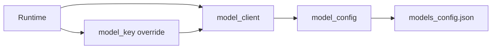

# Models Subsystem (`agent/models/`)

Model routing and client layer. All LLM calls should flow through this package to keep configuration, observability, and safety consistent.

---

## 1. Responsibilities

- **Model clients:** Perform HTTP calls to configured endpoints with consistent timeouts/params.
- **Task routing:** Map tasks (routing/planning/reasoning/reranking-fallback) to model choices via `models_config.json`.
- **Model override:** Support per-task model key override at runtime (e.g., gamma model for planning).
- **Configuration surface:** Expose resolved endpoints and model names for runtime wiring.

---

## 2. Public API

Exports from `agent/models/__init__.py`:

- Clients: `call_small_model`, `call_reasoning_model`
- Routing: `get_model_for_task`, `route_task`
- Types: `ModelType`
- Resolved config: `SMALL_MODEL_ENDPOINT`, `REASONING_MODEL_ENDPOINT`, `SMALL_MODEL_NAME`, `REASONING_MODEL_NAME`

---

## 3. Key files

| File | Role |
|------|------|
| `model_client.py` | Purpose-built client wrapper for OpenAI-compatible HTTP API. Handles timeouts, retries, auth, structured output. |
| `model_config.py` | Load and cache `models_config.json`; expose helpers for per-task model lookup (e.g., `get_model_for_task("planner")`). |
| `model_router.py` | Simple router; currently unused (no advanced routing logic yet). |
| `models_config.json` | Configuration file: endpoints, model keys, task-to-model mapping. |

---

## 4. Model override system

### Override mechanism

Runtime can override the model key for a specific task on a per-call basis. Example: use gamma model for planning while beta handles reasoning.

### How it works

1. **Default:** `model_config.get_model_for_task("planner")` returns model key from `models_config.json`.
2. **Override:** Runtime can pass `model_key="gamma-xyz"` to `model_client.call_*` methods.
3. **No routing system yet:** Override is manual; no automatic multi-model routing like "use small for QIP, large for synthesis".

### Override examples

```python
# Default (from config)
call_reasoning_model(prompt, model_key=None)

# Override (specific model)
call_small_model(prompt, model_key="custom-model-key")
```

Planner and other runtime components can pass `model_key` to override.

---

## 5. Current limitations

### No advanced routing

TODAY:
- Manual override only.
- No conditional routing based on instruction complexity, cost, or latency constraints.
- No experimentation/ab testing between models.

### No multi-model orchestration

TODAY:
- Single model per task per call.
- No automatic fallback if primary model fails.
- No load balancing across multiple endpoints for the same task.

### Simple routing stub

`model_router.py` exists but contains minimal logic. The router is **not** used in production flows. Direct model selection dominates.

---

## 6. Configuration

`models_config.json` defines:

- `models.*.endpoint`: Base URL for each model.
- `models.*.api_key`: Auth token (or `"none"`).
- `task_models`: Mapping from task type to model key (e.g., `{"planner": "gpt-4", "reasoning": "gpt-4"}`).

Env override: `MODEL_API_KEY` can replace or supplement config.

---

## 7. Data flow



1. Runtime calls `call_*` methods with optional `model_key`.
2. `model_client` resolves endpoint from `model_config`.
3. HTTP request sent with auth, timeout, structured output if needed.
4. Response parsed and returned.

---

## 8. Invariants

- **No direct LLM calls in business logic:** Orchestrator, planner, retrieval rankers, etc. must use this layer (or the configured model router) rather than calling vendor SDKs directly.
- Keep request parameters deterministic for evaluation where possible.
- All model calls observability via Langfuse (if configured).

---

## 9. What it DOES NOT do

- Does not implement advanced routing algorithms (cost-aware, latency-aware, etc.).
- Does not provide multi-model automatic experiments (A/B testing, etc.).
- Does not cache responses across calls (that's handled by caller if needed).
- Does not handle fine-tuning or model training.

---

## 10. Edge cases

- **Missing config:** If `models_config.json` invalid or missing, `model_config` raises errors on load.
- **Invalid model key:** Runtime override with unknown key may result in 404 from endpoint.
- **Timeout:** Default timeouts apply; caller may adjust via client parameters.