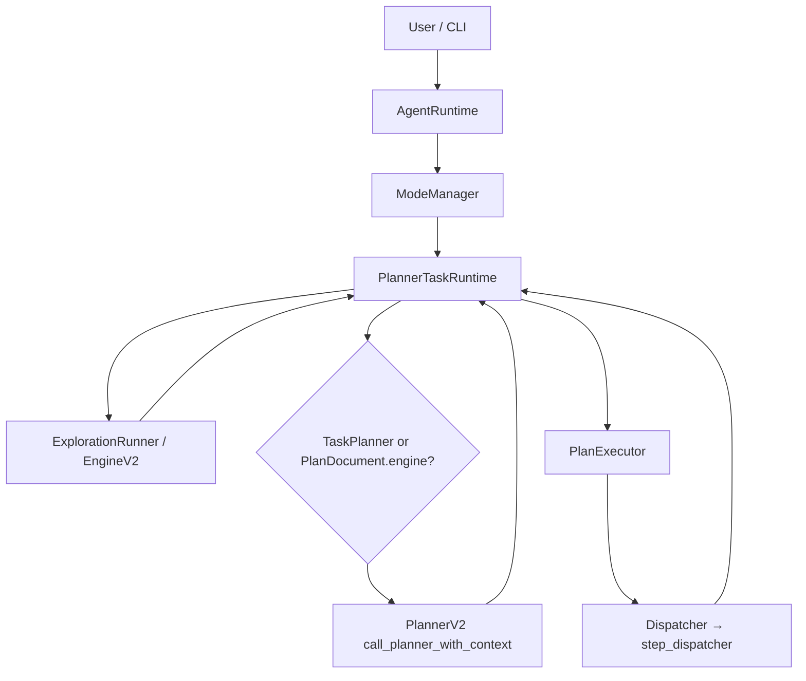

# `agent_v2/` — Agent runtime (implementation truth)

Structured pipeline: **bounded exploration → optional answer synthesis → ACT controller loop (TaskPlanner or PlannerV2-derived decisions) → `PlanExecutor`**. Types live under `schemas/`; orchestration under `runtime/` and `planning/`.

---

## 1. Purpose

**Does:** Wire `AgentRuntime`, `ModeManager`, exploration (`ExplorationEngineV2` via `ExplorationRunner`), **PlannerTaskRuntime** (single owner of the ACT/plan-safe outer loop), gated **PlannerV2** calls, and **PlanExecutor** (step runner + bounded replan). Expose Langfuse/trace hooks.

**Does not:** Replace the legacy `agent/` execution engine; act as a free-form ReAct chatbot; let PlannerV2 own the control loop when `AGENT_V2_TASK_PLANNER_AUTHORITATIVE_LOOP=1`.

---

## 2. Responsibilities (strict)

| | |
|--|--|
| **Owns** | Mode routing; exploration→plan→execute sequencing; `PlannerDecisionSnapshot` construction; TaskPlanner vs engine decision selection; metadata keys for loop accounting; task working memory + conversation store hooks. |
| **Does not own** | Raw tool dispatch implementation (`agent/execution/step_dispatcher`); retrieval indexing; editing pipeline internals. |

---

## 3. Control flow

---

## 4. Loop behavior

| Surface | Loop? | Bounds / stop |
|---------|-------|----------------|
| **ExplorationEngineV2** | Yes (inner engine) | `EXPLORATION_MAX_STEPS`, stagnation, refine cycles, utility stop — see `exploration/README.md`. |
| **`_run_act_controller_loop`** | Yes (outer) | `AGENT_V2_MAX_ACT_CONTROLLER_ITERATIONS` (default 256), `AGENT_V2_MAX_PLANNER_CONTROLLER_CALLS` (default 16), `AGENT_V2_MAX_SUB_EXPLORATIONS_PER_TASK` (default 2). |
| **`plan_legacy` mode** | Single-pass planner | No controller loop; plan-only trace. |
| **Controller disabled** | `AGENT_V2_PLANNER_CONTROLLER_LOOP=0` | One PlannerV2 call + full `PlanExecutor.run`. |

---

## 5. Inputs / outputs

- **In:** `instruction: str`, `mode` ∈ `act`, `plan_execute`, `plan`, `deep_plan`, `plan_legacy`; `AgentState` with `context`, `metadata`.
- **Out:** `dict` with `state` and/or `trace` (see `runtime/runtime.py` / `cli_adapter.format_output`).

---

## 6. State / memory

| Layer | Location | Role |
|-------|----------|------|
| **Task working memory** | `state.context["task_working_memory"]` | Per-instruction counters, exploration hashes, completed-step kinds. Reset at runtime entry. |
| **Conversation memory** | `state.context["conversation_memory_store"]` | Turn summaries + rolling summary; session id from `metadata["chat_session_id"]`. |
| **Planner session memory** | `state.context["planner_session_memory"]` | Planner/executor session facts for prompts. |
| **Decision snapshot** | Ephemeral `PlannerDecisionSnapshot` | Built in runtime; not persisted as a blob. |

---

## 7. Edge cases

- **Empty instruction:** `RuleBasedTaskPlannerService` returns `stop`; runtime exits loop accordingly when authoritative.
- **Planner budget exhausted:** `metadata["planner_loop_abort"]` = `planner_controller_budget_exhausted`; executor finalizes as failed.
- **Authoritative + explore gated:** sets `task_planner_last_loop_outcome` to `explore_gate:*` and **continues** loop (snapshot consumes outcome next iteration).
- **Shadow mode:** engine decision still drives behavior; mismatch flagged in metadata only.

---

## 8. Integration points

- **Upstream:** CLI / `create_runtime()`, prompts, `agent.models` for LLM calls.
- **Downstream:** `PlanValidator`, `Replanner`, `Dispatcher`, retrieval/editing via legacy dispatch.

---

## 9. Design principles

- **Planner vs executor:** PlannerV2 **materializes** `PlanDocument`; **PlannerTaskRuntime** chooses *whether* to call PlannerV2, explore again, synthesize, or run one executor step.
- **Small models:** Exploration stages (QIP, scoper, selector, analyzer) and answer synthesis use bounded prompts (`agent_v2/config.py`).
- **Bounded hierarchy:** Outer ACT loop + inner exploration loop + executor step loop; each has explicit caps.

---

## 10. Anti-patterns

- Calling PlannerV2 on every outer iteration without `should_call_planner_v2` gating (breaks authoritative TaskPlanner semantics).
- Storing raw code blobs in conversation memory (`FORBIDDEN_CONTENT_KEYS` in `memory/conversation_memory.py`).
- Using `AgentLoop` as the production `act` path — `ModeManager` uses `PlannerTaskRuntime`, not `AgentLoop.run()`.

---

## Layout

| Path | Role |
|------|------|
| `runtime/` | `AgentRuntime`, `ModeManager`, `PlannerTaskRuntime`, `PlanExecutor`, `ExplorationRunner`, dispatcher/tool policy — see `runtime/README.md`. |
| `planning/` | Task planner, decision snapshot, PlannerV2 gating, exploration outcome policy — see `planning/README.md`. |
| `exploration/` | `ExplorationEngineV2` pipeline — see `exploration/README.md`. |
| `memory/` | Task + conversation memory — see `memory/README.md`. |
| `planner/` | `PlannerV2` LLM plan generation (not controller). |
| `schemas/` | Pydantic contracts. |
| `config.py` | Central env-backed limits (`AGENT_V2_*`). |

---

## Control-plane evolution

| Era | Behavior |
|-----|----------|
| **Legacy default** | `PlannerDecision` derived from `PlanDocument.engine` / `controller` only (`planner_decision_from_plan_document`). |
| **Current (optional)** | Set `AGENT_V2_TASK_PLANNER_AUTHORITATIVE_LOOP=1`: **`TaskPlannerService.decide(PlannerDecisionSnapshot)`** is the control plane; PlannerV2 runs only when `should_call_planner_v2(...)` allows (bootstrap, plan/replan decisions, post-exploration merge, failure replan, progress refresh). |

See `planning/planner_v2_invocation.py` for the exact gate table.
