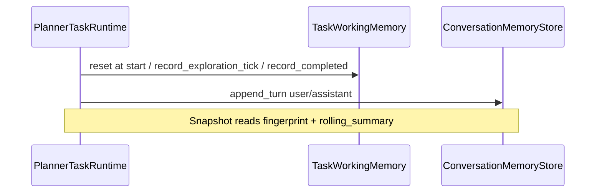

# `agent_v2/memory/` — Task and conversation memory

---

## 1. Purpose

**Does:** Hold **per-instruction task working memory** (`TaskWorkingMemory`) for exploration/planning signals; provide an **in-process conversation store** (`InMemoryConversationMemoryStore`) with turn summaries and rolling summary (no raw code blobs).

**Does not:** Replace the repo-wide `AgentState` object; persist across processes by default.

---

## 2. Responsibilities (strict)

```text
✔ owns
  TaskWorkingMemory model + reset_task_working_memory / task_working_memory_from_state
  InMemoryConversationMemoryStore + get_or_create_in_memory_store / get_session_id_from_state
  FORBIDDEN_CONTENT_KEYS for conversation records

❌ does not own
  Planner session memory (runtime/session_memory.py)
  ExplorationEngineV2 internal working memory (exploration/exploration_working_memory.py)
```

---

## 3. Control flow



---

## 4. Loop behavior

**Single-pass APIs:** `record_*`, `append_turn` are discrete calls. No internal loop.

**Compaction:** `InMemoryConversationMemoryStore.compact` truncates turns > 50 and rolls `rolling_summary` when oversized — triggered on `append_turn`.

---

## 5. Inputs / outputs

### Task working memory

- **Key:** `TASK_WORKING_MEMORY_CONTEXT_KEY` = `"task_working_memory"` on `state.context`.
- **Notable fields:** `outer_explore_iterations`, `last_exploration_query_hash`, `partial_streak`, `completed_steps`, `fingerprint()` for snapshots.

### Conversation memory

- **Store key:** `conversation_memory_store` on `state.context`.
- **Session:** `metadata["chat_session_id"]` or `"default"`.
- **Turn:** `role + text_summary` capped (8000 chars); forbidden keys listed in `FORBIDDEN_CONTENT_KEYS`.

---

## 6. State / memory interaction

**TaskWorkingMemory reads/writes:** Only through `task_working_memory_from_state` / `reset_task_working_memory` — callers must use `state.context` dict.

**Conversation:** `get_or_create_in_memory_store` mutates `state.context` once to attach store.

**Must not store:** Full file contents, raw snippets in conversation turn text (enforced by key ban + caller discipline).

---

## 7. Edge cases

- **Missing `state.context` dict:** `task_working_memory_from_state` raises `TypeError`.
- **Partial streak:** `partial_repeat_exhausted` used with `should_stop_after_exploration` when exploration stop policy enabled.
- **Default session:** Empty or missing `chat_session_id` → `"default"` session.

---

## 8. Integration points

- **Upstream:** `PlannerTaskRuntime`, `decision_snapshot.build_planner_decision_snapshot`, `answer_synthesizer` (policy), `exploration_outcome_policy`.

---

## 9. Design principles

- **Bounded summaries:** Fingerprints and rolling summaries keep small-model planner inputs cheap.
- **Explicit reset:** Task memory reset at each top-level runtime entry prevents cross-task leakage.

---

## 10. Anti-patterns

- Storing exploration evidence rows in `TaskWorkingMemory` — use `FinalExplorationSchema` on state.
- Serializing `InMemoryConversationMemoryStore` to disk without a migration/version scheme — not implemented.

---

## Related types

| Location | Role |
|----------|------|
| `runtime/session_memory.py` | Planner-facing session (last tool, active file) |
| `exploration/exploration_working_memory.py` | Engine-internal queue / visited state |
