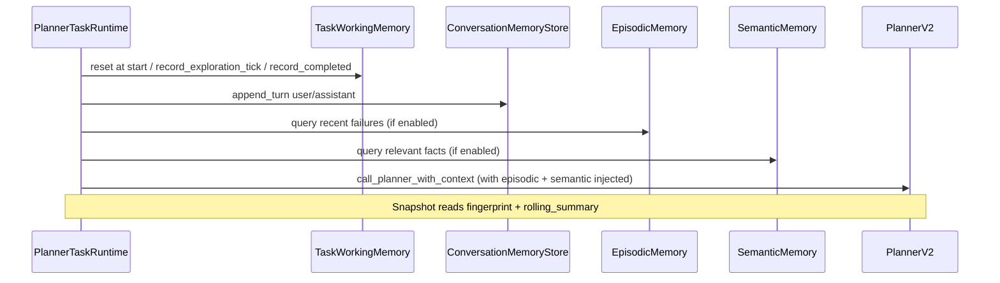

# `agent_v2/memory/` — Task, episodic, and semantic memory

---

## 1. Purpose

**Does:** Hold per-instruction task working memory (`TaskWorkingMemory`) for exploration/planning signals; provide an in-process conversation store (`InMemoryConversationMemoryStore`) with turn summaries and rolling summary; support episodic memory (recent failures log) and semantic memory (project facts).

**Does not:** Replace the repo-wide `AgentState` object; persist across processes by default (except episodic write-ahead log).

---

## 2. Responsibilities (strict)

```text
✔ owns
  TaskWorkingMemory model + reset_task_working_memory / task_working_memory_from_state
  InMemoryConversationMemoryStore + get_or_create_in_memory_store / get_session_id_from_state
  EpisodicMemory (write-ahead log) + query
  SemanticMemory (project facts directory)
  FORBIDDEN_CONTENT_KEYS for conversation records

❌ does not own
  Planner session memory (runtime/session_memory.py)
  ExplorationEngineV2 internal working memory (exploration/exploration_working_memory.py)
  Long-term persistent storage (except episodic log)
```

---

## 3. Memory layers

### Episodic memory (logs + query)

**What:** Recent tool failures and other events (e.g., `search:timeout`, `open_file:tool_error`).

**Location:** `.agent_memory/episodic/` (disk write-ahead log); queried at runtime.

**Injection:** Attach to planner context via `attach_episodic_failures_if_enabled` in `runtime/planner_task_runtime.py`.

**Advisory nature:** Planner uses to avoid repeating errors; exploration is source of truth. Advisory; conflicts with exploration → trust exploration.

**Limit:** Max 3 entries per prompt.

**Config flag:** `AGENT_V2_ENABLE_EPISODIC_INJECTION` (default: `0` / off).

### Semantic memory (facts)

**What:** Project-specific key-value facts (e.g., routing rules, policies, conventions).

**Location:** `.agent_memory/semantic/` (JSON files on disk, one per fact).

**Schema:** `{"key": string, "text": string}`.

**Injection:** Attach to planner context via `attach_semantic_facts_if_enabled` in `runtime/planner_task_runtime.py`.

**Query:** Text-based search on `active_file` + `instruction[:100]`; returns top 3 facts.

**Advisory nature:** Planner receives facts but does not rely on them as ground truth. Conflicts with exploration → trust exploration.

**Limit:** Max 3 facts per prompt.

**Config flag:** `AGENT_V2_ENABLE_SEMANTIC_INJECTION` (default: `False` / off).

### Session memory

**Location:** `state.context["planner_session_memory"]`.

**Type:** `SessionMemory` (class defined in `runtime/session_memory.py`). Not in this module.

**Content:** Short planner/executor session facts for prompts (e.g., last tool used, active file).

### Task working memory

**Location:** `state.context["task_working_memory"]` (key: `"task_working_memory"`).

**Content:** Per-instruction counters, exploration query hashes, completed-step kinds, fingerprint for snapshots.

**Lifecycle:** Reset when a new top-level run starts.

### Conversation memory

**Location:** `store` attached to `state.context["conversation_memory_store"]`.

**Content:** Turn summaries (user + assistant), rolling summary.

**Lifecycle:** In-process only; session ID from `metadata["chat_session_id"]` (default `"default"`).

**Compaction:** Truncates turns > 50 and rolls `rolling_summary` when oversized.

**Forbidden:** Raw code blobs, large snippets (enforced by `FORBIDDEN_CONTENT_KEYS`).

### state.memory vs state.context

- **`state.memory`**: Not used. Historically existed; current system uses `state.context` and `state.metadata`.
- **`state.context`**: Main working state: `task_working_memory`, `conversation_memory_store`, `planner_session_memory`, exploration results.

---

## 4. Control flow



---

## 5. Loop behavior

**Single-pass APIs:** `record_*`, `append_turn`, `query` are discrete calls. No internal loop.

**Compaction:** `InMemoryConversationMemoryStore.compact` truncates turns > 50 on `append_turn`.

---

## 6. Inputs / outputs

### Task working memory

- **Key:** `"task_working_memory"` on `state.context`.
- **Notable fields:** `outer_explore_iterations`, `last_exploration_query_hash`, `partial_streak`, `completed_steps`, `fingerprint()` for snapshots.

### Conversation memory

- **Store key:** `"conversation_memory_store"` on `state.context`.
- **Session:** `metadata["chat_session_id"]` or `"default"`.
- **Turn:** `role + text_summary` capped (8000 chars); forbidden keys listed in `FORBIDDEN_CONTENT_KEYS`.

### Episodic memory

- **Location:** Log directory from `get_agent_v2_episodic_log_dir()`.
- **Query:** `EpisodicMemory.query(limit=3)` returns recent entries.
- **Injection:** Runtime attaches to `planner_plan_context.episodic_failures`.

### Semantic memory

- **Location:** Directory from `get_semantic_memory_dir()`.
- **Query:** `SemanticMemory.query(query_text, limit=3)` returns relevant facts.
- **Injection:** Runtime attaches to `planner_plan_context.semantic_facts`.

---

## 7. State / memory interaction

**TaskWorkingMemory reads/writes:** Only through `task_working_memory_from_state` / `reset_task_working_memory` — callers must use `state.context` dict.

**Conversation:** `get_or_create_in_memory_store` mutates `state.context` once to attach store.

**Episodic/Semantic:** Query via `EpisodicMemory.query` / `SemanticMemory.query`; attach to planner context via object.__setattr (Pydantic-safe).

**Must not store:** Full file contents, raw snippets in conversation turn text (enforced by key ban + caller discipline).

---

## 8. Edge cases

- **Missing `state.context` dict:** `task_working_memory_from_state` raises `TypeError`.
- **Partial streak:** `partial_repeat_exhausted` used with `should_stop_after_exploration` when exploration stop policy enabled.
- **Default session:** Empty or missing `chat_session_id` → `"default"` session.
- **Episodic/Semantic disabled:** If config flags off, no blocks in planner prompt.
- **Empty episodic/semantic:** Query returns empty list; planner prompt omits advisory blocks.

---

## 9. Integration points

- **Upstream:** `PlannerTaskRuntime` (ticking task memory, attaching conversation turns, querying episodic/semantic), `decision_snapshot.build_planner_decision_snapshot` (reads conversation summary), `answer_synthesizer` (reads evidence for synthesis).
- **Downstream:** `planner/planner_v2.py` (receives episodic and semantic blocks for prompt composition).

---

## 10. Design principles

- **Bounded summaries:** Fingerprints and rolling summaries keep small-model planner inputs cheap.
- **Explicit reset:** Task memory reset at each top-level runtime entry prevents cross-task leakage.
- **Advisory memory:** Episodic and semantic facts are advisory; exploration is authority.

---

## 11. Anti-patterns

- Storing exploration evidence rows in `TaskWorkingMemory` — use `FinalExplorationSchema` on state.
- Serializing `InMemoryConversationMemoryStore` to disk without a migration/version scheme — not implemented.
- Treating episodic or semantic facts as ground truth — they are advisory.

---

## 12. Related types

|| Location | Role |
||----------|------|
|| `runtime/session_memory.py` | Planner-facing session (last tool, active file) |
|| `exploration/exploration_working_memory.py` | Engine-internal queue / visited state |

---

## 13. Module map

|| Module | Role |
||--------|------|
|| `task_working_memory.py` | Task working memory model and helpers |
|| `conversation_memory.py` | In-process conversation store |
|| `episodic_query.py` | Episodic memory query (log reader) |
|| `semantic_memory.py` | Semantic memory (project facts) |