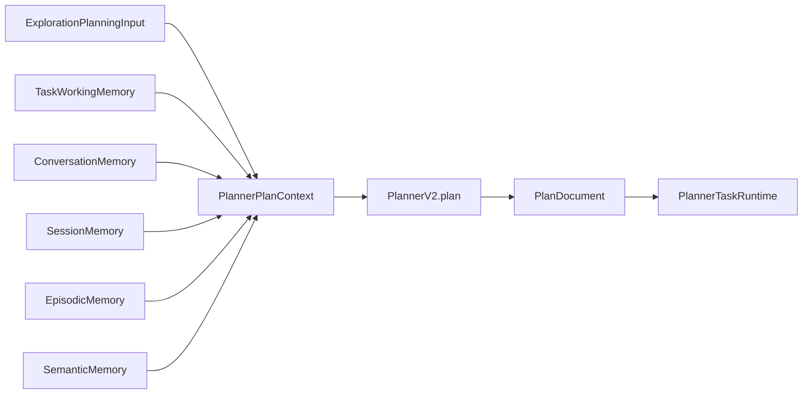

# `agent_v2/planner/` — PlannerV2 (plan generation, not control)

---

## 1. Purpose

**Does:** Generate structured `PlanDocument` with steps and control fields via LLM. Provides `PlannerPlanContext` for prompt assembly. Accepts episodic and semantic memory injection (advisory). Does not control execution loop.

**Does not:** Own the ACT controller loop, execute steps, or make high-level decisions (e.g., whether to explore again or stop).

---

## 2. Responsibilities (strict)

```text
✔ owns
  PlannerV2.plan — generate PlanDocument from PlannerPlanContext
  Prompt composition — exploration context, replan context, error/replan context
  Memory injection acceptance (episodic failures; semantic facts; both are advisory)
  Gated invocation via runtime (see planning/README.md for call rules)

❌ does not own
  PlannerTaskRuntime controller loop
  PlanExecutor
  TaskPlannerService decision logic
```

---

## 3. Data flow



**Inputs:** `PlannerPlanContext` (exploration summary, session memory, conversation memory, episodic/semantic injected fields).

**Outputs:** `PlanDocument` with `steps`, `engine` (control hints), `risk`, `metadata`.

---

## 4. Key files

| File | Role |
|------|------|
| `planner_v2.py` | `PlannerV2.plan`, context composers, memory block formatters |
| `planner_model_call_context.py` | Model call parameters wrapper for LLM invocation |

---

## 5. Memory injection

### Episodic memory

- **What:** Recent tool failures and command signatures (advisory; avoid repeats).
- **Flow:** Runtime attaches via `attach_episodic_failures_if_enabled`.
- **Prompt location:** After session block, labeled `RECENT FAILURES (advisory; avoid repeating)`.
- **Behavior:** Planner may use to avoid repeating errors; exploration is source of truth.

### Semantic memory

- **What:** Project facts (key-value text; e.g., routing rules, policies).
- **Flow:** Runtime attaches via `attach_semantic_facts_if_enabled`.
- **Prompt location:** After episodic block, labeled `PROJECT FACTS (advisory)`.
- **Behavior:** Advisory only; conflicts with exploration → trust exploration.

### Advisory nature

Both memory types are advisory. Planner receives them but does not rely on them as ground truth. Exploration is the authority for codebase structure.

---

## 6. Current design decisions

- **No routing:** PlannerV2 uses a single model key per run; no conditional routing in this module.
- **Gated execution:** When `AGENT_V2_TASK_PLANNER_AUTHORITATIVE_LOOP=1`, PlannerV2 only runs when `should_call_planner_v2` (in `runtime/planning/`) returns `True`.
- **Separation from control:** `PlanDocument.engine` fields are hints; the ACT controller (`PlannerTaskRuntime`) owns decision logic.
- **Memory limits:** Max 3 episodic entries, max 3 semantic facts per prompt.

---

## 7. What it DOES NOT do

- Does not execute tools or steps.
- Does not control the outer loop (act, explore, plan, replan, stop decisions).
- Does not implement routing between multiple models.
- Does not guarantee plan validity (validation happens in `PlanValidator`).

---

## 8. Edge cases

- **Empty exploration:** Planner may emit low-risk plan or `PlanDocument` with insufficient context.
- **Memory disabled:** If `AGENT_V2_ENABLE_EPISODIC_INJECTION=0` or `enable_semantic_injection()` returns `False`, blocks omitted.
- **Conflicting memory:** Advisory; planner should trust exploration over memory.

---

## 9. Integration points

- **Upstream:** `runtime/exploration_planning_input.call_planner_with_context` builds context and calls `PlannerV2.plan`.
- **Downstream:** `PlannerTaskRuntime` consumes `PlanDocument`; `PlanExecutor` executes steps.