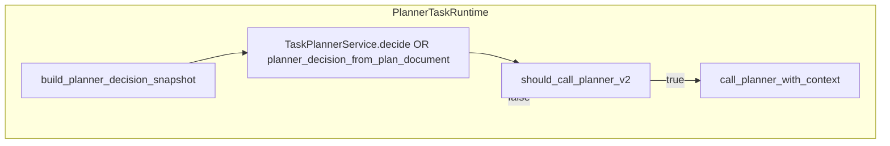

# `agent_v2/planning/` — Control-plane helpers (no tool execution)

---

## 1. Purpose

**Does:** Build **`PlannerDecisionSnapshot`**; define **`TaskPlannerService`** (pure `decide(snapshot) → PlannerDecision`); gate **PlannerV2** invocations (`should_call_planner_v2`); map structured planner actions (`planner_action_mapper`); normalize exploration outcomes for stop/sub-explore policy (`exploration_outcome_policy`).

**Does not:** Run the ACT loop, call `Dispatcher`, or mutate `PlannerDecision` inside PlannerV2.

---

## 2. Responsibilities (strict)

```text
✔ owns
  PlannerDecisionSnapshot construction (build_planner_decision_snapshot)
  PlannerV2 invocation rules (planner_v2_invocation.py)
  RuleBasedTaskPlannerService baseline behavior
  Exploration outcome normalization for gating (exploration_outcome_policy)
  Duplicate explore detection helpers (planner_action_mapper)

❌ does not own
  PlanExecutor or exploration engine execution
  Persisting snapshots to disk
```

---

## 3. Control flow



---

## 4. Loop behavior

**Single-pass per call:** `decide()` and `should_call_planner_v2()` are stateless aside from reading snapshot fields and config.

**TaskPlanner iteration:** `RuleBasedTaskPlannerService` uses `act_controller_iteration_count` vs `max_act_controller_iterations` to emit **`synthesize`** (bounded outer loop). **Does not** implement its own `while` loop.

---

## 5. Inputs / outputs

### `PlannerDecisionSnapshot` (fields)

| Field | Meaning |
|-------|---------|
| `instruction` | Current user instruction (capped). |
| `rolling_conversation_summary` | From conversation store. |
| `working_memory_fingerprint` | Hash from `TaskWorkingMemory`. |
| `last_exploration_confidence/gaps_count` | From last `FinalExplorationSchema`. |
| `last_exploration_query_hash` | Dedup explore proposals. |
| `outer_iteration` | From task working memory. |
| `has_pending_plan_work` | Whether runnable steps exist. |
| `last_loop_outcome` | Includes consumed `task_planner_last_loop_outcome` from metadata. |
| `act_controller_iteration_count` | From metadata. |

### `PlannerDecision` types

`explore` | `act` | `plan` | `replan` | `stop` | `synthesize` — must align with `runtime/planner_decision_mapper.py` parsing.

---

## 6. State / memory interaction

**Reads:** `state.context`, `state.metadata` (snapshot builder **deletes** `task_planner_last_loop_outcome` when ingesting).

**Writes:** None directly to state — callers set metadata based on decisions.

**Must not store:** Large payloads inside `TaskPlannerService` implementations.

---

## 7. Edge cases

- **`task_decision` + missing `decision`:** `should_call_planner_v2` raises `ValueError`.
- **`last_loop_outcome` empty:** Snapshot still valid; rule planner may still emit `explore`.
- **`synthesize_completed` in last outcome:** Rule planner returns `stop` after snapshot consumption (see `task_planner.py`).
- **`explore_gate:*` in last outcome:** `RuleBasedTaskPlannerService` returns **`replan`** so the runtime can invoke PlannerV2 with insufficiency context (when not short-circuited by other branches).
- **Shadow mismatch:** Does not change behavior — logged in metadata only.

---

## 8. Integration points

- **Upstream:** Only `PlannerTaskRuntime` and thin-planer observability (`_maybe_thin_planner_observability`) call `build_planner_decision_snapshot` / `TaskPlanner.decide`.
- **Downstream:** `PlannerV2` via `runtime.exploration_planning_input.call_planner_with_context`.

---

## 9. Design principles

- **Gated LLM:** PlannerV2 is a **plan generator**, not the controller — call sites must pass `context` through `should_call_planner_v2` before invoking (when authoritative).
- **Same decision type:** TaskPlanner returns `PlannerDecision`, identical to engine-derived decisions for branch unification.

---

## 10. Anti-patterns

- Invoking PlannerV2 for `task_decision` when `decision.type in (explore, act, synthesize)` — gate returns `False`; doing so violates authoritative control.
- Implementing `TaskPlannerService` with side effects (network, filesystem) — breaks testability and determinism.

---

## Config (planning loop)

| Env | Default | Effect |
|-----|---------|--------|
| `AGENT_V2_PLANNER_CONTROLLER_LOOP` | `1` | Enable `_run_act_controller_loop`. |
| `AGENT_V2_MAX_PLANNER_CONTROLLER_CALLS` | `16` | Max PlannerV2 invocations per task run. |
| `AGENT_V2_MAX_ACT_CONTROLLER_ITERATIONS` | `256` | Max outer controller iterations. |
| `AGENT_V2_MAX_SUB_EXPLORATIONS_PER_TASK` | `2` | Sub-explore runs after initial exploration. |
| `AGENT_V2_TASK_PLANNER_AUTHORITATIVE_LOOP` | `0` | If `1`, TaskPlanner decides; PlannerV2 gated. |
| `AGENT_V2_TASK_PLANNER_SHADOW_LOOP` | `0` | If `1` (and not authoritative), log TaskPlanner vs engine mismatch. |
| `AGENT_V2_PLANNER_PLAN_BODY_ONLY_WHEN_TASK_PLANNER_AUTHORITATIVE` | `0` | If `1` with authoritative, planner may use `plan_body_only` mode. |
| `AGENT_V2_ENABLE_THIN_TASK_PLANNER` | `0` | Record `thin_planner_decision` on metadata only. |
| `AGENT_V2_ENABLE_EXPLORATION_STOP_POLICY` | `0` | Tighten sub-explore via `should_stop_after_exploration`. |
| `AGENT_V2_SKIP_ANSWER_SYNTHESIS_WHEN_SUFFICIENT` | `0` | Skip synthesis when policy says sufficient. |

---

## `should_call_planner_v2` truth table (summary)

| Context | Calls PlannerV2? |
|---------|------------------|
| `bootstrap` | Only if plan invalid / empty steps |
| `post_exploration_merge` | Yes |
| `failure_or_insufficiency_replan` | Yes |
| `progress_refresh` | Yes |
| `task_decision` + `decision.plan/replan` | Yes |
| `task_decision` + `explore/act/synthesize/stop` | No |

See `planner_v2_invocation.py` for authoritative logic.
