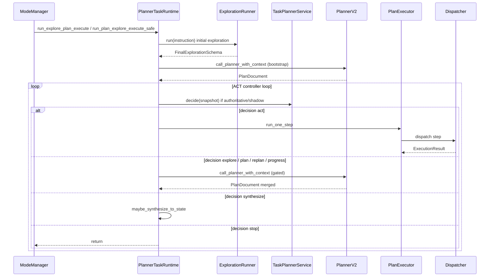

# `agent_v2/runtime/` — Orchestration and execution

---

## 1. Purpose

**Does:** Route modes (`ModeManager`); own the **single ACT/plan-safe outer loop** (`PlannerTaskRuntime`); run **PlanExecutor** (one step or full plan); bridge **Dispatcher** → legacy `step_dispatcher`; attach traces (`TraceEmitter`); sync tool policy (`ACT_MODE_TOOL_POLICY` vs `PLAN_MODE_TOOL_POLICY`).

**Does not:** Implement exploration semantics (delegates to `ExplorationRunner` / `exploration/`); implement PlannerV2 JSON generation (`planner/planner_v2.py`); own long-term persistent chat storage beyond the in-process conversation store.

---

## 2. Responsibilities (strict)

```text
✔ owns
  ModeManager → PlannerTaskRuntime entrypoints
  _run_act_controller_loop: iteration counting, decision resolution, PlannerV2 invocation scheduling
  PlanExecutor: step execution, run_one_step for controller loop, retry/replan integration
  Dispatcher + tool_mapper + tool_policy: allowed tools per mode
  SessionMemory attachment on state.context

❌ does not own
  TaskPlannerService.decide implementation (planning/task_planner.py)
  ExplorationEngineV2 inner loop
  PlanDocument JSON schema validation internals (validation/plan_validator.py)
```

---

## 3. Control flow



---

## 4. Loop behavior

| Component | Loop? | Bounds |
|-----------|--------|--------|
| **PlannerTaskRuntime._run_act_controller_loop** | Yes | `act_controller_iteration_count` increments each iteration; soft cap `max_act_controller_iterations`; hard PlannerV2 budget `max_planner_controller_calls`; sub-explore cap `max_sub_explorations_per_task`. |
| **PlanExecutor.run** | Yes (steps) | `ExecutionPolicy` max steps, retries, replans, dispatches, runtime seconds. |
| **PlanExecutor.run_one_step** | Single-pass | Returns `success`, `failed_step`, `progress`, or other terminal dict. |
| **ModeManager.run_plan_only (plan_legacy)** | No controller loop | Single exploration + single planner call. |

**Stopping (controller):** `PlannerDecision.type == stop` → exit; `run_one_step` → `success` → exit; synthesize path sets `task_planner_last_loop_outcome` and **continues** until TaskPlanner returns non-synthesize or snapshot consumes completion.

---

## 5. Inputs / outputs

- **`PlannerTaskRuntime.run_*`:** `state` (must have `context: dict`, `metadata: dict`), `deep: bool` where applicable.
- **`PlanExecutor.run(plan_doc, state)`:** returns executor result dict (often includes trace).
- **`PlanExecutor.run_one_step`:** `{"status": "success"|"failed_step"|"progress"|...}` — controller uses `success` (done), `failed_step` (replan), `progress` (refresh plan after one completed step).

**Example metadata after loop start:**

```json
{
  "planner_controller_calls": 3,
  "sub_explorations_used": 1,
  "act_controller_iteration_count": 5,
  "decision_source": "task_planner"
}
```

---

## 6. State / memory interaction

**Reads**

- `state.context["task_working_memory"]` — via helpers in `planner_task_runtime`.
- `state.context["planner_session_memory"]` — `SessionMemory` for planner prompts.
- `state.context["conversation_memory_store"]` — rolling summary for snapshots.
- `state.metadata` — loop counters, decision flags.

**Writes**

- `current_plan`, `current_plan_steps`, `exploration_result`, `context["exploration_*"]`.
- Metadata keys listed in root `README` §runtime metadata appendix (see table below).
- `tool_policy_mode` on metadata for logging.

**Must not store**

- Hidden globals; execution traces outside `TraceEmitter` / state metadata contract.

---

## 7. Edge cases

- **`PLANNER_CONTROLLER_LOOP=0`:** Skips `_run_act_controller_loop`; single PlannerV2 + `PlanExecutor.run` — TaskPlanner authoritative path **not** used for multi-step control.
- **Budget exhaustion:** `_exit_budget_exhausted` — no partial silent success; abort metadata set.
- **Authoritative explore blocked:** Duplicate query / sub-exploration budget / `sub_exploration_allowed` false → `task_planner_last_loop_outcome` gate tokens; loop continues without calling exploration again until TaskPlanner changes decision.
- **plan_safe:** `plan_validation_task_mode` set during run; `PlanExecutor` enforces read-only / plan-safe shell rules.

---

## 8. Integration points

- **Upstream:** `bootstrap.create_runtime()` constructs `ModeManager` + `PlannerTaskRuntime`.
- **Downstream:** `agent.execution.step_dispatcher._dispatch_react`, `Replanner`, `PlanValidator`.
- **Parallel:** `agent_v2/planning/decision_snapshot.build_planner_decision_snapshot` (only caller boundary for snapshots).

---

## 9. Design principles

- **Single loop owner:** Only `PlannerTaskRuntime` increments `act_controller_iteration_count` and schedules PlannerV2.
- **Executor purity:** `PlanExecutor` does not choose the next high-level action; it runs the next pending step or returns status for the runtime.
- **Tool policy by mode:** Planner’s `_tool_policy` swapped for ACT vs PLAN before exploration/planning.

---

## 10. Anti-patterns

- Calling `PlannerV2.plan` directly from application code bypassing `call_planner_with_context` and gating.
- Using `AgentLoop` for `act` mode production paths — conflicts with `PlannerTaskRuntime` ownership.
- Adding tool execution that skips `Dispatcher` (violates repo execution policy).

---

## Tooling surface (no `agent_v2/tools/` package)

| Module | Role |
|--------|------|
| `dispatcher.py` | Central dispatch for plan steps. |
| `tool_mapper.py` | Map raw tool results → `ExecutionResult`. |
| `tool_policy.py` | Allowlists / mode for planner tools vs executor. |
| `phase1_tool_exposure.py` | `PlanStep.action` → legacy react action mapping. |

---

## Runtime metadata keys (reference)

| Key | Set where | Consumed where | Lifecycle |
|-----|-----------|----------------|-----------|
| `planner_controller_calls` | `_run_act_controller_loop` init + `_budget_planner` | Budget checks | Whole run |
| `sub_explorations_used` | After sub-exploration | Explore gate | Whole run |
| `act_controller_iteration_count` | Start of each controller iteration | `build_planner_decision_snapshot` | Whole run |
| `task_planner_last_loop_outcome` | Synthesize / explore gates | `decision_snapshot` **pops** when building snapshot | Consume-once |
| `decision_source` | `task_planner` or `shadow` | Observability | Whole run |
| `task_planner_decision` | Authoritative/shadow | Debug | Whole run |
| `decision_snapshot_hash` | Snapshot hash | Debug | Whole run |
| `task_planner_shadow_mismatch` | Shadow compare | Debug | Whole run |
| `explore_gate` | Gate reason string | Debug | Per event |
| `planner_loop_abort` | Budget exhausted | Finalize | Terminal |
| `tool_policy_mode` | After planner attach | Logs | Whole run |
| `stop_reason` | `should_stop_after_exploration` | Optional gating | Whole run |
| `thin_planner_decision` | Thin task planner observability | Debug only | Whole run |
| `task_working_memory_version` | `_sync_chat_planning_metadata` | Observability | Whole run |
| `conversation_memory_turns` | `_sync_chat_planning_metadata` | Observability | Whole run |
